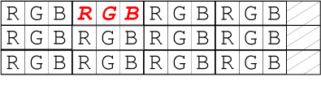
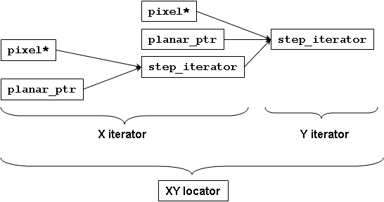

Design Guide
============

.. contents::
   :local:
   :depth: 1

Overview
--------
Images are essential in any image processing, vision and video
project, and yet the variability in image representations makes it
difficult to write imaging algorithms that are both generic and
efficient. In this section we will describe some of the challenges
that we would like to address.

In the following discussion an *image* is a 2D array of pixels. A
*pixel* is a set of color channels that represents the color at a
given point in an image. Each *channel* represents the value of a
color component.  There are two common memory structures for an
image. *Interleaved* images are represented by grouping the pixels
together in memory and interleaving all channels together, whereas
*planar* images keep the channels in separate color planes. Here is a
4x3 RGB image in which the second pixel of the first row is marked in
red, in interleaved form:

and in planar form:

.. image:: images/planar.jpg

Note also that rows may optionally be aligned resulting in a potential
padding at the end of rows.

The Generic Image Library (GIL) provides models for images that vary in:

* Structure (planar vs. interleaved)
* Color space and presence of alpha (RGB, RGBA, CMYK, etc.)
* Channel depth (8-bit, 16-bit, etc.)
* Order of channels (RGB vs. BGR, etc.)
* Row alignment policy (no alignment, word-alignment, etc.)

It also supports user-defined models of images, and images whose
parameters are specified at run-time.  GIL abstracts image
representation from algorithms applied on images and allows us to
write the algorithm once and have it work on any of the above image
variations while generating code that is comparable in speed to that
of hand-writing the algorithm for a specific image type.

This document follows bottom-up design. Each section defines concepts
that build on top of concepts defined in previous sections.  It is
recommended to read the sections in order.

About Concepts
--------------

All constructs in GIL are models of GIL concepts. A *concept* is a
set of requirements that a type (or a set of related types) must
fulfill to be used correctly in generic algorithms. The requirements
include syntactic and algorithmic guarantees.  For example, GIL's
class ``pixel`` is a model of GIL's ``PixelConcept``. The user may
substitute the pixel class with one of their own, and, as long as it
satisfies the requirements of ``PixelConcept``, all other GIL classes
and algorithms can be used with it. See more about concepts here:
http://www.generic-programming.org/languages/conceptcpp/

In this document we will use a syntax for defining concepts that is
described in a proposal for a Concepts extension to C++0x specified
here:
http://www.open-std.org/jtc1/sc22/wg21/docs/papers/2006/n2081.pdf

Here are some common concepts that will be used in GIL. Most of them
are defined here:
http://www.generic-programming.org/languages/conceptcpp/concept_web.php
::

  auto concept DefaultConstructible<typename T>
  {
    T::T();
  };

  auto concept CopyConstructible<typename T>
  {
    T::T(T);
    T::~T();
  };

  auto concept Assignable<typename T, typename U = T>
  {
    typename result_type;
    result_type operator=(T&, U);
  };

  auto concept EqualityComparable<typename T, typename U = T>
  {
    bool operator==(T x, T y);
    bool operator!=(T x, T y) { return !(x==y); }
  };

  concept SameType<typename T, typename U> { /* unspecified */ };
  template<typename T> concept_map SameType<T, T> { /* unspecified */ };

  auto concept Swappable<typename T>
  {
    void swap(T& t, T& u);
  };

Here are some additional basic concepts that GIL needs::

  auto concept Regular<typename T> : DefaultConstructible<T>, CopyConstructible<T>, EqualityComparable<T>, Assignable<T>, Swappable<T> {};

  auto concept Metafunction<typename T>
  {
    typename type;
  };

Point
-----

A point defines the location of a pixel inside an image. It can also
be used to describe the dimensions of an image.  In most general
terms, points are N-dimensional and model the following concept::

  concept PointNDConcept<typename T> : Regular<T>
  {
    // the type of a coordinate along each axis
    template <size_t K> struct axis; where Metafunction<axis>;

    const size_t num_dimensions;

    // accessor/modifier of the value of each axis.
    template <size_t K> const typename axis<K>::type& T::axis_value() const;
    template <size_t K>       typename axis<K>::type& T::axis_value();
  };

GIL uses a two-dimensional point, which is a refinement of
``PointNDConcept`` in which both dimensions are of the same type::

  concept Point2DConcept<typename T> : PointNDConcept<T>
  {
    where num_dimensions == 2;
    where SameType<axis<0>::type, axis<1>::type>;

    typename value_type = axis<0>::type;

    const value_type& operator;
          value_type& operator;

    value_type x,y;
  };

.. seealso::
   - `PointNDConcept <reference/structboost_1_1gil_1_1_point_n_d_concept.html>`_
   - `Point2DConcept <reference/structboost_1_1gil_1_1_point2_d_concept.html>`_

Models
~~~~~~

GIL provides a model of ``Point2DConcept``, ``point<T>`` where
``T`` is the coordinate type.

Channel
-------

A channel indicates the intensity of a color component (for example,
the red channel in an RGB pixel).  Typical channel operations are
getting, comparing and setting the channel values. Channels have
associated minimum and maximum value. GIL channels model the following
concept::

  concept ChannelConcept<typename T> : EqualityComparable<T>
  {
    typename value_type      = T;        // use channel_traits<T>::value_type to access it
       where ChannelValueConcept<value_type>;
    typename reference       = T&;       // use channel_traits<T>::reference to access it
    typename pointer         = T*;       // use channel_traits<T>::pointer to access it
    typename const_reference = const T&; // use channel_traits<T>::const_reference to access it
    typename const_pointer   = const T*; // use channel_traits<T>::const_pointer to access it
    static const bool is_mutable;        // use channel_traits<T>::is_mutable to access it

    static T min_value();                // use channel_traits<T>::min_value to access it
    static T max_value();                // use channel_traits<T>::min_value to access it
  };

  concept MutableChannelConcept<ChannelConcept T> : Swappable<T>, Assignable<T> {};

  concept ChannelValueConcept<ChannelConcept T> : Regular<T> {};

GIL allows built-in integral and floating point types to be
channels. Therefore the associated types and range information are
defined in ``channel_traits`` with the following default
implementation::

  template <typename T>
  struct channel_traits
  {
    typedef T         value_type;
    typedef T&        reference;
    typedef T*        pointer;
    typedef T& const  const_reference;
    typedef T* const  const_pointer;

    static value_type min_value() { return std::numeric_limits<T>::min(); }
    static value_type max_value() { return std::numeric_limits<T>::max(); }
  };

Two channel types are *compatible* if they have the same value type::

  concept ChannelsCompatibleConcept<ChannelConcept T1, ChannelConcept T2>
  {
    where SameType<T1::value_type, T2::value_type>;
  };

A channel may be *convertible* to another channel::

  template <ChannelConcept Src, ChannelValueConcept Dst>
  concept ChannelConvertibleConcept
  {
    Dst channel_convert(Src);
  };

Note that ``ChannelConcept`` and ``MutableChannelConcept`` do not
require a default constructor. Channels that also support default
construction (and thus are regular types) model
``ChannelValueConcept``. To understand the motivation for this
distinction, consider a 16-bit RGB pixel in a "565" bit pattern. Its
channels correspond to bit ranges. To support such channels, we need
to create a custom proxy class corresponding to a reference to a
sub-byte channel.  Such a proxy reference class models only
``ChannelConcept``, because, similar to native C++ references, it may
not have a default constructor.

Note also that algorithms may impose additional requirements on
channels, such as support for arithmetic operations.

.. seealso::
   - `ChannelConcept<T> <reference/structboost_1_1gil_1_1_channel_concept.html>`_
   - `ChannelValueConcept<T> <reference/structboost_1_1gil_1_1_channel_value_concept.html>`_
   - `MutableChannelConcept<T> <reference/structboost_1_1gil_1_1_mutable_channel_concept.html>`_
   - `ChannelsCompatibleConcept<T1,T2> <reference/structboost_1_1gil_1_1_channels_compatible_concept.html>`_
   - `ChannelConvertibleConcept<SrcChannel,DstChannel> <reference/structboost_1_1gil_1_1_channel_convertible_concept.html>`_

Models
~~~~~~

All C++11 fundamental integer and float point types are valid channels.

The minimum and maximum values of a channel modeled by a built-in type
correspond to the minimum and maximum physical range of the built-in
type, as specified by its ``std::numeric_limits``. Sometimes the
physical range is not appropriate. GIL provides
``scoped_channel_value``, a model for a channel adapter that allows
for specifying a custom range. We use it to define a [0..1] floating
point channel type as follows::

  struct float_zero { static float apply() { return 0.0f; } };
  struct float_one  { static float apply() { return 1.0f; } };
  typedef scoped_channel_value<float,float_zero,float_one> bits32f;

GIL also provides models for channels corresponding to ranges of bits::

  // Value of a channel defined over NumBits bits. Models ChannelValueConcept
  template <int NumBits> class packed_channel_value;

  // Reference to a channel defined over NumBits bits. Models ChannelConcept
  template <int FirstBit,
          int NumBits,       // Defines the sequence of bits in the data value that contain the channel
          bool Mutable>      // true if the reference is mutable
  class packed_channel_reference;

  // Reference to a channel defined over NumBits bits. Its FirstBit is a run-time parameter. Models ChannelConcept
  template <int NumBits,       // Defines the sequence of bits in the data value that contain the channel
          bool Mutable>      // true if the reference is mutable
  class packed_dynamic_channel_reference;

Note that there are two models of a reference proxy which differ based
on whether the offset of the channel range is specified as a template
or a run-time parameter. The first model is faster and more compact
while the second model is more flexible. For example, the second model
allows us to construct an iterator over bit range channels.

Algorithms
~~~~~~~~~~

Here is how to construct the three channels of a 16-bit "565" pixel
and set them to their maximum value::

  typedef packed_channel_reference<0,5,true> channel16_0_5_reference_t;
  typedef packed_channel_reference<5,6,true> channel16_5_6_reference_t;
  typedef packed_channel_reference<11,5,true> channel16_11_5_reference_t;

  boost::uint16_t data=0;
  channel16_0_5_reference_t   channel1(&data);
  channel16_5_6_reference_t   channel2(&data);
  channel16_11_5_reference_t  channel3(&data);

  channel1=channel_traits<channel16_0_5_reference_t>::max_value();
  channel2=channel_traits<channel16_5_6_reference_t>::max_value();
  channel3=channel_traits<channel16_11_5_reference_t>::max_value();
  assert(data==65535);

Assignment, equality comparison and copy construction are defined only
between compatible channels::

  packed_channel_value<5> channel_6bit = channel1;
  channel_6bit = channel3;

  //channel_6bit = channel2; // compile error: Assignment between incompatible channels.

All channel models provided by GIL are pairwise convertible::

  channel1 = channel_traits<channel16_0_5_reference_t>::max_value();
  assert(channel1 == 31);

  bits16 chan16 = channel_convert<bits16>(channel1);
  assert(chan16 == 65535);

Channel conversion is a lossy operation. GIL's channel conversion is a
linear transformation between the ranges of the source and destination
channel.  It maps precisely the minimum to the minimum and the maximum
to the maximum. (For example, to convert from uint8_t to uint16_t GIL
does not do a bit shift because it will not properly match the maximum
values. Instead GIL multiplies the source by 257).

All channel models that GIL provides are convertible from/to an
integral or floating point type. Thus they support arithmetic
operations.  Here are the channel-level algorithms that GIL provides::

  // Converts a source channel value into a destination channel.
  // Linearly maps the value of the source into the range of the destination.
  template <typename DstChannel, typename SrcChannel>
  typename channel_traits<DstChannel>::value_type channel_convert(SrcChannel src);

  // returns max_value - x + min_value
  template <typename Channel>
  typename channel_traits<Channel>::value_type channel_invert(Channel x);

  // returns a * b / max_value
  template <typename Channel>
  typename channel_traits<Channel>::value_type channel_multiply(Channel a, Channel b);

Color Space and Layout
----------------------

A color space captures the set and interpretation of channels comprising
a pixel. In Boost.GIL, color space is defined as an MPL random access
sequence containing the types of all elements in the color space.

Two color spaces are considered *compatible* if they are equal
(i.e. have the same set of colors in the same order).

.. seealso::
   - `ColorSpaceConcept<ColorSpace> <reference/structboost_1_1gil_1_1_color_space_concept.html>`_
   - `ColorSpacesCompatibleConcept<ColorSpace1,ColorSpace2> <reference/structboost_1_1gil_1_1_color_spaces_compatible_concept.html>`_
   - `ChannelMappingConcept<Mapping> <reference/structboost_1_1gil_1_1_channel_mapping_concept.html>`_

Models
~~~~~~

GIL currently provides the following color spaces:

- ``gray_t``
- ``rgb_t``
- ``rgba_t``
- ``cmyk_t``

It also provides unnamed N-channel color spaces of two to five channels:

- ``devicen_t<2>``
- ``devicen_t<3>``
- ``devicen_t<4>``
- ``devicen_t<5>``

Besides the standard layouts, it also provides:

- ``bgr_layout_t``
- ``bgra_layout_t``
- ``abgr_layout_t``
- ``argb_layout_t``

As an example, here is how GIL defines the RGBA color space::

  struct red_t{};
  struct green_t{};
  struct blue_t{};
  struct alpha_t{};
  typedef mpl::vector4<red_t,green_t,blue_t,alpha_t> rgba_t;

The ordering of the channels in the color space definition specifies
their semantic order. For example, ``red_t`` is the first semantic
channel of ``rgba_t``.  While there is a unique semantic ordering of
the channels in a color space, channels may vary in their physical
ordering in memory

The mapping of channels is specified by ``ChannelMappingConcept``,
which is an MPL random access sequence of integral types.
A color space and its associated mapping are often used together.

Thus they are grouped in GIL's layout::

  template <typename ColorSpace,
          typename ChannelMapping = mpl::range_c<int,0,mpl::size<ColorSpace>::value> >
  struct layout
  {
    typedef ColorSpace      color_space_t;
    typedef ChannelMapping  channel_mapping_t;
  };

Here is how to create layouts for the RGBA color space::

  typedef layout<rgba_t> rgba_layout_t; // default ordering is 0,1,2,3...
  typedef layout<rgba_t, mpl::vector4_c<int,2,1,0,3> > bgra_layout_t;
  typedef layout<rgba_t, mpl::vector4_c<int,1,2,3,0> > argb_layout_t;
  typedef layout<rgba_t, mpl::vector4_c<int,3,2,1,0> > abgr_layout_t;

Color Base
----------

A color base is a container of color elements. The most common use of
color base is in the implementation of a pixel, in which case the
color elements are channel values. The color base concept, however,
can be used in other scenarios. For example, a planar pixel has
channels that are not contiguous in memory. Its reference is a proxy
class that uses a color base whose elements are channel
references. Its iterator uses a color base whose elements are channel
iterators.

Color base models must satisfy the following concepts::

  concept ColorBaseConcept<typename T> : CopyConstructible<T>, EqualityComparable<T>
  {
    // a GIL layout (the color space and element permutation)
    typename layout_t;

    // The type of K-th element
    template <int K> struct kth_element_type;
        where Metafunction<kth_element_type>;

    // The result of at_c
    template <int K> struct kth_element_const_reference_type;
        where Metafunction<kth_element_const_reference_type>;

    template <int K> kth_element_const_reference_type<T,K>::type at_c(T);

    template <ColorBaseConcept T2> where { ColorBasesCompatibleConcept<T,T2> }
        T::T(T2);
    template <ColorBaseConcept T2> where { ColorBasesCompatibleConcept<T,T2> }
        bool operator==(const T&, const T2&);
    template <ColorBaseConcept T2> where { ColorBasesCompatibleConcept<T,T2> }
        bool operator!=(const T&, const T2&);

  };

  concept MutableColorBaseConcept<ColorBaseConcept T> : Assignable<T>, Swappable<T>
  {
    template <int K> struct kth_element_reference_type;
        where Metafunction<kth_element_reference_type>;

    template <int K> kth_element_reference_type<T,K>::type at_c(T);

    template <ColorBaseConcept T2> where { ColorBasesCompatibleConcept<T,T2> }
        T& operator=(T&, const T2&);
  };

  concept ColorBaseValueConcept<typename T> : MutableColorBaseConcept<T>, Regular<T>
  {
  };

  concept HomogeneousColorBaseConcept<ColorBaseConcept CB>
  {
    // For all K in [0 ... size<C1>::value-1):
    //     where SameType<kth_element_type<K>::type, kth_element_type<K+1>::type>;
    kth_element_const_reference_type<0>::type dynamic_at_c(const CB&, std::size_t n) const;
  };

  concept MutableHomogeneousColorBaseConcept<MutableColorBaseConcept CB> : HomogeneousColorBaseConcept<CB>
  {
    kth_element_reference_type<0>::type dynamic_at_c(const CB&, std::size_t n);
  };

  concept HomogeneousColorBaseValueConcept<typename T> : MutableHomogeneousColorBaseConcept<T>, Regular<T>
  {
  };

  concept ColorBasesCompatibleConcept<ColorBaseConcept C1, ColorBaseConcept C2>
  {
    where SameType<C1::layout_t::color_space_t, C2::layout_t::color_space_t>;
    // also, for all K in [0 ... size<C1>::value):
    //     where Convertible<kth_semantic_element_type<C1,K>::type, kth_semantic_element_type<C2,K>::type>;
    //     where Convertible<kth_semantic_element_type<C2,K>::type, kth_semantic_element_type<C1,K>::type>;
  };

A color base must have an associated layout (which consists of a color
space, as well as an ordering of the channels).  There are two ways to
index the elements of a color base: A physical index corresponds to
the way they are ordered in memory, and a semantic index corresponds
to the way the elements are ordered in their color space.  For
example, in the RGB color space the elements are ordered as {red_t,
green_t, blue_t}. For a color base with a BGR layout, the first
element in physical ordering is the blue element, whereas the first
semantic element is the red one.  Models of ``ColorBaseConcept`` are
required to provide the ``at_c<K>(ColorBase)`` function, which allows
for accessing the elements based on their physical order. GIL provides
a ``semantic_at_c<K>(ColorBase)`` function (described later) which can
operate on any model of ColorBaseConcept and returns the corresponding
semantic element.

Two color bases are *compatible* if they have the same color space and
their elements (paired semantically) are convertible to each other.

Models
~~~~~~

GIL provides a model for a homogeneous color base (a color base whose
elements all have the same type). ::

  namespace detail
  {
    template <typename Element, typename Layout, int K> struct homogeneous_color_base;
  }

It is used in the implementation of GIL's pixel, planar pixel
reference and planar pixel iterator.  Another model of
``ColorBaseConcept`` is ``packed_pixel`` - it is a pixel whose
channels are bit ranges. See the :ref:`design_guide:Pixel` section for more.

Algorithms
~~~~~~~~~~

GIL provides the following functions and metafunctions operating on
color bases::

  // Metafunction returning an mpl::int_ equal to the number of elements in the color base
  template <class ColorBase> struct size;

  // Returns the type of the return value of semantic_at_c<K>(color_base)
  template <class ColorBase, int K> struct kth_semantic_element_reference_type;
  template <class ColorBase, int K> struct kth_semantic_element_const_reference_type;

  // Returns a reference to the element with K-th semantic index.
  template <class ColorBase, int K>
  typename kth_semantic_element_reference_type<ColorBase,K>::type       semantic_at_c(ColorBase& p)
  template <class ColorBase, int K>
  typename kth_semantic_element_const_reference_type<ColorBase,K>::type semantic_at_c(const ColorBase& p)

  // Returns the type of the return value of get_color<Color>(color_base)
  template <typename Color, typename ColorBase> struct color_reference_t;
  template <typename Color, typename ColorBase> struct color_const_reference_t;

  // Returns a reference to the element corresponding to the given color
  template <typename ColorBase, typename Color>
  typename color_reference_t<Color,ColorBase>::type get_color(ColorBase& cb, Color=Color());
  template <typename ColorBase, typename Color>
  typename color_const_reference_t<Color,ColorBase>::type get_color(const ColorBase& cb, Color=Color());

  // Returns the element type of the color base. Defined for homogeneous color bases only
  template <typename ColorBase> struct element_type;
  template <typename ColorBase> struct element_reference_type;
  template <typename ColorBase> struct element_const_reference_type;

GIL also provides the following algorithms which operate on color
bases. Note that they all pair the elements semantically::

  // Equivalents to std::equal, std::copy, std::fill, std::generate
  template <typename CB1,typename CB2>   bool static_equal(const CB1& p1, const CB2& p2);
  template <typename Src,typename Dst>   void static_copy(const Src& src, Dst& dst);
  template <typename CB, typename Op>    void static_generate(CB& dst,Op op);

  // Equivalents to std::transform
  template <typename CB ,             typename Dst,typename Op> Op static_transform(      CB&,Dst&,Op);
  template <typename CB ,             typename Dst,typename Op> Op static_transform(const CB&,Dst&,Op);
  template <typename CB1,typename CB2,typename Dst,typename Op> Op static_transform(      CB1&,      CB2&,Dst&,Op);
  template <typename CB1,typename CB2,typename Dst,typename Op> Op static_transform(const CB1&,      CB2&,Dst&,Op);
  template <typename CB1,typename CB2,typename Dst,typename Op> Op static_transform(      CB1&,const CB2&,Dst&,Op);
  template <typename CB1,typename CB2,typename Dst,typename Op> Op static_transform(const CB1&,const CB2&,Dst&,Op);

  // Equivalents to std::for_each
  template <typename CB1,                          typename Op> Op static_for_each(      CB1&,Op);
  template <typename CB1,                          typename Op> Op static_for_each(const CB1&,Op);
  template <typename CB1,typename CB2,             typename Op> Op static_for_each(      CB1&,      CB2&,Op);
  template <typename CB1,typename CB2,             typename Op> Op static_for_each(      CB1&,const CB2&,Op);
  template <typename CB1,typename CB2,             typename Op> Op static_for_each(const CB1&,      CB2&,Op);
  template <typename CB1,typename CB2,             typename Op> Op static_for_each(const CB1&,const CB2&,Op);
  template <typename CB1,typename CB2,typename CB3,typename Op> Op static_for_each(      CB1&,      CB2&,      CB3&,Op);
  template <typename CB1,typename CB2,typename CB3,typename Op> Op static_for_each(      CB1&,      CB2&,const CB3&,Op);
  template <typename CB1,typename CB2,typename CB3,typename Op> Op static_for_each(      CB1&,const CB2&,      CB3&,Op);
  template <typename CB1,typename CB2,typename CB3,typename Op> Op static_for_each(      CB1&,const CB2&,const CB3&,Op);
  template <typename CB1,typename CB2,typename CB3,typename Op> Op static_for_each(const CB1&,      CB2&,      CB3&,Op);
  template <typename CB1,typename CB2,typename CB3,typename Op> Op static_for_each(const CB1&,      CB2&,const CB3&,Op);
  template <typename CB1,typename CB2,typename CB3,typename Op> Op static_for_each(const CB1&,const CB2&,      CB3&,Op);
  template <typename CB1,typename CB2,typename CB3,typename Op> Op static_for_each(const CB1&,const CB2&,const CB3&,Op);

  // The following algorithms are only defined for homogeneous color bases:
  // Equivalent to std::fill
  template <typename HCB, typename Element> void static_fill(HCB& p, const Element& v);

  // Equivalents to std::min_element and std::max_element
  template <typename HCB> typename element_const_reference_type<HCB>::type static_min(const HCB&);
  template <typename HCB> typename element_reference_type<HCB>::type       static_min(      HCB&);
  template <typename HCB> typename element_const_reference_type<HCB>::type static_max(const HCB&);
  template <typename HCB> typename element_reference_type<HCB>::type       static_max(      HCB&);

These algorithms are designed after the corresponding STL algorithms,
except that instead of ranges they take color bases and operate on
their elements.  In addition, they are implemented with a compile-time
recursion (thus the prefix "static\_"). Finally, they pair the
elements semantically instead of based on their physical order in
memory. For example, here is the implementation of ``static_equal``::

  namespace detail
  {
    template <int K> struct element_recursion
    {
      template <typename P1,typename P2>
      static bool static_equal(const P1& p1, const P2& p2)
      {
        return element_recursion<K-1>::static_equal(p1,p2) &&
               semantic_at_c<K-1>(p1)==semantic_at_c<N-1>(p2);
      }
    };
    template <> struct element_recursion<0>
    {
      template <typename P1,typename P2>
      static bool static_equal(const P1&, const P2&) { return true; }
    };
  }

  template <typename P1,typename P2>
  bool static_equal(const P1& p1, const P2& p2)
  {
    gil_function_requires<ColorSpacesCompatibleConcept<P1::layout_t::color_space_t,P2::layout_t::color_space_t> >();
    return detail::element_recursion<size<P1>::value>::static_equal(p1,p2);
  }

This algorithm is used when invoking ``operator==`` on two pixels, for
example. By using semantic accessors we are properly comparing an RGB
pixel to a BGR pixel. Notice also that all of the above algorithms
taking more than one color base require that they all have the same
color space.

Pixel
-----

A pixel is a set of channels defining the color at a given point in an
image. Conceptually, a pixel is little more than a color base whose
elements model ``ChannelConcept``.  All properties of pixels inherit
from color bases: pixels may be *homogeneous* if all of their channels
have the same type; otherwise they are called *heterogeneous*. The
channels of a pixel may be addressed using semantic or physical
indexing, or by color; all color-base algorithms work on pixels as
well. Two pixels are *compatible* if their color spaces are the same
and their channels, paired semantically, are compatible.  Note that
constness, memory organization and reference/value are ignored. For
example, an 8-bit RGB planar reference is compatible to a constant
8-bit BGR interleaved pixel value. Most pairwise pixel operations
(copy construction, assignment, equality, etc.) are only defined for
compatible pixels.

Pixels (as well as other GIL constructs built on pixels, such as
iterators, locators, views and images) must provide metafunctions to
access their color space, channel mapping, number of channels, and
(for homogeneous pixels) the channel type::

  concept PixelBasedConcept<typename T>
  {
    typename color_space_type<T>;
        where Metafunction<color_space_type<T> >;
        where ColorSpaceConcept<color_space_type<T>::type>;
    typename channel_mapping_type<T>;
        where Metafunction<channel_mapping_type<T> >;
        where ChannelMappingConcept<channel_mapping_type<T>::type>;
    typename is_planar<T>;
        where Metafunction<is_planar<T> >;
        where SameType<is_planar<T>::type, bool>;
  };

  concept HomogeneousPixelBasedConcept<PixelBasedConcept T>
  {
    typename channel_type<T>;
        where Metafunction<channel_type<T> >;
        where ChannelConcept<channel_type<T>::type>;
  };

Pixels model the following concepts::

  concept PixelConcept<typename P> : ColorBaseConcept
, PixelBasedConcept

  {
    where is_pixel
::value==true;
    // where for each K [0..size
::value-1]:
    //      ChannelConcept<kth_element_type<K> >;

    typename value_type;       where PixelValueConcept<value_type>;
    typename reference;        where PixelConcept<reference>;
    typename const_reference;  where PixelConcept<const_reference>;
    static const bool P::is_mutable;

    template <PixelConcept P2> where { PixelConcept<P,P2> }
        P::P(P2);
    template <PixelConcept P2> where { PixelConcept<P,P2> }
        bool operator==(const P&, const P2&);
    template <PixelConcept P2> where { PixelConcept<P,P2> }
        bool operator!=(const P&, const P2&);
  };

  concept MutablePixelConcept<typename P> : PixelConcept
, MutableColorBaseConcept

  {
    where is_mutable==true;
  };

  concept HomogeneousPixelConcept<PixelConcept P> : HomogeneousColorBaseConcept
, HomogeneousPixelBasedConcept

  {
    P::template element_const_reference_type
::type operator const { return dynamic_at_c(P,i); }
  };

  concept MutableHomogeneousPixelConcept<MutablePixelConcept P> : MutableHomogeneousColorBaseConcept

  {
    P::template element_reference_type
::type operator { return dynamic_at_c(p,i); }
  };

  concept PixelValueConcept<typename P> : PixelConcept
, Regular

  {
    where SameType<value_type,P>;
  };

  concept PixelsCompatibleConcept<PixelConcept P1, PixelConcept P2> : ColorBasesCompatibleConcept<P1,P2>
  {
    // where for each K [0..size<P1>::value):
    //    ChannelsCompatibleConcept<kth_semantic_element_type<P1,K>::type, kth_semantic_element_type<P2,K>::type>;
  };

A pixel is *convertible* to a second pixel if it is possible to
approximate its color in the form of the second pixel. Conversion is
an explicit, non-symmetric and often lossy operation (due to both
channel and color space approximation). Convertibility requires
modeling the following concept::

  template <PixelConcept SrcPixel, MutablePixelConcept DstPixel>
  concept PixelConvertibleConcept
  {
    void color_convert(const SrcPixel&, DstPixel&);
  };

The distinction between ``PixelConcept`` and ``PixelValueConcept`` is
analogous to that for channels and color bases - pixel reference
proxies model both, but only pixel values model the latter.

.. seealso::

   - `PixelBasedConcept
 <reference/structboost_1_1gil_1_1_pixel_based_concept.html>`_
   - `PixelConcept<Pixel> <reference/structboost_1_1gil_1_1_pixel_concept.html>`_
   - `MutablePixelConcept<Pixel> <reference/structboost_1_1gil_1_1_mutable_pixel_concept.html>`_
   - `PixelValueConcept<Pixel> <reference/structboost_1_1gil_1_1_pixel_value_concept.html>`_
   - `HomogeneousPixelConcept<Pixel> <reference/structboost_1_1gil_1_1_homogeneous_pixel_based_concept.html>`_
   - `MutableHomogeneousPixelConcept<Pixel> <reference/structboost_1_1gil_1_1_mutable_homogeneous_pixel_concept.html>`_
   - `HomogeneousPixelValueConcept<Pixel> <reference/structboost_1_1gil_1_1_homogeneous_pixel_value_concept.html>`_
   - `PixelsCompatibleConcept<Pixel1, Pixel2> <reference/structboost_1_1gil_1_1_pixels_compatible_concept.html>`_
   - `PixelConvertibleConcept<SrcPixel, DstPixel> <reference/structboost_1_1gil_1_1_pixel_convertible_concept.html>`_

Models
~~~~~~

The most commonly used pixel is a homogeneous pixel whose values are
together in memory.  For this purpose GIL provides the struct
``pixel``, templated over the channel value and layout::

  // models HomogeneousPixelValueConcept
  template <typename ChannelValue, typename Layout> struct pixel;

  // Those typedefs are already provided by GIL
  typedef pixel<bits8, rgb_layout_t> rgb8_pixel_t;
  typedef pixel<bits8, bgr_layout_t> bgr8_pixel_t;

  bgr8_pixel_t bgr8(255,0,0);     // pixels can be initialized with the channels directly
  rgb8_pixel_t rgb8(bgr8);        // compatible pixels can also be copy-constructed

  rgb8 = bgr8;            // assignment and equality is defined between compatible pixels
  assert(rgb8 == bgr8);   // assignment and equality operate on the semantic channels

  // The first physical channels of the two pixels are different
  assert(at_c<0>(rgb8) != at_c<0>(bgr8));
  assert(dynamic_at_c(bgr8,0) != dynamic_at_c(rgb8,0));
  assert(rgb8[0] != bgr8[0]); // same as above (but operator[] is defined for pixels only)

Planar pixels have their channels distributed in memory. While they
share the same value type (``pixel``) with interleaved pixels, their
reference type is a proxy class containing references to each of the
channels. This is implemented with the struct
``planar_pixel_reference``::

  // models HomogeneousPixel
  template <typename ChannelReference, typename ColorSpace> struct planar_pixel_reference;

  // Define the type of a mutable and read-only reference. (These typedefs are already provided by GIL)
  typedef planar_pixel_reference<      bits8&,rgb_t> rgb8_planar_ref_t;
  typedef planar_pixel_reference<const bits8&,rgb_t> rgb8c_planar_ref_t;

Note that, unlike the ``pixel`` struct, planar pixel references are
templated over the color space, not over the pixel layout. They always
use a canonical channel ordering. Ordering of their elements is
unnecessary because their elements are references to the channels.

Sometimes the channels of a pixel may not be byte-aligned. For example
an RGB pixel in '5-5-6' format is a 16-bit pixel whose red, green and
blue channels occupy bits [0..4],[5..9] and [10..15] respectively. GIL
provides a model for such packed pixel formats::

  // define an rgb565 pixel
  typedef packed_pixel_type<uint16_t, mpl::vector3_c<unsigned,5,6,5>, rgb_layout_t>::type rgb565_pixel_t;

  function_requires<PixelValueConcept<rgb565_pixel_t> >();
  static_assert(sizeof(rgb565_pixel_t) == 2, "");

  // define a bgr556 pixel
  typedef packed_pixel_type<uint16_t, mpl::vector3_c<unsigned,5,6,5>, bgr_layout_t>::type bgr556_pixel_t;

  function_requires<PixelValueConcept<bgr556_pixel_t> >();

  // rgb565 is compatible with bgr556.
  function_requires<PixelsCompatibleConcept<rgb565_pixel_t,bgr556_pixel_t> >();

In some cases, the pixel itself may not be byte aligned. For example,
consider an RGB pixel in '2-3-2' format. Its size is 7 bits.  GIL
refers to such pixels, pixel iterators and images as
"bit-aligned". Bit-aligned pixels (and images) are more complex than
packed ones.  Since packed pixels are byte-aligned, we can use a C++
reference as the reference type to a packed pixel, and a C pointer as
an x_iterator over a row of packed pixels. For bit-aligned constructs
we need a special reference proxy class (bit_aligned_pixel_reference)
and iterator class (bit_aligned_pixel_iterator). The value type of
bit-aligned pixels is a packed_pixel. Here is how to use bit_aligned
pixels and pixel iterators::

  // Mutable reference to a BGR232 pixel
  typedef const bit_aligned_pixel_reference<unsigned char, mpl::vector3_c<unsigned,2,3,2>, bgr_layout_t, true>  bgr232_ref_t;

  // A mutable iterator over BGR232 pixels
  typedef bit_aligned_pixel_iterator<bgr232_ref_t> bgr232_ptr_t;

  // BGR232 pixel value. It is a packed_pixel of size 1 byte. (The last bit is unused)
  typedef std::iterator_traits<bgr232_ptr_t>::value_type bgr232_pixel_t;
  static_assert(sizeof(bgr232_pixel_t) == 1, "");

  bgr232_pixel_t red(0,0,3); // = 0RRGGGBB, = 01100000 = 0x60

  // a buffer of 7 bytes fits exactly 8 BGR232 pixels.
  unsigned char pix_buffer[7];
  std::fill(pix_buffer,pix_buffer+7,0);

  // Fill the 8 pixels with red
  bgr232_ptr_t pix_it(&pix_buffer[0],0);  // start at bit 0 of the first pixel
  for (int i=0; i<8; ++i)
  {
    *pix_it++ = red;
  }
  // Result: 0x60 0x30 0x11 0x0C 0x06 0x83 0xC1

Algorithms
~~~~~~~~~~

Since pixels model ``ColorBaseConcept`` and ``PixelBasedConcept`` all
algorithms and metafunctions of color bases can work with them as
well::

  // This is how to access the first semantic channel (red)
  assert(semantic_at_c<0>(rgb8) == semantic_at_c<0>(bgr8));

  // This is how to access the red channel by name
  assert(get_color<red_t>(rgb8) == get_color<red_t>(bgr8));

  // This is another way of doing it (some compilers don't like the first one)
  assert(get_color(rgb8,red_t()) == get_color(bgr8,red_t()));

  // This is how to use the PixelBasedConcept metafunctions
  BOOST_MPL_ASSERT(num_channels<rgb8_pixel_t>::value == 3);
  BOOST_MPL_ASSERT((is_same<channel_type<rgb8_pixel_t>::type, bits8>));
  BOOST_MPL_ASSERT((is_same<color_space_type<bgr8_pixel_t>::type, rgb_t> ));
  BOOST_MPL_ASSERT((is_same<channel_mapping_type<bgr8_pixel_t>::type, mpl::vector3_c<int,2,1,0> > ));

  // Pixels contain just the three channels and nothing extra
  BOOST_MPL_ASSERT(sizeof(rgb8_pixel_t)==3);

  rgb8_planar_ref_t ref(bgr8);    // copy construction is allowed from a compatible mutable pixel type

  get_color<red_t>(ref) = 10;     // assignment is ok because the reference is mutable
  assert(get_color<red_t>(bgr8)==10);  // references modify the value they are bound to

  // Create a zero packed pixel and a full regular unpacked pixel.
  rgb565_pixel_t r565;
  rgb8_pixel_t rgb_full(255,255,255);

  // Convert all channels of the unpacked pixel to the packed one & assert the packed one is full
  get_color(r565,red_t())   = channel_convert<rgb565_channel0_t>(get_color(rgb_full,red_t()));
  get_color(r565,green_t()) = channel_convert<rgb565_channel1_t>(get_color(rgb_full,green_t()));
  get_color(r565,blue_t())  = channel_convert<rgb565_channel2_t>(get_color(rgb_full,blue_t()));
  assert(r565 == rgb565_pixel_t((uint16_t)65535));

GIL also provides the ``color_convert`` algorithm to convert between
pixels of different color spaces and channel types::

  rgb8_pixel_t red_in_rgb8(255,0,0);
  cmyk16_pixel_t red_in_cmyk16;
  color_convert(red_in_rgb8,red_in_cmyk16);

Pixel Iterator
--------------

Fundamental Iterator
~~~~~~~~~~~~~~~~~~~~

Pixel iterators are random traversal iterators whose ``value_type
models`` ``PixelValueConcept``.  Pixel iterators provide metafunctions
to determine whether they are mutable (i.e. whether they allow for
modifying the pixel they refer to), to get the immutable (read-only)
type of the iterator, and to determine whether they are plain
iterators or adaptors over another pixel iterator::

  concept PixelIteratorConcept<RandomAccessTraversalIteratorConcept Iterator> : PixelBasedConcept<Iterator>
  {
    where PixelValueConcept<value_type>;
    typename const_iterator_type<It>::type;
        where PixelIteratorConcept<const_iterator_type<It>::type>;
    static const bool  iterator_is_mutable<It>::value;
    static const bool  is_iterator_adaptor<It>::value;   // is it an iterator adaptor
  };

  template <typename Iterator>
  concept MutablePixelIteratorConcept : PixelIteratorConcept<Iterator>, MutableRandomAccessIteratorConcept<Iterator> {};

.. seealso::

   - `PixelIteratorConcept<Iterator> <reference/group___pixel_iterator_concept_pixel_iterator.html>`_
   - `MutablePixelIteratorConcept<Iterator> <reference/structboost_1_1gil_1_1_mutable_pixel_iterator_concept.html>`_

Models
++++++

A built-in pointer to pixel, ``pixel<ChannelValue,Layout>*``, is GIL's
model for pixel iterator over interleaved homogeneous pixels.
Similarly, ``packed_pixel<PixelData,ChannelRefVec,Layout>*`` is GIL's
model for an iterator over interleaved packed pixels.

For planar homogeneous pixels, GIL provides the class
``planar_pixel_iterator``, templated over a channel iterator and color
space. Here is how the standard mutable and read-only planar RGB
iterators over unsigned char are defined::

  template <typename ChannelPtr, typename ColorSpace> struct planar_pixel_iterator;

  // GIL provided typedefs
  typedef planar_pixel_iterator<const bits8*, rgb_t> rgb8c_planar_ptr_t;
  typedef planar_pixel_iterator<      bits8*, rgb_t> rgb8_planar_ptr_t;

``planar_pixel_iterator`` also models ``HomogeneousColorBaseConcept``
(it subclasses from ``homogeneous_color_base``) and, as a result, all
color base algorithms apply to it. The element type of its color base
is a channel iterator. For example, GIL implements ``operator++`` of
planar iterators approximately like this::

  template <typename T>
  struct inc : public std::unary_function<T,T>
  {
    T operator()(T x) const { return ++x; }
  };

  template <typename ChannelPtr, typename ColorSpace>
  planar_pixel_iterator<ChannelPtr,ColorSpace>&
  planar_pixel_iterator<ChannelPtr,ColorSpace>::operator++()
  {
    static_transform(*this,*this,inc<ChannelPtr>());
    return *this;
  }

Since ``static_transform`` uses compile-time recursion, incrementing
an instance of ``rgb8_planar_ptr_t`` amounts to three pointer
increments.  GIL also uses the class ``bit_aligned_pixel_iterator`` as
a model for a pixel iterator over bit-aligned pixels. Internally it
keeps track of the current byte and the bit offset.

Iterator Adaptor
~~~~~~~~~~~~~~~~

Iterator adaptor is an iterator that wraps around another
iterator. Its ``is_iterator_adaptor`` metafunction must evaluate to
true, and it needs to provide a member method to return the base
iterator, a metafunction to get its type, and a metafunction to rebind
to another base iterator::

  concept IteratorAdaptorConcept<RandomAccessTraversalIteratorConcept Iterator>
  {
    where SameType<is_iterator_adaptor<Iterator>::type, mpl::true_>;

    typename iterator_adaptor_get_base<Iterator>;
        where Metafunction<iterator_adaptor_get_base<Iterator> >;
        where boost_concepts::ForwardTraversalConcept<iterator_adaptor_get_base<Iterator>::type>;

    typename another_iterator;
    typename iterator_adaptor_rebind<Iterator,another_iterator>::type;
        where boost_concepts::ForwardTraversalConcept<another_iterator>;
        where IteratorAdaptorConcept<iterator_adaptor_rebind<Iterator,another_iterator>::type>;

    const iterator_adaptor_get_base<Iterator>::type& Iterator::base() const;
  };

  template <boost_concepts::Mutable_ForwardIteratorConcept Iterator>
  concept MutableIteratorAdaptorConcept : IteratorAdaptorConcept<Iterator> {};

.. seealso::

   - `IteratorAdaptorConcept<Iterator> <reference/structboost_1_1gil_1_1_iterator_adaptor_concept.html>`_
   - `MutableIteratorAdaptorConcept<Iterator> <reference/structboost_1_1gil_1_1_mutable_iterator_adaptor_concept.html>`_

Models
++++++

GIL provides several models of ``IteratorAdaptorConcept``:

* ``memory_based_step_iterator<Iterator>``: An iterator adaptor that
  changes the fundamental step of the base iterator (see :ref:`design_guide:Step Iterator`)
* ``dereference_iterator_adaptor<Iterator,Fn>``: An iterator that
  applies a unary function ``Fn`` upon dereferencing. It is used, for
  example, for on-the-fly color conversion. It can be used to construct
  a shallow image "view" that pretends to have a different color space
  or channel depth. See :ref:`design_guide:Image View` for more. The
  unary function ``Fn`` must model ``PixelDereferenceAdaptorConcept``
  (see below).

Pixel Dereference Adaptor
~~~~~~~~~~~~~~~~~~~~~~~~~

Pixel dereference adaptor is a unary function that can be applied upon
dereferencing a pixel iterator. Its argument type could be anything
(usually a ``PixelConcept``) and the result type must be convertible
to ``PixelConcept`` ::

  template <boost::UnaryFunctionConcept D>
  concept PixelDereferenceAdaptorConcept : DefaultConstructibleConcept<D>, CopyConstructibleConcept<D>, AssignableConcept<D>
  {
    typename const_t;         where PixelDereferenceAdaptorConcept<const_t>;
    typename value_type;      where PixelValueConcept<value_type>;
    typename reference;       where PixelConcept<remove_reference<reference>::type>;  // may be mutable
    typename const_reference;   // must not be mutable
    static const bool D::is_mutable;

    where Convertible<value_type, result_type>;
  };

Models
++++++

GIL provides several models of ``PixelDereferenceAdaptorConcept``:

* ``color_convert_deref_fn``: a function object that performs color
  conversion
* ``detail::nth_channel_deref_fn``: a function object that returns a
  grayscale pixel corresponding to the n-th channel of a given pixel
* ``deref_compose``: a function object that composes two models of
  ``PixelDereferenceAdaptorConcept``. Similar to
  ``std::unary_compose``, except it needs to pull the additional
  typedefs required by ``PixelDereferenceAdaptorConcept``

GIL uses pixel dereference adaptors to implement image views that
perform color conversion upon dereferencing, or that return the N-th
channel of the underlying pixel. They can be used to model virtual
image views that perform an arbitrary function upon dereferencing, for
example a view of the Mandelbrot
set. ``dereference_iterator_adaptor<Iterator,Fn>`` is an iterator
wrapper over a pixel iterator ``Iterator`` that invokes the given
dereference iterator adaptor ``Fn`` upon dereferencing.

Step Iterator
~~~~~~~~~~~~~

Sometimes we want to traverse pixels with a unit step other than the
one provided by the fundamental pixel iterators.  Examples where this
would be useful:

* a single-channel view of the red channel of an RGB interleaved image
* left-to-right flipped image (step = -fundamental_step)
* subsampled view, taking every N-th pixel (step = N*fundamental_step)
* traversal in vertical direction (step = number of bytes per row)
* any combination of the above (steps are multiplied)

Step iterators are forward traversal iterators that allow changing the
step between adjacent values::

  concept StepIteratorConcept<boost_concepts::ForwardTraversalConcept Iterator>
  {
    template <Integral D> void Iterator::set_step(D step);
  };

  concept MutableStepIteratorConcept<boost_concepts::Mutable_ForwardIteratorConcept Iterator> : StepIteratorConcept<Iterator> {};

GIL currently provides a step iterator whose ``value_type models``
``PixelValueConcept``. In addition, the step is specified in memory
units (which are bytes or bits).  This is necessary, for example, when
implementing an iterator navigating along a column of pixels - the
size of a row of pixels may sometimes not be divisible by the size of
a pixel; for example rows may be word-aligned.

To advance in bytes/bits, the base iterator must model
MemoryBasedIteratorConcept. A memory-based iterator has an inherent
memory unit, which is either a bit or a byte.  It must supply
functions returning the number of bits per memory unit (1 or 8), the
current step in memory units, the memory-unit distance between two
iterators, and a reference a given distance in memunits away. It must
also supply a function that advances an iterator a given distance in
memory units.  ``memunit_advanced`` and ``memunit_advanced_ref`` have
a default implementation but some iterators may supply a more
efficient version::

  concept MemoryBasedIteratorConcept<boost_concepts::RandomAccessTraversalConcept Iterator>
  {
    typename byte_to_memunit<Iterator>; where metafunction<byte_to_memunit<Iterator> >;
    std::ptrdiff_t      memunit_step(const Iterator&);
    std::ptrdiff_t      memunit_distance(const Iterator& , const Iterator&);
    void                memunit_advance(Iterator&, std::ptrdiff_t diff);
    Iterator            memunit_advanced(const Iterator& p, std::ptrdiff_t diff) { Iterator tmp; memunit_advance(tmp,diff); return tmp; }
    Iterator::reference memunit_advanced_ref(const Iterator& p, std::ptrdiff_t diff) { return *memunit_advanced(p,diff); }
  };

It is useful to be able to construct a step iterator over another
iterator. More generally, given a type, we want to be able to
construct an equivalent type that allows for dynamically specified
horizontal step::

  concept HasDynamicXStepTypeConcept<typename T>
  {
    typename dynamic_x_step_type<T>;
        where Metafunction<dynamic_x_step_type<T> >;
  };

All models of pixel iterators, locators and image views that GIL
provides support ``HasDynamicXStepTypeConcept``.

.. seealso::

   - `StepIteratorConcept<Iterator> <reference/structboost_1_1gil_1_1_step_iterator_concept.html>`_
   - `MutableStepIteratorConcept<Iterator> <reference/structboost_1_1gil_1_1_mutable_step_iterator_concept.html>`_
   - `MemoryBasedIteratorConcept<Iterator> <reference/structboost_1_1gil_1_1_memory_based_iterator_concept.html>`_
   - `HasDynamicXStepTypeConcept<T> <reference/structboost_1_1gil_1_1_has_dynamic_x_step_type_concept.html>`_

Models
++++++

All standard memory-based iterators GIL currently provides model
``MemoryBasedIteratorConcept``.  GIL provides the class
``memory_based_step_iterator`` which models ``PixelIteratorConcept``,
``StepIteratorConcept``, and ``MemoryBasedIteratorConcept``.  It takes
the base iterator as a template parameter (which must model
``PixelIteratorConcept`` and ``MemoryBasedIteratorConcept``) and
allows changing the step dynamically. GIL's implementation contains
the base iterator and a ``ptrdiff_t`` denoting the number of memory
units (bytes or bits) to skip for a unit step. It may also be used
with a negative number. GIL provides a function to create a step
iterator from a base iterator and a step::

  template <typename I>  // Models MemoryBasedIteratorConcept, HasDynamicXStepTypeConcept
  typename dynamic_x_step_type<I>::type make_step_iterator(const I& it, std::ptrdiff_t step);

GIL also provides a model of an iterator over a virtual array of
pixels, ``position_iterator``. It is a step iterator that keeps track
of the pixel position and invokes a function object to get the value
of the pixel upon dereferencing. It models ``PixelIteratorConcept``
and ``StepIteratorConcept`` but not ``MemoryBasedIteratorConcept``.

Pixel Locator
~~~~~~~~~~~~~

A Locator allows for navigation in two or more dimensions. Locators
are N-dimensional iterators in spirit, but we use a different name
because they don't satisfy all the requirements of iterators. For
example, they don't supply increment and decrement operators because
it is unclear which dimension the operators should advance along.
N-dimensional locators model the following concept::

  concept RandomAccessNDLocatorConcept<Regular Loc>
  {
    typename value_type;        // value over which the locator navigates
    typename reference;         // result of dereferencing
    typename difference_type; where PointNDConcept<difference_type>; // return value of operator-.
    typename const_t;           // same as Loc, but operating over immutable values
    typename cached_location_t; // type to store relative location (for efficient repeated access)
    typename point_t  = difference_type;

    static const size_t num_dimensions; // dimensionality of the locator
    where num_dimensions = point_t::num_dimensions;

    // The difference_type and iterator type along each dimension. The iterators may only differ in
    // difference_type. Their value_type must be the same as Loc::value_type
    template <size_t D> struct axis {
        typename coord_t = point_t::axis<D>::coord_t;
        typename iterator; where RandomAccessTraversalConcept<iterator>; // iterator along D-th axis.
        where iterator::value_type == value_type;
    };

    // Defines the type of a locator similar to this type, except it invokes Deref upon dereferencing
    template <PixelDereferenceAdaptorConcept Deref> struct add_deref {
        typename type;        where RandomAccessNDLocatorConcept<type>;
        static type make(const Loc& loc, const Deref& deref);
    };

    Loc& operator+=(Loc&, const difference_type&);
    Loc& operator-=(Loc&, const difference_type&);
    Loc operator+(const Loc&, const difference_type&);
    Loc operator-(const Loc&, const difference_type&);

    reference operator*(const Loc&);
    reference operator;

    // Storing relative location for faster repeated access and accessing it
    cached_location_t Loc::cache_location(const difference_type&) const;
    reference operator;

    // Accessing iterators along a given dimension at the current location or at a given offset
    template <size_t D> axis<D>::iterator&       Loc::axis_iterator();
    template <size_t D> axis<D>::iterator const& Loc::axis_iterator() const;
    template <size_t D> axis<D>::iterator        Loc::axis_iterator(const difference_type&) const;
  };

  template <typename Loc>
  concept MutableRandomAccessNDLocatorConcept : RandomAccessNDLocatorConcept<Loc> {
    where Mutable<reference>;
  };

Two-dimensional locators have additional requirements::

  concept RandomAccess2DLocatorConcept<RandomAccessNDLocatorConcept Loc>
  {
    where num_dimensions==2;
    where Point2DConcept<point_t>;

    typename x_iterator = axis<0>::iterator;
    typename y_iterator = axis<1>::iterator;
    typename x_coord_t  = axis<0>::coord_t;
    typename y_coord_t  = axis<1>::coord_t;

    // Only available to locators that have dynamic step in Y
    //Loc::Loc(const Loc& loc, y_coord_t);

    // Only available to locators that have dynamic step in X and Y
    //Loc::Loc(const Loc& loc, x_coord_t, y_coord_t, bool transposed=false);

    x_iterator&       Loc::x();
    x_iterator const& Loc::x() const;
    y_iterator&       Loc::y();
    y_iterator const& Loc::y() const;

    x_iterator Loc::x_at(const difference_type&) const;
    y_iterator Loc::y_at(const difference_type&) const;
    Loc Loc::xy_at(const difference_type&) const;

    // x/y versions of all methods that can take difference type
    x_iterator        Loc::x_at(x_coord_t, y_coord_t) const;
    y_iterator        Loc::y_at(x_coord_t, y_coord_t) const;
    Loc               Loc::xy_at(x_coord_t, y_coord_t) const;
    reference         operator()(const Loc&, x_coord_t, y_coord_t);
    cached_location_t Loc::cache_location(x_coord_t, y_coord_t) const;

    bool      Loc::is_1d_traversable(x_coord_t width) const;
    y_coord_t Loc::y_distance_to(const Loc& loc2, x_coord_t x_diff) const;
  };

  concept MutableRandomAccess2DLocatorConcept<RandomAccess2DLocatorConcept Loc> : MutableRandomAccessNDLocatorConcept<Loc> {};

2D locators can have a dynamic step not just horizontally, but also
vertically. This gives rise to the Y equivalent of
HasDynamicXStepTypeConcept::

  concept HasDynamicYStepTypeConcept<typename T>
  {
    typename dynamic_y_step_type<T>;
        where Metafunction<dynamic_y_step_type<T> >;
  };

All locators and image views that GIL provides model
``HasDynamicYStepTypeConcept``.

Sometimes it is necessary to swap the meaning of X and Y for a given
locator or image view type (for example, GIL provides a function to
transpose an image view).  Such locators and views must be
transposable::

  concept HasTransposedTypeConcept<typename T>
  {
    typename transposed_type<T>;
        where Metafunction<transposed_type<T> >;
  };

All GIL provided locators and views model
``HasTransposedTypeConcept``.

The locators GIL uses operate over models of ``PixelConcept`` and
their x and y dimension types are the same. They model the following
concept::

  concept PixelLocatorConcept<RandomAccess2DLocatorConcept Loc>
  {
    where PixelValueConcept<value_type>;
    where PixelIteratorConcept<x_iterator>;
    where PixelIteratorConcept<y_iterator>;
    where x_coord_t == y_coord_t;

    typename coord_t = x_coord_t;
  };

  concept MutablePixelLocatorConcept<PixelLocatorConcept Loc> : MutableRandomAccess2DLocatorConcept<Loc> {};

.. seealso::

   - `HasDynamicYStepTypeConcept<T> <reference/structboost_1_1gil_1_1_has_dynamic_y_step_type_concept.html>`_
   - `HasTransposedTypeConcept<T> <reference/structboost_1_1gil_1_1_has_transposed_type_concept.html>`_
   - `RandomAccessNDLocatorConcept<Locator> <reference/structboost_1_1gil_1_1_random_access_n_d_locator_concept.html>`_
   - `MutableRandomAccessNDLocatorConcept<Locator> <reference/structboost_1_1gil_1_1_mutable_random_access_n_d_locator_concept.html>`_
   - `RandomAccess2DLocatorConcept<Locator> <reference/structboost_1_1gil_1_1_random_access2_d_locator_concept.html>`_
   - `MutableRandomAccess2DLocatorConcept<Locator> <reference/structboost_1_1gil_1_1_mutable_random_access2_d_locator_concept.html>`_
   - `PixelLocatorConcept<Locator> <reference/structboost_1_1gil_1_1_pixel_locator_concept.html>`_
   - `MutablePixelLocatorConcept<Locator> <reference/structboost_1_1gil_1_1_mutable_pixel_locator_concept.html>`_

Models
++++++

GIL provides two models of ``PixelLocatorConcept`` - a memory-based
locator, ``memory_based_2d_locator`` and a virtual locator
``virtual_2d_locator``.

``memory_based_2d_locator`` is a locator over planar or interleaved
images that have their pixels in memory.  It takes a model of
``StepIteratorConcept`` over pixels as a template parameter. (When
instantiated with a model of ``MutableStepIteratorConcept``, it models
``MutablePixelLocatorConcept``). ::

  template <typename StepIterator>  // Models StepIteratorConcept, MemoryBasedIteratorConcept
  class memory_based_2d_locator;

The step of ``StepIterator`` must be the number of memory units (bytes
or bits) per row (thus it must be memunit advanceable). The class
``memory_based_2d_locator`` is a wrapper around ``StepIterator`` and
uses it to navigate vertically, while its base iterator is used to
navigate horizontally.

Combining fundamental and step iterators allows us to create locators
that describe complex pixel memory organizations. First, we have a
choice of iterator to use for horizontal direction, i.e. for iterating
over the pixels on the same row.  Using the fundamental and step
iterators gives us four choices:

- ``pixel<T,C>*`` - for interleaved images
- ``planar_pixel_iterator<T*,C>`` - for planar images
- ``memory_based_step_iterator<pixel<T,C>*>`` - for interleaved images with
  non-standard step)
- ``memory_based_step_iterator<planar_pixel_iterator<T*,C> >`` - for planar
  images with non-standard step

Of course, one could provide their own custom x-iterator. One such
example described later is an iterator adaptor that performs color
conversion when dereferenced.

Given a horizontal iterator ``XIterator``, we could choose the
``y-iterator``, the iterator that moves along a column, as
``memory_based_step_iterator<XIterator>`` with a step equal to the
number of memory units (bytes or bits) per row. Again, one is free to
provide their own y-iterator.

Then we can instantiate
``memory_based_2d_locator<memory_based_step_iterator<XIterator> >`` to
obtain a 2D pixel locator, as the diagram indicates:

``virtual_2d_locator`` is a locator that is instantiated with a
function object invoked upon dereferencing a pixel. It returns the
value of a pixel given its X,Y coordinates. Virtual locators can be
used to implement virtual image views that can model any user-defined
function. See the GIL tutorial for an example of using virtual
locators to create a view of the Mandelbrot set.

Both the virtual and the memory-based locators subclass from
``pixel_2d_locator_base``, a base class that provides most of the
interface required by ``PixelLocatorConcept``. Users may find this
base class useful if they need to provide other models of
``PixelLocatorConcept``.

Here is some sample code using locators::

  loc=img.xy_at(10,10);            // start at pixel (x=10,y=10)
  above=loc.cache_location(0,-1);  // remember relative locations of neighbors above and below
  below=loc.cache_location(0, 1);
  ++loc.x();                       // move to (11,10)
  loc.y()+=15;                     // move to (11,25)
  loc-=point<std::ptrdiff_t>(1,1);// move to (10,24)
  *loc=(loc(0,-1)+loc(0,1))/2;     // set pixel (10,24) to the average of (10,23) and (10,25) (grayscale pixels only)
  *loc=(loc[above]+loc[below])/2;  // the same, but faster using cached relative neighbor locations

The standard GIL locators are fast and lightweight objects. For
example, the locator for a simple interleaved image consists of one
raw pointer to the pixel location plus one integer for the row size in
bytes, for a total of 8 bytes. ``++loc.x()`` amounts to incrementing a
raw pointer (or N pointers for planar images). Computing 2D offsets is
slower as it requires multiplication and addition.  Filters, for
example, need to access the same neighbors for every pixel in the
image, in which case the relative positions can be cached into a raw
byte difference using ``cache_location``. In the above example
``loc[above]`` for simple interleaved images amounts to a raw array
index operator.

Iterator over 2D image
~~~~~~~~~~~~~~~~~~~~~~

Sometimes we want to perform the same, location-independent operation
over all pixels of an image. In such a case it is useful to represent
the pixels as a one-dimensional array. GIL's ``iterator_from_2d`` is a
random access traversal iterator that visits all pixels in an image in
the natural memory-friendly order left-to-right inside
top-to-bottom. It takes a locator, the width of the image and the
current X position. This is sufficient information for it to determine
when to do a "carriage return". Synopsis::

  template <typename Locator>  // Models PixelLocatorConcept
  class iterator_from_2d
  {
  public:
    iterator_from_2d(const Locator& loc, int x, int width);

    iterator_from_2d& operator++(); // if (++_x<_width) ++_p.x(); else _p+=point_t(-_width,1);

    ...
  private:
    int _x, _width;
    Locator _p;
  };

Iterating through the pixels in an image using ``iterator_from_2d`` is
slower than going through all rows and using the x-iterator at each
row.  This is because two comparisons are done per iteration step -
one for the end condition of the loop using the iterators, and one
inside ``iterator_from_2d::operator++`` to determine whether we are at
the end of a row. For fast operations, such as pixel copy, this second
check adds about 15% performance delay (measured for interleaved
images on Intel platform). GIL overrides some STL algorithms, such as
 ``std::copy`` and ``std::fill``, when invoked with
``iterator_from_2d``-s, to go through each row using their base
x-iterators, and, if the image has no padding
(i.e. ``iterator_from_2d::is_1d_traversable()`` returns true) to
simply iterate using the x-iterators directly.

Image View
----------

An image view is a generalization of STL range concept to multiple
dimensions. Similar to ranges (and iterators), image views are
shallow, don't own the underlying data and don't propagate their
constness over the data. For example, a constant image view cannot be
resized, but may allow modifying the pixels. For pixel-immutable
operations, use constant-value image view (also called non-mutable
image view).  Most general N-dimensional views satisfy the following
concept::

  concept RandomAccessNDImageViewConcept<Regular View>
  {
    typename value_type;      // for pixel-based views, the pixel type
    typename reference;       // result of dereferencing
    typename difference_type; // result of operator-(iterator,iterator) (1-dimensional!)
    typename const_t;  where RandomAccessNDImageViewConcept<View>; // same as View, but over immutable values
    typename point_t;  where PointNDConcept<point_t>; // N-dimensional point
    typename locator;  where RandomAccessNDLocatorConcept<locator>; // N-dimensional locator.
    typename iterator; where RandomAccessTraversalConcept<iterator>; // 1-dimensional iterator over all values
    typename reverse_iterator; where RandomAccessTraversalConcept<reverse_iterator>;
    typename size_type;       // the return value of size()

    // Equivalent to RandomAccessNDLocatorConcept::axis
    template <size_t D> struct axis {
        typename coord_t = point_t::axis<D>::coord_t;
        typename iterator; where RandomAccessTraversalConcept<iterator>;   // iterator along D-th axis.
        where SameType<coord_t, iterator::difference_type>;
        where SameType<iterator::value_type,value_type>;
    };

    // Defines the type of a view similar to this type, except it invokes Deref upon dereferencing
    template <PixelDereferenceAdaptorConcept Deref> struct add_deref {
        typename type;        where RandomAccessNDImageViewConcept<type>;
        static type make(const View& v, const Deref& deref);
    };

    static const size_t num_dimensions = point_t::num_dimensions;

    // Create from a locator at the top-left corner and dimensions
    View::View(const locator&, const point_type&);

    size_type        View::size()       const; // total number of elements
    reference        operator const; // 1-dimensional reference
    iterator         View::begin()      const;
    iterator         View::end()        const;
    reverse_iterator View::rbegin()     const;
    reverse_iterator View::rend()       const;
    iterator         View::at(const point_t&);
    point_t          View::dimensions() const; // number of elements along each dimension
    bool             View::is_1d_traversable() const;   // Does an iterator over the first dimension visit each value?

    // iterator along a given dimension starting at a given point
    template <size_t D> View::axis<D>::iterator View::axis_iterator(const point_t&) const;

    reference operator()(View,const point_t&) const;
  };

  concept MutableRandomAccessNDImageViewConcept<RandomAccessNDImageViewConcept View>
  {
    where Mutable<reference>;
  };

Two-dimensional image views have the following extra requirements::

  concept RandomAccess2DImageViewConcept<RandomAccessNDImageViewConcept View>
  {
    where num_dimensions==2;

    typename x_iterator = axis<0>::iterator;
    typename y_iterator = axis<1>::iterator;
    typename x_coord_t  = axis<0>::coord_t;
    typename y_coord_t  = axis<1>::coord_t;
    typename xy_locator = locator;

    x_coord_t View::width()  const;
    y_coord_t View::height() const;

    // X-navigation
    x_iterator View::x_at(const point_t&) const;
    x_iterator View::row_begin(y_coord_t) const;
    x_iterator View::row_end  (y_coord_t) const;

    // Y-navigation
    y_iterator View::y_at(const point_t&) const;
    y_iterator View::col_begin(x_coord_t) const;
    y_iterator View::col_end  (x_coord_t) const;

    // navigating in 2D
    xy_locator View::xy_at(const point_t&) const;

    // (x,y) versions of all methods taking point_t
    View::View(x_coord_t,y_coord_t,const locator&);
    iterator View::at(x_coord_t,y_coord_t) const;
    reference operator()(View,x_coord_t,y_coord_t) const;
    xy_locator View::xy_at(x_coord_t,y_coord_t) const;
    x_iterator View::x_at(x_coord_t,y_coord_t) const;
    y_iterator View::y_at(x_coord_t,y_coord_t) const;
  };

  concept MutableRandomAccess2DImageViewConcept<RandomAccess2DImageViewConcept View>
  : MutableRandomAccessNDImageViewConcept<View> {};

Image views that GIL typically uses operate on value types that model
``PixelValueConcept`` and have some additional requirements::

  concept ImageViewConcept<RandomAccess2DImageViewConcept View>
  {
    where PixelValueConcept<value_type>;
    where PixelIteratorConcept<x_iterator>;
    where PixelIteratorConcept<y_iterator>;
    where x_coord_t == y_coord_t;

    typename coord_t = x_coord_t;

    std::size_t View::num_channels() const;
  };

  concept MutableImageViewConcept<ImageViewConcept View> : MutableRandomAccess2DImageViewConcept<View> {};

Two image views are compatible if they have compatible pixels and the
same number of dimensions::

  concept ViewsCompatibleConcept<ImageViewConcept V1, ImageViewConcept V2>
  {
    where PixelsCompatibleConcept<V1::value_type, V2::value_type>;
    where V1::num_dimensions == V2::num_dimensions;
  };

Compatible views must also have the same dimensions (i.e. the same
width and height). Many algorithms taking multiple views require that
they be pairwise compatible.

.. seealso::

   - `RandomAccessNDImageViewConcept<View> <reference/structboost_1_1gil_1_1_random_access_n_d_image_view_concept.html>`_
   - `MutableRandomAccessNDImageViewConcept<View> <reference/structboost_1_1gil_1_1_mutable_random_access_n_d_image_view_concept.html>`_
   - `RandomAccess2DImageViewConcept<View> <reference/structboost_1_1gil_1_1_random_access2_d_image_view_concept.html>`_
   - `MutableRandomAccess2DImageViewConcept<View> <reference/structboost_1_1gil_1_1_mutable_random_access2_d_image_view_concept.html>`_
   - `ImageViewConcept<View> <reference/structboost_1_1gil_1_1_image_view_concept.html>`_
   - `MutableImageViewConcept<View> <reference/structboost_1_1gil_1_1_mutable_image_view_concept.html>`_
   - `ViewsCompatibleConcept<View1,View2> <reference/structboost_1_1gil_1_1_views_compatible_concept.html>`_

Models
~~~~~~

GIL provides a model for ``ImageViewConcept`` called
``image_view``. It is templated over a model of
``PixelLocatorConcept``.  (If instantiated with a model of
``MutablePixelLocatorConcept``, it models
``MutableImageViewConcept``). Synopsis::

  template <typename Locator>  // Models PixelLocatorConcept (could be MutablePixelLocatorConcept)
  class image_view
  {
  public:
    typedef Locator xy_locator;
    typedef iterator_from_2d<Locator> iterator;
    ...
  private:
    xy_locator _pixels;     // 2D pixel locator at the top left corner of the image view range
    point_t    _dimensions; // width and height
  };

Image views are lightweight objects. A regular interleaved view is
typically 16 bytes long - two integers for the width and height
(inside dimensions) one for the number of bytes between adjacent rows
(inside the locator) and one pointer to the beginning of the pixel
block.

Algorithms
~~~~~~~~~~

Creating Views from Raw Pixels
++++++++++++++++++++++++++++++

Standard image views can be constructed from raw data of any supported
color space, bit depth, channel ordering or planar vs. interleaved
structure.  Interleaved views are constructed using
``interleaved_view``, supplying the image dimensions, number of bytes
per row, and a pointer to the first pixel::

  template <typename Iterator> // Models pixel iterator (like rgb8_ptr_t or rgb8c_ptr_t)
  image_view<...> interleaved_view(ptrdiff_t width, ptrdiff_t height, Iterator pixels, ptrdiff_t rowsize)

Planar views are defined for every color space and take each plane
separately. Here is the RGB one::

  template <typename IC>  // Models channel iterator (like bits8* or const bits8*)
  image_view<...> planar_rgb_view(ptrdiff_t width, ptrdiff_t height,
                                 IC r, IC g, IC b, ptrdiff_t rowsize);

Note that the supplied pixel/channel iterators could be constant
(read-only), in which case the returned view is a constant-value
(immutable) view.

Creating Image Views from Other Image Views
+++++++++++++++++++++++++++++++++++++++++++

It is possible to construct one image view from another by changing
some policy of how image data is interpreted. The result could be a
view whose type is derived from the type of the source. GIL uses the
following metafunctions to get the derived types::

  // Some result view types
  template <typename View>
  struct dynamic_xy_step_type : public dynamic_y_step_type<typename dynamic_x_step_type<View>::type> {};

  template <typename View>
  struct dynamic_xy_step_transposed_type : public dynamic_xy_step_type<typename transposed_type<View>::type> {};

  // color and bit depth converted view to match pixel type P
  template <typename SrcView, // Models ImageViewConcept
          typename DstP,    // Models PixelConcept
          typename ColorConverter=gil::default_color_converter>
  struct color_converted_view_type
  {
    typedef ... type;     // image view adaptor with value type DstP, over SrcView
  };

  // single-channel view of the N-th channel of a given view
  template <typename SrcView>
  struct nth_channel_view_type
  {
    typedef ... type;
  };

GIL Provides the following view transformations::

  // flipped upside-down, left-to-right, transposed view
  template <typename View> typename dynamic_y_step_type<View>::type             flipped_up_down_view(const View& src);
  template <typename View> typename dynamic_x_step_type<View>::type             flipped_left_right_view(const View& src);
  template <typename View> typename dynamic_xy_step_transposed_type<View>::type transposed_view(const View& src);

  // rotations
  template <typename View> typename dynamic_xy_step_type<View>::type            rotated180_view(const View& src);
  template <typename View> typename dynamic_xy_step_transposed_type<View>::type rotated90cw_view(const View& src);
  template <typename View> typename dynamic_xy_step_transposed_type<View>::type rotated90ccw_view(const View& src);

  // view of an axis-aligned rectangular area within an image
  template <typename View> View                                                 subimage_view(const View& src,
             const View::point_t& top_left, const View::point_t& dimensions);

  // subsampled view (skipping pixels in X and Y)
  template <typename View> typename dynamic_xy_step_type<View>::type            subsampled_view(const View& src,
             const View::point_t& step);

  template <typename View, typename P>
  color_converted_view_type<View,P>::type                                       color_converted_view(const View& src);
  template <typename View, typename P, typename CCV> // with a custom color converter
  color_converted_view_type<View,P,CCV>::type                                   color_converted_view(const View& src);

  template <typename View>
  nth_channel_view_type<View>::view_t                                           nth_channel_view(const View& view, int n);

The implementations of most of these view factory methods are
straightforward. Here is, for example, how the flip views are
implemented.  The flip upside-down view creates a view whose first
pixel is the bottom left pixel of the original view and whose y-step
is the negated step of the source. ::

  template <typename View>
  typename dynamic_y_step_type<View>::type flipped_up_down_view(const View& src)
  {
    gil_function_requires<ImageViewConcept<View> >();
    typedef typename dynamic_y_step_type<View>::type RView;
    return RView(src.dimensions(),typename RView::xy_locator(src.xy_at(0,src.height()-1),-1));
  }

The call to ``gil_function_requires`` ensures (at compile time) that
the template parameter is a valid model of ``ImageViewConcept``. Using
it generates easier to track compile errors, creates no extra code and
has no run-time performance impact.  We are using the
``boost::concept_check library``, but wrapping it in
``gil_function_requires``, which performs the check if the
``BOOST_GIL_USE_CONCEPT_CHECK`` is set. It is unset by default,
because there is a significant increase in compile time when using
concept checks. We will skip ``gil_function_requires`` in the code
examples in this guide for the sake of succinctness.

Image views can be freely composed (see section :ref:`design_guide:Useful Metafunctions and Typedefs`
for the typedefs ``rgb16_image_t`` and ``gray16_step_view_t)``::

  rgb16_image_t img(100,100);    // an RGB interleaved image

  // grayscale view over the green (index 1) channel of img
  gray16_step_view_t green=nth_channel_view(view(img),1);

  // 50x50 view of the green channel of img, upside down and taking every other pixel in X and in Y
  gray16_step_view_t ud_fud=flipped_up_down_view(subsampled_view(green,2,2));

As previously stated, image views are fast, constant-time, shallow
views over the pixel data. The above code does not copy any pixels; it
operates on the pixel data allocated when ``img`` was created.

STL-Style Algorithms on Image Views
+++++++++++++++++++++++++++++++++++

Image views provide 1D iteration of their pixels via begin() and end()
methods, which makes it possible to use STL algorithms with
them. However, using nested loops over X and Y is in many cases more
efficient. The algorithms in this section resemble STL algorithms, but
they abstract away the nested loops and take views (as opposed to
ranges) as input.::

  // Equivalents of std::copy and std::uninitialized_copy
  // where ImageViewConcept<V1>, MutableImageViewConcept<V2>, ViewsCompatibleConcept<V1,V2>
  template <typename V1, typename V2>
  void copy_pixels(const V1& src, const V2& dst);
  template <typename V1, typename V2>
  void uninitialized_copy_pixels(const V1& src, const V2& dst);

  // Equivalents of std::fill and std::uninitialized_fill
  // where MutableImageViewConcept<V>, PixelConcept<Value>, PixelsCompatibleConcept<Value,V::value_type>
  template <typename V, typename Value>
  void fill_pixels(const V& dst, const Value& val);
  template <typename V, typename Value>
  void uninitialized_fill_pixels(const V& dst, const Value& val);

  // Equivalent of std::for_each
  // where ImageViewConcept<V>, boost::UnaryFunctionConcept<F>
  // where PixelsCompatibleConcept<V::reference, F::argument_type>
  template <typename V, typename F>
  F for_each_pixel(const V& view, F fun);
  template <typename V, typename F>
  F for_each_pixel_position(const V& view, F fun);

  // Equivalent of std::generate
  // where MutableImageViewConcept<V>, boost::UnaryFunctionConcept<F>
  // where PixelsCompatibleConcept<V::reference, F::argument_type>
  template <typename V, typename F>
  void generate_pixels(const V& dst, F fun);

  // Equivalent of std::transform with one source
  // where ImageViewConcept<V1>, MutableImageViewConcept<V2>
  // where boost::UnaryFunctionConcept<F>
  // where PixelsCompatibleConcept<V1::const_reference, F::argument_type>
  // where PixelsCompatibleConcept<F::result_type, V2::reference>
  template <typename V1, typename V2, typename F>
  F transform_pixels(const V1& src, const V2& dst, F fun);
  template <typename V1, typename V2, typename F>
  F transform_pixel_positions(const V1& src, const V2& dst, F fun);

  // Equivalent of std::transform with two sources
  // where ImageViewConcept<V1>, ImageViewConcept<V2>, MutableImageViewConcept<V3>
  // where boost::BinaryFunctionConcept<F>
  // where PixelsCompatibleConcept<V1::const_reference, F::first_argument_type>
  // where PixelsCompatibleConcept<V2::const_reference, F::second_argument_type>
  // where PixelsCompatibleConcept<F::result_type, V3::reference>
  template <typename V1, typename V2, typename V3, typename F>
  F transform_pixels(const V1& src1, const V2& src2, const V3& dst, F fun);
  template <typename V1, typename V2, typename V3, typename F>
  F transform_pixel_positions(const V1& src1, const V2& src2, const V3& dst, F fun);

  // Copies a view into another, color converting the pixels if needed, with the default or user-defined color converter
  // where ImageViewConcept<V1>, MutableImageViewConcept<V2>
  // V1::value_type must be convertible to V2::value_type.
  template <typename V1, typename V2>
  void copy_and_convert_pixels(const V1& src, const V2& dst);
  template <typename V1, typename V2, typename ColorConverter>
  void copy_and_convert_pixels(const V1& src, const V2& dst, ColorConverter ccv);

  // Equivalent of std::equal
  // where ImageViewConcept<V1>, ImageViewConcept<V2>, ViewsCompatibleConcept<V1,V2>
  template <typename V1, typename V2>
  bool equal_pixels(const V1& view1, const V2& view2);

Algorithms that take multiple views require that they have the same
dimensions.  ``for_each_pixel_position`` and
``transform_pixel_positions`` pass pixel locators, as opposed to pixel
references, to their function objects.  This allows for writing
algorithms that use pixel neighbors, as the tutorial demonstrates.

Most of these algorithms check whether the image views are
1D-traversable. A 1D-traversable image view has no gaps at the end of
the rows.  In other words, if an x_iterator of that view is advanced
past the last pixel in a row it will move to the first pixel of the
next row.  When image views are 1D-traversable, the algorithms use a
single loop and run more efficiently. If one or more of the input
views are not 1D-traversable, the algorithms fall-back to an X-loop
nested inside a Y-loop.

The algorithms typically delegate the work to their corresponding STL
algorithms. For example, ``copy_pixels`` calls ``std::copy`` either
for each row, or, when the images are 1D-traversable, once for all
pixels.

In addition, overloads are sometimes provided for the STL
algorithms. For example, ``std::copy`` for planar iterators is
overloaded to perform ``std::copy`` for each of the
planes. ``std::copy`` over bitwise-copyable pixels results in
``std::copy`` over unsigned char, which STL typically implements via
``memmove``.

As a result ``copy_pixels`` may result in a single call to ``memmove``
for interleaved 1D-traversable views, or one per each plane of planar
1D-traversable views, or one per each row of interleaved
non-1D-traversable images, etc.

GIL also provides some beta-versions of image processing algorithms,
such as resampling and convolution in a numerics extension available
on http://stlab.adobe.com/gil/download.html. This code is in early
stage of development and is not optimized for speed

Image
-----

An image is a container that owns the pixels of a given image view. It
allocates them in its constructor and deletes them in the
destructor. It has a deep assignment operator and copy
constructor. Images are used rarely, just when data ownership is
important. Most STL algorithms operate on ranges, not
containers. Similarly most GIL algorithms operate on image views
(which images provide).

In the most general form images are N-dimensional and satisfy the
following concept::

  concept RandomAccessNDImageConcept<typename Img> : Regular
  {
    typename view_t; where MutableRandomAccessNDImageViewConcept<view_t>;
    typename const_view_t = view_t::const_t;
    typename point_t      = view_t::point_t;
    typename value_type   = view_t::value_type;
    typename allocator_type;

    Img::Img(point_t dims, std::size_t alignment=0);
    Img::Img(point_t dims, value_type fill_value, std::size_t alignment);

    void Img::recreate(point_t new_dims, std::size_t alignment=0);
    void Img::recreate(point_t new_dims, value_type fill_value, std::size_t alignment);

    const point_t&        Img::dimensions() const;
    const const_view_t&   const_view(const Img&);
    const view_t&         view(Img&);
  };

Two-dimensional images have additional requirements::

  concept RandomAccess2DImageConcept<RandomAccessNDImageConcept Img>
  {
    typename x_coord_t = const_view_t::x_coord_t;
    typename y_coord_t = const_view_t::y_coord_t;

    Img::Img(x_coord_t width, y_coord_t height, std::size_t alignment=0);
    Img::Img(x_coord_t width, y_coord_t height, value_type fill_value, std::size_t alignment);

    x_coord_t Img::width() const;
    y_coord_t Img::height() const;

    void Img::recreate(x_coord_t width, y_coord_t height, std::size_t alignment=1);
    void Img::recreate(x_coord_t width, y_coord_t height, value_type fill_value, std::size_t alignment);
  };

GIL's images have views that model ``ImageViewConcept`` and
operate on pixels.::

  concept ImageConcept<RandomAccess2DImageConcept Img>
  {
    where MutableImageViewConcept<view_t>;
    typename coord_t  = view_t::coord_t;
  };

Images, unlike locators and image views, don't have 'mutable' set of
concepts because immutable images are not very useful.

.. seealso::

   - `RandomAccessNDImageConcept<Image> <reference/structboost_1_1gil_1_1_random_access_n_d_image_concept.html>`_
   - `RandomAccess2DImageConcept<Image> <reference/structboost_1_1gil_1_1_random_access2_d_image_concept.html>`_
   - `ImageConcept<Image> <reference/structboost_1_1gil_1_1_image_concept.html>`_

Models
~~~~~~

GIL provides a class, ``image``, which is templated over the value
type (the pixel) and models ``ImageConcept``::

  template <typename Pixel, \\ Models PixelValueConcept
          bool IsPlanar,  \\ planar or interleaved image
          typename A=std::allocator<unsigned char> >
  class image;

The image constructor takes an alignment parameter which allows for
constructing images that are word-aligned or 8-byte aligned. The
alignment is specified in bytes. The default value for alignment is 0,
which means there is no padding at the end of rows. Many operations
are faster using such 1D-traversable images, because
``image_view::x_iterator`` can be used to traverse the pixels, instead
of the more complicated ``image_view::iterator``. Note that when
alignment is 0, packed images are aligned to the bit - i.e. there are
no padding bits at the end of rows of packed images.

Run-time specified images and image views
-----------------------------------------

The color space, channel depth, channel ordering, and
interleaved/planar structure of an image are defined by the type of
its template argument, which makes them compile-time bound. Often some
of these parameters are available only at run time.  Consider, for
example, writing a module that opens the image at a given file path,
rotates it and saves it back in its original color space and channel
depth. How can we possibly write this using our generic image? What
type is the image loading code supposed to return?

GIL's dynamic_image extension allows for images, image views or any
GIL constructs to have their parameters defined at run time. Here is
an example::

  #include <boost/gil/extension/dynamic_image/dynamic_image_all.hpp>
  using namespace boost;

  #define ASSERT_SAME(A,B) static_assert(is_same< A,B >::value, "")

  // Define the set of allowed images
  typedef mpl::vector<rgb8_image_t, cmyk16_planar_image_t> my_images_t;

  // Create any_image class (or any_image_view) class
  typedef any_image<my_images_t> my_any_image_t;

  // Associated view types are available (equivalent to the ones in image_t)
  typedef any_image_view<mpl::vector2<rgb8_view_t,  cmyk16_planar_view_t > > AV;
  ASSERT_SAME(my_any_image_t::view_t, AV);

  typedef any_image_view<mpl::vector2<rgb8c_view_t, cmyk16c_planar_view_t> > CAV;
  ASSERT_SAME(my_any_image_t::const_view_t, CAV);
  ASSERT_SAME(my_any_image_t::const_view_t, my_any_image_t::view_t::const_t);

  typedef any_image_view<mpl::vector2<rgb8_step_view_t, cmyk16_planar_step_view_t> > SAV;
  ASSERT_SAME(typename dynamic_x_step_type<my_any_image_t::view_t>::type, SAV);

  // Assign it a concrete image at run time:
  my_any_image_t myImg = my_any_image_t(rgb8_image_t(100,100));

  // Change it to another at run time. The previous image gets destroyed
  myImg = cmyk16_planar_image_t(200,100);

  // Assigning to an image not in the allowed set throws an exception
  myImg = gray8_image_t();        // will throw std::bad_cast

``any_image`` and ``any_image_view`` subclass from GIL's ``variant``
class, which breaks down the instantiated type into a non-templated
underlying base type and a unique instantiation type identifier. The
underlying base instance is represented as a block of bytes. The block
is large enough to hold the largest of the specified types.

GIL's variant is similar to ``boost::variant`` in spirit (hence we
borrow the name from there) but it differs in several ways from the
current boost implementation. Perhaps the biggest difference is that
GIL's variant always takes a single argument, which is a model of MPL
Random Access Sequence enumerating the allowed types. Having a single
interface allows GIL's variant to be used easier in generic
code. Synopsis::

  template <typename Types>    // models MPL Random Access Container
  class variant
  {
    ...           _bits;
    std::size_t   _index;
  public:
    typedef Types types_t;

    variant();
    variant(const variant& v);
    virtual ~variant();

    variant& operator=(const variant& v);
    template <typename TS> friend bool operator==(const variant<TS>& x, const variant<TS>& y);
    template <typename TS> friend bool operator!=(const variant<TS>& x, const variant<TS>& y);

    // Construct/assign to type T. Throws std::bad_cast if T is not in Types
    template <typename T> explicit variant(const T& obj);
    template <typename T> variant& operator=(const T& obj);

    // Construct/assign by swapping T with its current instance. Only possible if they are swappable
    template <typename T> explicit variant(T& obj, bool do_swap);
    template <typename T> void move_in(T& obj);

    template <typename T> static bool has_type();

    template <typename T> const T& _dynamic_cast() const;
    template <typename T>       T& _dynamic_cast();

    template <typename T> bool current_type_is() const;
  };

  template <typename UOP, typename Types>
   UOP::result_type apply_operation(variant<Types>& v, UOP op);
  template <typename UOP, typename Types>
   UOP::result_type apply_operation(const variant<Types>& v, UOP op);

  template <typename BOP, typename Types1, typename Types2>
   BOP::result_type apply_operation(      variant<Types1>& v1,       variant<Types2>& v2, UOP op);

  template <typename BOP, typename Types1, typename Types2>
   BOP::result_type apply_operation(const variant<Types1>& v1,       variant<Types2>& v2, UOP op);

  template <typename BOP, typename Types1, typename Types2>
   BOP::result_type apply_operation(const variant<Types1>& v1, const variant<Types2>& v2, UOP op);

GIL's ``any_image_view`` and ``any_image`` are subclasses of ``variant``::

  template <typename ImageViewTypes>
  class any_image_view : public variant<ImageViewTypes>
  {
  public:
    typedef ... const_t; // immutable equivalent of this
    typedef std::ptrdiff_t x_coord_t;
    typedef std::ptrdiff_t y_coord_t;
    typedef point<std::ptrdiff_t> point_t;

    any_image_view();
    template <typename T> explicit any_image_view(const T& obj);
    any_image_view(const any_image_view& v);

    template <typename T> any_image_view& operator=(const T& obj);
    any_image_view&                       operator=(const any_image_view& v);

    // parameters of the currently instantiated view
    std::size_t num_channels()  const;
    point_t     dimensions()    const;
    x_coord_t   width()         const;
    y_coord_t   height()        const;
  };

  template <typename ImageTypes>
  class any_image : public variant<ImageTypes>
  {
    typedef variant<ImageTypes> parent_t;
  public:
    typedef ... const_view_t;
    typedef ... view_t;
    typedef std::ptrdiff_t x_coord_t;
    typedef std::ptrdiff_t y_coord_t;
    typedef point<std::ptrdiff_t> point_t;

    any_image();
    template <typename T> explicit any_image(const T& obj);
    template <typename T> explicit any_image(T& obj, bool do_swap);
    any_image(const any_image& v);

    template <typename T> any_image& operator=(const T& obj);
    any_image&                       operator=(const any_image& v);

    void recreate(const point_t& dims, unsigned alignment=1);
    void recreate(x_coord_t width, y_coord_t height, unsigned alignment=1);

    std::size_t num_channels()  const;
    point_t     dimensions()    const;
    x_coord_t   width()         const;
    y_coord_t   height()        const;
  };

Operations are invoked on variants via ``apply_operation`` passing a
function object to perform the operation. The code for every allowed
type in the variant is instantiated and the appropriate instantiation
is selected via a switch statement. Since image view algorithms
typically have time complexity at least linear on the number of
pixels, the single switch statement of image view variant adds
practically no measurable performance overhead compared to templated
image views.

Variants behave like the underlying type. Their copy constructor will
invoke the copy constructor of the underlying instance. Equality
operator will check if the two instances are of the same type and then
invoke their operator==, etc. The default constructor of a variant
will default-construct the first type. That means that
``any_image_view`` has shallow default-constructor, copy-constructor,
assignment and equality comparison, whereas ``any_image`` has deep
ones.

It is important to note that even though ``any_image_view`` and
``any_image`` resemble the static ``image_view`` and ``image``, they
do not model the full requirements of ``ImageViewConcept`` and
``ImageConcept``. In particular they don't provide access to the
pixels. There is no "any_pixel" or "any_pixel_iterator" in GIL. Such
constructs could be provided via the ``variant`` mechanism, but doing
so would result in inefficient algorithms, since the type resolution
would have to be performed per pixel. Image-level algorithms should be
implemented via ``apply_operation``. That said, many common operations
are shared between the static and dynamic types. In addition, all of
the image view transformations and many STL-like image view algorithms
have overloads operating on ``any_image_view``, as illustrated with
``copy_pixels``::

  rgb8_view_t v1(...);  // concrete image view
  bgr8_view_t v2(...);  // concrete image view compatible with v1 and of the same size
  any_image_view<Types>  av(...);  // run-time specified image view

  // Copies the pixels from v1 into v2.
  // If the pixels are incompatible triggers compile error
  copy_pixels(v1,v2);

  // The source or destination (or both) may be run-time instantiated.
  // If they happen to be incompatible, throws std::bad_cast
  copy_pixels(v1, av);
  copy_pixels(av, v2);
  copy_pixels(av, av);

By having algorithm overloads supporting dynamic constructs, we create
a base upon which it is possible to write algorithms that can work
with either compile-time or runtime images or views. The following
code, for example, uses the GIL I/O extension to turn an image on disk
upside down::

  #include <boost\gil\extension\io\jpeg_dynamic_io.hpp>

  template <typename Image>    // Could be rgb8_image_t or any_image<...>
  void save_180rot(const std::string& file_name)
  {
    Image img;
    jpeg_read_image(file_name, img);
    jpeg_write_view(file_name, rotated180_view(view(img)));
  }

It can be instantiated with either a compile-time or a runtime image
because all functions it uses have overloads taking runtime
constructs.  For example, here is how ``rotated180_view`` is
implemented::

  // implementation using templated view
  template <typename View>
  typename dynamic_xy_step_type<View>::type rotated180_view(const View& src) { ... }

  namespace detail
  {
    // the function, wrapped inside a function object
    template <typename Result> struct rotated180_view_fn
    {
        typedef Result result_type;
        template <typename View> result_type operator()(const View& src) const
  {
            return result_type(rotated180_view(src));
        }
    };
  }

  // overloading of the function using variant. Takes and returns run-time bound view.
  // The returned view has a dynamic step
  template <typename ViewTypes> inline // Models MPL Random Access Container of models of ImageViewConcept
  typename dynamic_xy_step_type<any_image_view<ViewTypes> >::type rotated180_view(const any_image_view<ViewTypes>& src)
  {
    return apply_operation(src,detail::rotated180_view_fn<typename dynamic_xy_step_type<any_image_view<ViewTypes> >::type>());
  }

Variants should be used with caution (especially algorithms that take
more than one variant) because they instantiate the algorithm for
every possible model that the variant can take. This can take a toll
on compile time and executable size.  Despite these limitations,
``variant`` is a powerful technique that allows us to combine the
speed of compile-time resolution with the flexibility of run-time
resolution. It allows us to treat images of different parameters
uniformly as a collection and store them in the same container.

Useful Metafunctions and Typedefs
---------------------------------

Flexibility comes at a price. GIL types can be very long and hard to
read.  To address this problem, GIL provides typedefs to refer to any
standard image, pixel iterator, pixel locator, pixel reference or
pixel value.  They follow this pattern:

*ColorSpace* + *BitDepth* + ["s|f"] + ["c"] + ["_planar"] +
 ["_step"] + *ClassType* + "_t"

where *ColorSpace* also indicates the ordering of components. Examples
are ``rgb``, ``bgr``, ``cmyk``, ``rgba``. *BitDepth* can be, for
example, ``8``,``16``,``32``. By default the bits are unsigned
integral type. Append ``s`` to the bit depth to indicate signed
integral, or ``f`` to indicate floating point. ``c`` indicates object
whose associated pixel reference is immutable. ``_planar`` indicates
planar organization (as opposed to interleaved). ``_step`` indicates
the type has a dynamic step and *ClassType* is ``_image`` (image,
using a standard allocator), ``_view`` (image view), ``_loc`` (pixel
locator), ``_ptr`` (pixel iterator), ``_ref`` (pixel reference),
``_pixel`` (pixel value). Here are examples::

  bgr8_image_t               i;     // 8-bit unsigned (unsigned char) interleaved BGR image
  cmyk16_pixel_t;            x;     // 16-bit unsigned (unsigned short) CMYK pixel value;
  cmyk16sc_planar_ref_t      p(x);  // const reference to a 16-bit signed integral (signed short) planar CMYK pixel x.
  rgb32f_planar_step_ptr_t   ii;    // step iterator to a floating point 32-bit (float) planar RGB pixel.

GIL provides the metafunctions that return the types of standard
homogeneous memory-based GIL constructs given a channel type, a
layout, and whether the construct is planar, has a step along the X
direction, and is mutable::

  template <typename ChannelValue, typename Layout, bool IsPlanar=false, bool IsMutable=true>
  struct pixel_reference_type { typedef ... type; };

  template <typename Channel, typename Layout>
  struct pixel_value_type { typedef ... type; };

  template <typename ChannelValue, typename Layout, bool IsPlanar=false, bool IsStep=false,  bool IsMutable=true>
  struct iterator_type { typedef ... type; };

  template <typename ChannelValue, typename Layout, bool IsPlanar=false, bool IsXStep=false, bool IsMutable=true>
  struct locator_type { typedef ... type; };

  template <typename ChannelValue, typename Layout, bool IsPlanar=false, bool IsXStep=false, bool IsMutable=true>
  struct view_type { typedef ... type; };

  template <typename ChannelValue, typename Layout, bool IsPlanar=false, typename Alloc=std::allocator<unsigned char> >
  struct image_type { typedef ... type; };

  template <typename BitField, typename ChannelBitSizeVector, typename Layout, typename Alloc=std::allocator<unsigned char> >
  struct packed_image_type { typedef ... type; };

  template <typename ChannelBitSizeVector, typename Layout, typename Alloc=std::allocator<unsigned char> >
  struct bit_aligned_image_type { typedef ... type; };

There are also helper metafunctions to construct packed and
bit-aligned images with up to five channels::

  template <typename BitField, unsigned Size1,
          typename Layout, typename Alloc=std::allocator<unsigned char> >
  struct packed_image1_type { typedef ... type; };

  template <typename BitField, unsigned Size1, unsigned Size2,
          typename Layout, typename Alloc=std::allocator<unsigned char> >
  struct packed_image2_type { typedef ... type; };

  template <typename BitField, unsigned Size1, unsigned Size2, unsigned Size3,
          typename Layout, typename Alloc=std::allocator<unsigned char> >
  struct packed_image3_type { typedef ... type; };

  template <typename BitField, unsigned Size1, unsigned Size2, unsigned Size3, unsigned Size4,
          typename Layout, typename Alloc=std::allocator<unsigned char> >
  struct packed_image4_type { typedef ... type; };

  template <typename BitField, unsigned Size1, unsigned Size2, unsigned Size3, unsigned Size4, unsigned Size5,
          typename Layout, typename Alloc=std::allocator<unsigned char> >
  struct packed_image5_type { typedef ... type; };

  template <unsigned Size1,
          typename Layout, typename Alloc=std::allocator<unsigned char> >
  struct bit_aligned_image1_type { typedef ... type; };

  template <unsigned Size1, unsigned Size2,
          typename Layout, typename Alloc=std::allocator<unsigned char> >
  struct bit_aligned_image2_type { typedef ... type; };

  template <unsigned Size1, unsigned Size2, unsigned Size3,
          typename Layout, typename Alloc=std::allocator<unsigned char> >
  struct bit_aligned_image3_type { typedef ... type; };

  template <unsigned Size1, unsigned Size2, unsigned Size3, unsigned Size4,
          typename Layout, typename Alloc=std::allocator<unsigned char> >
  struct bit_aligned_image4_type { typedef ... type; };

  template <unsigned Size1, unsigned Size2, unsigned Size3, unsigned Size4, unsigned Size5,
          typename Layout, typename Alloc=std::allocator<unsigned char> >
  struct bit_aligned_image5_type { typedef ... type; };

Here ``ChannelValue`` models ``ChannelValueConcept``. We don't need
``IsYStep`` because GIL's memory-based locator and view already allow
the vertical step to be specified dynamically. Iterators and views can
be constructed from a pixel type::

  template <typename Pixel, bool IsPlanar=false, bool IsStep=false, bool IsMutable=true>
  struct iterator_type_from_pixel { typedef ... type; };

  template <typename Pixel, bool IsPlanar=false, bool IsStepX=false, bool IsMutable=true>
  struct view_type_from_pixel { typedef ... type; };

Using a heterogeneous pixel type will result in heterogeneous
iterators and views. Types can also be constructed from horizontal
iterator::

  template <typename XIterator>
  struct type_from_x_iterator
  {
    typedef ... step_iterator_t;
    typedef ... xy_locator_t;
    typedef ... view_t;
  };

There are metafunctions to construct the type of a construct from an
existing type by changing one or more of its properties::

  template <typename PixelReference,
          typename ChannelValue, typename Layout, typename IsPlanar, typename IsMutable>
  struct derived_pixel_reference_type
  {
    typedef ... type;  // Models PixelConcept
  };

  template <typename Iterator,
          typename ChannelValue, typename Layout, typename IsPlanar, typename IsStep, typename IsMutable>
  struct derived_iterator_type
  {
    typedef ... type;  // Models PixelIteratorConcept
  };

  template <typename View,
          typename ChannelValue, typename Layout, typename IsPlanar, typename IsXStep, typename IsMutable>
  struct derived_view_type
  {
    typedef ... type;  // Models ImageViewConcept
  };

  template <typename Image,
          typename ChannelValue, typename Layout, typename IsPlanar>
  struct derived_image_type
  {
    typedef ... type;  // Models ImageConcept
  };

You can replace one or more of its properties and use
``boost::use_default`` for the rest. In this case ``IsPlanar``,
``IsStep`` and ``IsMutable`` are MPL boolean constants. For example,
here is how to create the type of a view just like ``View``, but being
grayscale and planar::

  typedef typename derived_view_type<View, boost::use_default, gray_t, mpl::true_>::type VT;

You can get pixel-related types of any pixel-based GIL constructs
(pixels, iterators, locators and views) using the following
metafunctions provided by PixelBasedConcept,
HomogeneousPixelBasedConcept and metafunctions built on top of them::

  template <typename T> struct color_space_type { typedef ... type; };
  template <typename T> struct channel_mapping_type { typedef ... type; };
  template <typename T> struct is_planar { typedef ... type; };

  // Defined by homogeneous constructs
  template <typename T> struct channel_type { typedef ... type; };
  template <typename T> struct num_channels { typedef ... type; };

These are metafunctions, some of which return integral types which can
be evaluated like this::

  static_assert(is_planar<rgb8_planar_view_t>::value == true, "");

GIL also supports type analysis metafunctions of the form:
[pixel_reference/iterator/locator/view/image] + "_is_" +
[basic/mutable/step]. For example::

  if (view_is_mutable<View>::value)
  {
   ...
  }

A *basic* GIL construct is a memory-based construct that uses the
built-in GIL classes and does not have any function object to invoke
upon dereferencing.  For example, a simple planar or interleaved, step
or non-step RGB image view is basic, but a color converted view or a
virtual view is not.

I/O Extension
-------------

GIL's I/O extension provides low level image i/o utilities. It
supports loading and saving several image formats, each of which
requires linking against the corresponding library:

:JPEG: To use JPEG files, include the file
       ``gil/extension/io/jpeg_io.hpp``. If you are using run-time
       images, you need to include
       ``gil/extension/io/jpeg_dynamic_io.hpp`` instead. You need to
       compile and link against libjpeg.lib (available at
       http://www.ijg.org). You need to have ``jpeglib.h`` in your
       include path.

:TIFF: To use TIFF files, include the file
       ``gil/extension/io/tiff_io.hpp``. If you are using run-time
       images, you need to include
       ``gil/extension/io/tiff_dynamic_io.hpp`` instead. You need to
       compile and link against libtiff.lib (available at
       http://www.libtiff.org). You need to have ``tiffio.h`` in your
       include path.

:PNG: To use PNG files, include the file
      ``gil/extension/io/png_io.hpp``. If you are using run-time
      images, you need to include
      ``gil/extension/io/png_dynamic_io.hpp`` instead. You need to
      compile and link against libpng.lib (available at
      http://wwwlibpng.org). You need to have ``png.h`` in your
      include path.

You don't need to install all these libraries; just the ones you will
use.  Here are the I/O APIs for JPEG files (replace "jpeg" with "tiff"
or "png" for the APIs of the other libraries)::

  // Returns the width and height of the JPEG file at the specified location.
  // Throws std::ios_base::failure if the location does not correspond to a valid JPEG file
  point<std::ptrdiff_t> jpeg_read_dimensions(const char*);

  // Allocates a new image whose dimensions are determined by the given jpeg image file, and loads the pixels into it.
  // Triggers a compile assert if the image color space or channel depth are not supported by the JPEG library or by the I/O extension.
  // Throws std::ios_base::failure if the file is not a valid JPEG file, or if its color space or channel depth are not
  // compatible with the ones specified by Image
  template <typename Img> void jpeg_read_image(const char*, Img&);

  // Allocates a new image whose dimensions are determined by the given jpeg image file, and loads the pixels into it,
  // color-converting and channel-converting if necessary.
  // Triggers a compile assert if the image color space or channel depth are not supported by the JPEG library or by the I/O extension.
  // Throws std::ios_base::failure if the file is not a valid JPEG file or if it fails to read it.
  template <typename Img>               void jpeg_read_and_convert_image(const char*, Img&);
  template <typename Img, typename CCV> void jpeg_read_and_convert_image(const char*, Img&, CCV color_converter);

  // Loads the image specified by the given jpeg image file name into the given view.
  // Triggers a compile assert if the view color space and channel depth are not supported by the JPEG library or by the I/O extension.
  // Throws std::ios_base::failure if the file is not a valid JPEG file, or if its color space or channel depth are not
  // compatible with the ones specified by View, or if its dimensions don't match the ones of the view.
  template <typename View> void jpeg_read_view(const char*, const View&);

  // Loads the image specified by the given jpeg image file name into the given view and color-converts (and channel-converts) it if necessary.
  // Triggers a compile assert if the view color space and channel depth are not supported by the JPEG library or by the I/O extension.
  // Throws std::ios_base::failure if the file is not a valid JPEG file, or if its dimensions don't match the ones of the view.
  template <typename View>               void jpeg_read_and_convert_view(const char*, const View&);
  template <typename View, typename CCV> void jpeg_read_and_convert_view(const char*, const View&, CCV color_converter);

  // Saves the view to a jpeg file specified by the given jpeg image file name.
  // Triggers a compile assert if the view color space and channel depth are not supported by the JPEG library or by the I/O extension.
  // Throws std::ios_base::failure if it fails to create the file.
  template <typename View> void jpeg_write_view(const char*, const View&);

  // Determines whether the given view type is supported for reading
  template <typename View> struct jpeg_read_support
  {
    static const bool value = ...;
  };

  // Determines whether the given view type is supported for writing
  template <typename View> struct jpeg_write_support
  {
    static const bool value = ...;
  };

If you use the dynamic image extension, make sure to include
``"jpeg_dynamic_io.hpp"`` instead of ``"jpeg_io.hpp"``.  In addition
to the above methods, you have the following overloads dealing with
dynamic images::

  // Opens the given JPEG file name, selects the first type in Images whose color space and channel are compatible to those of the image file
  // and creates a new image of that type with the dimensions specified by the image file.
  // Throws std::ios_base::failure if none of the types in Images are compatible with the type on disk.
  template <typename Images> void jpeg_read_image(const char*, any_image<Images>&);

  // Saves the currently instantiated view to a jpeg file specified by the given jpeg image file name.
  // Throws std::ios_base::failure if the currently instantiated view type is not supported for writing by the I/O extension
  // or if it fails to create the file.
  template <typename Views>  void jpeg_write_view(const char*, any_image_view<Views>&);

All of the above methods have overloads taking ``std::string`` instead
of ``const char*``

Sample Code
-----------

Pixel-level Sample Code
~~~~~~~~~~~~~~~~~~~~~~~

Here are some operations you can do with pixel values,
pointers and references::

  rgb8_pixel_t p1(255,0,0);     // make a red RGB pixel
  bgr8_pixel_t p2 = p1;         // RGB and BGR are compatible and the channels will be properly mapped.
  assert(p1==p2);               // p2 will also be red.
  assert(p2[0]!=p1[0]);         // operator[] gives physical channel order (as laid down in memory)
  assert(semantic_at_c<0>(p1)==semantic_at_c<0>(p2)); // this is how to compare the two red channels
  get_color(p1,green_t()) = get_color(p2,blue_t());  // channels can also be accessed by name

  const unsigned char* r;
  const unsigned char* g;
  const unsigned char* b;
  rgb8c_planar_ptr_t ptr(r,g,b); // constructing const planar pointer from const pointers to each plane

  rgb8c_planar_ref_t ref=*ptr;   // just like built-in reference, dereferencing a planar pointer returns a planar reference

  p2=ref; p2=p1; p2=ptr[7]; p2=rgb8_pixel_t(1,2,3);    // planar/interleaved references and values to RGB/BGR can be freely mixed

  //rgb8_planar_ref_t ref2;      // compile error: References have no default constructors
  //ref2=*ptr;                   // compile error: Cannot construct non-const reference by dereferencing const pointer
  //ptr[3]=p1;                   // compile error: Cannot set the fourth pixel through a const pointer
  //p1 = pixel<float, rgb_layout_t>();// compile error: Incompatible channel depth
  //p1 = pixel<bits8, rgb_layout_t>();// compile error: Incompatible color space (even though it has the same number of channels)
  //p1 = pixel<bits8,rgba_layout_t>();// compile error: Incompatible color space (even though it contains red, green and blue channels)

Here is how to use pixels in generic code::

  template <typename GrayPixel, typename RGBPixel>
  void gray_to_rgb(const GrayPixel& src, RGBPixel& dst)
  {
    gil_function_requires<PixelConcept<GrayPixel> >();
    gil_function_requires<MutableHomogeneousPixelConcept<RGBPixel> >();

    typedef typename color_space_type<GrayPixel>::type gray_cs_t;
    static_assert(boost::is_same<gray_cs_t,gray_t>::value, "");

    typedef typename color_space_type<RGBPixel>::type  rgb_cs_t;
    static_assert(boost::is_same<rgb_cs_t,rgb_t>::value, "");

    typedef typename channel_type<GrayPixel>::type gray_channel_t;
    typedef typename channel_type<RGBPixel>::type  rgb_channel_t;

    gray_channel_t gray = get_color(src,gray_color_t());
    static_fill(dst, channel_convert<rgb_channel_t>(gray));
  }

  // example use patterns:

  // converting gray l-value to RGB and storing at (5,5) in a 16-bit BGR interleaved image:
  bgr16_view_t b16(...);
  gray_to_rgb(gray8_pixel_t(33), b16(5,5));

  // storing the first pixel of an 8-bit grayscale image as the 5-th pixel of 32-bit planar RGB image:
  rgb32f_planar_view_t rpv32;
  gray8_view_t gv8(...);
  gray_to_rgb(*gv8.begin(), rpv32[5]);

As the example shows, both the source and the destination can be
references or values, planar or interleaved, as long as they model
``PixelConcept`` and ``MutablePixelConcept`` respectively.

Creating a Copy of an Image with a Safe Buffer
~~~~~~~~~~~~~~~~~~~~~~~~~~~~~~~~~~~~~~~~~~~~~~

Suppose we want to convolve an image with multiple kernels, the
largest of which is 2K+1 x 2K+1 pixels. It may be worth creating a
margin of K pixels around the image borders. Here is how to do it::

  template <typename SrcView,   // Models ImageViewConcept (the source view)
          typename DstImage>  // Models ImageConcept     (the returned image)
  void create_with_margin(const SrcView& src, int k, DstImage& result)
  {
    gil_function_requires<ImageViewConcept<SrcView> >();
    gil_function_requires<ImageConcept<DstImage> >();
    gil_function_requires<ViewsCompatibleConcept<SrcView, typename DstImage::view_t> >();

    result=DstImage(src.width()+2*k, src.height()+2*k);
    typename DstImage::view_t centerImg=subimage_view(view(result), k,k,src.width(),src.height());
    std::copy(src.begin(), src.end(), centerImg.begin());
  }

We allocated a larger image, then we used ``subimage_view`` to create
a shallow image of its center area of top left corner at (k,k) and of
identical size as ``src``, and finally we copied ``src`` into that
center image. If the margin needs initialization, we could have done
it with ``fill_pixels``. Here is how to simplify this code using the
``copy_pixels`` algorithm::

  template <typename SrcView, typename DstImage>
  void create_with_margin(const SrcView& src, int k, DstImage& result)
  {
    result.recreate(src.width()+2*k, src.height()+2*k);
    copy_pixels(src, subimage_view(view(result), k,k,src.width(),src.height()));
  }

(Note also that ``image::recreate`` is more efficient than
``operator=``, as the latter will do an unnecessary copy
construction).  Not only does the above example work for planar and
interleaved images of any color space and pixel depth; it is also
optimized.  GIL overrides ``std::copy`` - when called on two identical
interleaved images with no padding at the end of rows, it simply does
a ``memmove``. For planar images it does ``memmove`` for each
channel. If one of the images has padding, (as in our case) it will
try to do ``memmove`` for each row. When an image has no padding, it
will use its lightweight horizontal iterator (as opposed to the more
complex 1D image iterator that has to check for the end of rows).  It
choses the fastest method, taking into account both static and
run-time parameters.

Histogram
~~~~~~~~~

The histogram can be computed by counting the number of pixel values
that fall in each bin.  The following method takes a grayscale
(one-dimensional) image view, since only grayscale pixels are
convertible to integers::

  template <typename GrayView, typename R>
  void grayimage_histogram(const GrayView& img, R& hist)
  {
    for (typename GrayView::iterator it=img.begin(); it!=img.end(); ++it)
        ++hist[*it];
  }

Using ``boost::lambda`` and GIL's ``for_each_pixel`` algorithm, we can
write this more compactly::

  template <typename GrayView, typename R>
  void grayimage_histogram(const GrayView& v, R& hist)
  {
    for_each_pixel(v, ++var(hist)[_1]);
  }

Where ``for_each_pixel`` invokes ``std::for_each`` and ``var`` and
``_1`` are ``boost::lambda`` constructs.  To compute the luminosity
histogram, we call the above method using the grayscale view of an
image::

  template <typename View, typename R>
  void luminosity_histogram(const View& v, R& hist)
  {
    grayimage_histogram(color_converted_view<gray8_pixel_t>(v),hist);
  }

This is how to invoke it::

  unsigned char hist[256];
  std::fill(hist,hist+256,0);
  luminosity_histogram(my_view,hist);

If we want to view the histogram of the second channel of the image in
the top left 100x100 area, we call::

  grayimage_histogram(nth_channel_view(subimage_view(img,0,0,100,100),1),hist);

No pixels are copied and no extra memory is allocated - the code
operates directly on the source pixels, which could be in any
supported color space and channel depth. They could be either planar
or interleaved.

Using Image Views
~~~~~~~~~~~~~~~~~

The following code illustrates the power of using image views::

  jpeg_read_image("monkey.jpg", img);
  step1=view(img);
  step2=subimage_view(step1, 200,300, 150,150);
  step3=color_converted_view<rgb8_view_t,gray8_pixel_t>(step2);
  step4=rotated180_view(step3);
  step5=subsampled_view(step4, 2,1);
  jpeg_write_view("monkey_transform.jpg", step5);

The intermediate images are shown here:

.. image:: images/monkey_steps.jpg

Notice that no pixels are ever copied. All the work is done inside
``jpeg_write_view``.  If we call our ``luminosity_histogram`` with
``step5`` it will do the right thing.

Extending the Generic Image Library
-----------------------------------

You can define your own pixel iterators, locators, image views,
images, channel types, color spaces and algorithms.  You can make
virtual images that live on the disk, inside a jpeg file, somewhere on
the internet, or even fully-synthetic images such as the Mandelbrot
set.  As long as they properly model the corresponding concepts, they
will work with any existing GIL code.  Most such extensions require no
changes to the library and can thus be supplied in another module.

Defining New Color Spaces
~~~~~~~~~~~~~~~~~~~~~~~~~

Each color space is in a separate file. To add a new color space, just
copy one of the existing ones (like rgb.hpp) and change it
accordingly. If you want color conversion support, you will have to
provide methods to convert between it and the existing color spaces
(see color_convert.h). For convenience you may want to provide useful
typedefs for pixels, pointers, references and images with the new
color space (see typedefs.h).

Defining New Channel Types
~~~~~~~~~~~~~~~~~~~~~~~~~~

Most of the time you don't need to do anything special to use a new
channel type. You can just use it::

  typedef pixel<double,rgb_layout_t>   rgb64_pixel_t;    // 64 bit RGB pixel
  typedef rgb64_pixel*                 rgb64_pixel_ptr_t;// pointer to 64-bit interleaved data
  typedef image_type<double,rgb_layout_t>::type rgb64_image_t;    // 64-bit interleaved image

If you want to use your own channel class, you will need to provide a
specialization of ``channel_traits`` for it (see channel.hpp).  If you
want to do conversion between your and existing channel types, you
will need to provide an overload of ``channel_convert``.

Overloading Color Conversion
~~~~~~~~~~~~~~~~~~~~~~~~~~~~

Suppose you want to provide your own color conversion. For example,
you may want to implement higher quality color conversion using color
profiles.  Typically you may want to redefine color conversion only in
some instances and default to GIL's color conversion in all other
cases. Here is, for example, how to overload color conversion so that
color conversion to gray inverts the result but everything else
remains the same::

  // make the default use GIL's default
  template <typename SrcColorSpace, typename DstColorSpace>
  struct my_color_converter_impl
  : public default_color_converter_impl<SrcColorSpace,DstColorSpace> {};

  // provide specializations only for cases you care about
  // (in this case, if the destination is grayscale, invert it)
  template <typename SrcColorSpace>
  struct my_color_converter_impl<SrcColorSpace,gray_t>
  {
    template <typename SrcP, typename DstP>  // Model PixelConcept
    void operator()(const SrcP& src, DstP& dst) const
    {
        default_color_converter_impl<SrcColorSpace,gray_t>()(src,dst);
        get_color(dst,gray_color_t())=channel_invert(get_color(dst,gray_color_t()));
    }
  };

  // create a color converter object that dispatches to your own implementation
  struct my_color_converter
  {
    template <typename SrcP, typename DstP>  // Model PixelConcept
    void operator()(const SrcP& src,DstP& dst) const
    {
        typedef typename color_space_type<SrcP>::type SrcColorSpace;
        typedef typename color_space_type<DstP>::type DstColorSpace;
        my_color_converter_impl<SrcColorSpace,DstColorSpace>()(src,dst);
    }
  };

GIL's color conversion functions take the color converter as an
optional parameter. You can pass your own color converter::

  color_converted_view<gray8_pixel_t>(img_view,my_color_converter());

Defining New Image Views
~~~~~~~~~~~~~~~~~~~~~~~~

You can provide your own pixel iterators, locators and views,
overriding either the mechanism for getting from one pixel to the next
or doing an arbitrary pixel transformation on dereference. For
example, let's look at the implementation of ``color_converted_view``
(an image factory method that, given any image view, returns a new,
otherwise identical view, except that color conversion is performed on
pixel access).  First we need to define a model of
``PixelDereferenceAdaptorConcept``; a function object that will be
called when we dereference a pixel iterator.  It will call
``color_convert`` to convert to the destination pixel type::

  template <typename SrcConstRefP,  // const reference to the source pixel
          typename DstP>          // Destination pixel value (models PixelValueConcept)
  class color_convert_deref_fn
  {
  public:
    typedef color_convert_deref_fn const_t;
    typedef DstP                value_type;
    typedef value_type          reference;      // read-only dereferencing
    typedef const value_type&   const_reference;
    typedef SrcConstRefP        argument_type;
    typedef reference           result_type;
    static bool constexpr is_mutable = false;

    result_type operator()(argument_type srcP) const {
        result_type dstP;
        color_convert(srcP,dstP);
        return dstP;
    }
  };

We then use the ``add_deref`` member struct of image views to
construct the type of a view that invokes a given function object
(``deref_t``) upon dereferencing. In our case, it performs color
conversion::

  template <typename SrcView, typename DstP>
  struct color_converted_view_type
  {
  private:
    typedef typename SrcView::const_t::reference src_pix_ref;  // const reference to pixel in SrcView
    typedef color_convert_deref_fn<src_pix_ref, DstP> deref_t; // the dereference adaptor that performs color conversion
    typedef typename SrcView::template add_deref<deref_t> add_ref_t;
  public:
    typedef typename add_ref_t::type type; // the color converted view type
    static type make(const SrcView& sv) { return add_ref_t::make(sv, deref_t()); }
  };

Finally our ``color_converted_view`` code simply creates
color-converted view from the source view::

  template <typename DstP, typename View> inline
  typename color_converted_view_type<View,DstP>::type color_convert_view(const View& src)
  {
    return color_converted_view_type<View,DstP>::make(src);
  }

(The actual color convert view transformation is slightly more
complicated, as it takes an optional color conversion object, which
allows users to specify their own color conversion methods).  See the
GIL tutorial for an example of creating a virtual image view that
defines the Mandelbrot set.

Technicalities
--------------

Creating a reference proxy
~~~~~~~~~~~~~~~~~~~~~~~~~~

Sometimes it is necessary to create a proxy class that represents a
reference to a given object. Examples of these are GIL's reference to
a planar pixel (``planar_pixel_reference``) and GIL's sub-byte channel
references. Writing a reference proxy class can be tricky. One problem
is that the proxy reference is constructed as a temporary object and
returned by value upon dereferencing the iterator::

  struct rgb_planar_pixel_iterator
  {
   typedef my_reference_proxy<T> reference;
   reference operator*() const { return reference(red,green,blue); }
  };

The problem arises when an iterator is dereferenced directly into a
function that takes a mutable pixel::

  template <typename Pixel>    // Models MutablePixelConcept
  void invert_pixel(Pixel& p);

  rgb_planar_pixel_iterator myIt;
  invert_pixel(*myIt);        // compile error!

C++ does not allow for matching a temporary object against a
non-constant reference. The solution is to:

* Use const qualifier on all members of the reference proxy object::

    template <typename T>
    struct my_reference_proxy
    {
      const my_reference_proxy& operator=(const my_reference_proxy& p) const;
      const my_reference_proxy* operator->() const { return this; }
      ...
    };

* Use different classes to denote mutable and constant reference
  (maybe based on the constness of the template parameter)

* Define the reference type of your iterator with const qualifier::

    struct iterator_traits<rgb_planar_pixel_iterator>
    {
      typedef const my_reference_proxy<T> reference;
    };

A second important issue is providing an overload for ``swap`` for
your reference class. The default ``std::swap`` will not work
correctly. You must use a real value type as the temporary.  A further
complication is that in some implementations of the STL the ``swap``
function is incorrectly called qualified, as ``std::swap``.  The only
way for these STL algorithms to use your overload is if you define it
in the ``std`` namespace::

  namespace std
  {
   template <typename T>
   void swap(my_reference_proxy<T>& x, my_reference_proxy<T>& y)
   {
      my_value<T> tmp=x;
      x=y;
      y=tmp;
   }
  }

Lastly, remember that constructors and copy-constructors of proxy
references are always shallow and assignment operators are deep.

We are grateful to Dave Abrahams, Sean Parent and Alex Stepanov for
suggesting the above solution.

Conclusion
----------

The Generic Image Library is designed with the following five goals in
mind:

:Generality: Abstracts image representations from algorithms on
       images. It allows for writing code once and have it work for any
       image type.
:Performance: Speed has been instrumental to the design of the
        library. The generic algorithms provided in the library are in many
        cases comparable in speed to hand-coding the algorithm for a
        specific image type.
:Flexibility: Compile-type parameter resolution results in faster
        code, but severely limits code flexibility. The library allows for
        any image parameter to be specified at run time, at a minor
        performance cost.
:Extensibility: Virtually every construct in GIL can be extended - new
    channel types, color spaces, layouts, iterators, locators, image
    views and images can be provided by modeling the corresponding GIL
    concepts.
:Compatibility: The library is designed as an STL complement. Generic
    STL algorithms can be used for pixel manipulation, and they are
    specifically targeted for optimization. The library works with
    existing raw pixel data from another image library.
