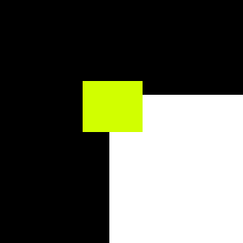

Affine region detectors
-----------------------

What is being detected?
~~~~~~~~~~~~~~~~~~~~~~~

Affine region is basically any region of the image
that is stable under affine transformations. It can be
edges under affinity conditions, corners (small patch of an image)
or any other stable features.

--------------

Available detectors
~~~~~~~~~~~~~~~~~~~

At the moment, the following detectors are implemented

-  Harris detector

-  Hessian detector

--------------

Algorithm steps
~~~~~~~~~~~~~~~

Harris and Hessian
^^^^^^^^^^^^^^^^^^

Both are derived from a concept called Moravec window. Lets have a look
at the image below:

   Moravec window corner case

As can be noticed, moving the yellow window in any direction will cause
very big change in intensity. Now, lets have a look at the edge case:

.. figure:: ./Moravec-window-edge.png
   :alt: Moravec window edge case

   Moravec window edge case

In this case, intensity change will happen only when moving in
particular direction.

This is the key concept in understanding how the two corner detectors
work.

The algorithms have the same structure:

1. Compute image derivatives

2. Compute Weighted sum

3. Compute response

4. Threshold (optional)

Harris and Hessian differ in what **derivatives they compute**. Harris
computes the following derivatives:

``HarrisMatrix = [(dx)^2, dxdy], [dxdy, (dy)^2]``

(note that ``d(x^2)`` and ``(dy^2)`` are **numerical** powers, not gradient again).

The three distinct terms of a matrix can be separated into three images,
to simplify implementation. Hessian, on the other hand, computes second
order derivatives:

``HessianMatrix = [dxdx, dxdy][dxdy, dydy]``

**Weighted sum** is the same for both. Usually Gaussian blur
matrix is used as weights, because corners should have hill like
curvature in gradients, and other weights might be noisy.
Basically overlay weights matrix over a corner, compute sum of
``s[i,j]=image[x + i, y + j] * weights[i, j]`` for ``i, j``
from zero to weight matrix dimensions, then move the window
and compute again until all of the image is covered.

**Response computation** is a matter of choice. Given the general form
of both matrices above

``[a, b][c, d]``

One of the response functions is

``response = det - k * trace^2 = a * c - b * d - k * (a + d)^2``

``k`` is called discrimination constant. Usual values are ``0.04`` -
``0.06``.

The other is simply determinant

``response = det = a * c - b * d``

**Thresholding** is optional, but without it the result will be
extremely noisy. For complex images, like the ones of outdoors, for
Harris it will be in order of 100000000 and for Hessian will be in order
of 10000. For simpler images values in order of 100s and 1000s should be
enough. The numbers assume ``uint8_t`` gray image.

To get deeper explanation please refer to following **paper**:

`Harris, Christopher G., and Mike Stephens. "A combined corner and edge
detector." In Alvey vision conference, vol. 15, no. 50, pp. 10-5244.
1988. <http://citeseerx.ist.psu.edu/viewdoc/download?doi=10.1.1.434.4816&rep=rep1&type=pdf>`__

`Mikolajczyk, Krystian, and Cordelia Schmid. "An affine invariant interest point detector." In European conference on computer vision, pp. 128-142. Springer, Berlin, Heidelberg, 2002. <https://hal.inria.fr/inria-00548252/document>`__

`Mikolajczyk, Krystian, Tinne Tuytelaars, Cordelia Schmid, Andrew Zisserman, Jiri Matas, Frederik Schaffalitzky, Timor Kadir, and Luc Van Gool. "A comparison of affine region detectors." International journal of computer vision 65, no. 1-2 (2005): 43-72. <https://hal.inria.fr/inria-00548528/document>`__

