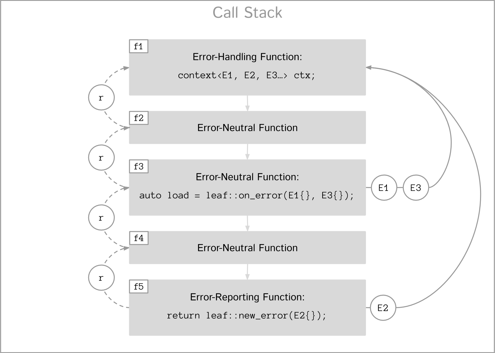

:last-update-label!:
:icons: font
:prewrap!:
:docinfo: shared
:stylesheet: zajo-dark.css
:source-highlighter: rouge

ifdef::backend-pdf[]
= LEAF
endif::[]
ifndef::backend-pdf[]
= LEAFpass:[
<input width="32" height="32" type="image" alt="Skin" src="./skin.png" onclick="this.blur();switch_style();return false;"/>
]
endif::[]
Lightweight Error Augmentation Framework written in {CPP}11 | Emil Dotchevski
ifndef::backend-pdf[]
:toc: left
:toclevels: 3
:toc-title:

[.text-right]
https://github.com/boostorg/leaf[GitHub] | https://boostorg.github.io/leaf/leaf.pdf[PDF]
endif::[]

[abstract]
== Abstract

Boost LEAF is a lightweight error handling library for {CPP}11. Features:

====
* Small single-header format, no dependencies.

* Designed for maximum efficiency ("happy" path and "sad" path).

* No dynamic memory allocations, even with heavy payloads.

* O(1) transport of arbitrary error types (independent of call stack depth).

* Can be used with or without exception handling.

* Support for multi-thread programming.
====

ifndef::backend-pdf[]
[grid=none, frame=none]
|====
| <<introduction,Introduction>> \| <<tutorial>> \| <<synopsis>> \| https://github.com/boostorg/leaf/blob/master/doc/whitepaper.md[Whitepaper] \| https://github.com/boostorg/leaf/blob/master/benchmark/benchmark.md[Benchmark] >| Reference: <<functions,Functions>> \| <<types,Types>> \| <<predicates,Predicates>> \| <<traits,Traits>> \| <<macros,Macros>>
|====
endif::[]

LEAF is designed with a strong bias towards the common use case where callers of functions which may fail check for success and forward errors up the call stack but do not handle them. In this case, only a trivial success-or-failure discriminant is transported. Actual error objects are communicated directly to the error-handling scope, skipping the intermediate check-only frames altogether.

[[support]]
== Support

* https://Cpplang.slack.com[cpplang on Slack] (use the `#boost` channel)
* https://lists.boost.org/mailman/listinfo.cgi/boost-users[Boost Users Mailing List]
* https://lists.boost.org/mailman/listinfo.cgi/boost[Boost Developers Mailing List]
* https://github.com/boostorg/leaf/issues[Report an issue] on GitHub

[[portability]]
== Portability

LEAF requires only {CPP}11, but is tested on many compiler versions and C++ standards.

The library uses thread-local storage, except when multi-threading is disabled (e.g. on some embedded platforms). See <<configuration>>.

[[distribution]]
== Distribution

Copyright (C) 2018-2021 Emil Dotchevski. Distributed under the http://www.boost.org/LICENSE_1_0.txt[Boost Software License, Version 1.0].

There are three distribution channels:

* LEAF is included in official https://www.boost.org/[Boost] releases, starting with Boost 1.75.
* The source code is hosted on https://github.com/boostorg/leaf[GitHub].
* For maximum portability, the library is also available in single-header format: simply download link:leaf.hpp[leaf.hpp] (direct download link).

NOTE: LEAF does not depend on Boost or other libraries.

[[introduction]]
== Five Minute Introduction

We'll implement two versions of the same simple program: one using the LEAF `noexcept` API to handle errors, and another using the exception-handling API.

[[introduction-result]]
=== `noexcept` API

We'll write a short but complete program that reads a text file in a buffer and prints it to `std::cout`, using LEAF to handle errors without exception handling.

NOTE: LEAF provides an <<introduction-eh>> as well.

We'll skip to the chase and start with the `main` function: it will try several operations as needed and handle all the errors that occur. Did I say *all* the errors? I did, so we'll use `leaf::try_handle_all`. It has the following signature:

[source,c++]
----
template <class TryBlock, class... Handler>
<<deduced>> try_handle_all( TryBlock && try_block, Handler && ... handler );
----

`TryBlock` is a function type, required to return a `result<T>` -- for example, `leaf::result<T>` -- that holds a value of type `T` or else indicates a failure.

The first thing `try_handle_all` does is invoke the `try_block` function. If the returned object `r` indicates success, `try_handle_all` unwraps it, returning the contained `r.value()`; otherwise it calls the [underline]#first suitable# error handling function from the `handler...` list.

We'll see later just what kind of a `TryBlock` will our `main` function pass to `try_handle_all`, but first, let's look at the juicy error-handling part. In case of an error, LEAF will consider each of the error handlers, [underline]#in order#, and call the first suitable match:

[source,c++]
----
int main( int argc, char const * argv[] )
{
  return leaf::try_handle_all(

    [&]() -> leaf::result<int>
    {
      // The TryBlock goes here, we'll see it later
    },

    // Error handlers below:

    
    { <1>
      std::cerr << "File not found: " << fn.value << std::endl;
      return 1;
    },

    
    { <2>
      std::cerr << "Failed to open " << fn.value << ", errno=" << errn << std::endl;
      return 2;
    },

    
    { <3>
      std::cerr << "Failed to access " << fn.value;
      if( errn )
        std::cerr << ", errno=" << *errn;
      std::cerr << std::endl;
      return 3;
    },

    
    { <4>
      std::cerr << "Output error, errno=" << errn << std::endl;
      return 4;
    },

    
    { <5>
      std::cout << "Bad command line argument" << std::endl;
      return 5;
    },

    
    { <6>
      std::cerr <<
        "Unknown failure detected" << std::endl <<
        "Cryptic diagnostic information follows" << std::endl <<
        unmatched;
      return 6;
    }
  );
}
----

<1> This handler will be called if the detected error includes: +
pass:[•] an object of type `enum error_code` equal to the value `open_error`, and +
pass:[•] an object of type `leaf::e_errno` that has `.value` equal to `ENOENT`, and +
pass:[•] an object of type `leaf::e_file_name`. +
In short, it handles "file not found" errors.

<2> This handler will be called if the detected error includes: +
pass:[•] an object of type `enum error_code` equal to `open_error`, and +
pass:[•] an object of type `leaf::e_errno` (regardless of its `.value`), and +
pass:[•] an object of type `leaf::e_file_name`. +
In short, it will handle other "file open" errors.

<3> This handler will be called if the detected error includes: +
pass:[•] an object of type `enum error_code` equal to any of `size_error`, `read_error`, `eof_error`, and +
pass:[•] an optional object of type `leaf::e_errno` (regardless of its `.value`), and +
pass:[•] an object of type `leaf::e_file_name`.

<4> This handler will be called if the detected error includes: +
pass:[•] an object of type `enum error_code` equal to `output_error`, and +
pass:[•] an object of type `leaf::e_errno` (regardless of its `.value`),

<5> This handler will be called if the detected error includes an object of type `enum error_code` equal to `bad_command_line`.

<6> This last handler is a catch-all for any error, in case no other handler could be selected: it prints diagnostic information to help debug logic errors in the program, since it failed to find an appropriate error handler for the error condition it encountered.

WARNING: It is critical to understand that the error handlers are considered in order, rather than by finding a "best match". No error handler is "better" than the others: LEAF will call the first one for which all of the arguments can be supplied using the available error objects.

Now, reading and printing a file may not seem like a complex job, but let's split it into several functions, each communicating failures using `leaf::result<T>`:

[source,c++]
----
leaf::result<char const *> parse_command_line( int argc, char const * argv[] ) noexcept; <1>

leaf::result<std::shared_ptr<FILE>> file_open( char const * file_name ) noexcept; <2>

leaf::result<int> file_size( FILE & f ) noexcept; <3>

leaf::result<void> file_read( FILE & f, void * buf, int size ) noexcept; <4>
----

<1> Parse the command line, return the file name.
<2> Open a file for reading.
<3> Return the size of the file.
<4> Read size bytes from f into buf.

For example, let's look at `file_open`:

[source,c++]
----
leaf::result<std::shared_ptr<FILE>> file_open( char const * file_name ) noexcept
{
  if( FILE * f = fopen(file_name,"rb") )
    return std::shared_ptr<FILE>(f,&fclose);
  else
    return leaf::new_error(open_error, leaf::e_errno{errno});
}
----

If `fopen` succeeds, we return a `shared_ptr` which will automatically call `fclose` as needed. If `fopen` fails, we report an error by calling `new_error`, which takes any number of error objects to communicate with the error. In this case we pass the system `errno` (LEAF defines `struct e_errno {int value;}`), and our own error code value, `open_error`.

Here is our complete error code `enum`:

[source,c++]
----
enum error_code
{
  bad_command_line = 1,
  open_error,
  read_error,
  size_error,
  eof_error,
  output_error
};
----

We're now ready to look at the `TryBlock` we'll pass to `try_handle_all`. It does all the work, bails out if it encounters an error:

[source,c++]
----
int main( int argc, char const * argv[] )
{
  return leaf::try_handle_all(

    [&]() -> leaf::result<int>
    {
      leaf::result<char const *> file_name = parse_command_line(argc,argv);
      if( !file_name )
        return file_name.error();
----

Wait, what's this, if "error" return "error"? There is a better way: we'll use `BOOST_LEAF_AUTO`. It takes a `result<T>` and bails out in case of a failure (control leaves the calling function), otherwise uses the passed variable to access the `T` value stored in the `result` object.

This is what our `TryBlock` really looks like:

[source,c++]
----
int main( int argc, char const * argv[] )
{
  return leaf::try_handle_all(

    [&]() -> leaf::result<int> <1>
    {
      BOOST_LEAF_AUTO(file_name, parse_command_line(argc,argv)); <2>

      auto load = leaf::on_error( leaf::e_file_name{file_name} ); <3>

      BOOST_LEAF_AUTO(f, file_open(file_name)); <4>

      BOOST_LEAF_AUTO(s, file_size(*f)); <4>

      std::string buffer( 1 + s, '\0' );
      BOOST_LEAF_CHECK(file_read(*f, &buffer[0], buffer.size()-1)); <4>

      std::cout << buffer;
      std::cout.flush();
      if( std::cout.fail() )
        return leaf::new_error(output_error, leaf::e_errno{errno});

      return 0;
    },

    .... <5>

  ); <6>
}
----

<1> Our `TryBlock` returns a `result<int>`. In case of success, it will hold `0`, which will be returned from `main` to the OS.
<2> If `parse_command_line` returns an error, we forward that error to `try_handle_all` (which invoked us) verbatim. Otherwise, `BOOST_LEAF_AUTO` gets us a variable, `file_name`, to access the parsed string.
<3> From now on, all errors escaping this scope will automatically communicate the (now successfully parsed from the command line) file name (LEAF defines `struct e_file_name {std::string value;}`). This is as if every time one of the following functions wants to report an error, `on_error` says "wait, associate this `e_file_name` object with the error, it's important!"
<4> Call more functions, forward each failure to the caller.
<5> List of error handlers goes here (we saw this earlier).
<6> This concludes the `try_handle_all` arguments -- as well as our program!

Nice and simple! Writing the `TryBlock`, we focus on the "happy" path -- if we encounter any error we just return it to `try_handle_all` for processing. Well, that's if we're being good and using RAII for automatic clean-up -- which we are, `shared_ptr` will automatically close the file for us.

TIP: The complete program from this tutorial is available https://github.com/boostorg/leaf/blob/master/examples/print_file/print_file_result.cpp?ts=4[here]. The https://github.com/boostorg/leaf/blob/master/examples/print_file/print_file_eh.cpp?ts=4[other] version of the same program uses exception handling to report errors (see <<introduction-eh,below>>).

'''

[[introduction-eh]]
=== Exception-Handling API

And now, we'll write the same program that reads a text file in a buffer and prints it to `std::cout`, this time using exceptions to report errors. First, we need to define our exception class hierarchy:

[source,c++]
----
struct bad_command_line: std::exception { };
struct input_error: std::exception { };
struct open_error: input_error { };
struct read_error: input_error { };
struct size_error: input_error { };
struct eof_error: input_error { };
struct output_error: std::exception { };
----

We'll split the job into several functions, communicating failures by throwing exceptions:

[source,c++]
----
char const * parse_command_line( int argc, char const * argv[] ); <1>

std::shared_ptr<FILE> file_open( char const * file_name ); <2>

int file_size( FILE & f ); <3>

void file_read( FILE & f, void * buf, int size ); <4>
----
<1> Parse the command line, return the file name.
<2> Open a file for reading.
<3> Return the size of the file.
<4> Read size bytes from f into buf.

The `main` function brings everything together and handles all the exceptions that are thrown, but instead of using `try` and `catch`, it will use the function template `leaf::try_catch`, which has the following signature:

[source,c++]
----
template <class TryBlock, class... Handler>
<<deduced>> try_catch( TryBlock && try_block, Handler && ... handler );
----

`TryBlock` is a function type that takes no arguments; `try_catch` simply returns the value returned by the `try_block`, catching [underline]#any# exception it throws, in which case it calls the [underline]#first# suitable error handling function from the `handler...` list.

Let's first look at the `TryBlock` our `main` function passes to `try_catch`:

[source,c++]
----
int main( int argc, char const * argv[] )
{
  return leaf::try_catch(

    [&] <1>
    {
      char const * file_name = parse_command_line(argc,argv); <2>

      auto load = leaf::on_error( leaf::e_file_name{file_name} ); <3>

      std::shared_ptr<FILE> f = file_open( file_name ); <2>

      std::string buffer( 1+file_size(*f), '\0' ); <2>
      file_read(*f, &buffer[0], buffer.size()-1); <2>

      std::cout << buffer;
      std::cout.flush();
      if( std::cout.fail() )
        throw leaf::exception(output_error{}, leaf::e_errno{errno});

      return 0;
    },

    .... <4>

  ); <5>
}
----

<1> Except if it throws, our `TryBlock` returns `0`, which will be returned from `main` to the OS.
<2> If any of the functions we call throws, `try_catch` will find an appropriate handler to invoke (below).
<3> From now on, all exceptions escaping this scope will automatically communicate the (now successfully parsed from the command line) file name (LEAF defines `struct e_file_name {std::string value;}`). This is as if every time one of the following functions wants to throw an exception, `on_error` says "wait, associate this `e_file_name` object with the exception, it's important!"
<4> List of error handlers goes here. We'll see that later.
<5> This concludes the `try_catch` arguments -- as well as our program!

As it is always the case when using exception handling, as long as our `TryBlock` is exception-safe, we can focus on the "happy" path. Of course, our `TryBlock` is exception-safe, since `shared_ptr` will automatically close the file for us in case an exception is thrown.

Now let's look at the second part of the call to `try_catch`, which lists the error handlers:

[source,c++]
----
int main( int argc, char const * argv[] )
{
  return leaf::try_catch(
    [&]
    {
      // The TryBlock goes here (we saw that earlier)
    },

    // Error handlers below:

    
    { <1>
      std::cerr << "File not found: " << fn.value << std::endl;
      return 1;
    },

    
    { <2>
      std::cerr << "Failed to open " << fn.value << ", errno=" << errn << std::endl;
      return 2;
    },

    
    { <3>
      std::cerr << "Failed to access " << fn.value;
      if( errn )
        std::cerr << ", errno=" << *errn;
      std::cerr << std::endl;
      return 3;
    },

    
    { <4>
      std::cerr << "Output error, errno=" << errn << std::endl;
      return 4;
    },

    
    { <5>
      std::cout << "Bad command line argument" << std::endl;
      return 5;
    },

    
    { <6>
      std::cerr <<
        "Unknown failure detected" << std::endl <<
        "Cryptic diagnostic information follows" << std::endl <<
        unmatched;
      return 6;
    } );
}
----

<1> This handler will be called if: +
pass:[•] an `open_error` exception was caught, with +
pass:[•] an object of type `leaf::e_errno` that has `.value` equal to `ENOENT`, and +
pass:[•] an object of type `leaf::e_file_name`. +
In short, it handles "file not found" errors.

<2> This handler will be called if: +
pass:[•] an `open_error` exception was caught, with +
pass:[•] an object of type `leaf::e_errno` (regardless of its `.value`), and +
pass:[•] an object of type `leaf::e_file_name`. +
In short, it handles other "file open" errors.

<3> This handler will be called if: +
pass:[•] an `input_error` exception was caught (which is a base type), with +
pass:[•] an optional object of type `leaf::e_errno` (regardless of its `.value`), and +
pass:[•] an object of type `leaf::e_file_name`.

<4> This handler will be called if: +
pass:[•] an `output_error` exception was caught, with +
pass:[•] an object of type `leaf::e_errno` (regardless of its `.value`),

<5> This handler will be called if a `bad_command_line` exception was caught.

<6> If `try_catch` fails to find an appropriate handler, it will re-throw the exception. But this is the `main` function which should handle all exceptions, so this last handler matches any error and prints diagnostic information, to help debug logic errors.

WARNING: It is critical to understand that the error handlers are considered in order, rather than by finding a "best match". No error handler is "better" than the others: LEAF will call the first one for which all of the arguments can be supplied using the available error objects.

To conclude this introduction, let's look at one of the error-reporting functions that our `TryBlock` calls, for example `file_open`:

[source,c++]
----
std::shared_ptr<FILE> file_open( char const * file_name )
{
  if( FILE * f = fopen(file_name,"rb") )
    return std::shared_ptr<FILE>(f,&fclose);
  else
    throw leaf::exception(open_error{}, leaf::e_errno{errno});
}
----

If `fopen` succeeds, it returns a `shared_ptr` which will automatically call `fclose` as needed. If `fopen` fails, we throw the exception object returned by `leaf::exception`, which in this case is of type that derives from `open_error`; the passed `e_errno` object will be associated with the exception.

NOTE: `try_catch` works with any exception, not only exceptions thrown using `leaf::exception`.

TIP: The complete program from this tutorial is available https://github.com/boostorg/leaf/blob/master/examples/print_file/print_file_eh.cpp?ts=4[here]. The https://github.com/boostorg/leaf/blob/master/examples/print_file/print_file_result.cpp?ts=4[other] version of the same program does not use exception handling to report errors (see the <<introduction-result,previous introduction>>).

[[tutorial]]
== Tutorial

This section assumes the reader has basic understanding of using LEAF to handle errors; see <<introduction>>.

[[tutorial-model]]
=== Error Communication Model

==== `noexcept` API

The following figure illustrates how error objects are transported when using LEAF without exception handling:

.LEAF noexcept Error Communication Model

The arrows pointing down indicate the call stack order for the functions `f1` through `f5`: higher level functions calling lower level functions.

Note the call to `on_error` in `f3`: it caches the passed error objects of types `E1` and `E3` in the returned object `load`, where they stay ready to be communicated in case any function downstream from `f3` reports an error. Presumably these objects are relevant to any such failure, but are conveniently accessible only in this scope.

_Figure 1_ depicts the condition where `f5` has detected an error. It calls `leaf::new_error` to create a new, unique `error_id`. The passed error object of type `E2` is immediately loaded in the first active `context` object that provides static storage for it, found in any calling scope (in this case `f1`), and is associated with the newly-generated `error_id` (solid arrow);

The `error_id` itself is returned to the immediate caller `f4`, usually stored in a `result<T>` object `r`. That object takes the path shown by dashed arrows, as each error-neutral function, unable to handle the failure, forwards it to its immediate caller in the returned value -- until an error-handling scope is reached.

When the destructor of the `load` object in `f3` executes, it detects that `new_error` was invoked after its initialization, loads the cached objects of types `E1` and `E3` in the first active `context` object that provides static storage for them, found in any calling scope (in this case `f1`), and associates them with the last generated `error_id` (solid arrow).

When the error-handling scope `f1` is reached, it probes `ctx` for any error objects associated with the `error_id` it received from `f2`, and processes a list of user-provided error handlers, in order, until it finds a handler with arguments that can be supplied using the available (in `ctx`) error objects. That handler is called to deal with the failure.

==== Exception-Handling API

The following figure illustrates the slightly different error communication model used when errors are reported by throwing exceptions:

.LEAF Error Communication Model Using Exception Handling
image::LEAF-2.png[]

The main difference is that the call to `new_error` is implicit in the call to the function template `leaf::exception`, which in this case takes an exception object of type `Ex`, and returns an exception object of unspecified type that derives publicly from `Ex`.

[[tutorial-interoperability]]
==== Interoperability

Ideally, when an error is detected, a program using LEAF would always call <<new_error>>, ensuring that each encountered failure is definitely assigned a unique <<error_id>>, which then is reliably delivered, by an exception or by a `result<T>` object, to the appropriate error-handling scope.

Alas, this is not always possible.

For example, the error may need to be communicated through uncooperative 3rd-party interfaces. To facilitate this transmission, a error ID may be encoded in a `std::error_code`. As long as a 3rd-party interface understands `std::error_code`, it should be compatible with LEAF.

Further, it is sometimes necessary to communicate errors through an interface that does not even use `std::error_code`. An example of this is when an external lower-level library throws an exception, which is unlikely to be able to carry an `error_id`.

To support this tricky use case, LEAF provides the function <<current_error>>, which returns the error ID returned by the most recent call (from this thread) to <<new_error>>. One possible approach to solving the problem is to use the following logic (implemented by the <<error_monitor>> type):

. Before calling the uncooperative API, call <<current_error>> and cache the returned value.
. Call the API, then call `current_error` again:
.. If this returns the same value as before, pass the error objects to `new_error` to associate them with a new `error_id`;
.. else, associate the error objects with the `error_id` value returned by the second call to `current_error`.

Note that if the above logic is nested (e.g. one function calling another), `new_error` will be called only by the inner-most function, because that call guarantees that all calling functions will hit the `else` branch.

TIP: To avoid ambiguities, whenever possible, use the <<exception>> function template when throwing exceptions to ensure that the exception object transports a unique `error_id`; better yet, use the <<BOOST_LEAF_THROW_EXCEPTION>> macro, which in addition will capture `pass:[__FILE__]` and `pass:[__LINE__]`.

'''

[[tutorial-loading]]
=== Loading of Error Objects

To load an error object is to move it into an active <<context>>, usually local to a <<try_handle_some>>, a <<try_handle_all>> or a <<try_catch>> scope in the calling thread, where it becomes uniquely associated with a specific <<error_id>> -- or discarded if storage is not available.

Various LEAF functions take a list of error objects to load. As an example, if a function `copy_file` that takes the name of the input file and the name of the output file as its arguments detects a failure, it could communicate an error code `ec`, plus the two relevant file names using <<new_error>>:

[source,c++]
----
return leaf::new_error(ec, e_input_name{n1}, e_output_name{n2});
----

Alternatively, error objects may be loaded using a `result<T>` that is already communicating an error. This way they become associated with that error, rather than with a new error:

[source,c++]
----
leaf::result<int> f() noexcept;

leaf::result<void> g( char const * fn ) noexcept
{
  if( leaf::result<int> r = f() )
  { <1>
    ....;
    return { };
  }
  else
  {
    return r.load( e_file_name{fn} ); <2>
  }
}
----
[.text-right]
<<result>> | <<result::load>>

<1> Success! Use `r.value()`.
<2> `f()` has failed; here we associate an additional `e_file_name` with the error. However, this association occurs iff in the call stack leading to `g` there are error handlers that take an `e_file_name` argument. Otherwise, the object passed to `load` is discarded. In other words, the passed objects are loaded iff the program actually uses them to handle errors.

Besides error objects, `load` can take function arguments:

* If we pass a function that takes no arguments, it is invoked, and the returned error object is loaded.
+
Consider that if we pass to `load` an error object that is not needed by any error handler, it will be discarded. If the object is expensive to compute, it would be better if the computation can be skipped as well. Passing a function with no arguments to `load` is an excellent way to achieve this behavior:
+
[source,c++]
----
struct info { .... };

info compute_info() noexcept;

leaf::result<void> operation( char const * file_name ) noexcept
{
  if( leaf::result<int> r = try_something() )
  { <1>
    ....
    return { };
  }
  else
  {
    return r.load( <2>
      [&]
      {
        return compute_info();
      } );
  }
}
----
[.text-right]
<<result>> | <<result::load>>
+
<1> Success! Use `r.value()`.
<2> `try_something` has failed; `compute_info` will only be called if an error handler exists which takes a `info` argument.
+
* If we pass a function that takes a single argument of type `E &`, LEAF calls the function with the object of type `E` currently loaded in an active `context`, associated with the error. If no such object is available, a new one is default-initialized and then passed to the function.
+
For example, if an operation that involves many different files fails, a program may provide for collecting all relevant file names in a `e_relevant_file_names` object:
+
[source,c++]
----
struct e_relevant_file_names
{
  std::vector<std::string> value;
};

leaf::result<void> operation( char const * file_name ) noexcept
{
  if( leaf::result<int> r = try_something() )
  { <1>
    ....
    return { };
  }
  else
  {
    return r.load( <2>
      [&](e_relevant_file_names & e)
      {
        e.value.push_back(file_name);
      } );
  }
}
----
[.text-right]
<<result>> | <<result::load>>
+
<1> Success! Use `r.value()`.
<2> `try_something` has failed -- add `file_name` to the `e_relevant_file_names` object, associated with the `error_id` communicated in `r`. Note, however, that the passed function will only be called iff in the call stack there are error handlers that take an `e_relevant_file_names` object.

'''

[[tutorial-on_error]]
=== Using `on_error`

It is not typical for an error-reporting function to be able to supply all of the data needed by a suitable error-handling function in order to recover from the failure. For example, a function that reports `FILE` operation failures may not have access to the file name, yet an error handling function needs it in order to print a useful error message.

Of course the file name is typically readily available in the call stack leading to the failed `FILE` operation. Below, while `parse_info` can't report the file name, `parse_file` can and does:

[source,c++]
----
leaf::result<info> parse_info( FILE * f ) noexcept; <1>

leaf::result<info> parse_file( char const * file_name ) noexcept
{
  auto load = leaf::on_error(leaf::e_file_name{file_name}); <2>

  if( FILE * f = fopen(file_name,"r") )
  {
    auto r = parse_info(f);
    fclose(f);
    return r;
  }
  else
    return leaf::new_error( error_enum::file_open_error );
}
----

[.text-right]
<<result>> | <<on_error>> | <<new_error>>

<1> `parse_info` parses `f`, communicating errors using `result<info>`.
<2> Using `on_error` ensures that the file name is included with any error reported out of `parse_file`. All we need to do is hold on to the returned object `load`; when it expires, if an error is being reported, the passed `e_file_name` value will be automatically associated with it.

TIP: `on_error` --  like `load` -- can be passed any number of arguments.

When we invoke `on_error`, we can pass three kinds of arguments:

. Actual error objects (like in the example above);
. Functions that take no arguments and return an error object;
. Functions that take an error object by mutable reference.

If we want to use `on_error` to capture `errno`, we can't just pass <<e_errno>> to it, because at that time it hasn't been set (yet). Instead, we'd pass a function that returns it:

[source,c++]
----
void read_file(FILE * f) {

  auto load = leaf::on_error([]{ return e_errno{errno}; });

  ....
  size_t nr1=fread(buf1,1,count1,f);
  if( ferror(f) )
    throw leaf::exception();

  size_t nr2=fread(buf2,1,count2,f);
  if( ferror(f) )
    throw leaf::exception();

  size_t nr3=fread(buf3,1,count3,f);
  if( ferror(f) )
    throw leaf::exception();
  ....
}
----

Above, if a `throw` statement is reached, LEAF will invoke the function passed to `on_error` and associate the returned `e_errno` object with the exception.

The final type of arguments that can be passed to `on_error` is a function that takes a single mutable error object reference. In this case, `on_error` uses it similarly to how such functios are used by `load`; see <<tutorial-loading>>.

'''

[[tutorial-predicates]]
=== Using Predicates to Handle Errors

Usually, LEAF error handlers are selected based on the type of the arguments they take and the type of the available error objects. When an error handler takes a predicate type as an argument, the <<handler_selection_procedure,handler selection procedure>> is able to also take into account the _value_ of the available error objects.

Consider this error code enum:

[source,c++]
----
enum class my_error
{
  e1=1,
  e2,
  e3
};
----

We could handle `my_error` errors like so:

[source,c++]
----
return leaf::try_handle_some(
  []
  {
    return f(); // returns leaf::result<T>
  },

  
  { <1>
    switch(e)
    {
      case my_error::e1:
        ....; <2>
        break;
      case my_error::e2:
      case my_error::e3:
        ....; <3>
        break;
      default:
        ....; <4>
        break;
  } );
----
<1> This handler will be selected if we've got a `my_error` object.
<2> Handle `e1` errors.
<3> Handle `e2` and `e3` errors.
<4> Handle bad `my_error` values.

If `my_error` object is available, LEAF will call our error handler. If not, the failure will be forwarded to our caller.

This can be rewritten using the <<match>> predicate to organize the different cases in different error handlers. The following is equivalent:

[source,c++]
----
return leaf::try_handle_some(
  []
  {
    return f(); // returns leaf::result<T>
  },

  
  { <1>
    assert(m.matched == my_error::e1);
    ....;
  },

  
  { <2>
    assert(m.matched == my_error::e2 || m.matched == my_error::e3);
    ....;
  },

  
  { <3>
    ....;
  } );
----
<1> We've got a `my_error` object that compares equal to `e1`.
<2> We`ve got a `my_error` object that compares equal to either `e2` or `e3`.
<3> Handle bad `my_error` values.

The first argument to the `match` template generally specifies the type `E` of the error object `e` that must be available for the error handler to be considered at all. Typically, the rest of the arguments are values. The error handler to be dropped if `e` does not compare equal to any of them.

In particular, `match` works great with `std::error_code`. The following handler is designed to handle `ENOENT` errors:

[source,c++]
----

{
}
----

This, however, requires {CPP}17 or newer, because it is impossible to infer the type of the error enum (in this case, `std::errc`) from the specified type `std::error_code`, and {CPP}11 does not allow `auto` template arguments. LEAF provides the following workaround, compatible with {CPP}11:

[source,c++]
----

{
}
----

In addition, it is possible to select a handler based on `std::error_category`. The following handler will match any `std::error_code` of the `std::generic_category` (requires {CPP}17 or newer):

[source,c++]
----

{
}
----

TIP: See <<match>> for more examples.

The following predicates are available:

* <<match>>: as described above.
* <<match_value>>: where `match<E, V...>` compares the object `e` of type `E` with the values `V...`, `match_value<E, V...>` compare `e.value` with the values `V...`.
* <<match_member>>: similar to `match_value`, but takes a pointer to the data member to compare; that is, `match_member<&E::value, V...>` is equvialent to `match_value<E, V...>`. Note, however, that `match_member` requires {CPP}17 or newer, while `match_value` does not.
* `<<catch_,catch_>><Ex...>`: Similar to `match`, but checks whether the caught `std::exception` object can be `dynamic_cast` to any of the `Ex` types.
* <<if_not>> is a special predicate that takes any other predicate `Pred` and requires that an error object of type `E` is available and that `Pred` evaluates to `false`. For example, `if_not<match<E, V...>>` requires that an object `e` of type `E` is available, and that it does not compare equal to any of the specified `V...`.

Finally, the predicate system is easily extensible, see <<predicates,Predicates>>.

NOTE: See also <<tutorial-std_error_code>>.

'''

[[tutorial-binding_handlers]]
=== Binding Error Handlers in a `std::tuple`

Consider this snippet:

[source,c++]
----
leaf::try_handle_all(
  [&]
  {
    return f(); // returns leaf::result<T>
  },

  
  {
    ...
  },

  
  {
    ...
  },

  []
  {
    ...
  });
----

[.text-right]
<<try_handle_all>> | <<e_file_name>>

Looks pretty simple, but what if we need to attempt a different set of operations yet use the same handlers? We could repeat the same thing with a different function passed as `TryBlock` for `try_handle_all`:

[source,c++]
----
leaf::try_handle_all(
  [&]
  {
    return g(); // returns leaf::result<T>
  },

  
  {
    ...
  },

  
  {
    ...
  },

  []
  {
    ...
  });
----

That works, but it is better to bind our error handlers in a `std::tuple`:

[source,c++]
----
auto error_handlers = std::make_tuple(
  
  {
    ...
  },

  
  {
    ...
  },

  []
  {
    ...
  });
----

The `error_handlers` tuple can later be used with any error handling function:

[source,c++]
----
leaf::try_handle_all(
  [&]
  {
    // Operations which may fail <1>
  },

  error_handlers );

leaf::try_handle_all(
  [&]
  {
    // Different operations which may fail <2>
  },

  error_handlers ); <3>
----
[.text-right]
<<try_handle_all>> | <<error_info>>

<1> One set of operations which may fail...
<2> A different set of operations which may fail...
<3> ... both using the same `error_handlers`.

Error-handling functions accept a `std::tuple` of error handlers in place of any error handler. The behavior is as if the tuple is unwrapped in-place.

'''

[[tutorial-async]]
=== Transporting Error Objects Between Threads

Error objects are stored on the stack in an instance of the <<context>> class template in the scope of e.g. <<try_handle_some>>, <<try_handle_all>> or <<try_catch>> functions. When using concurrency, we need a mechanism to collect error objects in one thread, then use them to handle errors in another thread.

LEAF offers two interfaces for this purpose, one using `result<T>`, and another designed for programs that use exception handling.

[[tutorial-async_result]]
==== Using `result<T>`

Let's assume we have a `task` that we want to launch asynchronously, which produces a `task_result` but could also fail:

[source,c++]
----
leaf::result<task_result> task();
----

Because the task will run asynchronously, in case of a failure we need it to capture the relevant error objects but not handle errors. To this end, in the main thread we bind our error handlers in a `std::tuple`, which we will later use to handle errors from each completed asynchronous task (see <<tutorial-binding_handlers,tutorial>>):

[source,c++]
----
auto error_handlers = std::make_tuple(
  
  {
    //Deal with E1, E2
    ....
    return { };
  },

  
  {
    //Deal with E3
    ....
    return { };
  } );
----

Why did we start with this step? Because we need to create a <<context>> object to collect the error objects we need. We could just instantiate the `context` template with `E1`, `E2` and `E3`, but that would be prone to errors, since it could get out of sync with the handlers we use. Thankfully LEAF can deduce the types we need automatically, we just need to show it our `error_handlers`:

[source,c++]
----
std::shared_ptr<leaf::polymorphic_context> ctx = leaf::make_shared_context(error_handlers);
----

The `polymorphic_context` type is an abstract base class that has the same members as any instance of the `context` class template, allowing us to erase its exact type. In this case what we're holding in `ctx` is a `context<E1, E2, E3>`, where `E1`, `E2` and `E3` were deduced automatically from the `error_handlers` tuple we passed to `make_shared_context`.

We're now ready to launch our asynchronous task:

[source,c++]
----
std::future<leaf::result<task_result>> launch_task() noexcept
{
  return std::async(
    std::launch::async,
    [&]
    {
      std::shared_ptr<leaf::polymorphic_context> ctx = leaf::make_shared_context(error_handlers);
      return leaf::capture(ctx, &task);
    } );
}
----

[.text-right]
<<result>> | <<make_shared_context>> | <<capture>>

That's it! Later when we `get` the `std::future`, we can process the returned `result<task_result>` in a call to <<try_handle_some>>, using the `error_handlers` tuple we created earlier:

[source,c++]
----
//std::future<leaf::result<task_result>> fut;
fut.wait();

return leaf::try_handle_some(

  [&]() -> leaf::result<void>
  {
    BOOST_LEAF_AUTO(r, fut.get());
    //Success!
    return { }
  },

  error_handlers );
----

[.text-right]
<<try_handle_some>> | <<result>> | <<BOOST_LEAF_AUTO>>

The reason this works is that in case it communicates a failure, `leaf::result<T>` is able to hold a `shared_ptr<polymorphic_context>` object. That is why earlier instead of calling `task()` directly, we called `leaf::capture`: it calls the passed function and, in case that fails, it stores the `shared_ptr<polymorphic_context>` we created in the returned `result<T>`, which now doesn't just communicate the fact that an error has occurred, but also holds the `context` object that `try_handle_some` needs in order to supply a suitable handler with arguments.

NOTE: Follow this link to see a complete example program: https://github.com/boostorg/leaf/blob/master/examples/capture_in_result.cpp?ts=4[capture_in_result.cpp].

'''

[[tutorial-async_eh]]
==== Using Exception Handling

Let's assume we have an asynchronous `task` which produces a `task_result` but could also throw:

[source,c++]
----
task_result task();
----

Just like we saw in <<tutorial-async_result>>, first we will bind our error handlers in a `std::tuple`:

[source,c++]
----
auto handle_errors = std::make_tuple(
{
  
  {
    //Deal with E1, E2
    ....
    return { };
  },

  
  {
    //Deal with E3
    ....
    return { };
  } );
----

Launching the task looks the same as before, except that we don't use `result<T>`:

[source,c++]
----
std::future<task_result> launch_task()
{
  return std::async(
    std::launch::async,
    [&]
    {
      std::shared_ptr<leaf::polymorphic_context> ctx = leaf::make_shared_context(&handle_error);
      return leaf::capture(ctx, &task);
    } );
}
----

[.text-right]
<<make_shared_context>> | <<capture>>

That's it! Later when we `get` the `std::future`, we can process the returned `task_result` in a call to <<try_catch>>, using the `error_handlers` we saved earlier, as if it was generated locally:

[source,c++]
----
//std::future<task_result> fut;
fut.wait();

return leaf::try_catch(

  [&]
  {
    task_result r = fut.get(); // Throws on error
    //Success!
  },

  error_handlers );
----

[.text-right]
<<try_catch>>

This works similarly to using `result<T>`, except that the `std::shared_ptr<polymorphic_context>` is transported in an exception object (of unspecified type which <<try_catch>> recognizes and then automatically unwraps the original exception).

NOTE: Follow this link to see a complete example program: https://github.com/boostorg/leaf/blob/master/examples/capture_in_exception.cpp?ts=4[capture_in_exception.cpp].

'''

[[tutorial-classification]]
=== Classification of Failures

It is common for any given interface to define an `enum` that lists all possible error codes that the API reports. The benefit of this approach is that the list is complete and usually contains comments, so we know where to go for reference.

The disadvantage of such flat enums is that they do not support handling a whole class of failures. Consider this error handler from the <<introduction-result,introduction section>>:

[source,c++]
----
....

{
  std::cerr << "Failed to access " << fn.value;
  if( errn )
    std::cerr << ", errno=" << *errn;
  std::cerr << std::endl;
  return 3;
},
....
----

It will get called if the value of the `error_code` enum communicated with the failure is one of `size_error`, `read_error` or `eof_error`. In short, the idea is to handle any input error.

But what if later we add support for detecting and reporting a new type of input error, e.g. `permissions_error`? It is easy to add that to our `error_code` enum; but now our input error handler won't recognize this new input error -- and we have a bug.

If we can use exceptions, the situation is better because exception types can be organized in a hierarchy in order to classify failures:

[source,c++]
----
struct input_error: std::exception { };
struct read_error: input_error { };
struct size_error: input_error { };
struct eof_error: input_error { };
----

In terms of LEAF, our input error exception handler now looks like this:

[source,c++]
----

{
  std::cerr << "Failed to access " << fn.value;
  if( errn )
    std::cerr << ", errno=" << *errn;
  std::cerr << std::endl;
  return 3;
},
----

This is future-proof, but still not ideal, because it is not possible to refine the classification of the failure after the exception object has been thrown.

LEAF supports a novel style of error handling where the classification of failures does not use error code values or exception type hierarchies. If we go back to the introduction section, instead of defining:

[source,c++]
----
enum error_code
{
  ....
  read_error,
  size_error,
  eof_error,
  ....
};
----

We could define:

[source,c++]
----
....
struct input_error { };
struct read_error { };
struct size_error { };
struct eof_error { };
....
----

With this in place, `file_read` from the https://github.com/boostorg/leaf/blob/master/examples/print_file/print_file_result.cpp?ts=4[print_file_result.cpp] example can be rewritten like this:

[source,c++]
----
leaf::result<void> file_read( FILE & f, void * buf, int size )
{
  int n = fread(buf, 1, size, &f);

  if( ferror(&f) )
    return leaf::new_error(input_error{}, read_error{}, leaf::e_errno{errno}); <1>

  if( n!=size )
    return leaf::new_error(input_error{}, eof_error{}); <2>

  return { };
}
----
[.text-right]
<<result>> | <<new_error>> | <<e_errno>>

<1> This error is classified as `input_error` and `read_error`.
<2> This error is classified as `input_error` and `eof_error`.

Or, even better:

[source,c++]
----
leaf::result<void> file_read( FILE & f, void * buf, int size )
{
  auto load = leaf::on_error(input_error{}); <1>

  int n = fread(buf, 1, size, &f);

  if( ferror(&f) )
    return leaf::new_error(read_error{}, leaf::e_errno{errno}); <2>

  if( n!=size )
    return leaf::new_error(eof_error{}); <3>

  return { };
}
----
[.text-right]
<<result>> | <<on_error>> | <<new_error>> | <<e_errno>>

<1> Any error escaping this scope will be classified as `input_error`
<2> In addition, this error is classified as `read_error`.
<3> In addition, this error is classified as `eof_error`.

This technique works just as well if we choose to use exception handling:

[source,c++]
----
void file_read( FILE & f, void * buf, int size )
{
  auto load = leaf::on_error(input_error{});

  int n = fread(buf, 1, size, &f);

  if( ferror(&f) )
    throw leaf::exception(read_error{}, leaf::e_errno{errno});

  if( n!=size )
    throw leaf::exception(eof_error{});
}
----
[.text-right]
<<on_error>> | <<exception>> | <<e_errno>>

NOTE: If the type of the first argument passed to `leaf::exception` derives from `std::exception`, it will be used to initialize the returned exception object taken by `throw`. Here this is not the case, so the function returns a default-initialized `std::exception` object, while the first (and any other) argument is associated with the failure.

And now we can write a future-proof handler that can handle any `input_error`:

[source,c++]
----
....

{
  std::cerr << "Failed to access " << fn.value;
  if( errn )
    std::cerr << ", errno=" << *errn;
  std::cerr << std::endl;
  return 3;
},
....
----

Remarkably, because the classification of the failure does not depend on error codes or on exception types, this error handler can be used with `try_catch` if we use exception handling, or with `try_handle_some`/`try_handle_all` if we do not. Here is the complete example from the introduction section, rewritten to use this technique:

* https://github.com/boostorg/leaf/blob/master/examples/print_file/print_file_result_error_tags.cpp?ts=4[print_file_result_error_tags.cpp] (using `leaf::result<T>`).
* https://github.com/boostorg/leaf/blob/master/examples/print_file/print_file_eh_error_tags.cpp?ts=4[print_file_eh_error_tags.cpp] (using exception handling).

'''

[[tutorial-exception_to_result]]
=== Converting Exceptions to `result<T>`

It is sometimes necessary to catch exceptions thrown by a lower-level library function, and report the error through different means, to a higher-level library which may not use exception handling.

NOTE: Understand that error handlers that take arguments of types that derive from `std::exception` work correctly -- regardless of whether the error object itself is thrown as an exception, or <<tutorial-loading,loaded>> into a <<context>>. The technique described here is only needed when the exception must be communicated through functions which are not exception-safe, or are compiled with exception-handling disabled.

Suppose we have an exception type hierarchy and a function `compute_answer_throws`:

[source,c++]
----
class error_base: public std::exception { };
class error_a: public error_base { };
class error_b: public error_base { };
class error_c: public error_base { };

int compute_answer_throws()
{
  switch( rand()%4 )
  {
    default: return 42;
    case 1: throw error_a();
    case 2: throw error_b();
    case 3: throw error_c();
  }
}
----

We can write a simple wrapper using `exception_to_result`, which calls `compute_answer_throws` and switches to `result<int>` for error handling:

[source,c++]
----
leaf::result<int> compute_answer() noexcept
{
  return leaf::exception_to_result<error_a, error_b>(
    []
    {
      return compute_answer_throws();
    } );
}
----

[.text-right]
<<result>> | <<exception_to_result>>

The `exception_to_result` template takes any number of exception types. All exception types thrown by the passed function are caught, and an attempt is made to convert the exception object to each of the specified types. Each successfully-converted slice of the caught exception object, as well as the return value of `std::current_exception`, are copied and <<tutorial-loading,loaded>>, and in the end the exception is converted to a `<<result,result>><T>` object.

(In our example, `error_a` and `error_b` slices as communicated as error objects, but `error_c` exceptions will still be captured by `std::exception_ptr`).

Here is a simple function which prints successfully computed answers, forwarding any error (originally reported by throwing an exception) to its caller:

[source,c++]
----
leaf::result<void> print_answer() noexcept
{
  BOOST_LEAF_AUTO(answer, compute_answer());
  std::cout << "Answer: " << answer << std::endl;
  return { };
}
----

[.text-right]
<<result>> | <<BOOST_LEAF_AUTO>>

Finally, here is a scope that handles the errors -- it will work correctly regardless of whether `error_a` and `error_b` objects are thrown as exceptions or not.

[source,c++]
----
leaf::try_handle_all(
   -> leaf::result<void>
  {
    BOOST_LEAF_CHECK(print_answer());
    return { };
  },

  
  {
    std::cerr << "Error A!" << std::endl;
  },

  
  {
    std::cerr << "Error B!" << std::endl;
  },

  []
  {
    std::cerr << "Unknown error!" << std::endl;
  } );
----

[.text-right]
<<try_handle_all>> | <<result>> | <<BOOST_LEAF_CHECK>>

NOTE: The complete program illustrating this technique is available https://github.com/boostorg/leaf/blob/master/examples/exception_to_result.cpp?ts=4[here].

'''

[[tutorial-on_error_in_c_callbacks]]
=== Using `error_monitor` to Report Arbitrary Errors from C-callbacks

Communicating information pertaining to a failure detected in a C callback is tricky, because C callbacks are limited to a specific static signature, which may not use {CPP} types.

LEAF makes this easy. As an example, we'll write a program that uses Lua and reports a failure from a {CPP} function registered as a C callback, called from a Lua program. The failure will be propagated from {CPP}, through the Lua interpreter (written in C), back to the {CPP} function which called it.

C/{CPP} functions designed to be invoked from a Lua program must use the following signature:

[source,c]
----
int do_work( lua_State * L ) ;
----

Arguments are passed on the Lua stack (which is accessible through `L`). Results too are pushed onto the Lua stack.

First, let's initialize the Lua interpreter and register `do_work` as a C callback, available for Lua programs to call:

[source,c++]
----
std::shared_ptr<lua_State> init_lua_state() noexcept
{
  std::shared_ptr<lua_State> L(lua_open(), &lua_close); //<1>

  lua_register(&*L, "do_work", &do_work); //<2>

  luaL_dostring(&*L, "\ //<3>
\n      function call_do_work()\
\n          return do_work()\
\n      end");

  return L;
}
----
<1> Create a new `lua_State`. We'll use `std::shared_ptr` for automatic cleanup.
<2> Register the `do_work` {CPP} function as a C callback, under the global name `do_work`. With this, calls from Lua programs to `do_work` will land in the `do_work` {CPP} function.
<3> Pass some Lua code as a `C` string literal to Lua. This creates a global Lua function called `call_do_work`, which we will later ask Lua to execute.

Next, let's define our `enum` used to communicate `do_work` failures:

[source,c++]
----
enum do_work_error_code
{
  ec1=1,
  ec2
};
----

We're now ready to define the `do_work` callback function:

[source,c++]
----
int do_work( lua_State * L ) noexcept
{
  bool success = rand()%2; <1>
  if( success )
  {
    lua_pushnumber(L, 42); <2>
    return 1;
  }
  else
  {
    leaf::new_error(ec1); <3>
    return luaL_error(L, "do_work_error"); <4>
  }
}
----
[.text-right]
<<new_error>> | <<error_id::load>>

<1> "Sometimes" `do_work` fails.
<2> In case of success, push the result on the Lua stack, return back to Lua.
<3> Generate a new `error_id` and associate a `do_work_error_code` with it. Normally, we'd return this in a `leaf::result<T>`, but the `do_work` function signature (required by Lua) does not permit this.
<4> Tell the Lua interpreter to abort the Lua program.

Now we'll write the function that calls the Lua interpreter to execute the Lua function `call_do_work`, which in turn calls `do_work`. We'll return `<<result,result>><int>`, so that our caller can get the answer in case of success, or an error:

[source,c++]
----
leaf::result<int> call_lua( lua_State * L )
{
  lua_getfield(L, LUA_GLOBALSINDEX, "call_do_work");

  error_monitor cur_err;
  if( int err=lua_pcall(L, 0, 1, 0) ) <1>
  {
    auto load = leaf::on_error(e_lua_error_message{lua_tostring(L,1)}); <2>
    lua_pop(L,1);

    return cur_err.assigned_error_id().load(e_lua_pcall_error{err}); <3>
  }
  else
  {
    int answer = lua_tonumber(L, -1); <4>
    lua_pop(L, 1);
    return answer;
  }
}
----
[.text-right]
<<result>> | <<on_error>> | <<error_monitor>>

<1> Ask the Lua interpreter to call the global Lua function `call_do_work`.
<2> `on_error` works as usual.
<3> `load` will use the `error_id` generated in our Lua callback. This is the same `error_id` the `on_error` uses as well.
<4> Success! Just return the `int` answer.

Finally, here is the `main` function which exercises `call_lua`, each time handling any failure:

[source,c++]
----
int main() noexcept
{
  std::shared_ptr<lua_State> L=init_lua_state();

  for( int i=0; i!=10; ++i )
  {
    leaf::try_handle_all(

      [&]() -> leaf::result<void>
      {
        BOOST_LEAF_AUTO(answer, call_lua(&*L));
        std::cout << "do_work succeeded, answer=" << answer << '\n'; <1>
        return { };
      },

       <2>
      {
        std::cout << "Got do_work_error_code = " << e <<  "!\n";
      },

       <3>
      {
        std::cout << "Got e_lua_pcall_error, Lua error code = " << err.value << ", " << msg.value << "\n";
      },

      
      {
        std::cerr <<
          "Unknown failure detected" << std::endl <<
          "Cryptic diagnostic information follows" << std::endl <<
          unmatched;
      } );
  }
----
[.text-right]
<<try_handle_all>> | <<result>> | <<BOOST_LEAF_AUTO>> | <<error_info>>

<1> If the call to `call_lua` succeeded, just print the answer.
<2> Handle `do_work` failures.
<3> Handle all other `lua_pcall` failures.

NOTE: Follow this link to see the complete program: https://github.com/boostorg/leaf/blob/master/examples/lua_callback_result.cpp?ts=4[lua_callback_result.cpp].

TIP: When using Lua with {CPP}, we need to protect the Lua interpreter from exceptions that may be thrown from {CPP} functions installed as `lua_CFunction` callbacks. Here is the program from this section rewritten to use a {CPP} exception to safely communicate errors out of the `do_work` function: https://github.com/boostorg/leaf/blob/master/examples/lua_callback_eh.cpp?ts=4[lua_callback_eh.cpp]. 

'''

[[tutorial-diagnostic_information]]
=== Diagnostic Information

LEAF is able to automatically generate diagnostic messages that include information about all error objects available to error handlers. For this purpose, it needs to be able to print objects of user-defined error types.

To do this, LEAF attempts to bind an unqualified call to `operator<<`, passing a `std::ostream` and the error object. If that fails, it will also attempt to bind `operator<<` that takes the `.value` of the error type. If that also doesn't compile, the error object value will not appear in diagnostic messages, though LEAF will still print its type.

Even with error types that define a printable `.value`, the user may still want to overload `operator<<` for the enclosing `struct`, e.g.:

[source,c++]
----
struct e_errno
{
  int value;

  friend std::ostream & operator<<( std::ostream & os, e_errno const & e )
  {
    return os << "errno = " << e.value << ", \"" << strerror(e.value) << '"';
  }
};
----

The `e_errno` type above is designed to hold `errno` values. The defined `operator<<` overload will automatically include the output from `strerror` when `e_errno` values are printed (LEAF defines `e_errno` in `<boost/leaf/common.hpp>`, together with other commonly-used error types).

TIP: The automatically-generated diagnostic messages are developer-friendly, but not user-friendly. Therefore, `operator<<` overloads for error types should only print technical information in English, and should not attempt to localize strings or to format a user-friendly message; this should be done in error-handling functions specifically designed for that purpose.

'''

[[tutorial-std_error_code]]
=== Working with `std::error_code`, `std::error_condition`

==== Introduction

The relationship between `std::error_code` and `std::error_condition` is not easily understood from reading the standard specifications. This section explains how they're supposed to be used, and how LEAF interacts with them.

The idea behind `std::error_code` is to encode both an integer value representing an error code, as well as the domain of that value. The domain is represented by a `std::error_category` [underline]#reference#. Conceptually, a `std::error_code` is like a `pair<std::error_category const &, int>`.

Let's say we have this `enum`:

[source,c++]
----
enum class libfoo_error
{
  e1 = 1,
  e2,
  e3
};
----

We want to be able to transport `libfoo_error` values in `std::error_code` objects. This erases their static type, which enables them to travel freely across API boundaries. To this end, we must define a `std::error_category` that represents our `libfoo_error` type:

[source,c++]
----
std::error_category const & libfoo_error_category()
{
  struct category: std::error_category
  {
    char const * name() const noexcept override
    {
      return "libfoo";
    }

    std::string message(int code) const override
    {
      switch( libfoo_error(code) )
      {
        case libfoo_error::e1: return "e1";
        case libfoo_error::e2: return "e2";
        case libfoo_error::e3: return "e3";
        default: return "error";
      }
    }
  };

  static category c;
  return c;
}
----

We also need to inform the standard library that `libfoo_error` is compatible with `std::error_code`, and provide a factory function which can be used to make `std::error_code` objects out of `libfoo_error` values:

[source,c++]
----
namespace std
{
  template <>
  struct is_error_code_enum<libfoo_error>: std::true_type
  {
  };
}

std::error_code make_error_code(libfoo_error e)
{
  return std::error_code(int(e), libfoo_error_category());
}
----

With this in place, if we receive a `std::error_code`, we can easily check if it represents some of the `libfoo_error` values we're interested in:

[source,c++]
----
std::error_code f();

....
auto ec = f();
if( ec == libfoo_error::e1 || ec == libfoo_error::e2 )
{
  // We got either a libfoo_error::e1 or a libfoo_error::e2
}
----

This works because the standard library detects that `std::is_error_code_enum<libfoo_error>::value` is `true`, and then uses `make_error_code` to create a `std::error_code` object it actually uses to compare to `ec`.

So far so good, but remember, the standard library defines another type also, `std::error_condition`. The first confusing thing is that in terms of its physical representation, `std::error_condition` is identical to `std::error_code`; that is, it is also like a pair of `std::error_category` reference and an `int`. Why do we need two different types which use identical physical representation?

The key to answering this question is to understand that `std::error_code` objects are designed to be returned from functions to indicate failures. In contrast, `std::error_condition` objects are [underline]#never# supposed to be communicated; their purpose is to interpret the `std::error_code` values being communicated. The idea is that in a given program there may be multiple different "physical" (maybe platform-specific) `std::error_code` values which all indicate the same "logical" `std::error_condition`.

This leads us to the second confusing thing about `std::error_condition`: it uses the same `std::error_category` type, but for a completely different purpose: to specify what `std::error_code` values are equivalent to what `std::error_condition` values.

Let's say that in addition to `libfoo`, our program uses another library, `libbar`, which communicates failures in terms of `std::error_code` with a different error category. Perhaps `libbar_error` looks like this:

[source,c++]
----
enum class libbar_error
{
  e1 = 1,
  e2,
  e3,
  e4
};

// Boilerplate omitted:
// - libbar_error_category()
// - specialization of std::is_error_code_enum
// - make_error_code factory function for libbar_error.
----

We can now use `std::error_condition` to define the _logical_ error conditions represented by the `std::error_code` values communicated by `libfoo` and `libbar`:

[source,c++]
----
enum class my_error_condition <1>
{
  c1 = 1,
  c2
};

std::error_category const & libfoo_error_category() <2>
{
  struct category: std::error_category
  {
    char const * name() const noexcept override
    {
      return "my_error_condition";
    }

    std::string message(int cond) const override
    {
      switch( my_error_condition(code) )
      {
        case my_error_condition::c1: return "c1";
        case my_error_condition::c2: return "c2";
        default: return "error";
      }
    }

    bool equivalent(std::error_code const & code, int cond) const noexcept
    {
      switch( my_error_condition(cond) )
      {
        case my_error_condition::c1: <3>
          return
            code == libfoo_error::e1 ||
            code == libbar_error::e3 ||
            code == libbar_error::e4;
        case my_error_condition::c2: <4>
          return
            code == libfoo_error::e2 ||
            code == libbar_error::e1 ||
            code == libbar_error::e2;
        default:
          return false;
      }
    }
  };

  static category c;
  return c;
}

namespace std
{
  template <> <5>
  class is_error_condition_enum<my_error_condition>: std::true_type
  {
  };
}

std::error_condition make_error_condition(my_error_condition e) <6>
{
  return std::error_condition(int(e), my_error_condition_error_category());
}
----
<1> Enumeration of the two logical error conditions, `c1` and `c2`.
<2> Define the `std::error_category` for `std::error_condition` objects that represent a `my_error_condition`.
<3> Here we specify that any of `libfoo:error::e1`, `libbar_error::e3` and `libbar_error::e4` are logically equivalent to `my_error_condition::c1`, and that...
<4> ...any of `libfoo:error::e2`, `libbar_error::e1` and `libbar_error::e2` are logically equivalent to `my_error_condition::c2`.
<5> This specialization tells the standard library that the `my_error_condition` enum is designed to be used with `std::error_condition`.
<6> The factory function to make `std::error_condition` objects out of `my_error_condition` values.

Phew!

Now, if we have a `std::error_code` object `ec`, we can easily check if it is equivalent to `my_error_condition::c1` like so:

[source,c++]
----
if( ec == my_error_condition::c1 )
{
  // We have a c1 in our hands
}
----

Again, remember that beyond defining the `std::error_category` for `std::error_condition` objects initialized with a `my_error_condition` value, we don't need to interact with the actual `std::error_condition` instances: they're created when needed to compare to a `std::error_code`, and that's pretty much all they're good for.

==== Support in LEAF

The following support for `std::error_code` and `std::error_condition` is available:

* The <<match>> template can be used as an argument to a LEAF error handler, so it can be considered based on the value of a communicated `std::error_code`.
+
NOTE: See <<match>> for examples.
+
* The <<error_id>> type can be converted to a `std::error_code`; see <<error_id::to_error_code>>. The returned object encodes the state of the `error_id` without any loss of information. This is useful if an `error_id` needs to be communicated through interfaces that support `std::error_code` but do not use LEAF.
* The `error_id` type can be implicitly initialized with a `std::error_code`. If the `std::error_code` was created using `to_error_code`, the original `error_id` state is restored. Otherwise, the `std::error_code` is <<tutorial-loading,loaded>> so it can be used by LEAF error handlers, while the `error_id` itself is initialized by <<new_error>>.
* The `leaf::result<T>` type can be implicitly initialized with an `error_id`, which means that it can be implicitly initialized with a `std::error_code`.

'''

[[tutorial-boost_exception_integration]]
=== Boost Exception Integration

Instead of the https://www.boost.org/doc/libs/release/libs/exception/doc/get_error_info.html[`boost::get_error_info`] API defined by Boost Exception, it is possible to use LEAF error handlers directly. Consider the following use of `boost::get_error_info`:

[source,c++]
----
typedef boost::error_info<struct my_info_, int> my_info;

void f(); // Throws using boost::throw_exception

void g()
{
  try
  {
    f();
  },
  catch( boost::exception & e )
  {
    if( int const * x = boost::get_error_info<my_info>(e) )
      std::cerr << "Got my_info with value = " << *x;
  } );
}
----

We can rewrite `g` to access `my_info` using LEAF:

[source,c++]
----
#include <boost/leaf/handle_errors.hpp>

void g()
{
  leaf::try_catch(
    []
    {
      f();
    },

    
    {
      std::cerr << "Got my_info with value = " << x.value();
    } );
}
----
[.text-right]
<<try_catch>>

Taking `my_info` means that the handler will only be selected if the caught exception object carries `my_info` (which LEAF accesses via `boost::get_error_info`).

The use of <<match>> is also supported:

[source,c++]
----
void g()
{
  leaf::try_catch(
    []
    {
      f();
    },

    
    {
      std::cerr << "Got my_info with value = 42";
    } );
}
----

Above, the handler will be selected if the caught exception object carries `my_info` with `.value()` equal to 42.

[[examples]]
== Examples

See https://github.com/boostorg/leaf/tree/master/examples[github].

[[synopsis]]
== Synopsis

This section lists each public header file in LEAF, documenting the definitions it provides.

LEAF headers are designed to minimize coupling:

* Headers needed to report or forward but not handle errors are lighter than headers providing error-handling functionality.
* Headers that provide exception handling or throwing functionality are separate from headers that provide error-handling or reporting but do not use exceptions.

A standalone single-header option is available; please `#include <boost/leaf.hpp>`.

'''

[[synopsis-reporting]]
=== Error Reporting

[[error.hpp]]
==== `error.hpp`

====
.#include <boost/leaf/error.hpp>
[source,c++]
----
namespace boost { namespace leaf {

  class error_id
  {
  public:

    error_id() noexcept;

    template <class Enum>
    error_id( Enum e, typename std::enable_if<std::is_error_code_enum<Enum>::value, Enum>::type * = 0 ) noexcept;

    error_id( std::error_code const & ec ) noexcept;

    int value() const noexcept;
    explicit operator bool() const noexcept;

    std::error_code to_error_code() const noexept;

    friend bool operator==( error_id a, error_id b ) noexcept;
    friend bool operator!=( error_id a, error_id b ) noexcept;
    friend bool operator<( error_id a, error_id b ) noexcept;

    template <class... Item>
    error_id load( Item && ... item ) const noexcept;

    friend std::ostream & operator<<( std::ostream & os, error_id x );
  };

  bool is_error_id( std::error_code const & ec ) noexcept;

  template <class... Item>
  error_id new_error( Item && ... item ) noexcept;

  error_id current_error() noexcept;

  //////////////////////////////////////////

  class polymorphic_context
  {
  protected:

    polymorphic_context() noexcept = default;
    ~polymorphic_context() noexcept = default;

  public:

    virtual void activate() noexcept = 0;
    virtual void deactivate() noexcept = 0;
    virtual bool is_active() const noexcept = 0;

    virtual void propagate() noexcept = 0;

    virtual void print( std::ostream & ) const = 0;
  };

  //////////////////////////////////////////

  template <class Ctx>
  class context_activator
  {
    context_activator( context_activator const & ) = delete;
    context_activator & operator=( context_activator const & ) = delete;

  public:

    explicit context_activator( Ctx & ctx ) noexcept;
    context_activator( context_activator && ) noexcept;
    ~context_activator() noexcept;
  };

  template <class Ctx>
  context_activator<Ctx> activate_context( Ctx & ctx ) noexcept;

  template <class R>
  struct is_result_type: std::false_type
  {
  };

  template <class R>
  struct is_result_type<R const>: is_result_type<R>
  {
  };

} }

#define BOOST_LEAF_ASSIGN(v, r)\
  auto && <<temp>> = r;\
  if( !<<temp>> )\
    return <<temp>>.error();\
  v = std::forward<decltype(<<temp>>)>(<<temp>>).value()

#define BOOST_LEAF_AUTO(v, r)\
  BOOST_LEAF_ASSIGN(auto v, r)

#define BOOST_LEAF_CHECK(r)\
		auto && <<temp>> = r;\
		if( <<temp>> )\
      ;\
    else\
			return <<temp>>.error()

#define BOOST_LEAF_NEW_ERROR <<inject e_source_location voodoo>> ::boost::leaf::new_error
----

[.text-right]
Reference: <<error_id>> | <<is_error_id>> | <<new_error>> | <<current_error>> | <<polymorphic_context>> | <<context_activator>> | <<activate_context>> | <<is_result_type>> | <<BOOST_LEAF_ASSIGN>> | <<BOOST_LEAF_AUTO>> | <<BOOST_LEAF_CHECK>> | <<BOOST_LEAF_NEW_ERROR>>
====

[[common.hpp]]
==== `common.hpp`

====
.#include <boost/leaf/common.hpp>
[source,c++]
----
namespace boost { namespace leaf {

  struct e_api_function { char const * value; };

  struct e_file_name { std::string value; };

  struct e_type_info_name { char const * value; };

  struct e_at_line { int value; };

  struct e_errno
  {
    int value;
    friend std::ostream & operator<<( std::ostream &, e_errno const & );
  };

  namespace windows
  {
    struct e_LastError
    {
      unsigned value;
      friend std::ostream & operator<<( std::ostream &, e_LastError const & );
    };
  }

} }
----

[.text-right]
Reference: <<e_api_function>> | <<e_file_name>> | <<e_at_line>> | <<e_type_info_name>> | <<e_source_location>> | <<e_errno>> | <<e_LastError>>
====

[[result.hpp]]
==== `result.hpp`

====
.#include <boost/leaf/result.hpp>
[source,c++]
----
namespace boost { namespace leaf {

  template <class T>
  class result
  {
  public:

    result() noexcept;
    result( T && v ) noexcept;
    result( T const & v );

    template <class U>
    result( U && u, <<enabled_if_T_can_be_inited_with_U>> );

    result( error_id err ) noexcept;
    result( std::shared_ptr<polymorphic_context> && ctx ) noexcept;

    template <class Enum>
    result( Enum e, typename std::enable_if<std::is_error_code_enum<Enum>::value, Enum>::type * = 0 ) noexcept;

    result( std::error_code const & ec ) noexcept;

    result( result && r ) noexcept;

    template <class U>
    result( result<U> && r ) noexcept;

    result & operator=( result && r ) noexcept;

    template <class U>
    result & operator=( result<U> && r ) noexcept;

    explicit operator bool() const noexcept;

    T const & value() const;
    T & value();

    T const & operator*() const;
    T & operator*();

    T const * operator->() const;
    T * operator->();

    <<unspecified-type>> error() noexcept;

    template <class... Item>
    error_id load( Item && ... item ) noexcept;
  };

  template <>
  class result<void>
  {
  public:

    result() noexcept;

    result( error_id err ) noexcept;
    result( std::shared_ptr<polymorphic_context> && ctx ) noexcept;

    template <class Enum>
    result( Enum e, typename std::enable_if<std::is_error_code_enum<Enum>::value, Enum>::type * = 0 ) noexcept;

    result( std::error_code const & ec ) noexcept;

    result( result && r ) noexcept;

    template <class U>
    result( result<U> && r ) noexcept;

    result & operator=( result && r ) noexcept;

    template <class U>
    result & operator=( result<U> && r ) noexcept;

    explicit operator bool() const noexcept;

    void value() const;

    <<unspecified-type>> error() noexcept;

    template <class... Item>
    error_id load( Item && ... item ) noexcept;
  };

  struct bad_result: std::exception { };

  template <class T>
  struct is_result_type<result<T>>: std::true_type
  {
  };

} }
----

[.text-right]
Reference: <<result>> | <<is_result_type>>
====

[[on_error.hpp]]
==== `on_error.hpp`

====
[source,c++]
.#include <boost/leaf/on_error.hpp>
----
namespace boost { namespace leaf {

  template <class... Item>
  <<unspecified-type>> on_error( Item && ... e ) noexcept;

  class error_monitor
  {
  public:

    error_monitor() noexcept;

    error_id check() const noexcept;
    error_id assigned_error_id() const noexcept;
  };

} }
----

[.text-right]
Reference: <<on_error>> | <<error_monitor>>
====

[[exception.hpp]]
==== `exception.hpp`

====
.#include <boost/leaf/exception.hpp>
[source,c++]
----
namespace boost { namespace leaf {

  template <class Ex, class... E> <1>
  <<unspecified-exception-type>> exception( Ex &&, E && ... ) noexcept;

  template <class E1, class... E> <2>
  <<unspecified-exception-type>> exception( E1 &&, E && ... ) noexcept;

  <<unspecified-exception-type>> exception() noexcept;

  template <class Ex, class... E> <1>
  <<unspecified-exception-type>> exception( error_id id, Ex &&, E && ... ) noexcept;

  template <class E1, class... E> <2>
  <<unspecified-exception-type>> exception( error_id id, E1 &&, E && ... ) noexcept;

  <<unspecified-exception-type>> exception( error_id id ) noexcept;

} }

#define BOOST_LEAF_EXCEPTION <<inject e_source_location voodoo>> ::boost::leaf::exception

#define BOOST_LEAF_THROW_EXCEPTION <<inject e_source_location + invoke boost::throw_exception voodoo>> ::boost::leaf::exception
----

[.text-right]
Reference: <<exception>> | <<BOOST_LEAF_EXCEPTION>> | <<BOOST_LEAF_THROW_EXCEPTION>>

<1> Only enabled if std::is_base_of<std::exception, Ex>::value.
<2> Only enabled if !std::is_base_of<std::exception, E1>::value.
====

==== `capture.hpp`

====
[source,c++]
.#include <boost/leaf/capture_exception.hpp>
----
namespace boost { namespace leaf {

  template <class F, class... A>
  decltype(std::declval<F>()(std::forward<A>(std::declval<A>())...))
  capture(std::shared_ptr<polymorphic_context> && ctx, F && f, A... a);

  template <class... Ex, class F>
  <<result<T>-deduced>> exception_to_result( F && f ) noexcept;

} }
----

[.text-right]
Reference: <<capture>> | <<exception_to_result>>
====

'''

[[tutorial-handling]]

=== Error Handling

[[context.hpp]]
==== `context.hpp`

====
.#include <boost/leaf/context.hpp>
[source,c++]
----
namespace boost { namespace leaf {

  template <class... E>
  class context
  {
    context( context const & ) = delete;
    context & operator=( context const & ) = delete;

  public:

    context() noexcept;
    context( context && x ) noexcept;
    ~context() noexcept;

    void activate() noexcept;
    void deactivate() noexcept;
    bool is_active() const noexcept;

    void propagate () noexcept;

    void print( std::ostream & os ) const;

    template <class R, class... H>
    R handle_error( R &, H && ... ) const;
  };

  //////////////////////////////////////////

  template <class... H>
  using context_type_from_handlers = typename <<unspecified>>::type;

  template <class...  H>
  BOOST_LEAF_CONSTEXPR context_type_from_handlers<H...> make_context() noexcept;

  template <class...  H>
  BOOST_LEAF_CONSTEXPR context_type_from_handlers<H...> make_context( H && ... ) noexcept;

  template <class...  H>
  context_ptr make_shared_context() noexcept;

  template <class...  H>
  context_ptr make_shared_context( H && ... ) noexcept;

} }
----

[.text-right]
Reference: <<context>> | <<context_type_from_handlers>> | <<make_context>> | <<make_shared_context>>
====

[[handle_errors.hpp]]
==== `handle_errors.hpp`

====
.#include <boost/leaf/handle_errors.hpp>
[source,c++]
----
namespace boost { namespace leaf {

  template <class TryBlock, class... H>
  typename std::decay<decltype(std::declval<TryBlock>()().value())>::type
  try_handle_all( TryBlock && try_block, H && ... h );

  template <class TryBlock, class... H>
  typename std::decay<decltype(std::declval<TryBlock>()())>::type
  try_handle_some( TryBlock && try_block, H && ... h );

  template <class TryBlock, class... H>
  typename std::decay<decltype(std::declval<TryBlock>()())>::type
  try_catch( TryBlock && try_block, H && ... h );

  //////////////////////////////////////////

  class error_info
  {
    //No public constructors

  public:

    error_id error() const noexcept;

    bool exception_caught() const noexcept;
    std::exception const * exception() const noexcept;

    friend std::ostream & operator<<( std::ostream & os, error_info const & x );
  };

  class diagnostic_info: public error_info
  {
    //No public constructors

    friend std::ostream & operator<<( std::ostream & os, diagnostic_info const & x );
  };

  class verbose_diagnostic_info: public error_info
  {
    //No public constructors

    friend std::ostream & operator<<( std::ostream & os, diagnostic_info const & x );
  };

} }
----

[.text-right]
Reference: <<try_handle_all>> | <<try_handle_some>> | <<try_catch>> | <<error_info>> | <<diagnostic_info>> | <<verbose_diagnostic_info>>
====

[[pred.hpp]]
==== `pred.hpp`

====
.#include <boost/leaf/pred.hpp>
[source,c++]
----
namespace boost { namespace leaf {

  template <class T>
  struct is_predicate: std::false_type
  {
  };

  template <class E, auto... V>
  struct match
  {
    E matched;

    // Other members not specified
  };

  template <class E, auto... V>
  struct is_predicate<match<E, V...>>: std::true_type
  {
  };

  template <class E, auto... V>
  struct match_value
  {
    E matched;

    // Other members not specified
  };

  template <class E, auto... V>
  struct is_predicate<match_value<E, V...>>: std::true_type
  {
  };

  template <auto, auto...>
  struct match_member;

  template <class E, class T, T E::* P, auto... V>
  struct member<P, V...>
  {
    E matched;

    // Other members not specified
  };

  template <auto P, auto... V>
  struct is_predicate<match_member<P, V...>>: std::true_type
  {
  };

  template <class... Ex>
  struct catch_
  {
    std::exception const & matched;

    // Other members not specified
  };

  template <class Ex>
  struct catch_<Ex>
  {
    Ex const & matched;

    // Other members not specified
  };

  template <class... Ex>
  struct is_predicate<catch_<Ex...>>: std::true_type
  {
  };

  template <class Pred>
  struct if_not
  {
    E matched;

    // Other members not specified
  };

  template <class Pred>
  struct is_predicate<if_not<Pred>>: std::true_type
  {
  };

  template <class ErrorCodeEnum>
  bool category( std::error_code const & ec ) noexcept;

  template <class Enum, class EnumType = Enum>
  struct condition;

} }
----

[.text-right]
Reference: <<match>> | <<match_value>> | <<match_member>> | <<catch_>> | <<if_not>> | <<category,`category`>> | <<condition,`condition`>>
====

[[functions]]
== Reference: Functions

TIP: The contents of each Reference section are organized alphabetically.

'''

[[activate_context]]
=== `activate_context`

.#include <boost/leaf/error.hpp>
[source,c++]
----
namespace boost { namespace leaf {

  template <class Ctx>
  context_activator<Ctx> activate_context( Ctx & ctx ) noexcept
  {
    return context_activator<Ctx>(ctx);
  }

} }
----

[.text-right]
<<context_activator>>

.Example:
[source,c++]
----
leaf::context<E1, E2, E3> ctx;

{
  auto active_context = activate_context(ctx); <1>
} <2>
----
<1> Activate `ctx`.
<2> Automatically deactivate `ctx`.

'''

[[capture]]
=== `capture`

.#include <boost/leaf/capture.hpp>
[source,c++]
----
namespace boost { namespace leaf {

  template <class F, class... A>
  decltype(std::declval<F>()(std::forward<A>(std::declval<A>())...))
  capture(std::shared_ptr<polymorphic_context> && ctx, F && f, A... a);

} }
----

[.text-right]
<<polymorphic_context>>

This function can be used to capture error objects stored in a <<context>> in one thread and transport them to a different thread for handling, either in a `<<result,result>><T>` object or in an exception.

Returns: :: The same type returned by `F`.

Effects: :: Uses an internal <<context_activator>> to <<context::activate>> `*ctx`, then invokes `std::forward<F>(f)(std::forward<A>(a)...)`. Then:
+
--
* If the returned value `r` is not a `result<T>` type (see <<is_result_type>>), it is forwarded to the caller.
* Otherwise:
** If `!r`, the return value of `capture` is initialized with `ctx`;
+
NOTE: An object of type `leaf::<<result,result>><T>` can be initialized with a `std::shared_ptr<leaf::polymorphic_context>`.
+
** otherwise, it is initialized with `r`.
--
+
In case `f` throws, `capture` catches the exception in a `std::exception_ptr`, and throws a different exception of unspecified type that transports both the `std::exception_ptr` as well as `ctx`. This exception type is recognized by <<try_catch>>, which automatically unpacks the original exception and propagates the contents of `*ctx` (presumably, in a different thread).

TIP: See also <<tutorial-async>> from the Tutorial.

'''

[[context_type_from_handlers]]
=== `context_type_from_handlers`

.#include <boost/leaf/context.hpp>
[source,c++]
----
namespace boost { namespace leaf {

  template <class... H>
  using context_type_from_handlers = typename <<unspecified>>::type;

} }
----

.Example:
[source,c++]
----
auto error_handlers = std::make_tuple(
  
  {
    ....
  },

  
  {
    ....
  },
  .... );

leaf::context_type_from_handlers<decltype(error_handlers)> ctx; <1>
----
<1> `ctx` will be of type `context<e_this, e_that>`, deduced automatically from the specified error handlers.

TIP: Alternatively, a suitable context may be created by calling <<make_context>>, or allocated dynamically by calling <<make_shared_context>>.

'''

[[current_error]]
=== `current_error`

.#include <boost/leaf/error.hpp>
[source,c++]
----
namespace boost { namespace leaf {

  error_id current_error() noexcept;

} }
----

Returns: :: The `error_id` value returned the last time <<new_error>> was invoked from the calling thread.

TIP: See also <<on_error>>.

'''

[[exception]]
=== `exception`

[source,c++]
.#include <boost/leaf/exception.hpp>
----
namespace boost { namespace leaf {

  template <class Ex, class... E> <1>
  <<unspecified>> exception( Ex && ex, E && ... e ) noexcept;

  template <class E1, class... E> <2>
  <<unspecified>> exception( E1 && e1, E && ... e ) noexcept;

  <<unspecified>> exception() noexcept; <3>

  template <class Ex, class... E> <4>
  <<unspecified>> exception( error_id id, Ex && ex, E && ... e ) noexcept;

  template <class E1, class... E> <5>
  <<unspecified>> exception( error_id id, E1 && e1, E && ... e ) noexcept;

  <<unspecified>> exception( error_id id ) noexcept; <6>

} }
----
The `exception` function is overloaded: it can be invoked with no arguments, or else there are several alternatives, selected using `std::enable_if` based on the type of the passed arguments:

<1> Selected if the first argument is not of type `error_id` and is an exception object, that is, iff `Ex` derives publicly from `std::exception`. In this case the return value is of unspecified type which derives publicly from `Ex` *and* from class <<error_id>>, such that:
* its `Ex` subobject is initialized by `std::forward<Ex>(ex)`;
* its `error_id` subobject is initialized by `<<new_error,new_error>>(std::forward<E>(e)...`).

<2> Selected if the first argument is not of type `error_id` and is not an exception object. In this case the return value is of unspecified type which derives publicly from `std::exception` *and* from class `error_id`, such that:
** its `std::exception` subobject is default-initialized;
** its `error_id` subobject is initialized by `<<new_error,new_error>>(std::forward<E1>(e1), std::forward<E>(e)...`).

<3> If the fuction is invoked without arguments, the return value is of unspecified type which derives publicly from `std::exception` *and* from class `error_id`, such that:
** its `std::exception` subobject is default-initialized;
** its `error_id` subobject is initialized by `<<new_error,new_error>>()`.

<4> Selected if the first argument is of type `error_id` and the second argument is an exception object, that is, iff `Ex` derives publicly from `std::exception`. In this case the return value is of unspecified type which derives publicly from `Ex` *and* from class <<error_id>>, such that:
** its `Ex` subobject is initialized by `std::forward<Ex>(ex)`;
** its `error_id` subobject is initialized by `id.<<error_id::load>>(std::forward<E>(e)...)`.

<5> Selected if the first argument is of type `error_id` and the second argument is not an exception object. In this case the return value is of unspecified type which derives publicly from `std::exception` *and* from class `error_id`, such that:
** its `std::exception` subobject is default-initialized;
** its `error_id` subobject is initialized by `id.<<error_id::load>>(std::forward<E1>(e1), std::forward<E>(e)...`).

<6> If `exception` is invoked with just an `error_id` object, the return value is of unspecified type which derives publicly from `std::exception` *and* from class `error_id`, such that:
** its `std::exception` subobject is default-initialized;
** its `error_id` subobject is initialized by copying from `id`.

NOTE: The first three overloads return an exception object that is associated with a new `error_id`. The second three overloads return an exception object that is associated with the specified `error_id`.

.Example 1:
[source,c++]
----
struct my_exception: std::exception { };

throw leaf::exception(my_exception{}); <1>
----
<1> Throws an exception of a type that derives from `error_id` and from `my_exception` (because `my_exception` derives from `std::exception`).

.Example 2:
[source,c++]
----
enum class my_error { e1=1, e2, e3 }; <1>

throw leaf::exception(my_error::e1);
----
<1> Throws an exception of a type that derives from `error_id` and from `std::exception` (because `my_error` does not derive from `std::exception`).

NOTE: To automatically capture `pass:[__FILE__]`, `pass:[__LINE__]` and `pass:[__FUNCTION__]` with the returned object, use <<BOOST_LEAF_EXCEPTION>> instead of `leaf::exception`.

'''

[[exception_to_result]]
=== `exception_to_result`

[source,c++]
.#include <boost/leaf/capture.hpp>
----
namespace boost { namespace leaf {

  template <class... Ex, class F>
  <<result<T>-deduced>> exception_to_result( F && f ) noexcept;

} }
----

This function can be used to catch exceptions from a lower-level library and convert them to `<<result,result>><T>`.

Returns: :: Where `f` returns a type `T`, `exception_to_result` returns `leaf::result<T>`.

Effects: ::

. Catches all exceptions, then captures `std::current_exception` in a `std::exception_ptr` object, which is <<tutorial-loading,loaded>> with the returned `result<T>`.
. Attempts to convert the caught exception, using `dynamic_cast`, to each type `Ex~i~` in `Ex...`. If the cast to `Ex~i~` succeeds, the `Ex~i~` slice of the caught exception is loaded with the returned `result<T>`.

TIP: An error handler that takes an argument of an exception type (that is, of a type that derives from `std::exception`) will work correctly whether the object is thrown as an exception or communicated via <<new_error>> (or converted using `exception_to_result`).

.Example:
[source,c++]
----
int compute_answer_throws();

//Call compute_answer, convert exceptions to result<int>
leaf::result<int> compute_answer()
{
  return leaf::exception_to_result<ex_type1, ex_type2>(compute_answer_throws());
}
----

At a later time we can invoke <<try_handle_some>> / <<try_handle_all>> as usual, passing handlers that take `ex_type1` or `ex_type2`, for example by reference:

[source,c++]
----
return leaf::try_handle_some(

  [] -> leaf::result<void>
  {
    BOOST_LEAF_AUTO(answer, compute_answer());
    //Use answer
    ....
    return { };
  },

  
  {
    //Handle ex_type1
    ....
    return { };
  },

  
  {
    //Handle ex_type2
    ....
    return { };
  },

  
  {
    //Handle any other exception from compute_answer.
    ....
    return { };
  } );
----

[.text-right]
<<try_handle_some>> | <<result>> | <<BOOST_LEAF_AUTO>>

WARNING: When a handler takes an argument of an exception type (that is, a type that derives from `std::exception`), if the object is thrown, the argument will be matched dynamically (using `dynamic_cast`); otherwise (e.g. after being converted by `exception_to_result`) it will be matched based on its static type only (which is the same behavior used for types that do not derive from `std::exception`).

TIP: See also <<tutorial-exception_to_result>> from the tutorial.

'''

[[make_context]]
=== `make_context`

.#include <boost/leaf/context.hpp>
[source,c++]
----
namespace boost { namespace leaf {

  template <class...  H>
  context_type_from_handlers<H...> make_context() noexcept
  {
    return { };
  }

  template <class...  H>
  context_type_from_handlers<H...> make_context( H && ... ) noexcept
  {
    return { };
  }

} }
----

[.text-right]
<<context_type_from_handlers>>

.Example:
[source,c++]
----
auto ctx = leaf::make_context( <1>
   { .... },
   { .... } );
----
<1> `decltype(ctx)` is `leaf::context<e_this, e_that>`.

'''

[[make_shared_context]]
=== `make_shared_context`

.#include <boost/leaf/context.hpp>
[source,c++]
----
namespace boost { namespace leaf {

  template <class...  H>
  context_ptr make_shared_context() noexcept
  {
    return std::make_shared<leaf_detail::polymorphic_context_impl<context_type_from_handlers<H...>>>();
  }

  template <class...  H>
  context_ptr make_shared_context( H && ... ) noexcept
  {
    return std::make_shared<leaf_detail::polymorphic_context_impl<context_type_from_handlers<H...>>>();
  }

} }
----

[.text-right]
<<context_type_from_handlers>>

TIP: See also <<tutorial-async>> from the tutorial.

'''

[[new_error]]
=== `new_error`

.#include <boost/leaf/error.hpp>
[source,c++]
----
namespace boost { namespace leaf {

  template <class... Item>
  error_id new_error(Item && ... item) noexcept;

} }
----

Requires: :: Each of the `Item...` types must be no-throw movable.

Effects: :: As if:
+
[source,c++]
----
error_id id = <<generate-new-unique-id>>;
return id.load(std::forward<Item>(item)...);
----

Returns: :: A new `error_id` value, which is unique across the entire program.

Ensures: :: `id.value()!=0`, where `id` is the returned `error_id`.

NOTE: `new_error` discards error objects which are not used in any active error-handling calling scope.

CAUTION: When loaded into a `context`, an error object of a type `E` will overwrite the previously loaded object of type `E`, if any.

'''

[[on_error]]
=== `on_error`

.#include <boost/leaf/on_error.hpp>
[source,c++]
----
namespace boost { namespace leaf {

  template <class... Item>
  <<unspecified-type>> on_error(Item && ... item) noexcept;

} }
----

Requires: :: Each of the `Item...` types must be no-throw movable.

Effects: :: All `item...` objects are forwarded and stored, together with the value returned from `std::unhandled_exceptions`, into the returned object of unspecified type, which should be captured by `auto` and kept alive in the calling scope. When that object is destroyed, if an error has occurred since `on_error` was invoked, LEAF will process the stored items to obtain error objects to be associated with the failure.
+
On error, LEAF first needs to deduce an `error_id` value `err` to associate error objects with. This is done using the following logic:
+
--
* If <<new_error>> was invoked (by the calling thread) since the object returned by `on_error` was created, `err` is initialized with the value returned by <<current_error>>;
* Otherwise, if `std::unhandled_exceptions` returns a greater value than it returned during initialization, `err` is initialized with the value returned by <<new_error>>;
* Otherwise, the stored `item...` objects are discarded and no further action is taken (no error has occurred).
--
+
Next, LEAF proceeds similarly to:
+
[source,c++]
----
err.load(std::forward<Item>(item)...);
----
+
The difference is that unlike <<error_id::load>>, `on_error` will not overwrite any error objects already associated with `err`.

TIP: See <<tutorial-on_error>> from the Tutorial.

'''

[[try_catch]]
=== `try_catch`

.#include <boost/leaf/handle_errors.hpp>
[source,c++]
----
namespace boost { namespace leaf {

  template <class TryBlock, class... H>
  typename std::decay<decltype(std::declval<TryBlock>()())>::type
  try_catch( TryBlock && try_block, H && ... h );

} }
----

The `try_catch` function works similarly to <<try_handle_some>>, except that it does not use or understand the semantics of `result<T>` types; instead:

* It assumes that the `try_block` throws to indicate a failure, in which case `try_catch` will attempt to find a suitable handler among `h...`;
* If a suitable handler isn't found, the original exception is re-thrown using `throw;`.

TIP: See also Five Minute Introduction <<introduction-eh>>.

'''

[[try_handle_all]]
=== `try_handle_all`

.#include <boost/leaf/handle_errors.hpp>
[source,c++]
----
namespace boost { namespace leaf {

  template <class TryBlock, class... H>
  typename std::decay<decltype(std::declval<TryBlock>()().value())>::type
  try_handle_all( TryBlock && try_block, H && ... h );

} }
----

The `try_handle_all` function works similarly to <<try_handle_some>>, except:

* In addition, it requires that at least one of  `h...` can be used to handle any error (this requirement is enforced at compile time);
* If the `try_block` returns some `result<T>` type, it must be possible to initialize a value of type `T` with the value returned by each of `h...`, and
* Because it is required to handle all errors, `try_handle_all` unwraps the `result<T>` object `r` returned by the `try_block`, returning `r.value()` instead of `r`.

TIP: See also <<introduction-result,Five Minute Introduction>>.

'''

[[try_handle_some]]
=== `try_handle_some`

.#include <boost/leaf/handle_errors.hpp>

[source,c++]
----
namespace boost { namespace leaf {

  template <class TryBlock, class... H>
  typename std::decay<decltype(std::declval<TryBlock>()())>::type
  try_handle_some( TryBlock && try_block, H && ... h );

} }
----

Requires: ::
* The `try_block` function may not take any arguments.
* The type `R` returned by the `try_block` function must be a `result<T>` type (see <<is_result_type>>). It is valid for the `try_block` to return `leaf::<<result,result>><T>`, however this is not a requirement.
* Each of the `h...` functions:
** must return a type that can be used to initialize an object of the type `R`; in case R is a `result<void>` (that is, in case of success it does not communicate a value), handlers that return `void` are permitted. If such a handler is selected, the `try_handle_some` return value is initialized by `{}`;
** may take any error objects, by value, by (`const`) reference, or as pointer (to `const`);
** may take arguments, by value, of any predicate type: <<catch_>>, <<match>>, <<match_value>>, <<match_member>>, <<if_not>>, or of any user-defined predicate type `Pred` for which `<<is_predicate,is_predicate>><Pred>::value` is `true`;
** may take an <<error_info>> argument by `const &`;
** may take a <<diagnostic_info>> argument by `const &`;
** may take a <<verbose_diagnostic_info>> argument by `const &`.

Effects: ::

* Creates a local `<<context,context>><E...>` object `ctx`, where the `E...` types are automatically deduced from the types of arguments taken by each of `h...`, which guarantees that `ctx` is able to store all of the types required to handle errors.
* Invokes the `try_block`:
** if the returned object `r` indicates success [.underline]#and# the `try_block` did not throw, `r` is forwarded to the caller.
** otherwise, LEAF  considers each of the `h...` handlers, in order, until it finds one that it can supply with arguments using the error objects currently stored in `ctx`, associated with `r.error()`. The first such handler is invoked and its return value is used to initialize the return value of `try_handle_some`, which can indicate success if the handler was able to handle the error, or failure if it was not.
+
** if `try_handle_some` is unable to find a suitable handler, it returns `r`.

NOTE: `try_handle_some` is exception-neutral: it does not throw exceptions, however the `try_block` and any of `h...` are permitted to throw.

[[handler_selection_procedure]]
Handler Selection Procedure: ::
+
A handler `h` is suitable to handle the failure reported by `r` iff `try_handle_some` is able to produce values to pass as its arguments, using the error objects currently available in `ctx`, associated with the error ID obtained by calling `r.error()`. As soon as it is determined that an argument value can not be produced, the current handler is dropped and the selection process continues with the next handler, if any.
+
The return value of `r.error()` must be implicitly convertible to <<error_id>>. Naturally, the `leaf::result` template satisfies this requirement. If an external `result` type is used instead, usually `r.error()` would return a `std::error_code`, which is able to communicate LEAF error IDs; see <<tutorial-interoperability>>.
+
If `err` is the `error_id` obtained from `r.error()`, each argument `a~i~` taken by the handler currently under consideration is produced as follows:
+
* If `a~i~` is of type `A~i~`, `A~i~ const&` or `A~i~&`:
+
--
** If an error object of type `A~i~`, associated with `err`, is currently available in `ctx`, `a~i~` is initialized with a reference to that object; otherwise
** If `A~i~` derives from `std::exception`, and the `try_block` throws an object `ex` of type that derives from `std::exception`, LEAF obtains `A~i~* p = dynamic_cast<A~i~*>(&ex)`. The handler is dropped if `p` is null, otherwise `a~i~` is initialized with `*p`.
** Otherwise the handler is dropped.
--
+
.Example:
[source,c++]
----
....
auto r = leaf::try_handle_some(
   -> leaf::result<int>
  {
    return f();
  },

   <1>
  {
    std::cerr << "File Name: \"" << fn.value << '"' << std::endl; <2>

    return 1;
  } );
----
+
[.text-right]
<<result>> | <<e_file_name>>
+
<1> In case the `try_block` indicates a failure, this handler will be selected if `ctx` stores an `e_file_name` associated with the error. Because this is the only supplied handler, if an `e_file_name` is not available, `try_handle_some` will return the `leaf::result<int>` returned by `f`.
<2> Print the file name, handle the error.
+
* If `a~i~` is of type `A~i~` `const*` or `A~i~*`, `try_handle_some` is always able to produce it: first it attempts to produce it as if it is taken by reference; if that fails, rather than dropping the handler, `a~i~` is initialized with `0`.
+
.Example:
[source,c++]
----
....
try_handle_some(
   -> leaf::result<int>
  {
    return f();
  },

   <1>
  {
    if( fn ) <2>
      std::cerr << "File Name: \"" << fn->value << '"' << std::endl;

    return 1;
  } );
}
----
+
[.text-right]
<<result>> | <<e_file_name>>
+
<1> This handler can be selected to handle any error, because it takes `e_file_name` as a `const *` (and nothing else).
<2> If an `e_file_name` is available with the current error, print it.
+
* If `a~i~` is of a predicate type `Pred` (for which `<<is_predicate,is_predicate>><Pred>::value` is `true`), `E` is deduced as `typename Pred::error_type`, and then:
** If `E` is not `void`, and an error object `e` of type `E`, associated with `err`, is not currently stored in `ctx`, the handler is dropped; otherwise the handler is dropped  if the expression `Pred::evaluate(e)` returns `false`.
** if `E` is `void`, and a `std::exception` was not caught, the handler is dropped; otherwise the handler is dropped if the expression `Pred::evaluate(e)`, where `e` is of type `std::exception const &`, returns `false`.
** To invoke the handler, the `Pred` argument `a~i~` is initialized with `Pred{e}`.
+
NOTE: See also: <<predicates,Predicates>>.
+
* If `a~i~` is of type `error_info const &`,  `try_handle_some` is always able to produce it.
+
.Example:
[source,c++]
----
....
try_handle_some(
  []
  {
    return f(); // returns leaf::result<T>
  },

   <1>
  {
    std::cerr << "leaf::error_info:" << std::endl << info; <2>
    return info.error(); <3>
  } );
----
+
[.text-right]
<<result>> | <<error_info>>
+
<1> This handler matches any error.
<2> Print error information.
<3> Return the original error, which will be returned out of `try_handle_some`.
+
* If `a~i~` is of type `diagnostic_info const &`,  `try_handle_some` is always able to produce it.
+
.Example:
[source,c++]
----
....
try_handle_some(
  []
  {
    return f(); // throws
  },

   <1>
  {
    std::cerr << "leaf::diagnostic_information:" << std::endl << info; <2>
    return info.error(); <3>
  } );
----
+
[.text-right]
<<result>> | <<diagnostic_info>>
+
<1> This handler matches any error.
<2> Print diagnostic information, including limited information about dropped error objects.
<3> Return the original error, which will be returned out of `try_handle_some`.
+
* If `a~i~` is of type `verbose_diagnostic_info const &`,  `try_handle_some` is always able to produce it.
+
.Example:
[source,c++]
----
....
try_handle_some(
  []
  {
    return f(); // throws
  },

   <1>
  {
    std::cerr << "leaf::verbose_diagnostic_information:" << std::endl << info; <2>
    return info.error(); <3>
  } );
----
+
[.text-right]
<<result>> | <<verbose_diagnostic_info>>
+
<1> This handler matches any error.
<2> Print verbose diagnostic information, including values of dropped error objects.
<3> Return the original error, which will be returned out of `try_handle_some`.

[[types]]

== Reference: Types

TIP: The contents of each Reference section are organized alphabetically.

'''

[[context]]
=== `context`

.#include <boost/leaf/context.hpp>
[source,c++]
----
namespace boost { namespace leaf {

  template <class... E>
  class context
  {
    context( context const & ) = delete;
    context & operator=( context const & ) = delete;

  public:

    context() noexcept;
    context( context && x ) noexcept;
    ~context() noexcept;

    void activate() noexcept;
    void deactivate() noexcept;
    bool is_active() const noexcept;

    void propagate() noexcept;

    void print( std::ostream & os ) const;

    template <class R, class... H>
    R handle_error( error_id, H && ... ) const;

  };

  template <class... H>
  using context_type_from_handlers = typename <<unspecified>>::type;

} }
----
[.text-right]
<<context::context>> | <<context::activate>> | <<context::deactivate>> | <<context::is_active>> | <<context::propagate>> | <<context::print>> | <<context::handle_error>> | <<context_type_from_handlers>>

The `context` class template provides storage for each of the specified `E...` types. Typically, `context` objects are not used directly; they're created internally when the <<try_handle_some>>, <<try_handle_all>> or <<try_catch>> functions are invoked, instantiated with types that are automatically deduced from the types of the arguments of the passed handlers.

Independently, users can create `context` objects if they need to capture error objects and then transport them, by moving the `context` object itself.

Even in that case it is recommended that users do not instantiate the `context` template by explicitly listing the `E...` types they want it to be able to store. Instead, use <<context_type_from_handlers>> or call the <<make_context>> function template, which deduce the correct `E...` types from a captured list of handler function objects.

To be able to load up error objects in a `context` object, it must be activated. Activating a `context` object `ctx` binds it to the calling thread, setting thread-local pointers of the stored `E...` types to point to the corresponding storage within `ctx`. It is possible, even likely, to have more than one active `context` in any given thread. In this case, activation/deactivation must happen in a LIFO manner. For this reason, it is best to use a <<context_activator>>, which relies on RAII to activate and deactivate a `context`.

When a `context` is deactivated, it detaches from the calling thread, restoring the thread-local pointers to their pre-`activate` values. Typically, at this point the stored error objects, if any, are either discarded (by default) or moved to corresponding storage in other `context` objects active in the calling thread (if available), by calling <<context::propagate>>.

While error handling typically uses <<try_handle_some>>, <<try_handle_all>> or <<try_catch>>, it is also possible to handle errors by calling the member function <<context::handle_error>>. It takes an <<error_id>>, and attempts to select an error handler based on the error objects stored in `*this`, associated with the passed `error_id`.

TIP: `context` objects can be moved, as long as they aren't active.

WARNING: Moving an active `context` results in undefined behavior.

'''

[[context::context]]
==== Constructors

.#include <boost/leaf/context.hpp>
[source,c++]
----
namespace boost { namespace leaf {

  template <class... E>
  context<E...>::context() noexcept;

  template <class... E>
  context<E...>::context( context && x ) noexcept;

} }
----

The default constructor initializes an empty `context` object: it provides storage for, but does not contain any error objects.

The move constructor moves the stored error objects from one `context` to the other.

WARNING: Moving an active `context` object results in undefined behavior.

'''

[[context::activate]]
==== `activate`

.#include <boost/leaf/context.hpp>
[source,c++]
----
namespace boost { namespace leaf {

  template <class... E>
  void context<E...>::activate() noexcept;

} }
----

Requires: :: `!<<context::is_active,is_active>>()`.

Effects: :: Associates `*this` with the calling thread.

Ensures: :: `<<context::is_active,is_active>>()`.

When a context is associated with a thread, thread-local pointers are set to point each `E...` type in its store, while the previous value of each such pointer is preserved in the `context` object, so that the effect of `activate` can be undone by calling `deactivate`.

When an error object is <<tutorial-loading,loaded>>, it is moved in the last activated (in the calling thread) `context` object that provides storage for its type (note that this may or may not be the last activated `context` object). If no such storage is available, the error object is discarded.

'''

[[context::deactivate]]
==== `deactivate`

.#include <boost/leaf/context.hpp>
[source,c++]
----
namespace boost { namespace leaf {

  template <class... E>
  void context<E...>::deactivate() noexcept;

} }
----

Requires: ::
* `<<context::is_active,is_active>>()`;
* `*this` must be the last activated `context` object in the calling thread.

Effects: :: Un-associates `*this` with the calling thread.

Ensures: :: `!<<context::is_active,is_active>>()`.

When a context is deactivated, the thread-local pointers that currently point to each individual error object storage in it are restored to their original value prior to calling <<context::activate>>.

'''

[[context::handle_error]]
==== `handle_error`

[source,c++]
.#include <boost/leaf/handle_errors.hpp>
----
namespace boost { namespace leaf {

  template <class... E>
  template <class R, class... H>
  R context<E...>::handle_error( error_id err, H && ... h ) const;

} }
----

This function works similarly to <<try_handle_all>>, but rather than calling a `try_block` and obtaining the <<error_id>> from a returned `result` type, it matches error objects (stored in `*this`, associated with `err`) with a suitable error handler from the `h...` pack.

NOTE: The caller is required to specify the return type `R`. This is because in general the supplied handlers may return different types (which must all be convertible to `R`).

'''

[[context::is_active]]
==== `is_active`

[source,c++]
.#include <boost/leaf/context.hpp>
----
namespace boost { namespace leaf {

  template <class... E>
  bool context<E...>::is_active() const noexcept;

} }
----

Returns: :: `true` if the `*this` is active in any thread, `false` otherwise.

'''

[[context::print]]
==== `print`

.#include <boost/leaf/context.hpp>
[source,c++]
----
namespace boost { namespace leaf {

  template <class... E>
  void context<E...>::print( std::ostream & os ) const;

} }
----

Effects: :: Prints all error objects currently stored in `*this`, together with the unique error ID each individual error object is associated with.

'''

[[context::propagate]]
==== `propagate`

.#include <boost/leaf/context.hpp>
[source,c++]
----
namespace boost { namespace leaf {

  template <class... E>
  void context<E...>::propagate() noexcept;

} }
----

Requires: ::
`!<<context::is_active,is_active>>()`.

Effects: ::

Each stored error object of some type `E` is moved into another `context` object active in the call stack that provides storage for objects of type `E`, if any, or discarded.

'''

[[context_activator]]
=== `context_activator`
.#include <boost/leaf/error.hpp>
[source,c++]
----
namespace boost { namespace leaf {

  template <class Ctx>
  class context_activator
  {
    context_activator( context_activator const & ) = delete;
    context_activator & operator=( context_activator const & ) = delete;

  public:

    explicit context_activator( Ctx & ctx ) noexcept;
    context_activator( context_activator && ) noexcept;
    ~context_activator() noexcept;
  };

} }
----

`context_activator` is a simple class that activates and deactivates a <<context>> using RAII:

If `<<context::is_active,ctx.is_active>>`() is `true` at the time the `context_activator` is initialized, the constructor and the destructor have no effects. Otherwise:

* The constructor stores a reference to `ctx` in `*this` and calls `<<context::activate,ctx.activate>>`().
* The destructor:
** Has no effects if `ctx.is_active()` is `false` (that is, it is valid to call <<context::deactivate>> manually, before the `context_activator` object expires);
** Otherwise, calls `<<context::deactivate,ctx.deactivate>>`() and, if there are new uncaught exceptions since the constructor was called, the destructor calls `<<context::propagate,ctx.propagate>>`().

For automatic deduction of `Ctx`, use <<activate_context>>.

'''

[[diagnostic_info]]
=== `diagnostic_info`

.#include <boost/leaf/handle_errors.hpp>
[source,c++]
----
namespace boost { namespace leaf {

  class diagnostic_info: public error_info
  {
    //Constructors unspecified

    friend std::ostream & operator<<( std::ostream & os, diagnostic_info const & x );
  };

} }
----

Handlers passed to <<try_handle_some>>, <<try_handle_all>> or <<try_catch>> may take an argument of type `diagnostic_info const &` if they need to print diagnostic information about the error.

The message printed by `operator<<` includes the message printed by `error_info`, followed by basic information about error objects that were communicated to LEAF (to be associated with the error) for which there was no storage available in any active <<context>> (these error objects were discarded by LEAF, because no handler needed them).

The additional information is limited to the type name of the first such error object, as well as their total count.

[NOTE]
--
The behavior of `diagnostic_info` (and <<verbose_diagnostic_info>>) is affected by the value of the macro `BOOST_LEAF_DIAGNOSTICS`:

* If it is 1 (the default), LEAF produces `diagnostic_info` but only if an active error handling context on the call stack takes an argument of type `diagnostic_info`;
* If it is 0, the `diagnostic_info` functionality is stubbed out even for error handling contexts that take an argument of type `diagnostic_info`. This could shave a few cycles off the error path in some programs (but it is probably not worth it).
--

'''

[[error_id]]
=== `error_id`

.#include <boost/leaf/error.hpp>
[source,c++]
----
namespace boost { namespace leaf {

  class error_id
  {
  public:

    error_id() noexcept;

    template <class Enum>
    result( Enum e, typename std::enable_if<std::is_error_code_enum<Enum>::value, Enum>::type * = 0 ) noexcept;

    error_id( std::error_code const & ec ) noexcept;

    int value() const noexcept;
    explicit operator bool() const noexcept;

    std::error_code to_error_code() const noexcept;

    friend bool operator==( error_id a, error_id b ) noexcept;
    friend bool operator!=( error_id a, error_id b ) noexcept;
    friend bool operator<( error_id a, error_id b ) noexcept;

    template <class... Item>
    error_id load( Item && ... item ) const noexcept;

    friend std::ostream & operator<<( std::ostream & os, error_id x );
  };

  bool is_error_id( std::error_code const & ec ) noexcept;

  template <class... E>
  error_id new_error( E && ... e ) noexcept;

  error_id current_error() noexcept;

} }
----

[.text-right]
<<error_id::error_id>> | <<error_id::value>> | <<error_id::operator_bool>> | <<error_id::to_error_code>> | <<error_id::comparison_operators>> | <<error_id::load>> | <<is_error_id>> | <<new_error>> | <<current_error>>

Values of type `error_id` identify a specific occurrence of a failure across the entire program. They can be copied, moved, assigned to, and compared to other `error_id` objects. They're as efficient as an `int`.

'''

[[error_id::error_id]]
==== Constructors

.#include <boost/leaf/error.hpp>
[source,c++]
----
namespace boost { namespace leaf {

  error_id::error_id() noexcept = default;

  template <class Enum>
  error_id::error_id( Enum e, typename std::enable_if<std::is_error_code_enum<Enum>::value, Enum>::type * = 0 ) noexcept;

  error_id::error_id( std::error_code const & ec ) noexcept;

} }
----

A default-initialized `error_id` object does not represent a specific failure. It compares equal to any other default-initialized `error_id` object. All other `error_id` objects identify a specific occurrence of a failure.

CAUTION: When using an object of type `error_id` to initialize a `result<T>` object, it will be initialized in error state, even when passing a default-initialized `error_id` value.

Converting an `error_id` object to `std::error_code` uses an unspecified `std::error_category` which LEAF recognizes. This allows an `error_id` to be transported through interfaces that work with `std::error_code`. The `std::error_code` constructor allows the original `error_id` to be restored.

TIP: To check if a given `std::error_code` is actually carrying an `error_id`, use <<is_error_id>>.

Typically, users create new `error_id` objects by invoking <<new_error>>. The constructor that takes `std::error_code`, and the one that takes a type `Enum` for which `std::is_error_code_enum<Enum>::value` is `true`, have the following effects:

* If `ec.value()` is `0`, the effect is the same as using the default constructor.
* Otherwise, if `<<is_error_id,is_error_id>>(ec)` is `true`, the original `error_id` value is used to initialize `*this`;
* Otherwise, `*this` is initialized by the value returned by <<new_error>>, while `ec` is passed to `load`, which enables handlers used with `try_handle_some`, `try_handle_all` or `try_catch` to receive it as an argument of type `std::error_code`.

'''

[[is_error_id]]
==== `is_error_id`

.#include <boost/leaf/error.hpp>
[source,c++]
----
namespace boost { namespace leaf {

  bool is_error_id( std::error_code const & ec ) noexcept;

} }
----

Returns: :: `true` if `ec` uses the LEAF-specific `std::error_category` that identifies it as carrying an error ID rather than another error code; otherwise returns `false`.

'''

[[error_id::load]]
==== `load`

.#include <boost/leaf/error.hpp>
[source,c++]
----
namespace boost { namespace leaf {

  template <class... Item>
  error_id error_id::load( Item && ... item ) const noexcept;

} }
----

Requires: :: Each of the `Item...` types must be no-throw movable.

Effects: ::
* If `value()==0`, all of `item...` are discarded and no further action is taken.
* Otherwise, what happens with each `item` depends on its type:
** If it is a function that takes a single argument of some type `E &`, that function is called with the object of type `E` currently associated with `*this`. If no such object exists, a default-initialized object is associated with `*this` and then passed to the function.
** If it is a function that takes no arguments, than function is called to obtain an error object, which is associated with `*this`.
** Otherwise, the `item` itself is assumed to be an error object, which is associated with `*this`.

Returns: :: `*this`.

NOTE: `load` discards error objects which are not used in any active error-handling calling scope.

CAUTION: When loaded into a `context`, an error object of a type `E` will overwrite the previously loaded object of type `E`, if any.

See also: :: <<tutorial-loading>>.

'''

[[error_id::comparison_operators]]
==== `operator==`, `!=`, `<`

.#include <boost/leaf/error.hpp>
[source,c++]
----
namespace boost { namespace leaf {

  friend bool operator==( error_id a, error_id b ) noexcept;
  friend bool operator!=( error_id a, error_id b ) noexcept;
  friend bool operator<( error_id a, error_id b ) noexcept;

} }
----

These functions have the usual semantics, comparing `a.value()` and `b.value()`.

NOTE: The exact strict weak ordering implemented by `operator<` is not specified. In particular, if for two `error_id` objects `a` and `b`, `a < b` is true, it does not follow that the failure identified by `a` ocurred earlier than the one identified by `b`.

'''

[[error_id::operator_bool]]
==== `operator bool`

.#include <boost/leaf/error.hpp>
[source,c++]
----
namespace boost { namespace leaf {

    explicit error_id::operator bool() const noexcept;

} }
----

Effects: :: As if `return value()!=0`.

'''

[[error_id::to_error_code]]
==== `to_error_code`

.#include <boost/leaf/error.hpp>
[source,c++]
----
namespace boost { namespace leaf {

    std::error_code error_id::to_error_code() const noexcept;

} }
----

Effects: :: Returns a `std::error_code` with the same `value()` as `*this`, using an unspecified `std::error_category`.

NOTE: The returned object can be used to initialize an `error_id`, in which case the original `error_id` value will be restored.

TIP: Use <<is_error_id>> to check if a given `std::error_code` carries an `error_id`.

'''

[[error_id::value]]
==== `value`

.#include <boost/leaf/error.hpp>
[source,c++]
----
namespace boost { namespace leaf {

    int error_id::value() const noexcept;

} }
----

Effects: ::
* If `*this` was initialized using the default constructor, returns 0.
* Otherwise returns an `int` that is guaranteed to not be 0: a program-wide unique identifier of the failure.

'''

[[error_monitor]]
=== `error_monitor`

.#include <boost/leaf/on_error.hpp>
[source,c++]
----
namespace boost { namespace leaf {

  class error_monitor
  {
  public:

    error_monitor() noexcept;

    error_id check() const noexcept;

    error_id assigned_error_id( E && ... e ) const noexcept;
  };

} }
----

This class helps obtain an <<error_id>> to associate error objects with, when augmenting failures communicated using LEAF through uncooperative APIs that do not use LEAF to report errors (and therefore do not return an `error_id` on error).

The common usage of this class is as follows:

[source,c++]
----
error_code compute_value( int * out_value ) noexcept; <1>

leaf::error<int> augmenter() noexcept
{
  leaf::error_monitor cur_err; <2>

  int val;
  auto ec = compute_value(&val);

  if( failure(ec) )
    return cur_err.assigned_error_id().load(e1, e2, ...); <3>
  else
    return val; <4>
}
----
<1> Uncooperative third-party API that does not use LEAF, but may result in calling a user callback that does use LEAF. In case our callback reports a failure, we'll augment it with error objects available in the calling scope, even though `compute_value` can not communicate an <<error_id>>.
<2> Initialize an `error_monitor` object.
<3> The call to `compute_value` has failed:
- If <<new_error>> was invoked (by the calling thread) after the `augment` object was initialized, `assigned_error_id` returns the last `error_id` returned by `new_error`. This would be the case if the failure originates in our callback (invoked internally by `compute_value`).
- Else, `assigned_error_id` invokes `new_error` and returns that `error_id`.
<4> The call was successful, return the computed value.

The `check` function works similarly, but instead of invoking `new_error` it returns a default-initialized `error_id`.

TIP: See <<tutorial-on_error_in_c_callbacks>>.

'''

[[e_api_function]]
=== `e_api_function`

.#include <boost/leaf/common.hpp>
[source,c++]
----
namespace boost { namespace leaf {

  struct e_api_function {char const * value;};

} }
----

The `e_api_function` type is designed to capture the name of the API function that failed. For example, if you're reporting an error from `fread`, you could use `leaf::e_api_function {"fread"}`.

WARNING: The passed value is stored as a C string (`char const *`), so `value` should only be initialized with a string literal.

'''

[[e_at_line]]
=== `e_at_line`

.#include <boost/leaf/common.hpp>
[source,c++]
----
namespace boost { namespace leaf {

  struct e_at_line { int value; };

} }
----

`e_at_line` can be used to communicate the line number when reporting errors (for example parse errors) about a text file.

'''

[[e_errno]]
=== `e_errno`

.#include <boost/leaf/common.hpp>
[source,c++]
----
namespace boost { namespace leaf {

  struct e_errno
  {
    int value;
    friend std::ostream & operator<<( std::ostream & os, e_errno const & err );
  };

} }
----

To capture `errno`, use `e_errno`. When printed in automatically-generated diagnostic messages, `e_errno` objects use `strerror` to convert the `errno` code to string.

'''

[[e_file_name]]
=== `e_file_name`

.#include <boost/leaf/common.hpp>
[source,c++]
----
namespace boost { namespace leaf {

  struct e_file_name { std::string value; };

} }
----

When a file operation fails, you could use `e_file_name` to store the name of the file.

TIP: It is probably better to define your own file name wrappers to avoid clashes if different modules all use `leaf::e_file_name`. It is best to use a descriptive name that clarifies what kind of file name it is (e.g. `e_source_file_name`, `e_destination_file_name`), or at least define `e_file_name` in a given module's namespace.

'''

[[e_LastError]]
=== `e_LastError`

.#include <boost/leaf/common.hpp>
[source,c++]
----
namespace boost { namespace leaf {

  namespace windows
  {
    struct e_LastError
    {
      unsigned value;
      friend std::ostream & operator<<( std::ostream & os, e_LastError const & err );
    };
  }

} }
----

`e_LastError` is designed to communicate `GetLastError()` values on Windows.

'''

[[e_source_location]]
=== `e_source_location`

.#include <boost/leaf/error.hpp>
[source,c++]
----
namespace boost { namespace leaf {

  struct e_source_location
  {
    char const * const file;
    int const line;
    char const * const function;

    friend std::ostream & operator<<( std::ostream & os, e_source_location const & x );
  };

} }
----

The <<BOOST_LEAF_NEW_ERROR>>, <<BOOST_LEAF_EXCEPTION>> and <<BOOST_LEAF_THROW_EXCEPTION>> macros capture `pass:[__FILE__]`, `pass:[__LINE__]` and `pass:[__FUNCTION__]` into a `e_source_location` object.

'''

[[e_type_info_name]]
=== `e_type_info_name`

.#include <boost/leaf/common.hpp>
[source,c++]
----
namespace boost { namespace leaf {

  struct e_type_info_name { char const * value; };

} }
----

`e_type_info_name` is designed to store the return value of `std::type_info::name`.

'''

[[error_info]]
=== `error_info`

.#include <boost/leaf/handle_errors.hpp>
[source,c++]
----
namespace boost { namespace leaf {

  class error_info
  {
    //Constructors unspecified

  public:

    error_id error() const noexcept;

    bool exception_caught() const noexcept;
    std::exception const * exception() const noexcept;

    friend std::ostream & operator<<( std::ostream & os, error_info const & x );
  };

} }
----

Handlers passed to error-handling functions such as <<try_handle_some>>, <<try_handle_all>> or <<try_catch>> may take an argument of type `error_info const &` to receive generic information about the error being handled.

The `error` member function returns the program-wide unique <<error_id>> of the error.

The `exception_caught` member function returns `true` if the handler that received `*this` is being invoked to handle an exception, `false` otherwise.

If handling an exception, the `exception` member function returns a pointer to the `std::exception` subobject of the caught exception, or `0` if that exception could not be converted to `std::exception`.

WARNING: It is illegal to call the `exception` member function unless `exception_caught()` is `true`.

The `operator<<` overload prints diagnostic information about each error object currently stored in the <<context>> local to the <<try_handle_some>>, <<try_handle_all>> or <<try_catch>> scope that invoked the handler, but only if it is associated with the <<error_id>> returned by `error()`.

'''

[[polymorphic_context]]
=== `polymorphic_context`

.#include <boost/leaf/error.hpp>
[source,c++]
----
namespace boost { namespace leaf {

  class polymorphic_context
  {
  protected:

    polymorphic_context() noexcept;
    ~polymorphic_context() noexcept;

  public:

    virtual void activate() noexcept = 0;
    virtual void deactivate() noexcept = 0;
    virtual bool is_active() const noexcept = 0;

    virtual void propagate() noexcept = 0;

    virtual void print( std::ostream & ) const = 0;
  };

} }
----

The `polymorphic_context` class is an abstract base type which can be used to erase the type of the exact instantiation of the <<context>> class template used. See <<make_shared_context>>.

'''

[[result]]
=== `result`

.#include <boost/leaf/result.hpp>
[source,c++]
----
namespace boost { namespace leaf {

  template <class T>
  class result
  {
  public:

    result() noexcept;
    result( T && v ) noexcept;
    result( T const & v );

    template <class U>
    result( U &&, <<enabled_if_T_can_be_inited_with_U>> );

    result( error_id err ) noexcept;
    result( std::shared_ptr<polymorphic_context> && ctx ) noexcept;

    template <class Enum>
    result( Enum e, typename std::enable_if<std::is_error_code_enum<Enum>::value, Enum>::type * = 0 ) noexcept;

    result( std::error_code const & ec ) noexcept;

    result( result && r ) noexcept;

    template <class U>
    result( result<U> && r ) noexcept;

    result & operator=( result && r ) noexcept;

    template <class U>
    result & operator=( result<U> && r ) noexcept;

    explicit operator bool() const noexcept;

    T const & value() const;
    T & value();

    T const & operator*() const;
    T & operator*();

    T const * operator->() const;
    T * operator->();

    <<unspecified-type>> error() noexcept;

    template <class... Item>
    error_id load( Item && ... item ) noexcept;
  };

  template <>
  class result<void>
  {
  public:

    result() noexcept;

    result( error_id err ) noexcept;
    result( std::shared_ptr<polymorphic_context> && ctx ) noexcept;

    template <class Enum>
    result( Enum e, typename std::enable_if<std::is_error_code_enum<Enum>::value, Enum>::type * = 0 ) noexcept;

    result( std::error_code const & ec ) noexcept;

    result( result && r ) noexcept;

    template <class U>
    result( result<U> && r ) noexcept;

    result & operator=( result && r ) noexcept;

    template <class U>
    result & operator=( result<U> && r ) noexcept;

    explicit operator bool() const noexcept;

    void value() const;

    <<unspecified-type>> error() noexcept;

    template <class... Item>
    error_id load( Item && ... item ) noexcept;
  };

  struct bad_result: std::exception { };

} }
----
[.text-right]
<<result::result>> | <<result::operator_eq>> | <<result::operator_bool>> | <<result::value>> | <<result::error>> | <<result::load>>

The `result<T>` type can be returned by functions which produce a value of type `T` but may fail doing so.

Requires: :: `T` must be movable, and its move constructor may not throw.

Invariant: :: A `result<T>` object is in one of three states:
* Value state, in which case it contains an object of type `T`, and `<<result::value,value>>`/`<<result::value,operator*>>`/`<<result::value,operatorpass:[->]>>` can be used to access the contained value.
* Error state, in which case it contains an error ID, and calling `<<result::value,value>>`/`<<result::value,operator*>>`/`<<result::value,operatorpass:[->]>>` throws `leaf::bad_result`.
* Error-capture state, which is the same as the Error state, but in addition to the error ID, it holds a `std::shared_ptr<<<polymorphic_context,polymorphic_context>>>`.

`result<T>` objects are nothrow-moveable but are not copyable.

'''

[[result::result]]
==== Constructors

--
.#include <boost/leaf/result.hpp>
[source,c++]
----
namespace boost { namespace leaf {

  template <class T>
  result<T>::result() noexcept;

  template <class T>
  result<T>::result( T && v ) noexcept; <1>

  template <class T>
  result<T>::result( T const & v ); <1>

  template <class U>
  result<T>::result( U && u, <<enabled_if_T_can_be_inited_with_U>> ); <2>

  template <class T>
  result<T>::result( leaf::error_id err ) noexcept;

  template <class T>
  template <class Enum>
  result<T>::result( Enum e, typename std::enable_if<std::is_error_code_enum<Enum>::value, Enum>::type * = 0 ) noexcept;

  template <class T>
  result<T>::result( std::error_code const & ec ) noexcept;

  template <class T>
  result<T>::result( std::shared_ptr<polymorphic_context> && ctx ) noexcept;

  template <class T>
  result<T>::result( result && ) noexcept;

  template <class T>
  template <class U>
  result<T>::result( result<U> && ) noexcept;

} }
----
<1> Not available if `T` is `void`.
<2> Available if an object of type `T` can be initialized with `std::forward<U>(u)`. This is to enable e.g. `result<std::string>` to be initialized with a string literal.
--

Requires: :: `T` must be movable, and its move constructor may not throw; or `void`.

Effects: ::

Establishes the `result<T>` invariant:
+
--
* To get a `result<T>` in <<result,Value state>>, initialize it with an object of type `T` or use the default constructor.
* To get a `result<T>` in <<result,Error state>>, initialize it with:
** an <<error_id>> object.
+
CAUTION: Initializing a `result<T>` with a default-initialized `error_id` object (for which `.value()` returns `0`) will still result in <<result,Error state>>!
+
** a `std::error_code` object.
** an object of type `Enum` for which `std::is_error_code_enum<Enum>::value` is `true`.
* To get a `result<T>` in <<result,Error-capture state>>, initialize it with a `std::shared_ptr<<<polymorphic_context,polymorphic_context>>>` (which can be obtained by calling e.g. <<make_shared_context>>).
--
+
When a `result` object is initialized with a `std::error_code` object, it is used to initialize an `error_id` object, then the behavior is the same as if initialized with `error_id`.

Throws: ::
* Initializing the `result<T>` in Value state may throw, depending on which constructor of `T` is invoked;
* Other constructors do not throw.

TIP: A `result` that is in value state converts to `true` in boolean contexts. A `result` that is not in value state converts to `false` in boolean contexts.

NOTE: `result<T>` objects are nothrow-moveable but are not copyable.

'''

[[result::error]]
==== `error`

.#include <boost/leaf/result.hpp>
[source,c++]
----
namespace boost { namespace leaf {

  template <class... E>
  <<unspecified-type>> result<T>::error() noexcept;

} }
----

Returns: A proxy object of unspecified type, implicitly convertible to any instance of the `result` class template, as well as to <<error_id>>.

* If the proxy object is converted to some `result<U>`:
** If `*this` is in <<result,Value state>>, returns `result<U>(error_id())`.
** Otherwise the state of `*this` is moved into the returned `result<U>`.
* If the proxy object is converted to an `error_id`:
** If `*this` is in <<result,Value state>>, returns a default-initialized <<error_id>> object.
** If `*this` is in <<result,Error-capture state>>, all captured error objects are <<tutorial-loading,loaded>> in the calling thread, and the captured `error_id` value is returned.
** If `*this` is in <<result,Error state>>, returns the stored `error_id`.
* If the proxy object is not used, the state of `*this` is not modified.

WARNING: The returned proxy object refers to `*this`; avoid holding on to it.

'''

[[result::load]]
==== `load`

.#include <boost/leaf/result.hpp>
[source,c++]
----
namespace boost { namespace leaf {

  template <class T>
  template <class... Item>
  error_id result<T>::load( Item && ... item ) noexcept;

} }
----

This member function is designed for use in `return` statements in functions that return `result<T>` to forward additional error objects to the caller.

Effects: :: As if `error_id(thispass:[->]error()).load(std::forward<Item>(item)...)`.

Returns: :: `*this`.

'''

[[result::operator_eq]]
==== `operator=`

.#include <boost/leaf/result.hpp>
[source,c++]
----
namespace boost { namespace leaf {

  template <class T>
  result<T> & result<T>::operator=( result && ) noexcept;

  template <class T>
  template <class U>
  result<T> & result<T>::operator=( result<U> && ) noexcept;

} }
----

Effects: :: Destroys `*this`, then re-initializes it as if using the appropriate `result<T>` constructor. Basic exception-safety guarantee.

'''

[[result::operator_bool]]
==== `operator bool`

.#include <boost/leaf/result.hpp>
[source,c++]
----
namespace boost { namespace leaf {

  template <class T>
  result<T>::operator bool() const noexcept;

} }
----

Returns: :: If `*this` is in <<result,value state>>, returns `true`, otherwise returns `false`.

'''

[[result::value]]
==== `value`, `operator*`, `pass:[->]`

.#include <boost/leaf/result.hpp>
[source,c++]
----
namespace boost { namespace leaf {

  void result<void>::value() const; <1>

  template <class T>
  T const & result<T>::value() const; <2>

  template <class T>
  T & result<T>::value();

  template <class T>
  T const & result<T>::operator*() const; <2>

  template <class T>
  T & result<T>::operator*();

  template <class T>
  T const * result<T>::operator->() const; <2>

  template <class T>
  T * result<T>::operator->(); <2>

  struct bad_result: std::exception { };

} }
----
<1> Only when `T` is `void`.
<2> Only when `T` is not `void`.

[[result::bad_result]]
Effects: :: If `*this` is in <<result,value state>>, returns a reference (or pointer) to the stored value, otherwise throws `bad_result`.

'''

[[verbose_diagnostic_info]]
=== `verbose_diagnostic_info`

.#include <boost/leaf/handle_errors.hpp>
[source,c++]
----
namespace boost { namespace leaf {

  class verbose_diagnostic_info: public error_info
  {
    //Constructors unspecified

    friend std::ostream & operator<<( std::ostream & os, verbose_diagnostic_info const & x );
  };

} }
----

Handlers passed to error-handling functions such as <<try_handle_some>>, <<try_handle_all>> or <<try_catch>> may take an argument of type `verbose_diagnostic_info const &` if they need to print diagnostic information about the error.

The message printed by `operator<<` includes the message printed by `error_info`, followed by information about error objects that were communicated to LEAF (to be associated with the error) for which there was no storage available in any active <<context>> (these error objects were discarded by LEAF, because no handler needed them).

The additional information includes the types and the values of all such error objects.

[NOTE]
--
The behavior of `verbose_diagnostic_info` (and <<diagnostic_info>>) is affected by the value of the macro `BOOST_LEAF_DIAGNOSTICS`:

* If it is 1 (the default), LEAF produces `verbose_diagnostic_info` but only if an active error handling context on the call stack takes an argument of type `verbose_diagnostic_info`;
* If it is 0, the `verbose_diagnostic_info` functionality is stubbed out even for error handling contexts that take an argument of type `verbose_diagnostic_info`. This could save some cycles on the error path in some programs (but is probably not worth it).
--

WARNING: Using `verbose_diagnostic_info` will likely allocate memory dynamically.

[[predicates]]
== Reference: Predicates

TIP: The contents of each Reference section are organized alphabetically.

A predicate is a special type of error handler argument which enables the <<handler_selection_procedure,handler selection procedure>> to consider the _value_ of available error objects, not only their type; see <<tutorial-predicates>>.

The following predicates are available:

* <<match>>
* <<match_value>>
* <<match_member>>
* <<catch_>>
* <<if_not>>

In addition, any user-defined type `Pred` for which `<<is_predicate,is_predicate>><Pred>::value` is `true` is treated as a predicate. In this case, it is required that:

* `Pred` defines an accessible member type `error_type` to specify the error object type it requires;
* `Pred` defines an accessible static member function `evaluate`, which returns a boolean type, and can be invoked with an object of type `error_type const &`;
* A `Pred` instance can be initialized with an object of type `error_type`.

When an error handler takes an argument of a predicate type `Pred`, the <<handler_selection_procedure,handler selection procedure>> drops the handler if an error object `e` of type `Pred::error_type` is not available. Otherwise, the handler is dropped if `Pred::evaluate(e)` returns `false`. If the handler is invoked, the `Pred` argument is initialized with `Pred{e}`.

NOTE: Predicates are evaluated before the error handler is invoked, and so they may not access dynamic state (of course the error handler itself can access dynamic state, e.g. by means of lambda expression captures).

.Example 1:
[source,c++]
----
enum class my_error { e1 = 1, e2, e3 };

struct my_pred
{
  using error_type = my_error; <1>

  static bool evaluate(my_error) noexcept; <2>

  my_error matched; <3>
}

namespace boost { namespace leaf {

  template <>
  struct is_predicate<my_pred>: std::true_type
  {
  };

} }
----
<1> This predicate requires an error object of type `my_error`.
<2> The handler selection procedure will call this function with an object `e` of type `my_error` to evaluate the predicate...
<3> ...and if successful, initialize the `my_pred` error handler argument with `my_pred{e}`.

.Example 2:
[source,c++]
----
struct my_pred
{
  using error_type = leaf::e_errno; <1>

  static bool evaluate(leaf::e_errno const &) noexcept; <2>

  leaf::e_errno const & matched; <3>
}

namespace boost { namespace leaf {

  template <>
  struct is_predicate<my_pred>: std::true_type
  {
  };

} }
----
<1> This predicate requires an error object of type <<e_errno>>.
<2> The handler selection procedure will call this function with an object `e` of type `e_errno` to evaluate the predicate...
<3> ...and if successful, initialize the `my_pred` error handler argument with `my_pred{e}`.

'''

[[catch_]]
=== `catch_`

.#include <boost/leaf/pred.hpp>
[source,c++]
----
namespace boost { namespace leaf {

  template <class... Ex>
  struct catch_
  {
    std::exception const & matched;

    // Other members not specified
  };

  template <class Ex>
  struct catch_<Ex>
  {
    Ex const & matched;

    // Other members not specified
  };

  template <class... Ex>
  struct is_predicate<catch_<Ex...>>: std::true_type
  {
  };

} }
----
[.text-right]
<<is_predicate>>

When an error handler takes an argument of type that is an instance of the `catch_` template, the <<handler_selection_procedure,handler selection procedure>> first checks if a `std::exception` was caught. If not, the handler is dropped. Otherwise, the handler is dropped if the caught `std::exception` can not be `dynamic_cast` to any of the specified types `Ex...`.

If the error handler is invoked, the `matched` member can be used to access the exception object.

NOTE: See also: <<tutorial-predicates>>.

TIP: While `catch_` requires that the caught exception object is of type that derives from `std::exception`, it is not required that the `Ex...` types derive from `std::exception`.

.Example 1:
[source,c++]
----
struct ex1: std::exception { };
struct ex2: std::exception { };

leaf::try_catch(
  []
  {
    return f(); // throws
  },

  
  { <1>
    assert(dynamic_cast<ex1 const *>(&c.matched) || dynamic_cast<ex2 const *>(&c.matched));
    ....
  } );
----
<1> The handler is selected if `f` throws an exception of type `ex1` or `ex2`.

.Example 2:
[source,c++]
----
struct ex1: std::exception { };

leaf::try_handle_some(
  []
  {
    return f(); // returns leaf::result<T>
  },

  
  { <1>
    ....
  } );
----
<1> The handler is selected if `f` throws an exception of type `ex1`. Notice that if we're interested in only one exception type, as long as that type derives from `std::exception`, the use of `catch_` is not required.

'''

[[if_not]]
=== `if_not`

.#include <boost/leaf/pred.hpp>
[source,c++]
----
namespace boost { namespace leaf {

  template <class P>
  struct if_not
  {
    <<deduced>> matched;

    // Other members not specified
  };

  template <class P>
  struct is_predicate<if_not
>: std::true_type
  {
  };

} }
----
[.text-right]
<<is_predicate>>

When an error handler takes an argument of type `if_not
`, where `P` is another predicate type, the <<handler_selection_procedure,handler selection procedure>> first checks if an error object of the type `E` required by `P` is available. If not, the handler is dropped. Otherwise, the handler is dropped if `P` evaluates to `true`.

If the error handler is invoked, `matched` can be used to access the matched object `E`.

NOTE: See also <<tutorial-predicates>>.

.Example:
[source,c++]
----
enum class my_enum { e1, e2, e3 };

leaf::try_handle_some(
  []
  {
    return f(); // returns leaf::result<T>
  },

  
  { <1>
    ....
  } );
----

[.text-right]
<<try_handle_some>> | <<match>>

<1> The handler is selected if an object of type `my_enum`, which [.underline]#*does not*# compare equal to `e1` or to `e2`, [.underline]#*is*# associated with the detected error.

'''

[[match]]
=== `match`

.#include <boost/leaf/pred.hpp>
[source,c++]
----
namespace boost { namespace leaf {

  template <class E, auto... V>
  class match
  {
    <<deduced>> matched;

    // Other members not specified
  };

  template <class E, auto... V>
  struct is_predicate<match<E, V...>>: std::true_type
  {
  };

} }
----
[.text-right]
<<is_predicate>>

When an error handler takes an argument of type `match<E, V...>`, the <<handler_selection_procedure,handler selection procedure>> first checks if an error object `e` of type `E` is available. If it is not available, the handler is dropped. Otherwise, the handler is dropped if the following condition is not met:

[.text-center]
`p~1~ || p~2~ || ... p~n~`.

Generally, `p~i~` is equivalent to `e == V~i~`, except if `V~i~` is pointer to a function

[.text-center]
`bool (*V~i~)(T x)`.

In this case it is required that `V~i~ != 0` and that `x` can be initialized with `E const &`, and `p~i~` is equivalent to:

[.text-center]
`V~i~(e)`.

[[category]]
In particular, it is valid to pass pointer to the function `leaf::category<Enum>` for any `V~i~`, where:

[.text-center]
`std::is_error_code_enum<Enum>::value || std::is_error_condition_enum<Enum>::value`.

In this case, `p~i~` is equivalent to:

[.text-center]
`&e.category() == &std::error_code(Enum{}).category()`.

If the error handler is invoked, `matched` can be used to access `e`.

NOTE: See also <<tutorial-predicates>>.

.Example 1: Handling of a subset of enum values.
[source,c++]
----
enum class my_enum { e1, e2, e3 };

leaf::try_handle_some(
  []
  {
    return f(); // returns leaf::result<T>
  },

  
  { <1>
    static_assert(std::is_same<my_enum, decltype(m.matched)>::value);
    assert(m.matched == my_enum::e1 || m.matched == my_enum::e2);
    ....
  } );
----
<1> The handler is selected if an object of type `my_enum`, which compares equal to `e1` or to `e2`, is associated with the detected error.

.Example 2: Handling of a subset of std::error_code enum values (requires at least {CPP}17, see Example 4 for a {CPP}11-compatible workaround).
[source,c++]
----
enum class my_enum { e1=1, e2, e3 };

namespace std
{
  template <> struct is_error_code_enum<my_enum>: std::true_type { };
}

leaf::try_handle_some(
  []
  {
    return f(); // returns leaf::result<T>
  },

  
  { <1>
    static_assert(std::is_same<std::error_code const &, decltype(m.matched)>::value);
    assert(m.matched == my_enum::e1 || m.matched == my_enum::e2);
    ....
  } );
----
<1> The handler is selected if an object of type `std::error_code`, which compares equal to `e1` or to `e2`, is associated with the detected error.

.Example 3: Handling of a specific std::error_code::category (requires at least {CPP}17).
[source,c++]
----
enum class enum_a { a1=1, a2, a3 };
enum class enum_b { b1=1, b2, b3 };

namespace std
{
  template <> struct is_error_code_enum<enum_a>: std::true_type { };
  template <> struct is_error_code_enum<enum_b>: std::true_type { };
}

leaf::try_handle_some(
  []
  {
    return f(); // returns leaf::result<T>
  },

  
  { <1>
    static_assert(std::is_same<std::error_code const &, decltype(m.matched)>::value);
    assert(&m.matched.category() == &std::error_code(enum_{}).category() || m.matched == enum_b::b2);
    ....
  } );
----
<1> The handler is selected if an object of type `std::error_code`, which either has the same `std::error_category` as that of `enum_a` or compares equal to `enum_b::b2`, is associated with the detected error.

[[condition]]
The use of the `leaf::category` template requires automatic deduction of the type of each `V~i~`, which in turn requires {CPP}17 or newer. The same applies to the use of `std::error_code` as `E`, but LEAF provides a compatible {CPP}11 workaround for this case, using the template `condition`. The following is equivalent to Example 2:

.Example 4: Handling of a subset of std::error_code enum values using the {CPP}11-compatible API.
[source,c++]
----
enum class my_enum { e1=1, e2, e3 };

namespace std
{
  template <> struct is_error_code_enum<my_enum>: std::true_type { };
}

leaf::try_handle_some(
  []
  {
    return f(); // returns leaf::result<T>
  },

  
  {
    static_assert(std::is_same<std::error_code const &, decltype(m.matched)>::value);
    assert(m.matched == my_enum::e1 || m.matched == my_enum::e2);
    ....
  } );
----

Instead of a set of values, the `match` template can be given pointers to functions that implement a custom comparison. In the following example, we define a handler which will be selected to handle any error that communicates an object of the user-defined type `severity` with value greater than 4:

.Example 5: Handling of failures with severity::value greater than a specified threshold (requires at least {CPP}17).
[source,c++]
----
struct severity { int value; }

template <int S>
constexpr bool severity_greater_than( severity const & e ) noexcept
{
  return e.value > S;
}

leaf::try_handle_some(
  []
  {
    return f(); // returns leaf::result<T>
  },

  
  {
    static_assert(std::is_same<severity const &, decltype(m.matched)>::value);
    assert(m.matched.value > 4);
    ....
  } );

----

'''

[[match_member]]
=== `match_member`

.#include <boost/leaf/pred.hpp>
[source,c++]
----
namespace boost { namespace leaf {

  template <auto, auto... V>
  struct match_member;

  template <class E, class T, T E::* P, auto... V>
  struct match_member<P, V...>
  {
    E const & matched;

    // Other members not specified
  };

  template <auto P, auto... V>
  struct is_predicate<match_member<P, V...>>: std::true_type
  {
  };

} }
----
[.text-right]
<<is_predicate>>

This predicate is similar to <<match_value>>, but able to bind any accessible data member of `E`; e.g. `match_member<&E::value, V...>` is equivalent to `match_value<E, V...>`.

NOTE: See also <<tutorial-predicates>>.

WARNING: `match_member` requires at least {CPP}17, whereas `match_value` does not.

'''

[[match_value]]
=== `match_value`

.#include <boost/leaf/pred.hpp>
[source,c++]
----
namespace boost { namespace leaf {

  template <class E, auto... V>
  struct match_value
  {
    E const & matched;

    // Other members not specified
  };

  template <class E, auto... V>
  struct is_predicate<match_value<E, V...>>: std::true_type
  {
  };

} }
----
[.text-right]
<<is_predicate>>

This predicate is similar to <<match>>, but where `match` compares the available error object `e` of type `E` to the specified values `V...`, `match_value` works with `e.value`.

NOTE: See also <<tutorial-predicates>>.

.Example:
[source,c++]
----
struct e_errno { int value; }

leaf::try_handle_some(
  []
  {
    return f(); // returns leaf::result<T>
  },

  
  { <1>
    static_assert(std::is_same<e_errno const &, decltype(m.matched)>::value);
    assert(m.matched.value == ENOENT);
    ....
  } );
----
<1> The handler is selected if an object of type <<e_errno>>, with `.value` equal to `ENOENT`, is associated with the detected error.

[[traits]]
== Reference: Traits

TIP: The contents of each Reference section are organized alphabetically.

[[is_predicate]]
=== `is_predicate`

[source,c++]
.#include <boost/leaf/pred.hpp>>
----
namespace boost { namespace leaf {

  template <class T>
  struct is_predicate: std::false_type
  {
  };

} }
----

The `is_predicate` template is used by the <<handler_selection_procedure,handler selection procedure>> to detect predicate types. See <<tutorial-predicates>>.

'''

[[is_result_type]]
=== `is_result_type`

[source,c++]
.#include <boost/leaf/error.hpp>>
----
namespace boost { namespace leaf {

  template <class R>
  struct is_result_type: std::false_type
  {
  };

} }
----

The error-handling functionality provided by <<try_handle_some>> and <<try_handle_all>> -- including the ability to <<tutorial-loading,load>> error objects of arbitrary types -- is compatible with any external `result<T>` type R, as long as for a given object `r` of type `R`:

* If `bool(r)` is `true`, `r` indicates success, in which case it is valid to call `r.value()` to recover the `T` value.
* Otherwise `r` indicates a failure, in which case it is valid to call `r.error()`. The returned value is used to initialize an `error_id` (note: `error_id` can be initialized by `std::error_code`).

To use an external `result<T>`  type R, you must specialize the `is_result_type` template so that `is_result_type<R>::value` evaluates to `true`.

Naturally, the provided `leaf::<<result,result>><T>` class template satisfies these requirements. In addition, it allows error objects to be transported across thread boundaries, using a `std::shared_ptr<<<polymorphic_context,polymorphic_context>>>`.

[[macros]]
== Reference: Macros

TIP: The contents of each Reference section are organized alphabetically.

'''

=== `BOOST_LEAF_`

[[BOOST_LEAF_ASSIGN]]
==== `ASSIGN`

.#include <boost/leaf/error.hpp>
[source,c++]
----
#define BOOST_LEAF_ASSIGN(v, r)\
  auto && <<temp>> = r;\
  if( !<<temp>> )\
    return <<temp>>.error();\
  v = std::forward<decltype(<<temp>>)>(<<temp>>).value()
----

`BOOST_LEAF_ASSIGN` is useful when calling a function that returns `result<T>` (other than `result<void>`), if the desired behavior is to forward any errors to the caller verbatim.

In case of success, the result `value()` of type `T` is assigned to the specified variable `v`, which must have been declared prior to invoking `BOOST_LEAF_ASSIGN`. However, it is possible to use `BOOST_LEAF_ASSIGN` to declare a new variable, by passing in `v` its type together with its name, e.g. `BOOST_LEAF_ASSIGN(auto && x, f())` calls `f`, forwards errors to the caller, while capturing successful values in `x`.

NOTE: See also <<BOOST_LEAF_AUTO>>.

'''

[[BOOST_LEAF_AUTO]]
==== `AUTO`

.#include <boost/leaf/error.hpp>
[source,c++]
----
#define BOOST_LEAF_AUTO(v, r)\
  BOOST_LEAF_ASSIGN(auto v, r)
----
[.text-right]
<<BOOST_LEAF_ASSIGN>>

`BOOST_LEAF_AUTO` is useful when calling a function that returns `result<T>` (other than `result<void>`), if the desired behavior is to forward any errors to the caller verbatim.

.Example:
[source,c++]
----
leaf::result<int> compute_value();

leaf::result<float> add_values()
{
  BOOST_LEAF_AUTO(v1, compute_value()); <1>
  BOOST_LEAF_AUTO(v2, compute_value()); <2>
  return v1 + v2;
}
----
<1> Call `compute_value`, bail out on failure, define a local variable `v1` on success.
<2> Call `compute_value` again, bail out on failure, define a local variable `v2` on success.

Of course, we could write `add_value` without using `BOOST_LEAF_AUTO`. This is equivalent:

----
leaf::result<float> add_values()
{
  auto v1 = compute_value();
  if( !v1 )
    return v1.error();

  auto v2 = compute_value();
  if( !v2 )
    return v2.error();

  return v1.value() + v2.value();
}
----

NOTE: See also <<BOOST_LEAF_ASSIGN>>.

'''

[[BOOST_LEAF_CHECK]]
==== `CHECK`

.#include <boost/leaf/error.hpp>
[source,c++]
----
#define BOOST_LEAF_CHECK(r)\
    auto && <<temp>> = r;\
    if( <<temp>> )\
      ;\
    else\
      return <<temp>>.error()
----

`BOOST_LEAF_CHECK` is useful when calling a function that returns `result<void>`, if the desired behavior is to forward any errors to the caller verbatim.

.Example:
[source,c++]
----
leaf::result<void> send_message( char const * msg );

leaf::result<int> compute_value();

leaf::result<int> say_hello_and_compute_value()
{
  BOOST_LEAF_CHECK(send_message("Hello!")); <1>
  return compute_value();
}
----

<1> Try to send a message, then compute a value, report errors using BOOST_LEAF_CHECK.

Equivalent implementation without `BOOST_LEAF_CHECK`:

----
leaf::result<float> add_values()
{
  auto r = send_message("Hello!");
  if( !r )
    return r.error();

  return compute_value();
}
----

'''

[[BOOST_LEAF_EXCEPTION]]
==== `EXCEPTION`

[source,c++]
.#include <boost/leaf/exception.hpp>
----
#define BOOST_LEAF_EXCEPTION <<voodoo>>
----

Effects: :: `BOOST_LEAF_EXCEPTION(e...)` is equivalent to `leaf::<<exception,exception>>(e...)`, except the current source location is automatically passed, in a `<<e_source_location>>` object (in addition to all `e...` objects).

'''

[[BOOST_LEAF_NEW_ERROR]]
==== `NEW_ERROR`

.#include <boost/leaf/error.hpp>
[source,c++]
----
#define BOOST_LEAF_NEW_ERROR <<voodoo>>
----

Effects: :: `BOOST_LEAF_NEW_ERROR(e...)` is equivalent to `leaf::<<new_error,new_error>>(e...)`, except the current source location is automatically passed, in a `<<e_source_location>>` object (in addition to all `e...` objects).

'''

[[BOOST_LEAF_THROW_EXCEPTION]]
==== `THROW_EXCEPTION`

[source,c++]
.#include <boost/leaf/exception.hpp>
----
#define BOOST_LEAF_THROW_EXCEPTION throw BOOST_LEAF_EXCEPTION
----

Effects: :: Throws the exception object returned by <<BOOST_LEAF_EXCEPTION>>.

[[rationale]]
== Design

=== Rationale

Definition: :: Objects that carry information about error conditions are called error objects. For example, objects of type `std::error_code` are error objects.

NOTE: The following reasoning is independent of the mechanism used to transport error objects, whether it is exception handling or anything else.

Definition: :: Depending on their interaction with error objects, functions can be classified as follows:
* *Error-initiating*: functions that initiate error conditions by creating new error objects.
* *Error-neutral*: functions that forward to the caller error objects communicated by lower-level functions they call.
* *Error-handling*: functions that dispose of error objects they have received, recovering normal program operation.

A crucial observation is that _error-initiating_ functions are typically low-level functions that lack any context and can not determine, much less dictate, the correct program behavior in response to the errors they may initiate. Error conditions which (correctly) lead to termination in some programs may (correctly) be ignored in others; yet other programs may recover from them and resume normal operation.

The same reasoning applies to _error-neutral_ functions, but in this case there is the additional issue that the errors they need to communicate, in general, are initiated by functions multiple levels removed from them in the call chain, functions which usually are -- and should be treated as -- implementation details. An _error-neutral_ function should not be coupled with error object types communicated by _error-initiating_ functions, for the same reason it should not be coupled with any other aspect of their interface.

Finally, _error-handling_ functions, by definition, have the full context they need to deal with at least some, if not all, failures. In their scope it is an absolute necessity that the author knows exactly what information must be communicated by lower level functions in order to recover from each error condition. Specifically, none of this necessary information can be treated as implementation details; in this case, the coupling which is to be avoided in _error-neutral_ functions is in fact desirable.

We're now ready to define our

Design goals: ::
* *Error-initiating* functions should be able to communicate [underline]#all# information available to them that is relevant to the failure being reported.
* *Error-neutral* functions should not be coupled with error types communicated by lower-level _error-initiating_ functions. They should be able to augment any failure with additional relevant information available to them.
* *Error-handling* functions should be able to access all the information communicated by _error-initiating_ or _error-neutral_ functions that is needed in order to deal with failures.

The design goal that _error-neutral_ functions are not coupled with the static type of error objects that pass through them seems to require dynamic polymorphism and therefore dynamic memory allocations (the Boost Exception library meets this design goal at the cost of dynamic memory allocation).

As it turns out, dynamic memory allocation is not necessary due to the following

Fact: ::
* *Error-handling* functions "know" which of the information _error-initiating_ and _error-neutral_ functions are [.underline]#able# to communicate is [.underline]#actually needed# in order to deal with failures in a particular program. Ideally, no resources should be [.line-through]#used# wasted storing or communicating information which is not currently needed to handle errors, [.underline]#even if it is relevant to the failure#.

For example, if a library function is able to communicate an error code but the program does not need to know the exact error code, then that information may be ignored at the time the library function attempts to communicate it. On the other hand, if an _error-handling_ function needs that information, the memory needed to store it can be reserved statically in its scope.

The LEAF functions <<try_handle_some>>, <<try_handle_all>> and <<try_catch>> implement this idea. Users provide error-handling lambda functions, each taking arguments of the types it needs in order to recover from a particular error condition. LEAF simply provides the space needed to store these types (in the form of a `std::tuple`, using automatic storage duration) until they are passed to a suitable handler.

At the time this space is reserved in the scope of an error-handling function, `thread_local` pointers of the required error types are set to point to the corresponding objects within it. Later on, _error-initiating_ or _error-neutral_ functions wanting to communicate an error object of a given type `E` use the corresponding `thread_local` pointer to detect if there is currently storage available for this type:

* If the pointer is not null, storage is available and the object is moved into the pointed storage, exactly once -- regardless of how many levels of function calls must unwind before an _error-handling_ function is reached.
* If the pointer is null, storage is not available and the error object is discarded, since no error-handling function makes any use of it in this program -- saving resources.

This almost works, except we need to make sure that _error-handling_ functions are protected from accessing stale error objects stored in response to previous failures, which would be a serious logic error. To this end, each occurrence of an error is assigned a unique <<error_id>>. Each of the `E...` objects stored in error-handling scopes is assigned an `error_id` as well, permanently associating it with a particular failure.

Thus, to handle a failure we simply match the available error objects (associated with its unique `error_id`) with the argument types required by each user-provided error-handling function. In terms of {CPP} exception handling, it is as if we could write something like:

[source,c++]
----
try
{
  auto r = process_file();

  //Success, use r:
  ....
}

catch(file_read_error &, e_file_name const & fn, e_errno const & err)
{
  std::cerr <<
    "Could not read " << fn << ", errno=" << err << std::endl;
}

catch(file_read_error &, e_errno const & err)
{
  std::cerr <<
    "File read error, errno=" << err << std::endl;
}

catch(file_read_error &)
{
  std::cerr << "File read error!" << std::endl;
}
----

Of course this syntax is not valid, so LEAF uses lambda functions to express the same idea:

[source,c++]
----
leaf::try_catch(

  []
  {
    auto r = process_file(); //Throws in case of failure, error objects stored inside the try_catch scope

    //Success, use r:
    ....
  }

  
  {
    std::cerr <<
      "Could not read " << fn << ", errno=" << err << std::endl;
  },

  
  {
    std::cerr <<
      "File read error, errno=" << err << std::endl;
  },

  
  {
    std::cerr << "File read error!" << std::endl;
  } );
----

[.text-right]
<<try_catch>> | <<e_file_name>> | <<e_errno>>

Similar syntax works without exception handling as well. Below is the same snippet, written using `<<result,result>><T>`:

[source,c++]
----
return leaf::try_handle_some(

   -> leaf::result<void>
  {
    BOOST_LEAF_AUTO(r, process_file()); //In case of errors, error objects are stored inside the try_handle_some scope

    //Success, use r:
    ....

    return { };
  }

  
  {
    std::cerr <<
      "Could not read " << fn << ", errno=" << err << std::endl;
  },

  
  {
    std::cerr <<
      "File read error, errno=" << err << std::endl;
  },

  
  {
    std::cerr << "File read error!" << std::endl;
  } );
----

[.text-right]
<<result>> | <<try_handle_some>> | <<match>> | <<e_file_name>> | <<e_errno>>

NOTE: Please post questions and feedback on the Boost Developers Mailing List.

'''

[[exception_specifications]]
=== Critique 1: Error Types Do Not Participate in Function Signatures

A knee-jerk critique of the LEAF design is that it does not statically enforce that each possible error condition is recognized and handled by the program. One idea I've heard from multiple sources is to add `E...` parameter pack to `result<T>`, essentially turning it into `expected<T,E...>`, so we could write something along these lines:

[source,c++]
----
expected<T, E1, E2, E3> f() noexcept; <1>

expected<T, E1, E3> g() noexcept <2>
{
  if( expected<T, E1, E2, E3> r = f() )
  {
    return r; //Success, return the T
  }
  else
  {
    return r.handle_error<E2>( [] ( .... ) <3>
      {
        ....
      } );
  }
}
----
<1> `f` may only return error objects of type `E1`, `E2`, `E3`.
<2> `g` narrows that to only `E1` and `E3`.
<3> Because `g` may only return error objects of type `E1` and `E3`, it uses `handle_error` to deal with `E2`. In case `r` contains `E1` or `E3`, `handle_error` simply returns `r`, narrowing the error type parameter pack from `E1, E2, E3` down to `E1, E3`. If `r` contains an `E2`, `handle_error` calls the supplied lambda, which is required to return one of `E1`, `E3` (or a valid `T`).

The motivation here is to help avoid bugs in functions that handle errors that pop out of `g`: as long as the programmer deals with `E1` and `E3`, he can rest assured that no error is left unhandled.

Congratulations, we've just discovered exception specifications. The difference is that exception specifications, before being removed from {CPP}, were enforced dynamically, while this idea is equivalent to statically-enforced exception specifications, like they are in Java.

Why not use the equivalent of exception specifications, even if they are enforced statically?

"The short answer is that nobody knows how to fix exception specifications in any language, because the dynamic enforcement {CPP} chose has only different (not greater or fewer) problems than the static enforcement Java chose. ... When you go down the Java path, people love exception specifications until they find themselves all too often encouraged, or even forced, to add `throws Exception`, which immediately renders the exception specification entirely meaningless. (Example: Imagine writing a Java generic that manipulates an arbitrary type `T`).footnote:[https://herbsutter.com/2007/01/24/questions-about-exception-specifications/]"
-- Herb Sutter

Consider again the example above: assuming we don't want important error-related information to be lost, values of type `E1` and/or `E3` must be able to encode any `E2` value dynamically. But like Sutter points out, in generic contexts we don't know what errors may result in calling a user-supplied function. The only way around that is to specify a single type (e.g. `std::error_code`) that can communicate any and all errors, which ultimately defeats the idea of using static type checking to enforce correct error handling.

That said, in every program there are certain _error-handling_ functions (e.g. `main`) which are required to handle any error, and it is highly desirable to be able to enforce this requirement at compile-time. In LEAF, the `try_handle_all` function implements this idea: if the user fails to supply at least one handler that will match any error, the result is a compile error. This guarantees that the scope invoking `try_handle_all` is prepared to recover from any failure.

'''

[[translation]]
=== Critique 2: LEAF Does Not Facilitate Mapping Between Different Error Types

Most {CPP} programs use multiple C and {CPP} libraries, and each library may provide its own system of error codes. But because it is difficult to define static interfaces that can communicate arbitrary error code types, a popular idea is to map each library-specific error code to a common program-wide enum.

For example, if we have --

[source,c++,options="nowrap"]
----
namespace lib_a
{
  enum error
  {
    ok,
    ec1,
    ec2,
    ....
  };
}
----

[source,c++,options="nowrap"]
----
namespace lib_b
{
  enum error
  {
    ok,
    ec1,
    ec2,
    ....
  };
}
----

-- we could define:

[source,c++]
----
namespace program
{
  enum error
  {
    ok,
    lib_a_ec1,
    lib_a_ec2,
    ....
    lib_b_ec1,
    lib_b_ec2,
    ....
  };
}
----

An error-handling library could provide conversion API that uses the {CPP} static type system to automate the mapping between the different error enums. For example, it may define a class template `result<T,E>` with value-or-error variant semantics, so that:

* `lib_a` errors are transported in `result<T,lib_a::error>`,
* `lib_b` errors are transported in `result<T,lib_b::error>`,
* then both are automatically mapped to `result<T,program::error>` once control reaches the appropriate scope.

There are several problems with this idea:

* It is prone to errors, both during the initial implementation as well as under maintenance.

* It does not compose well. For example, if both of `lib_a` and `lib_b` use `lib_c`, errors that originate in `lib_c` would be obfuscated by the different APIs exposed by each of `lib_a` and `lib_b`.

* It presumes that all errors in the program can be specified by exactly one error code, which is false.

To elaborate on the last point, consider a program that attempts to read a configuration file from three different locations: in case all of the attempts fail, it should communicate each of the failures. In theory `result<T,E>` handles this case well:

[source,c++]
----
struct attempted_location
{
  std::string path;
  error ec;
};

struct config_error
{
  attempted_location current_dir, user_dir, app_dir;
};

result<config,config_error> read_config();
----

This looks nice, until we realize what the `config_error` type means for the automatic mapping API we wanted to define: an `enum` can not represent a `struct`. It is a fact that we can not assume that all error conditions can be fully specified by an `enum`; an error handling library must be able to transport arbitrary static types efficiently.

[[errors_are_not_implementation_details]]
=== Critique 3: LEAF Does Not Treat Low Level Error Types as Implementation Details

This critique is a combination of <<exception_specifications,Critique 1>> and <<translation,Critique 2>>, but it deserves special attention. Let's consider this example using LEAF:

[source,c++]
----
leaf::result<std::string> read_line( reader & r );

leaf::result<parsed_line> parse_line( std::string const & line );

leaf::result<parsed_line> read_and_parse_line( reader & r )
{
  BOOST_LEAF_AUTO(line, read_line(r)); <1>
  BOOST_LEAF_AUTO(parsed, parse_line(line)); <2>
  return parsed;
}
----
[.text-right]
<<result>> | <<BOOST_LEAF_AUTO>>

<1> Read a line, forward errors to the caller.
<2> Parse the line, forward errors to the caller.

The objection is that LEAF will forward verbatim the errors that are detected in `read_line` or `parse_line` to the caller of  `read_and_parse_line`. The premise of this objection is that such low-level errors are implementation details and should be treated as such. Under this premise, `read_and_parse_line` should act as a translator of sorts, in both directions:

* When called, it should translate its own arguments to call `read_line` and `parse_line`;
* If an error is detected, it should translate the errors from the error types returned by `read_line` and `parse_line` to a higher-level type.

The motivation is to isolate the caller of `read_and_parse_line` from its implementation details `read_line` and `parse_line`.

There are two possible ways to implement this translation:

*1)* `read_and_parse_line` understands the semantics of *all possible failures* that may be reported by both `read_line` and `parse_line`, implementing a non-trivial mapping which both _erases_ information that is considered not relevant to its caller, as well as encodes _different_ semantics in the error it reports. In this case `read_and_parse_line` assumes full responsibility for describing precisely what went wrong, using its own type specifically designed for the job.

*2)* `read_and_parse_line` returns an error object that essentially indicates which of the two inner functions failed, and also transports the original error object without understanding its semantics and without any loss of information, wrapping it in a new error type.

The problem with *1)* is that typically the caller of `read_and_parse_line` is not going to handle the error, but it does need to forward it to its caller. In our attempt to protect the *one* error-handling function from "implementation details", we've coupled the interface of *all* intermediate error-neutral functions with the static types of errors they do not understand and do not handle.

Consider the case where `read_line` communicates `errno` in its errors. What is `read_and_parse_line` supposed to do with e.g. `EACCESS`? Turn it into `READ_AND_PARSE_LINE_EACCESS`? To what end, other than to obfuscate the original (already complex and platform-specific) semantics of `errno`?

And what if the call to `read` is polymorphic, which is also typical? What if it involves a user-supplied function object? What kinds of errors does it return and why should `read_and_parse_line` care?

Therefore, we're left with *2)*. There's almost nothing wrong with this option, since it passes any and all error-related information from lower level functions without any loss. However, using a wrapper type to grant (presumably dynamic) access to any lower-level error type it may be transporting is cumbersome and (like Niall Douglas <<interoperability,explains>>) in general probably requires dynamic allocations. It is better to use independent error types that communicate the additional information not available in the original error object, while error handlers rely on LEAF to provide efficient access to any and all low-level error types, as needed.

== Alternatives to LEAF

* https://www.boost.org/doc/libs/release/libs/exception/doc/boost-exception.html[Boost Exception]
* https://ned14.github.io/outcome[Boost Outcome]
* https://github.com/TartanLlama/expected[`tl::expected`]

Below we offer a comparison of Boost LEAF to Boost Exception and to Boost Outcome.

[[boost_exception]]
=== Comparison to Boost Exception

While LEAF can be used without exception handling, in the use case when errors are communicated by throwing exceptions, it can be viewed as a better, more efficient alternative to Boost Exception. LEAF has the following advantages over Boost Exception:

* LEAF does not allocate memory dynamically;
* LEAF does not waste system resources communicating error objects not used by specific error handling functions;
* LEAF does not store the error objects in the exception object, and therefore it is able to augment exceptions thrown by external libraries (Boost Exception can only augment exceptions of types that derive from `boost::exception`).

The following tables outline the differences between the two libraries which should be considered when code that uses Boost Exception is refactored to use LEAF instead.

NOTE: It is possible to access Boost Exception error information using the LEAF error handling interface. See <<tutorial-boost_exception_integration>>.

.Defining a custom type for transporting values of type T
[cols="1a,1a",options="header",stripes=none]
|====
| Boost Exception | LEAF
|
[source,c++,options="nowrap"]
----
typedef error_info<struct my_info_,T> my_info;
----
[.text-right]
https://www.boost.org/doc/libs/release/libs/exception/doc/error_info.html[`boost::error_info`]
|
[source,c++,options="nowrap"]
----
struct my_info { T value; };
----
|====

.Passing arbitrary info at the point of the throw
[cols="1a,1a",options="header",stripes=none]
|====
| Boost Exception | LEAF
|
[source,c++,options="nowrap"]
----
throw my_exception() <<
  my_info(x) <<
  my_info(y);
----
[.text-right]
https://www.boost.org/doc/libs/release/libs/exception/doc/exception_operator_shl.html[`operator<<`]
|
[source,c++,options="nowrap"]
----
throw leaf::exception( my_exception(),
  my_info{x},
  my_info{y} );
----
[.text-right]
<<exception>>
|====

.Augmenting exceptions in error-neutral contexts
[cols="1a,1a",options="header",stripes=none]
|====
| Boost Exception | LEAF
|
[source,c++,options="nowrap"]
----
try
{
  f();
}
catch( boost::exception & e )
{
  e << my_info(x);
  throw;
}
----
[.text-right]
https://www.boost.org/doc/libs/release/libs/exception/doc/exception.html[`boost::exception`] \| https://www.boost.org/doc/libs/release/libs/exception/doc/exception_operator_shl.html[`operator<<`]
|
[source,c++,options="nowrap"]
----
auto load = leaf::on_error( my_info{x} );

f();
----
[.text-right]
<<on_error>>
|====

.Obtaining arbitrary info at the point of the catch
[cols="1a,1a",options="header",stripes=none]
|====
| Boost Exception | LEAF
|
[source,c++,options="nowrap"]
----
try
{
  f();
}
catch( my_exception & e )
{
  if( T * v = get_error_info<my_info>(e) )
  {
    //my_info is available in e.
  }
}
----
[.text-right]
https://www.boost.org/doc/libs/release/libs/exception/doc/get_error_info.html[`boost::get_error_info`]
|
[source,c++,options="nowrap"]
----
leaf::try_catch(
  []
  {
    f(); // throws
  }
  
  {
    //my_info is available with
    //the caught exception.
  } );
----
[.text-right]
<<try_catch>>
|====

.Transporting of error objects
[cols="1a,1a",options="header",stripes=none]
|====
| Boost Exception | LEAF
| All supplied https://www.boost.org/doc/libs/release/libs/exception/doc/error_info.html[`boost::error_info`] objects are allocated dynamically and stored in the https://www.boost.org/doc/libs/release/libs/exception/doc/exception.html[`boost::exception`] subobject of exception objects.
|  User-defined error objects are stored statically in the scope of <<try_catch>>, but only if their types are needed to handle errors; otherwise they are discarded.
|====

.Transporting of error objects across thread boundaries
[cols="1a,1a",options="header",stripes=none]
|====
| Boost Exception | LEAF
| https://www.boost.org/doc/libs/release/libs/exception/doc/exception_ptr.html[`boost::exception_ptr`] automatically captures https://www.boost.org/doc/libs/release/libs/exception/doc/error_info.html[`boost::error_info`] objects stored in a `boost::exception` and can transport them across thread boundaries.
| Transporting error objects across thread boundaries requires the use of <<capture>>.
|====

.Printing of error objects in automatically-generated diagnostic information messages
[cols="1a,1a",options="header",stripes=none]
|====
| Boost Exception | LEAF
| `boost::error_info` types may define conversion to `std::string` by providing `to_string` overloads *or* by overloading `operator<<` for `std::ostream`.
| LEAF does not use `to_string`. Error types may define `operator<<` overloads for `std::ostream`.
|====

[WARNING]
====
The fact that Boost Exception stores all supplied `boost::error_info` objects -- while LEAF discards them if they aren't needed -- affects the completeness of the message we get when we print `leaf::<<diagnostic_info,diagnostic_info>>` objects, compared to the string returned by https://www.boost.org/doc/libs/release/libs/exception/doc/diagnostic_information.html[`boost::diagnostic_information`].

If the user requires a complete diagnostic message, the solution is to use `leaf::<<verbose_diagnostic_info,verbose_diagnostic_info>>`. In this case, before unused error objects are discarded by LEAF, they are converted to string and printed. Note that this allocates memory dynamically.
====

'''

[[boost_outcome]]
=== Comparison to Boost Outcome

==== Design Differences

Like LEAF, the https://ned14.github.io/outcome[Boost Outcome] library is designed to work in low latency environments. It provides two class templates, `result<>` and `outcome<>`:

* `result<T,EC,NVP>` can be used as the return type in `noexcept` functions which may fail, where `T` specifies the type of the return value in case of success, while `EC` is an "error code" type. Semantically, `result<T,EC>` is similar to `std::variant<T,EC>`. Naturally, `EC` defaults to `std::error_code`.
* `outcome<T,EC,EP,NVP>` is similar to `result<>`, but in case of failure, in addition to the "error code" type `EC` it can hold a "pointer" object of type `EP`, which defaults to `std::exception_ptr`.

NOTE: `NVP` is a policy type used to customize the behavior of `.value()` when the `result<>` or the `outcome<>` object contains an error.

The idea is to use `result<>` to communicate failures which can be fully specified by an "error code", and `outcome<>` to communicate failures that require additional information.

Another way to describe this design is that `result<>` is used when it suffices to return an error object of some static type `EC`, while `outcome<>` can also transport a polymorphic error object, using the pointer type `EP`.

NOTE: In the default configuration of `outcome<T>` the additional information -- or the additional polymorphic object -- is an exception object held by `std::exception_ptr`. This targets the use case when an exception thrown by a lower-level library function needs to be transported through some intermediate contexts that are not exception-safe, to a higher-level context able to handle it. LEAF directly supports this use as well, see <<exception_to_result>>.

Similar reasoning drives the design of LEAF as well. The difference is that while both libraries recognize the need to transport "something else" in addition to an "error code", LEAF provides an efficient solution to this problem, while Outcome shifts this burden to the user.

The `leaf::result<>` template deletes both `EC` and `EP`, which decouples it from the type of the error objects that are transported in case of a failure. This enables lower-level functions to freely communicate anything and everything they "know" about the failure: error code, even multiple error codes, file names, URLs, port numbers, etc. At the same time, the higher-level error-handling functions control which of this information is needed in a specific client program and which is not. This is ideal, because:

* Authors of lower-level library functions lack context to determine which of the information that is both relevant to the error _and_ naturally available to them needs to be communicated in order for a particular client program to recover from that error;
* Authors of higher-level error-handling functions can easily and confidently make this determination, which they communicate naturally to LEAF, by simply writing the different error handlers. LEAF will transport the needed error objects while discarding the ones handlers don't care to use, saving resources.

TIP: The LEAF examples include an adaptation of the program from the https://ned14.github.io/outcome/tutorial/essential/result/[Boost Outcome `result<>` tutorial]. You can https://github.com/boostorg/leaf/blob/master/examples/print_half.cpp?ts=4[view it on GitHub].

NOTE: Programs using LEAF for error-handling are not required to use `leaf::result<T>`; for example, it is possible to use `outcome::result<T>` with LEAF.

[[interoperability]]
==== The Interoperability Problem

The Boost Outcome documentation discusses the important problem of bringing together multiple libraries -- each using its own error reporting mechanism -- and incorporating them in a robust error handling infrastructure in a client program.

Users are advised that whenever possible they should use a common error handling system throughout their entire codebase, but because this is not practical, both the `result<>` and the `outcome<>` templates can carry user-defined "payloads".

The following analysis is from the Boost Outcome documentation:
====
If library A uses `result<T, libraryA::failure_info>`, and library B uses `result<T, libraryB::error_info>` and so on, there becomes a problem for the application writer who is bringing in these third party dependencies and tying them together into an application. As a general rule, each third party library author will not have built in explicit interoperation support for unknown other third party libraries. The problem therefore lands with the application writer.

The application writer has one of three choices:

. In the application, the form of result used is `result<T, std::variant<E1, E2, ...>>` where `E1, E2 …` are the failure types for every third party library in use in the application. This has the advantage of preserving the original information exactly, but comes with a certain amount of use inconvenience and maybe excessive coupling between high level layers and implementation detail.

. One can translate/map the third party’s failure type into the application’s failure type at the point of the failure exiting the third party library and entering the application. One might do this, say, with a C preprocessor macro wrapping every invocation of the third party API from the application. This approach may lose the original failure detail, or mis-map under certain circumstances if the mapping between the two systems is not one-one.

. One can type erase the third party’s failure type into some application failure type, which can later be reconstituted if necessary. *This is the cleanest solution with the least coupling issues and no problems with mis-mapping*, but it almost certainly requires the use of `malloc` which the previous two did not.
====

The analysis above (emphasis added) is clear and precise, but LEAF and Boost Outcome tackle the interoperability problem differently:

* The Boost Outcome design asserts that the "cleanest" solution based on type-erasure is suboptimal ("almost certainly requires the use of `malloc`pass:[]"), and instead provides a system for injecting custom converters into the `outcome::convert` namespace, used to translate between library-specific and program-wide error types, even though this approach "may lose the original failure detail".

* The LEAF design asserts that coupling the signatures of <<rationale,error-neutral>> functions with the static types of the error objects they need to forward to the caller <<translation,does not scale>>, and instead transports error objects directly to error-handling scopes where they are stored statically, effectively implementing the third choice outlined above (without the use of `malloc`).

Further, consider that Outcome aims to hopefully become _the_ one error-handling API all libraries would use, and in theory everyone would benefit from uniformity and standardization. But the reality is that this is wishful thinking. In fact, that reality is reflected in the design of `outcome::result<>`, in its lack of commitment to using `std::error_code` for its intended purpose: to be _the_ standard type for transporting error codes. The fact is that `std::error_code` became _yet another_ error code type programmers need to understand and support.

In contrast, the design of LEAF acknowledges that {CPP} programmers don't even agree on what a string is. If your project uses 10 different libraries, this probably means 15 different ways to report errors, sometimes across uncooperative interfaces (e.g. C APIs). LEAF helps you get the job done.

== Benchmark

https://github.com/boostorg/leaf/blob/master/benchmark/benchmark.md[This benchmark] compares the performance of LEAF, Boost Outcome and `tl::expected`.

== Running the Unit Tests

The unit tests can be run with https://mesonbuild.com[Meson Build] or with Boost Build. To run the unit tests:

=== Meson Build

Clone LEAF into any local directory and execute:

[source,sh]
----
cd leaf
meson bld/debug
cd bld/debug
meson test
----

See `meson_options.txt` found in the root directory for available build options.

=== Boost Build

Assuming the current working directory is `<boostroot>/libs/leaf`:

[source,sh]
----
../../b2 test
----

[[configuration]]
== Configuration Macros

The following configuration macros are recognized:

* `BOOST_LEAF_DIAGNOSTICS`: Defining this macro to `0` stubs out both <<diagnostic_info>> and <<verbose_diagnostic_info>>, which could improve the performance of the error path in some programs (if the macro is left undefined, LEAF defines it as `1`).
* `BOOST_LEAF_NO_EXCEPTIONS`: Disables all exception handling support. If left undefined, LEAF defines it based on the compiler configuration (e.g. `-fno-exceptions`).
* `BOOST_LEAF_NO_THREADS`: Disable all multi-thread support.

== Limitations

LEAF requires {CPP}11, including `thread_local` support, except when compiled with `BOOST_LEAF_NO_THREADS` (which can be useful on some embedded platforms).

When using dynamic linking, it is required that error types are declared with `default` visibility, e.g.:

[source,c++]
----
struct __attribute__ ((visibility ("default"))) my_error_info
{
    int value;
};
----

This works as expected except on Windows, where thread-local storage is not shared between the individual binary modules. For this reason, to transport error objects across DLL boundaries, it is required that they're captured in a <<polymorphic_context>>, just like when <<tutorial-async>>.

TIP: When using dynamic linking, it is always best to define module interfaces in terms of C (and implement them in {CPP} if appropriate).

== Acknowledgements

Special thanks to Peter Dimov and Sorin Fetche.

Ivo Belchev, Sean Palmer, Jason King, Vinnie Falco, Glen Fernandes, Augustín Bergé -- thanks for the valuable feedback.

Documentation rendered by https://asciidoctor.org/[Asciidoctor] with https://github.com/zajo/asciidoctor_skin[these customizations].
