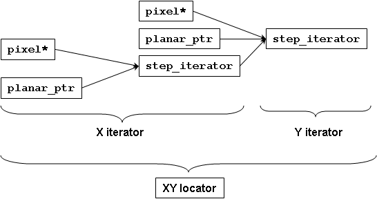

Pixel Locator
=============

.. contents::
   :local:
   :depth: 2

Overview
--------

A Locator allows for navigation in two or more dimensions. Locators are
N-dimensional iterators in spirit, but we use a different name because they
don't satisfy all the requirements of iterators. For example, they don't
supply increment and decrement operators because it is unclear which dimension
the operators should advance along.
N-dimensional locators model the following concept:

.. code-block:: cpp

  concept RandomAccessNDLocatorConcept<Regular Loc>
  {
    typename value_type;        // value over which the locator navigates
    typename reference;         // result of dereferencing
    typename difference_type; where PointNDConcept<difference_type>; // return value of operator-.
    typename const_t;           // same as Loc, but operating over immutable values
    typename cached_location_t; // type to store relative location (for efficient repeated access)
    typename point_t  = difference_type;

    static const size_t num_dimensions; // dimensionality of the locator
    where num_dimensions = point_t::num_dimensions;

    // The difference_type and iterator type along each dimension. The iterators may only differ in
    // difference_type. Their value_type must be the same as Loc::value_type
    template <size_t D> struct axis {
        typename coord_t = point_t::axis<D>::coord_t;
        typename iterator; where RandomAccessTraversalConcept<iterator>; // iterator along D-th axis.
        where iterator::value_type == value_type;
    };

    // Defines the type of a locator similar to this type, except it invokes Deref upon dereferencing
    template <PixelDereferenceAdaptorConcept Deref> struct add_deref {
        typename type;        where RandomAccessNDLocatorConcept<type>;
        static type make(const Loc& loc, const Deref& deref);
    };

    Loc& operator+=(Loc&, const difference_type&);
    Loc& operator-=(Loc&, const difference_type&);
    Loc operator+(const Loc&, const difference_type&);
    Loc operator-(const Loc&, const difference_type&);

    reference operator*(const Loc&);
    reference operator;

    // Storing relative location for faster repeated access and accessing it
    cached_location_t Loc::cache_location(const difference_type&) const;
    reference operator;

    // Accessing iterators along a given dimension at the current location or at a given offset
    template <size_t D> axis<D>::iterator&       Loc::axis_iterator();
    template <size_t D> axis<D>::iterator const& Loc::axis_iterator() const;
    template <size_t D> axis<D>::iterator        Loc::axis_iterator(const difference_type&) const;
  };

  template <typename Loc>
  concept MutableRandomAccessNDLocatorConcept
      : RandomAccessNDLocatorConcept<Loc>
  {
    where Mutable<reference>;
  };

Two-dimensional locators have additional requirements:

.. code-block:: cpp

  concept RandomAccess2DLocatorConcept<RandomAccessNDLocatorConcept Loc>
  {
    where num_dimensions==2;
    where Point2DConcept<point_t>;

    typename x_iterator = axis<0>::iterator;
    typename y_iterator = axis<1>::iterator;
    typename x_coord_t  = axis<0>::coord_t;
    typename y_coord_t  = axis<1>::coord_t;

    // Only available to locators that have dynamic step in Y
    //Loc::Loc(const Loc& loc, y_coord_t);

    // Only available to locators that have dynamic step in X and Y
    //Loc::Loc(const Loc& loc, x_coord_t, y_coord_t, bool transposed=false);

    x_iterator&       Loc::x();
    x_iterator const& Loc::x() const;
    y_iterator&       Loc::y();
    y_iterator const& Loc::y() const;

    x_iterator Loc::x_at(const difference_type&) const;
    y_iterator Loc::y_at(const difference_type&) const;
    Loc Loc::xy_at(const difference_type&) const;

    // x/y versions of all methods that can take difference type
    x_iterator        Loc::x_at(x_coord_t, y_coord_t) const;
    y_iterator        Loc::y_at(x_coord_t, y_coord_t) const;
    Loc               Loc::xy_at(x_coord_t, y_coord_t) const;
    reference         operator()(const Loc&, x_coord_t, y_coord_t);
    cached_location_t Loc::cache_location(x_coord_t, y_coord_t) const;

    bool      Loc::is_1d_traversable(x_coord_t width) const;
    y_coord_t Loc::y_distance_to(const Loc& loc2, x_coord_t x_diff) const;
  };

  concept MutableRandomAccess2DLocatorConcept<RandomAccess2DLocatorConcept Loc>
      : MutableRandomAccessNDLocatorConcept<Loc> {};

2D locators can have a dynamic step not just horizontally, but
vertically. This gives rise to the Y equivalent of
``HasDynamicXStepTypeConcept``:

.. code-block:: cpp

  concept HasDynamicYStepTypeConcept<typename T>
  {
    typename dynamic_y_step_type<T>;
        where Metafunction<dynamic_y_step_type<T> >;
  };

All locators and image views that GIL provides model
``HasDynamicYStepTypeConcept``.

Sometimes it is necessary to swap the meaning of X and Y for a given locator
or image view type (for example, GIL provides a function to transpose an image
view). Such locators and views must be transposable:

.. code-block:: cpp

  concept HasTransposedTypeConcept<typename T>
  {
    typename transposed_type<T>;
        where Metafunction<transposed_type<T> >;
  };

All GIL provided locators and views model ``HasTransposedTypeConcept``.

The locators GIL uses operate over models of ``PixelConcept`` and their x and
y dimension types are the same. They model the following concept:

.. code-block:: cpp

  concept PixelLocatorConcept<RandomAccess2DLocatorConcept Loc>
  {
    where PixelValueConcept<value_type>;
    where PixelIteratorConcept<x_iterator>;
    where PixelIteratorConcept<y_iterator>;
    where x_coord_t == y_coord_t;

    typename coord_t = x_coord_t;
  };

  concept MutablePixelLocatorConcept<PixelLocatorConcept Loc> : MutableRandomAccess2DLocatorConcept<Loc> {};

.. seealso::

  - `HasDynamicYStepTypeConcept<T> <reference/structboost_1_1gil_1_1_has_dynamic_y_step_type_concept.html>`_
  - `HasTransposedTypeConcept<T> <reference/structboost_1_1gil_1_1_has_transposed_type_concept.html>`_
  - `RandomAccessNDLocatorConcept<Locator> <reference/structboost_1_1gil_1_1_random_access_n_d_locator_concept.html>`_
  - `MutableRandomAccessNDLocatorConcept<Locator> <reference/structboost_1_1gil_1_1_mutable_random_access_n_d_locator_concept.html>`_
  - `RandomAccess2DLocatorConcept<Locator> <reference/structboost_1_1gil_1_1_random_access2_d_locator_concept.html>`_
  - `MutableRandomAccess2DLocatorConcept<Locator> <reference/structboost_1_1gil_1_1_mutable_random_access2_d_locator_concept.html>`_
  - `PixelLocatorConcept<Locator> <reference/structboost_1_1gil_1_1_pixel_locator_concept.html>`_
  - `MutablePixelLocatorConcept<Locator> <reference/structboost_1_1gil_1_1_mutable_pixel_locator_concept.html>`_

Models
------

GIL provides two models of ``PixelLocatorConcept`` - a memory-based locator,
``memory_based_2d_locator`` and a virtual locator ``virtual_2d_locator``.

The ``memory_based_2d_locator`` is a locator over planar or interleaved images
that have their pixels in memory. It takes a model of ``StepIteratorConcept``
over pixels as a template parameter. (When instantiated with a model of
``MutableStepIteratorConcept``, it models ``MutablePixelLocatorConcept``).

.. code-block:: cpp

  // StepIterator models StepIteratorConcept, MemoryBasedIteratorConcept
  template <typename StepIterator>
  class memory_based_2d_locator;

The step of ``StepIterator`` must be the number of memory units (bytes or
bits) per row (thus it must be memunit advanceable). The class
``memory_based_2d_locator`` is a wrapper around ``StepIterator`` and uses it
to navigate vertically, while its base iterator is used to navigate
horizontally.

Combining fundamental iterator and step iterator allows us to create locators
that describe complex pixel memory organizations. First, we have a choice of
iterator to use for horizontal direction, i.e. for iterating over the pixels
on the same row. Using the fundamental and step iterators gives us four
choices:

- ``pixel<T,C>*`` - for interleaved images
- ``planar_pixel_iterator<T*,C>`` - for planar images
- ``memory_based_step_iterator<pixel<T,C>*>`` - for interleaved images with
  non-standard step)
- ``memory_based_step_iterator<planar_pixel_iterator<T*,C> >`` - for planar
  images with non-standard step

Of course, one could provide their own custom x-iterator. One such example
described later is an iterator adaptor that performs color conversion when
dereferenced.

Given a horizontal iterator ``XIterator``, we could choose the ``y-iterator``,
the iterator that moves along a column, as
``memory_based_step_iterator<XIterator>`` with a step equal to the number of
memory units (bytes or bits) per row. Again, one is free to provide their own
y-iterator.

Then we can instantiate
``memory_based_2d_locator<memory_based_step_iterator<XIterator> >`` to obtain
a 2D pixel locator, as the diagram indicates:

The ``memory_based_2d_locator`` also offers `cached_location_t` as mechanism
to store relative locations for optimized repeated access of neighborhood
pixels. The 2D coordinates of relative locations are cached as 1-dimensional
raw byte offsets. This provides efficient access if a neighboring locations
relative to a given locator are read or written frequently (e.g. in filters).

The ``virtual_2d_locator`` is a locator that is instantiated with a function
object invoked upon dereferencing a pixel. It returns the value of a pixel
given its X,Y coordinates. Virtual locators can be used to implement virtual
image views that can model any user-defined function. See the GIL tutorial for
an example of using virtual locators to create a view of the Mandelbrot set.

Both the virtual and the memory-based locators subclass from
``pixel_2d_locator_base``, a base class that provides most of the interface
required by ``PixelLocatorConcept``. Users may find this base class useful if
they need to provide other models of ``PixelLocatorConcept``.

Here is some sample code using locators:

.. code-block:: cpp

  loc=img.xy_at(10,10);            // start at pixel (x=10,y=10)
  above=loc.cache_location(0,-1);  // remember relative locations of neighbors above and below
  below=loc.cache_location(0, 1);
  ++loc.x();                       // move to (11,10)
  loc.y()+=15;                     // move to (11,25)
  loc-=point<std::ptrdiff_t>(1,1);// move to (10,24)
  *loc=(loc(0,-1)+loc(0,1))/2;     // set pixel (10,24) to the average of (10,23) and (10,25) (grayscale pixels only)
  *loc=(loc[above]+loc[below])/2;  // the same, but faster using cached relative neighbor locations

The standard GIL locators are fast and lightweight objects. For example, the
locator for a simple interleaved image consists of one raw pointer to the
pixel location plus one integer for the row size in bytes, for a total of
8 bytes. ``++loc.x()`` amounts to incrementing a raw pointer (or N pointers
for planar images). Computing 2D offsets is slower as it requires
multiplication and addition. Filters, for example, need to access the same
neighbors for every pixel in the image, in which case the relative positions
can be cached into a raw byte difference using ``cache_location``.
In the above example ``loc[above]`` for simple interleaved images amounts to a
raw array index operator.

Iterator over 2D image
----------------------

Sometimes we want to perform the same, location-independent operation
over all pixels of an image. In such a case it is useful to represent
the pixels as a one-dimensional array. GIL's ``iterator_from_2d`` is a
random access traversal iterator that visits all pixels in an image in
the natural memory-friendly order left-to-right inside
top-to-bottom. It takes a locator, the width of the image and the
current X position. This is sufficient information for it to determine
when to do a "carriage return". Synopsis:

.. code-block:: cpp

  template <typename Locator>  // Models PixelLocatorConcept
  class iterator_from_2d
  {
  public:
    iterator_from_2d(const Locator& loc, int x, int width);

    iterator_from_2d& operator++(); // if (++_x<_width) ++_p.x(); else _p+=point_t(-_width,1);

    ...
  private:
    int _x, _width;
    Locator _p;
  };

Iterating through the pixels in an image using ``iterator_from_2d`` is slower
than going through all rows and using the x-iterator at each row. This is
because two comparisons are done per iteration step - one for the end
condition of the loop using the iterators, and one inside
``iterator_from_2d::operator++`` to determine whether we are at the end of a
row. For fast operations, such as pixel copy, this second check adds about
15% performance delay (measured for interleaved images on Intel platform).
GIL overrides some STL algorithms, such as ``std::copy`` and ``std::fill``,
when invoked with ``iterator_from_2d``-s, to go through each row using their
base x-iterators, and, if the image has no padding (i.e.
``iterator_from_2d::is_1d_traversable()`` returns true) to simply iterate
using the x-iterators directly.
