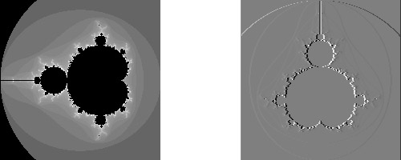

Tutorial: Image Gradient
========================

.. contents::
   :local:
   :depth: 1

This comprehensive (and long) tutorial will walk you through an example of
using GIL to compute the image gradients.

We will start with some very simple and non-generic code and make it more
generic as we go along.  Let us start with a horizontal gradient and use the
simplest possible approximation to a gradient - central difference.

The gradient at pixel x can be approximated with the half-difference of its
two neighboring pixels::

  D[x] = (I[x-1] - I[x+1]) / 2

For simplicity, we will also ignore the boundary cases - the pixels along the
edges of the image for which one of the neighbors is not defined. The focus of
this document is how to use GIL, not how to create a good gradient generation
algorithm.

Interface and Glue Code
-----------------------

Let us first start with 8-bit unsigned grayscale image as the input and 8-bit
signed grayscale image as the output.

Here is how the interface to our algorithm looks like:

.. code-block:: cpp

  #include <boost/gil.hpp>
  using namespace boost::gil;

  void x_gradient(gray8c_view_t const& src, gray8s_view_t const& dst)
  {
    assert(src.dimensions() == dst.dimensions());
    ...    // compute the gradient
  }

``gray8c_view_t`` is the type of the source image view - an 8-bit grayscale
view, whose pixels are read-only (denoted by the "c").

The output is a grayscale view with a 8-bit signed (denoted by the "s")
integer channel type. See Appendix 1 for the complete convention GIL uses to
name concrete types.

GIL makes a distinction between an image and an image view.
A GIL **image view**, is a shallow, lightweight view of a rectangular grid of
pixels. It provides access to the pixels but does not own the pixels.
Copy-constructing a view does not deep-copy the pixels. Image views do not
propagate their constness to the pixels and should always be taken by a const
reference. Whether a view is mutable or read-only (immutable) is a property of
the view type.

A GIL `image`, on the other hand, is a view with associated ownership.
It is a container of pixels; its constructor/destructor allocates/deallocates
the pixels, its copy-constructor performs deep-copy of the pixels and its
``operator==`` performs deep-compare of the pixels. Images also propagate
their constness to their pixels - a constant reference to an image will not
allow for modifying its pixels.

Most GIL algorithms operate on image views; images are rarely
needed. GIL's design is very similar to that of the STL. The STL
equivalent of GIL's image is a container, like ``std::vector``,
whereas GIL's image view corresponds to STL range, which is often
represented with a pair of iterators. STL algorithms operate on
ranges, just like GIL algorithms operate on image views.

GIL's image views can be constructed from raw data - the dimensions,
the number of bytes per row and the pixels, which for chunky views are
represented with one pointer. Here is how to provide the glue between
your code and GIL:

.. code-block:: cpp

  void ComputeXGradientGray8(
      unsigned char const* src_pixels, ptrdiff_t src_row_bytes,
      int w, int h,
      signed char* dst_pixels, ptrdiff_t dst_row_bytes)
  {
    gray8c_view_t src = interleaved_view(w, h, (gray8_pixel_t const*)src_pixels, src_row_bytes);
    gray8s_view_t dst = interleaved_view(w, h, (gray8s_pixel_t*)dst_pixels, dst_row_bytes);
    x_gradient(src, dst);
  }

This glue code is very fast and views are lightweight - in the above example
the views have a size of 16 bytes. They consist of a pointer to the top left
pixel and three integers - the width, height, and number of bytes per row.

First Implementation
--------------------

Focusing on simplicity at the expense of speed, we can compute the horizontal
gradient like this:

.. code-block:: cpp

  void x_gradient(gray8c_view_t const& src, gray8s_view_t const& dst)
  {
    for (int y = 0; y < src.height(); ++y)
        for (int x = 1; x < src.width() - 1; ++x)
            dst(x, y) = (src(x-1, y) - src(x+1, y)) / 2;
  }

We use image view's ``operator(x,y)`` to get a reference to the pixel at a
given location and we set it to the half-difference of its left and right
neighbors.  ``operator()`` returns a reference to a grayscale pixel.
A grayscale pixel is convertible to its channel type (``unsigned char`` for
``src``) and it can be copy-constructed from a channel.
(This is only true for grayscale pixels).

While the above code is easy to read, it is not very fast, because the binary
``operator()`` computes the location of the pixel in a 2D grid, which involves
addition and multiplication. Here is a faster version of the above:

.. code-block:: cpp

  void x_gradient(gray8c_view_t const& src, gray8s_view_t const& dst)
  {
    for (int y = 0; y < src.height(); ++y)
    {
        gray8c_view_t::x_iterator src_it = src.row_begin(y);
        gray8s_view_t::x_iterator dst_it = dst.row_begin(y);

        for (int x=1; x < src.width() - 1; ++x)
            dst_it[x] = (src_it[x-1] - src_it[x+1]) / 2;
    }
  }

We use pixel iterators initialized at the beginning of each row. GIL's
iterators are Random Access Traversal iterators. If you are not
familiar with random access iterators, think of them as if they were
pointers. In fact, in the above example the two iterator types are raw
C pointers and their ``operator[]`` is a fast pointer indexing
operator.

The code to compute gradient in the vertical direction is very
similar:

.. code-block: cpp

  void y_gradient(gray8c_view_t const& src, gray8s_view_t const& dst)
  {
    for (int x = 0; x < src.width(); ++x)
    {
        gray8c_view_t::y_iterator src_it = src.col_begin(x);
        gray8s_view_t::y_iterator dst_it = dst.col_begin(x);

        for (int y = 1; y < src.height() - 1; ++y)
            dst_it[y] = (src_it[y-1] - src_it[y+1]) / 2;
    }
  }

Instead of looping over the rows, we loop over each column and create a
``y_iterator``, an iterator moving vertically. In this case a simple pointer
cannot be used because the distance between two adjacent pixels equals the
number of bytes in each row of the image. GIL uses here a special step
iterator class whose size is 8 bytes - it contains a raw C pointer and a step.
Its ``operator[]`` multiplies the index by its step.

The above version of ``y_gradient``, however, is much slower (easily an order
of magnitude slower) than ``x_gradient`` because of the memory access pattern;
traversing an image vertically results in lots of cache misses. A much more
efficient and cache-friendly version will iterate over the columns in the inner
loop:

.. code-block:: cpp

  void y_gradient(gray8c_view_t const& src, gray8s_view_t const& dst)
  {
    for (int y = 1; y < src.height() - 1; ++y)
    {
        gray8c_view_t::x_iterator src1_it = src.row_begin(y-1);
        gray8c_view_t::x_iterator src2_it = src.row_begin(y+1);
        gray8s_view_t::x_iterator dst_it = dst.row_begin(y);

        for (int x = 0; x < src.width(); ++x)
        {
            *dst_it = ((*src1_it) - (*src2_it)) / 2;
            ++dst_it;
            ++src1_it;
            ++src2_it;
        }
    }
  }

This sample code also shows an alternative way of using pixel iterators -
instead of ``operator[]`` one could use increments and dereferences.

Using Locators
--------------

Unfortunately this cache-friendly version requires the extra hassle of
maintaining two separate iterators in the source view. For every pixel, we
want to access its neighbors above and below it. Such relative access can be
done with GIL locators:

.. code-block:: cpp

  void y_gradient(gray8c_view_t const& src, gray8s_view_t const& dst)
  {
    gray8c_view_t::xy_locator src_loc = src.xy_at(0,1);
    for (int y = 1; y < src.height() - 1; ++y)
    {
        gray8s_view_t::x_iterator dst_it  = dst.row_begin(y);

        for (int x = 0; x < src.width(); ++x)
    {
            (*dst_it) = (src_loc(0,-1) - src_loc(0,1)) / 2;
            ++dst_it;
            ++src_loc.x(); // each dimension can be advanced separately
        }
        src_loc+=point<std::ptrdiff_t>(-src.width(), 1); // carriage return
    }
  }

The first line creates a locator pointing to the first pixel of the
second row of the source view. A GIL pixel locator is very similar to
an iterator, except that it can move both horizontally and
vertically. ``src_loc.x()`` and ``src_loc.y()`` return references to a
horizontal and a vertical iterator respectively, which can be used to
move the locator along the desired dimension, as shown
above. Additionally, the locator can be advanced in both dimensions
simultaneously using its ``operator+=`` and ``operator-=``. Similar to
image views, locators provide binary ``operator()`` which returns a
reference to a pixel with a relative offset to the current locator
position. For example, ``src_loc(0,1)`` returns a reference to the
neighbor below the current pixel.  Locators are very lightweight
objects - in the above example the locator has a size of 8 bytes - it
consists of a raw pointer to the current pixel and an int indicating
the number of bytes from one row to the next (which is the step when
moving vertically). The call to ``++src_loc.x()`` corresponds to a
single C pointer increment.  However, the example above performs more
computations than necessary. The code ``src_loc(0,1)`` has to compute
the offset of the pixel in two dimensions, which is slow.  Notice
though that the offset of the two neighbors is the same, regardless of
the pixel location. To improve the performance, GIL can cache and
reuse this offset::

  void y_gradient(gray8c_view_t const& src, gray8s_view_t const& dst)
  {
    gray8c_view_t::xy_locator src_loc = src.xy_at(0,1);
    gray8c_view_t::xy_locator::cached_location_t above = src_loc.cache_location(0,-1);
    gray8c_view_t::xy_locator::cached_location_t below = src_loc.cache_location(0, 1);

    for (int y = 1; y < src.height() - 1; ++y)
    {
        gray8s_view_t::x_iterator dst_it = dst.row_begin(y);

        for (int x = 0; x < src.width(); ++x)
    {
            (*dst_it) = (src_loc[above] - src_loc[below]) / 2;
            ++dst_it;
            ++src_loc.x();
        }
        src_loc+=point<std::ptrdiff_t>(-src.width(), 1);
    }
  }

In this example ``src_loc[above]`` corresponds to a fast pointer indexing
operation and the code is efficient.

Creating a Generic Version of GIL Algorithms
--------------------------------------------

Let us make our ``x_gradient`` more generic. It should work with any image
views, as long as they have the same number of channels. The gradient
operation is to be computed for each channel independently.

Here is how the new interface looks like:

.. code-block:: cpp

  template <typename SrcView, typename DstView>
  void x_gradient(const SrcView& src, const DstView& dst)
  {
    gil_function_requires<ImageViewConcept<SrcView> >();
    gil_function_requires<MutableImageViewConcept<DstView> >();
    gil_function_requires
    <
      ColorSpacesCompatibleConcept
      <
        typename color_space_type<SrcView>::type,
        typename color_space_type<DstView>::type
      >
    >();

    ... // compute the gradient
  }

The new algorithm now takes the types of the input and output image
views as template parameters.  That allows using both built-in GIL
image views, as well as any user-defined image view classes.  The
first three lines are optional; they use ``boost::concept_check`` to
ensure that the two arguments are valid GIL image views, that the
second one is mutable and that their color spaces are compatible
(i.e. have the same set of channels).

GIL does not require using its own built-in constructs. You are free
to use your own channels, color spaces, iterators, locators, views and
images.  However, to work with the rest of GIL they have to satisfy a
set of requirements; in other words, they have to \e model the
corresponding GIL _concept_.  GIL's concepts are defined in the user
guide.

One of the biggest drawbacks of using templates and generic
programming in C++ is that compile errors can be very difficult to
comprehend.  This is a side-effect of the lack of early type
checking - a generic argument may not satisfy the requirements of a
function, but the incompatibility may be triggered deep into a nested
call, in code unfamiliar and hardly related to the problem.  GIL uses
``boost::concept_check`` to mitigate this problem. The above three
lines of code check whether the template parameters are valid models
of their corresponding concepts.  If a model is incorrect, the compile
error will be inside ``gil_function_requires``, which is much closer
to the problem and easier to track. Furthermore, such checks get
compiled out and have zero performance overhead. The disadvantage of
using concept checks is the sometimes severe impact they have on
compile time. This is why GIL performs concept checks only in debug
mode, and only if ``BOOST_GIL_USE_CONCEPT_CHECK`` is defined (off by
default).

The body of the generic function is very similar to that of the
concrete one. The biggest difference is that we need to loop over the
channels of the pixel and compute the gradient for each channel:

.. code-block:: cpp

  template <typename SrcView, typename DstView>
  void x_gradient(const SrcView& src, const DstView& dst)
  {
    for (int y=0; y < src.height(); ++y)
    {
        typename SrcView::x_iterator src_it = src.row_begin(y);
        typename DstView::x_iterator dst_it = dst.row_begin(y);

        for (int x = 1; x < src.width() - 1; ++x)
            for (int c = 0; c < num_channels<SrcView>::value; ++c)
                dst_it[x][c] = (src_it[x-1][c]- src_it[x+1][c]) / 2;
    }
  }

Having an explicit loop for each channel could be a performance problem.
GIL allows us to abstract out such per-channel operations:

.. code-block:: cpp

  template <typename Out>
  struct halfdiff_cast_channels
  {
    template <typename T> Out operator()(T const& in1, T const& in2) const
    {
        return Out((in1 - in2) / 2);
    }
  };

  template <typename SrcView, typename DstView>
  void x_gradient(const SrcView& src, const DstView& dst)
  {
    typedef typename channel_type<DstView>::type dst_channel_t;

    for (int y=0; y < src.height(); ++y)
    {
        typename SrcView::x_iterator src_it = src.row_begin(y);
        typename DstView::x_iterator dst_it = dst.row_begin(y);

        for (int x=1; x < src.width() - 1; ++x)
        {
            static_transform(src_it[x-1], src_it[x+1], dst_it[x],
                halfdiff_cast_channels<dst_channel_t>());
        }
    }
  }

The ``static_transform`` is an example of a channel-level GIL algorithm.
Other such algorithms are ``static_generate``, ``static_fill`` and
``static_for_each``. They are the channel-level equivalents of STL
``generate``, ``transform``, ``fill`` and ``for_each`` respectively.
GIL channel algorithms use static recursion to unroll the loops; they never
loop over the channels explicitly.

Note that sometimes modern compilers (at least Visual Studio 8) already unroll
channel-level loops, such as the one above. However, another advantage of
using GIL's channel-level algorithms is that they pair the channels
semantically, not based on their order in memory. For example, the above
example will properly match an RGB source with a BGR destination.

Here is how we can use our generic version with images of different types:

.. code-block:: cpp

  // Calling with 16-bit grayscale data
  void XGradientGray16_Gray32(
      unsigned short const* src_pixels, ptrdiff_t src_row_bytes,
      int w, int h,
      signed int* dst_pixels, ptrdiff_t dst_row_bytes)
  {
    gray16c_view_t src=interleaved_view(w, h, (gray16_pixel_t const*)src_pixels, src_row_bytes);
    gray32s_view_t dst=interleaved_view(w, h, (gray32s_pixel_t*)dst_pixels, dst_row_bytes);
    x_gradient(src,dst);
  }

  // Calling with 8-bit RGB data into 16-bit BGR
  void XGradientRGB8_BGR16(
      unsigned char const* src_pixels, ptrdiff_t src_row_bytes,
      int w, int h,
      signed short* dst_pixels, ptrdiff_t dst_row_bytes)
  {
    rgb8c_view_t  src = interleaved_view(w, h, (rgb8_pixel_t const*)src_pixels, src_row_bytes);
    bgr16s_view_t dst = interleaved_view(w, h, (bgr16s_pixel_t*)dst_pixels, dst_row_bytes);
    x_gradient(src, dst);
  }

  // Either or both the source and the destination could be planar - the gradient code does not change
  void XGradientPlanarRGB8_RGB32(
      unsigned short const* src_r, unsigned short const* src_g, unsigned short const* src_b,
      ptrdiff_t src_row_bytes, int w, int h,
      signed int* dst_pixels, ptrdiff_t dst_row_bytes)
  {
    rgb16c_planar_view_t src = planar_rgb_view (w, h, src_r, src_g, src_b,        src_row_bytes);
    rgb32s_view_t        dst = interleaved_view(w, h,(rgb32s_pixel_t*)dst_pixels, dst_row_bytes);
    x_gradient(src,dst);
  }

As these examples illustrate, both the source and the destination can be
interleaved or planar, of any channel depth (assuming the destination channel
is assignable to the source), and of any compatible color spaces.

GIL 2.1 can also natively represent images whose channels are not
byte-aligned, such as 6-bit RGB222 image or a 1-bit Gray1 image.
GIL algorithms apply to these images natively. See the design guide or sample
files for more on using such images.

Image View Transformations
--------------------------

One way to compute the y-gradient is to rotate the image by 90 degrees,
compute the x-gradient and rotate the result back.
Here is how to do this in GIL:

.. code-block:: cpp

  template <typename SrcView, typename DstView>
  void y_gradient(const SrcView& src, const DstView& dst)
  {
    x_gradient(rotated90ccw_view(src), rotated90ccw_view(dst));
  }

``rotated90ccw_view`` takes an image view and returns an image view
representing 90-degrees counter-clockwise rotation of its input. It is
an example of a GIL view transformation function. GIL provides a
variety of transformation functions that can perform any axis-aligned
rotation, transpose the view, flip it vertically or horizontally,
extract a rectangular subimage, perform color conversion, subsample
view, etc. The view transformation functions are fast and shallow -
they don't copy the pixels, they just change the "coordinate system"
of accessing the pixels. ``rotated90cw_view``, for example, returns a
view whose horizontal iterators are the vertical iterators of the
original view. The above code to compute ``y_gradient`` is slow
because of the memory access pattern; using ``rotated90cw_view`` does
not make it any slower.

Another example: suppose we want to compute the gradient of the N-th
channel of a color image. Here is how to do that:

.. code-block:: cpp

  template <typename SrcView, typename DstView>
  void nth_channel_x_gradient(const SrcView& src, int n, const DstView& dst)
  {
    x_gradient(nth_channel_view(src, n), dst);
  }

``nth_channel_view`` is a view transformation function that takes any
view and returns a single-channel (grayscale) view of its N-th
channel.  For interleaved RGB view, for example, the returned view is
a step view - a view whose horizontal iterator skips over two channels
when incremented.  If applied on a planar RGB view, the returned type
is a simple grayscale view whose horizontal iterator is a C pointer.
Image view transformation functions can be piped together. For
example, to compute the y gradient of the second channel of the even
pixels in the view, use:

.. code-block:: cpp

  y_gradient(subsampled_view(nth_channel_view(src, 1), 2,2), dst);

GIL can sometimes simplify piped views. For example, two nested
subsampled views (views that skip over pixels in X and in Y) can be
represented as a single subsampled view whose step is the product of
the steps of the two views.

1D pixel iterators
------------------

Let's go back to ``x_gradient`` one more time.  Many image view
algorithms apply the same operation for each pixel and GIL provides an
abstraction to handle them. However, our algorithm has an unusual
access pattern, as it skips the first and the last column. It would be
nice and instructional to see how we can rewrite it in canonical
form. The way to do that in GIL is to write a version that works for
every pixel, but apply it only on the subimage that excludes the first
and last column:

.. code-block:: cpp

  void x_gradient_unguarded(gray8c_view_t const& src, gray8s_view_t const& dst)
  {
    for (int y=0; y < src.height(); ++y)
    {
        gray8c_view_t::x_iterator src_it = src.row_begin(y);
        gray8s_view_t::x_iterator dst_it = dst.row_begin(y);

        for (int x = 0; x < src.width(); ++x)
            dst_it[x] = (src_it[x-1] - src_it[x+1]) / 2;
    }
  }

  void x_gradient(gray8c_view_t const& src, gray8s_view_t const& dst)
  {
    assert(src.width()>=2);
    x_gradient_unguarded(subimage_view(src, 1, 0, src.width()-2, src.height()),
                         subimage_view(dst, 1, 0, src.width()-2, src.height()));
  }

``subimage_view`` is another example of a GIL view transformation
function. It takes a source view and a rectangular region (in this
case, defined as x_min,y_min,width,height) and returns a view
operating on that region of the source view. The above implementation
has no measurable performance degradation from the version that
operates on the original views.

Now that ``x_gradient_unguarded`` operates on every pixel, we can
rewrite it more compactly:

.. code-block:: cpp

  void x_gradient_unguarded(gray8c_view_t const& src, gray8s_view_t const& dst)
  {
    gray8c_view_t::iterator src_it = src.begin();
    for (gray8s_view_t::iterator dst_it = dst.begin(); dst_it!=dst.end(); ++dst_it, ++src_it)
        *dst_it = (src_it.x()[-1] - src_it.x()[1]) / 2;
  }

GIL image views provide ``begin()`` and ``end()`` methods that return
one dimensional pixel iterators which iterate over each pixel in the
view, left to right and top to bottom. They do a proper "carriage
return" - they skip any unused bytes at the end of a row. As such,
they are slightly suboptimal, because they need to keep track of their
current position with respect to the end of the row. Their increment
operator performs one extra check (are we at the end of the row?), a
check that is avoided if two nested loops are used instead. These
iterators have a method ``x()`` which returns the more lightweight
horizontal iterator that we used previously. Horizontal iterators have
no notion of the end of rows. In this case, the horizontal iterators
are raw C pointers. In our example, we must use the horizontal
iterators to access the two neighbors properly, since they could
reside outside the image view.

STL Equivalent Algorithms
-------------------------

GIL provides STL equivalents of many algorithms. For example,
``std::transform`` is an STL algorithm that sets each element in a
destination range the result of a generic function taking the
corresponding element of the source range. In our example, we want to
assign to each destination pixel the value of the half-difference of
the horizontal neighbors of the corresponding source pixel.  If we
abstract that operation in a function object, we can use GIL's
``transform_pixel_positions`` to do that:

.. code-block:: cpp

  struct half_x_difference
  {
    int operator()(const gray8c_loc_t& src_loc) const
    {
        return (src_loc.x()[-1] - src_loc.x()[1]) / 2;
    }
  };

  void x_gradient_unguarded(gray8c_view_t const& src, gray8s_view_t const& dst)
  {
    transform_pixel_positions(src, dst, half_x_difference());
  }

GIL provides the algorithms ``for_each_pixel`` and
``transform_pixels`` which are image view equivalents of STL
``std::for_each`` and ``std::transform``. It also provides
``for_each_pixel_position`` and ``transform_pixel_positions``, which
instead of references to pixels, pass to the generic function pixel
locators. This allows for more powerful functions that can use the
pixel neighbors through the passed locators.  GIL algorithms iterate
through the pixels using the more efficient two nested loops (as
opposed to the single loop using 1-D iterators)

Color Conversion
----------------

Instead of computing the gradient of each color plane of an image, we
often want to compute the gradient of the luminosity. In other words,
we want to convert the color image to grayscale and compute the
gradient of the result. Here how to compute the luminosity gradient of
a 32-bit float RGB image:

.. code-block:: cpp

  void x_gradient_rgb_luminosity(rgb32fc_view_t const& src, gray8s_view_t const& dst)
  {
    x_gradient(color_converted_view<gray8_pixel_t>(src), dst);
  }

``color_converted_view`` is a GIL view transformation function that
takes any image view and returns a view in a target color space and
channel depth (specified as template parameters). In our example, it
constructs an 8-bit integer grayscale view over 32-bit float RGB
pixels. Like all other view transformation functions,
``color_converted_view`` is very fast and shallow. It doesn't copy the
data or perform any color conversion. Instead it returns a view that
performs color conversion every time its pixels are accessed.

In the generic version of this algorithm we might like to convert the
color space to grayscale, but keep the channel depth the same. We do
that by constructing the type of a GIL grayscale pixel with the same
channel as the source, and color convert to that pixel type:

.. code-block:: cpp

  template <typename SrcView, typename DstView>
  void x_luminosity_gradient(SrcView const& src, DstView const& dst)
  {
    using gray_pixel_t = pixel<typename channel_type<SrcView>::type, gray_layout_t>;
    x_gradient(color_converted_view<gray_pixel_t>(src), dst);
  }

When the destination color space and channel type happens to be the
same as the source one, color conversion is unnecessary. GIL detects
this case and avoids calling the color conversion code at all -
i.e. ``color_converted_view`` returns back the source view unchanged.

Image
-----

The above example has a performance problem - ``x_gradient``
dereferences most source pixels twice, which will cause the above code
to perform color conversion twice.  Sometimes it may be more efficient
to copy the color converted image into a temporary buffer and use it
to compute the gradient - that way color conversion is invoked once
per pixel. Using our non-generic version we can do it like this:

.. code-block:: cpp

  void x_luminosity_gradient(rgb32fc_view_t const& src, gray8s_view_t const& dst)
  {
    gray8_image_t ccv_image(src.dimensions());
    copy_pixels(color_converted_view<gray8_pixel_t>(src), view(ccv_image));

    x_gradient(const_view(ccv_image), dst);
  }

First we construct an 8-bit grayscale image with the same dimensions
as our source. Then we copy a color-converted view of the source into
the temporary image.  Finally we use a read-only view of the temporary
image in our ``x_gradient algorithm``. As the example shows, GIL
provides global functions ``view`` and ``const_view`` that take an
image and return a mutable or an immutable view of its pixels.

Creating a generic version of the above is a bit trickier:

.. code-block:: cpp

  template <typename SrcView, typename DstView>
  void x_luminosity_gradient(const SrcView& src, const DstView& dst)
  {
    using d_channel_t = typename channel_type<DstView>::type;
    using channel_t = typename channel_convert_to_unsigned<d_channel_t>::type;
    using gray_pixel_t = pixel<channel_t, gray_layout_t>;
    using gray_image_t = image<gray_pixel_t, false>;

    gray_image_t ccv_image(src.dimensions());
    copy_pixels(color_converted_view<gray_pixel_t>(src), view(ccv_image));
    x_gradient(const_view(ccv_image), dst);
  }

First we use the ``channel_type`` metafunction to get the channel type
of the destination view. A metafunction is a function operating on
types. In GIL metafunctions are class templates (declared with
``struct`` type specifier) which take their parameters as template
parameters and return their result in a nested typedef called
``type``. In this case, ``channel_type`` is a unary metafunction which
in this example is called with the type of an image view and returns
the type of the channel associated with that image view.

GIL constructs that have an associated pixel type, such as pixels,
pixel iterators, locators, views and images, all model
``PixelBasedConcept``, which means that they provide a set of
metafunctions to query the pixel properties, such as ``channel_type``,
``color_space_type``, ``channel_mapping_type``, and ``num_channels``.

After we get the channel type of the destination view, we use another
metafunction to remove its sign (if it is a signed integral type) and
then use it to generate the type of a grayscale pixel. From the pixel
type we create the image type. GIL's image class is specialized over
the pixel type and a boolean indicating whether the image should be
planar or interleaved.  Single-channel (grayscale) images in GIL must
always be interleaved. There are multiple ways of constructing types
in GIL. Instead of instantiating the classes directly we could have
used type factory metafunctions. The following code is equivalent:

.. code-block:: cpp

  template <typename SrcView, typename DstView>
  void x_luminosity_gradient(SrcView const& src, DstView const& dst)
  {
    typedef typename channel_type<DstView>::type d_channel_t;
    typedef typename channel_convert_to_unsigned<d_channel_t>::type channel_t;
    typedef typename image_type<channel_t, gray_layout_t>::type gray_image_t;
    typedef typename gray_image_t::value_type gray_pixel_t;

    gray_image_t ccv_image(src.dimensions());
    copy_and_convert_pixels(src, view(ccv_image));
    x_gradient(const_view(ccv_image), dst);
  }

GIL provides a set of metafunctions that generate GIL types -
``image_type`` is one such meta-function that constructs the type of
an image from a given channel type, color layout, and
planar/interleaved option (the default is interleaved). There are also
similar meta-functions to construct the types of pixel references,
iterators, locators and image views. GIL also has metafunctions
``derived_pixel_reference_type``, ``derived_iterator_type``,
``derived_view_type`` and ``derived_image_type`` that construct the
type of a GIL construct from a given source one by changing one or
more properties of the type and keeping the rest.

From the image type we can use the nested typedef ``value_type`` to
obtain the type of a pixel. GIL images, image views and locators have
nested typedefs ``value_type`` and ``reference`` to obtain the type of
the pixel and a reference to the pixel. If you have a pixel iterator,
you can get these types from its ``iterator_traits``. Note also the
algorithm ``copy_and_convert_pixels``, which is an abbreviated version
of ``copy_pixels`` with a color converted source view.

Virtual Image Views
-------------------

So far we have been dealing with images that have pixels stored in
memory. GIL allows you to create an image view of an arbitrary image,
including a synthetic function. To demonstrate this, let us create a
view of the Mandelbrot set.  First, we need to create a function
object that computes the value of the Mandelbrot set at a given
location (x,y) in the image:

.. code-block:: cpp

  // models PixelDereferenceAdaptorConcept
  struct mandelbrot_fn
  {
    typedef point<ptrdiff_t>   point_t;

    typedef mandelbrot_fn       const_t;
    typedef gray8_pixel_t       value_type;
    typedef value_type          reference;
    typedef value_type          const_reference;
    typedef point_t             argument_type;
    typedef reference           result_type;
    static bool constexpr is_mutable = false;

    mandelbrot_fn() {}
    mandelbrot_fn(const point_t& sz) : _img_size(sz) {}

    result_type operator()(const point_t& p) const
    {
        // normalize the coords to (-2..1, -1.5..1.5)
        double t=get_num_iter(point<double>(p.x/(double)_img_size.x*3-2, p.y/(double)_img_size.y*3-1.5f));
        return value_type((bits8)(pow(t,0.2)*255));   // raise to power suitable for viewing
    }
  private:
    point_t _img_size;

    double get_num_iter(const point<double>& p) const
    {
        point<double> Z(0,0);
        for (int i=0; i<100; ++i)  // 100 iterations
    {
            Z = point<double>(Z.x*Z.x - Z.y*Z.y + p.x, 2*Z.x*Z.y + p.y);
            if (Z.x*Z.x + Z.y*Z.y > 4)
                return i/(double)100;
        }
        return 0;
    }
  };

We can now use GIL's ``virtual_2d_locator`` with this function object
to construct a Mandelbrot view of size 200x200 pixels:

.. code-block:: cpp

  typedef mandelbrot_fn::point_t point_t;
  typedef virtual_2d_locator<mandelbrot_fn,false> locator_t;
  typedef image_view<locator_t> my_virt_view_t;

  point_t dims(200,200);

  // Construct a Mandelbrot view with a locator, taking top-left corner (0,0) and step (1,1)
  my_virt_view_t mandel(dims, locator_t(point_t(0,0), point_t(1,1), mandelbrot_fn(dims)));

We can treat the synthetic view just like a real one. For example,
let's invoke our ``x_gradient`` algorithm to compute the gradient of
the 90-degree rotated view of the Mandelbrot set and save the original
and the result:

.. code-block:: cpp

  gray8s_image_t img(dims);
  x_gradient(rotated90cw_view(mandel), view(img));

  // Save the Mandelbrot set and its 90-degree rotated gradient (jpeg cannot save signed char; must convert to unsigned char)
  jpeg_write_view("mandel.jpg",mandel);
  jpeg_write_view("mandel_grad.jpg",color_converted_view<gray8_pixel_t>(const_view(img)));

Here is what the two files look like:

Run-Time Specified Images and Image Views
-----------------------------------------

So far we have created a generic function that computes the image
gradient of an image view template specialization.  Sometimes,
however, the properties of an image view, such as its color space and
channel depth, may not be available at compile time.  GIL's
``dynamic_image`` extension allows for working with GIL constructs
that are specified at run time, also called _variants_. GIL provides
models of a run-time instantiated image, ``any_image``, and a run-time
instantiated image view, ``any_image_view``. The mechanisms are in
place to create other variants, such as ``any_pixel``,
``any_pixel_iterator``, etc.  Most of GIL's algorithms and all of the
view transformation functions also work with run-time instantiated
image views and binary algorithms, such as ``copy_pixels`` can have
either or both arguments be variants.

Lets make our ``x_luminosity_gradient`` algorithm take a variant image
view. For simplicity, let's assume that only the source view can be a
variant.  (As an example of using multiple variants, see GIL's image
view algorithm overloads taking multiple variants.)

First, we need to make a function object that contains the templated
destination view and has an application operator taking a templated
source view:

.. code-block:: cpp

  #include <boost/gil/extension/dynamic_image/dynamic_image_all.hpp>

  template <typename DstView>
  struct x_gradient_obj
  {
    typedef void result_type;        // required typedef

    const DstView& _dst;
    x_gradient_obj(const DstView& dst) : _dst(dst) {}

    template <typename SrcView>
    void operator()(const SrcView& src) const { x_luminosity_gradient(src, _dst); }
  };

The second step is to provide an overload of ``x_luminosity_gradient`` that
takes image view variant and calls GIL's ``apply_operation`` passing it the
function object:

.. code-block:: cpp

  template <typename SrcViews, typename DstView>
  void x_luminosity_gradient(const any_image_view<SrcViews>& src, const DstView& dst)
  {
    apply_operation(src, x_gradient_obj<DstView>(dst));
  }

``any_image_view<SrcViews>`` is the image view variant. It is
templated over ``SrcViews``, an enumeration of all possible view types
the variant can take.  ``src`` contains inside an index of the
currently instantiated type, as well as a block of memory containing
the instance.  ``apply_operation`` goes through a switch statement
over the index, each case of which casts the memory to the correct
view type and invokes the function object with it. Invoking an
algorithm on a variant has the overhead of one switch
statement. Algorithms that perform an operation for each pixel in an
image view have practically no performance degradation when used with
a variant.

Here is how we can construct a variant and invoke the algorithm:

.. code-block:: cpp

  #include <boost/mp11.hpp>
  #include <boost/gil/extension/io/jpeg/old.hpp>

  typedef mp11::mp_list<gray8_image_t, gray16_image_t, rgb8_image_t, rgb16_image_t> my_img_types;
  any_image<my_img_types> runtime_image;
  jpeg_read_image("input.jpg", runtime_image);

  gray8s_image_t gradient(runtime_image.dimensions());
  x_luminosity_gradient(const_view(runtime_image), view(gradient));
  jpeg_write_view("x_gradient.jpg", color_converted_view<gray8_pixel_t>(const_view(gradient)));

In this example, we create an image variant that could be 8-bit or
16-bit RGB or grayscale image. We then use GIL's I/O extension to load
the image from file in its native color space and channel depth. If
none of the allowed image types matches the image on disk, an
exception will be thrown.  We then construct a 8 bit signed
(i.e. ``char``) image to store the gradient and invoke ``x_gradient``
on it. Finally we save the result into another file.  We save the view
converted to 8-bit unsigned, because JPEG I/O does not support signed
char.

Note how free functions and methods such as ``jpeg_read_image``,
``dimensions``, ``view`` and ``const_view`` work on both templated and
variant types.  For templated images ``view(img)`` returns a templated
view, whereas for image variants it returns a view variant.  For
example, the return type of ``view(runtime_image)`` is
``any_image_view<Views>`` where ``Views`` enumerates four views
corresponding to the four image types.  ``const_view(runtime_image)``
returns a ``any_image_view`` of the four read-only view types, etc.

A warning about using variants: instantiating an algorithm with a
variant effectively instantiates it with every possible type the
variant can take.  For binary algorithms, the algorithm is
instantiated with every possible combination of the two input types!
This can take a toll on both the compile time and the executable size.

Conclusion
----------

This tutorial provides a glimpse at the challenges associated with
writing generic and efficient image processing algorithms in GIL.  We
have taken a simple algorithm and shown how to make it work with image
representations that vary in bit depth, color space, ordering of the
channels, and planar/interleaved structure. We have demonstrated that
the algorithm can work with fully abstracted virtual images, and even
images whose type is specified at run time. The associated video
presentation also demonstrates that even for complex scenarios the
generated assembly is comparable to that of a C version of the
algorithm, hand-written for the specific image types.

Yet, even for such a simple algorithm, we are far from making a fully
generic and optimized code. In particular, the presented algorithms
work on homogeneous images, i.e. images whose pixels have channels
that are all of the same type. There are examples of images, such as a
packed 565 RGB format, which contain channels of different
types. While GIL provides concepts and algorithms operating on
heterogeneous pixels, we leave the task of extending x_gradient as an
exercise for the reader.  Second, after computing the value of the
gradient we are simply casting it to the destination channel
type. This may not always be the desired operation. For example, if
the source channel is a float with range [0..1] and the destination is
unsigned char, casting the half-difference to unsigned char will
result in either 0 or 1. Instead, what we might want to do is scale
the result into the range of the destination channel. GIL's
channel-level algorithms might be useful in such cases. For example,
\p channel_convert converts between channels by linearly scaling the
source channel value into the range of the destination channel.

There is a lot to be done in improving the performance as
well. Channel-level operations, such as the half-difference, could be
abstracted out into atomic channel-level algorithms and performance
overloads could be provided for concrete channel
types. Processor-specific operations could be used, for example, to
perform the operation over an entire row of pixels simultaneously, or
the data could be pre-fetched. All of these optimizations can be
realized as performance specializations of the generic
algorithm. Finally, compilers, while getting better over time, are
still failing to fully optimize generic code in some cases, such as
failing to inline some functions or put some variables into
registers. If performance is an issue, it might be worth trying your
code with different compilers.
