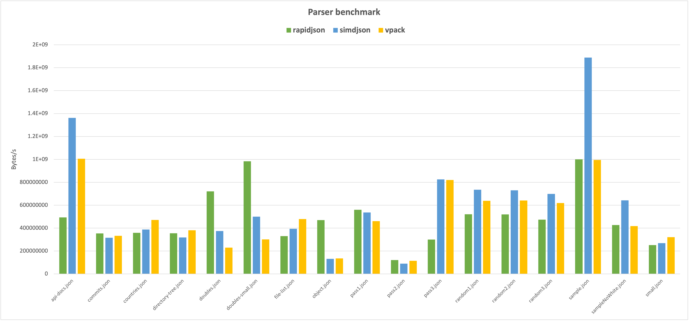

# Parser benchmark results

**Platform**
- Apple Silicon:
  - Apple M1 Pro 
  - Clock Rate	2064 - 3220 MHz
  - Level 1 Cache	2.9 MB
  - Level 2 Cache	28 MB
  - Level 3 Cache	24 MB
- Intel: 
  - Intel(R) Xeon(R) Platinum 8269CY CPU @ 2.50GHz
  - L1d 32K
  - L1i 32K
  - L2 1024K
  - L3 36608K

**Data sets**

Provided at `tests/jsonSample/*`.

**Benchmark parameters**

- Run seconds: 5
- Copies: 1
- Parsers: vpack, rapidjson, simdjson

**Benchmark command**

`build/tools/bench all`

**Results on Apple Silicon**

| DataSet | Parser | Bytes/second | JSON Objects/seccond | 
| ------- | ------ | --------- | ------------ |
|small.json | vpack         |   321259472.38 bytes/s |     3180786.86 | 
|small.json | rapidjson     |   251331260.01 bytes/s |     2488428.32 | 
|small.json | simdjson      |   268615358.00 bytes/s |     2659558.00 | 
|sample.json | vpack         |   995575625.90 bytes/s |        1448.13 | 
|sample.json | rapidjson     |  1000640487.29 bytes/s |        1455.50 | 
|sample.json | simdjson      |  1888606183.94 bytes/s |        2747.10 | 
|sampleNoWhite.json | vpack         |   417137839.37 bytes/s |        2421.56 | 
|sampleNoWhite.json | rapidjson     |   427465084.28 bytes/s |        2481.51 | 
|sampleNoWhite.json | simdjson      |   642083640.52 bytes/s |        3727.41 | 
|commits.json | vpack         |   332464096.26 bytes/s |       13184.65 | 
|commits.json | rapidjson     |   353892153.38 bytes/s |       14034.43 | 
|commits.json | simdjson      |   315499923.38 bytes/s |       12511.89 | 
|api-docs.json | vpack         |  1005134354.02 bytes/s |         833.47 | 
|api-docs.json | rapidjson     |   493710181.72 bytes/s |         409.39 | 
|api-docs.json | simdjson      |  1361741288.27 bytes/s |        1129.17 | 
|countries.json | vpack         |   471693081.18 bytes/s |         415.94 | 
|countries.json | rapidjson     |   359038336.92 bytes/s |         316.60 | 
|countries.json | simdjson      |   388099549.72 bytes/s |         342.23 | 
|directory-tree.json | vpack         |   381213015.99 bytes/s |        1280.55 | 
|directory-tree.json | rapidjson     |   355632949.25 bytes/s |        1194.62 | 
|directory-tree.json | simdjson      |   319052369.04 bytes/s |        1071.74 | 
|doubles-small.json | vpack         |   301124922.69 bytes/s |        1897.38 | 
|doubles-small.json | rapidjson     |   983073601.99 bytes/s |        6194.31 | 
|doubles-small.json | simdjson      |   500339319.66 bytes/s |        3152.62 | 
|doubles.json | vpack         |   230222264.01 bytes/s |         193.94 | 
|doubles.json | rapidjson     |   720225225.33 bytes/s |         606.73 | 
|doubles.json | simdjson      |   374390599.09 bytes/s |         315.39 | 
|file-list.json | vpack         |   479150299.23 bytes/s |        3166.53 | 
|file-list.json | rapidjson     |   330475416.42 bytes/s |        2183.99 | 
|file-list.json | simdjson      |   394475023.85 bytes/s |        2606.94 | 
|object.json | vpack         |   135926117.49 bytes/s |         861.49 | 
|object.json | rapidjson     |   469582052.22 bytes/s |        2976.16 | 
|object.json | simdjson      |   131672564.66 bytes/s |         834.53 | 
|pass1.json | vpack         |   460723056.70 bytes/s |      319724.54 | 
|pass1.json | rapidjson     |   560052696.30 bytes/s |      388655.58 | 
|pass1.json | simdjson      |   536455497.63 bytes/s |      372280.01 | 
|pass2.json | vpack         |   114450697.99 bytes/s |     2200974.96 | 
|pass2.json | rapidjson     |   121089424.58 bytes/s |     2328642.78 | 
|pass2.json | simdjson      |    89430818.26 bytes/s |     1719823.43 | 
|pass3.json | vpack         |   820104892.91 bytes/s |     5541249.28 | 
|pass3.json | rapidjson     |   300325807.38 bytes/s |     2029228.43 | 
|pass3.json | simdjson      |   825691899.52 bytes/s |     5578999.32 | 
|random1.json | vpack         |   638019393.04 bytes/s |       65965.61 | 
|random1.json | rapidjson     |   521001726.14 bytes/s |       53867.01 | 
|random1.json | simdjson      |   735360505.44 bytes/s |       76029.83 | 
|random2.json | vpack         |   640517237.04 bytes/s |       77742.11 | 
|random2.json | rapidjson     |   519791186.73 bytes/s |       63089.11 | 
|random2.json | simdjson      |   729862200.07 bytes/s |       88586.26 | 
|random3.json | vpack         |   619224398.33 bytes/s |        8487.99 | 
|random3.json | rapidjson     |   474406937.26 bytes/s |        6502.91 | 
|random3.json | simdjson      |   699205926.16 bytes/s |        9584.33 | 

**Results on Intel Chip**

| DataSet | Parser | Bytes/second | JSON Objects/second | 
| ------- | ------ | --------- | ------------ |
|small.json | vpack         |   187441229.00 bytes/s |     2285868.65 | 
|small.json | rapidjson     |   131513417.47 bytes/s |     1603822.16 | 
|small.json | simdjson      |   150155715.03 bytes/s |     1831167.26 | 
|sample.json | vpack         |   902508661.40 bytes/s |        1312.76 | 
|sample.json | rapidjson     |  1431012805.37 bytes/s |        2081.50 | 
|sample.json | simdjson      |   964400141.58 bytes/s |        1402.78 | 
|sampleNoWhite.json | vpack         |   244835683.80 bytes/s |        1421.31 | 
|sampleNoWhite.json | rapidjson     |   465676516.65 bytes/s |        2703.34 | 
|sampleNoWhite.json | simdjson      |   284580680.75 bytes/s |        1652.04 | 
|commits.json | vpack         |   163949064.90 bytes/s |        6501.79 | 
|commits.json | rapidjson     |   291250741.61 bytes/s |       11550.24 | 
|commits.json | simdjson      |   139306179.61 bytes/s |        5524.52 | 
|api-docs.json | vpack         |   868962117.32 bytes/s |         720.55 | 
|api-docs.json | rapidjson     |   672640196.08 bytes/s |         557.76 | 
|api-docs.json | simdjson      |  1000924492.73 bytes/s |         829.98 | 
|countries.json | vpack         |   303160928.58 bytes/s |         267.33 | 
|countries.json | rapidjson     |   329215344.11 bytes/s |         290.31 | 
|countries.json | simdjson      |   231070926.46 bytes/s |         203.76 | 
|directory-tree.json | vpack         |   221809097.60 bytes/s |         745.09 | 
|directory-tree.json | rapidjson     |   289353963.45 bytes/s |         971.98 | 
|directory-tree.json | simdjson      |   170297328.21 bytes/s |         572.05 | 
|doubles-small.json | vpack         |    93173853.68 bytes/s |         587.08 | 
|doubles-small.json | rapidjson     |   562763062.24 bytes/s |        3545.95 | 
|doubles-small.json | simdjson      |   330040897.70 bytes/s |        2079.57 | 
|doubles.json | vpack         |    70340051.68 bytes/s |          59.26 | 
|doubles.json | rapidjson     |   393659071.13 bytes/s |         331.62 | 
|doubles.json | simdjson      |   240875087.49 bytes/s |         202.92 | 
|file-list.json | vpack         |   342657432.69 bytes/s |        2264.50 | 
|file-list.json | rapidjson     |   294238940.61 bytes/s |        1944.52 | 
|file-list.json | simdjson      |   250717591.17 bytes/s |        1656.90 | 
|object.json | vpack         |    60713219.01 bytes/s |         384.79 | 
|object.json | rapidjson     |   414143187.46 bytes/s |        2624.80 | 
|object.json | simdjson      |    58337720.09 bytes/s |         369.74 | 
|pass1.json | vpack         |   245178345.77 bytes/s |      170144.58 | 
|pass1.json | rapidjson     |   492250661.39 bytes/s |      341603.51 | 
|pass1.json | simdjson      |   298889190.17 bytes/s |      207417.90 | 
|pass2.json | vpack         |    76463077.05 bytes/s |     1470443.79 | 
|pass2.json | rapidjson     |    67378324.33 bytes/s |     1295737.01 | 
|pass2.json | simdjson      |    51190043.64 bytes/s |      984423.92 | 
|pass3.json | vpack         |   630324667.72 bytes/s |     4258950.46 | 
|pass3.json | rapidjson     |   217778842.89 bytes/s |     1471478.67 | 
|pass3.json | simdjson      |   471823101.62 bytes/s |     3187993.93 | 
|random1.json | vpack         |   447335491.62 bytes/s |       46250.57 | 
|random1.json | rapidjson     |   728146434.57 bytes/s |       75283.96 | 
|random1.json | simdjson      |   428836735.38 bytes/s |       44337.96 | 
|random2.json | vpack         |   445016703.25 bytes/s |       54013.44 | 
|random2.json | rapidjson     |   727503857.88 bytes/s |       88300.02 | 
|random2.json | simdjson      |   417356240.23 bytes/s |       50656.18 | 
|random3.json | vpack         |   418225740.57 bytes/s |        5732.81 | 
|random3.json | rapidjson     |   450569533.98 bytes/s |        6176.16 | 
|random3.json | simdjson      |   394271365.45 bytes/s |        5404.46 | 
