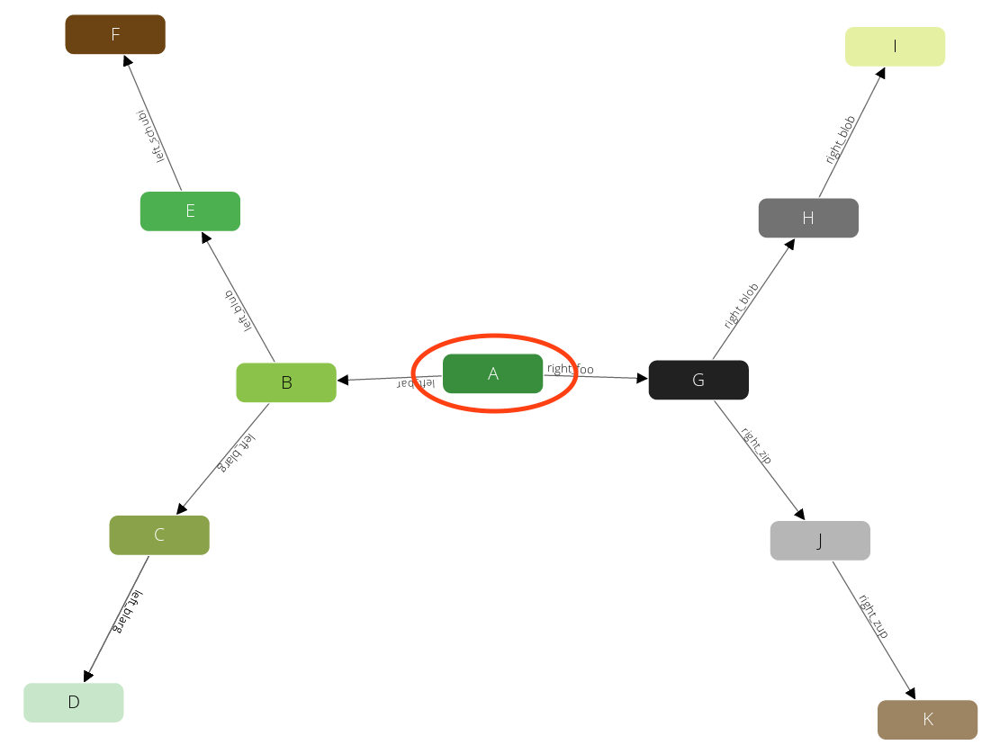
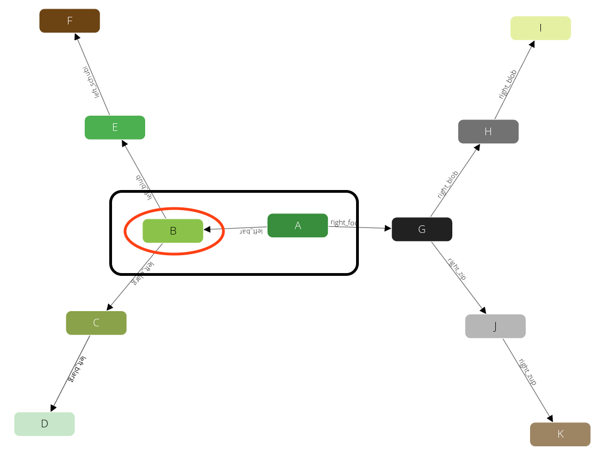
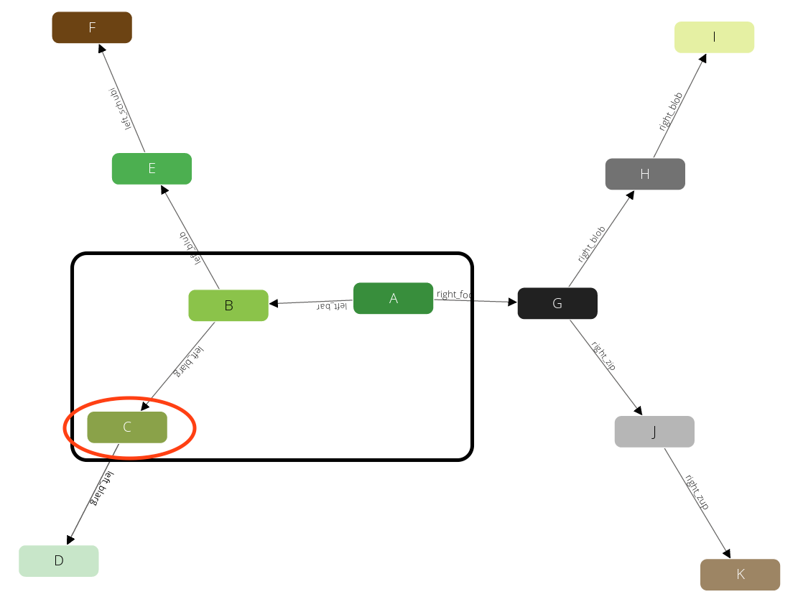
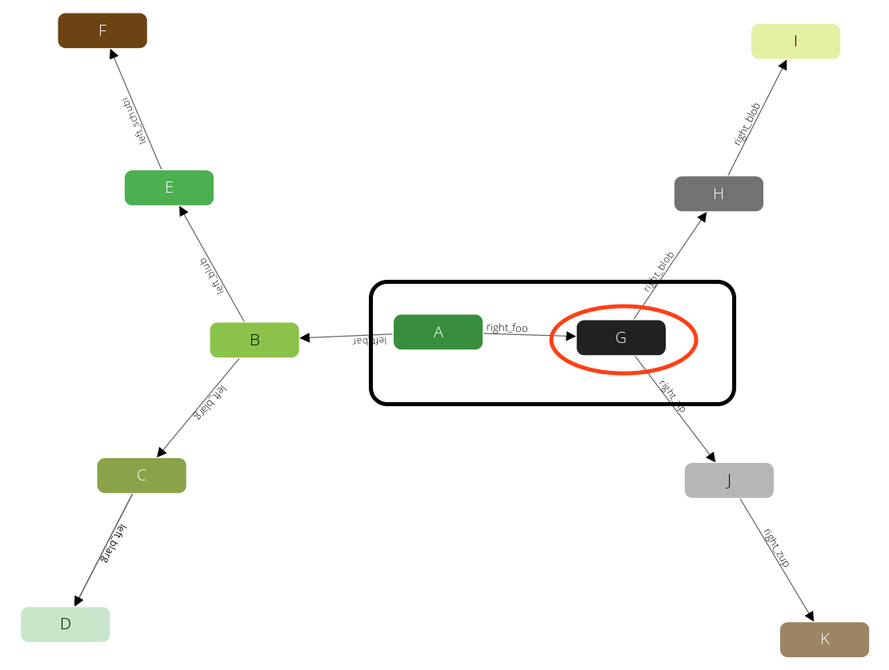

!CHAPTER Graph traversals in AQL

!SECTION General query idea

A traversal starts at one specific document (*startVertex*) and follows all
edges connected to this document. For all documents (*vertices*) that are
targeted by these edges it will again follow all edges connected to them and
so on. It is possible to define how many of these follow iterations should be
executed at least (*min* depth) and at most (*max* depth).

For all vertices that were visited during this process in the range between
*min* depth and *max* depth iterations you will get a result in form of a
set with three items:

1. The visited vertex.
2. The edge pointing to it.
3. The complete path from startVertex to the visited vertex as object with an
  attribute *edges* and an attribute *vertices*, each a list of the coresponding
  elements. These lists are sorted, which means the first element in *vertices*
  is the *startVertex* and the last is the visited vertex, and the n-th element
  in *edges* connects the n-th element with the (n+1)-th element in *vertices*.

!SUBSECTION Example execution

Let's take a look at a simple example to explain how it works.
This is the graph that we are going to traverse:


We use the following parameters for our query:

1. We start at the vertex **A**.
2. We use a *min* depth of 1.
3. We use a *max* depth of 2.
4. We follow only in *OUTBOUND* direction of edges



Now it walks to one of the direct neighbors of **A**, say **B** (note: ordering
is not guaranteed!):



The query will remember the state (red circle) and will emit the first result
**A** → **B** (black box). This will also prevent the traverser to be trapped
in cycles. Now again it will visit one of the direct neighbors of **B**, say **E**:


We have limited the query with a *max* depth of *2*, so it will not pick any
neighbor of **E**, as the path from **A** to **E** already requires *2* steps.
Instead, we will go back one level to **B** and continue with any other direct
neighbor there:



Again after we produced this result we will step back to **B**.
But there is no neighbor of **B** left that we have not yet visited.
Hence we go another step back to **A** and continue with any other neighbor there.



And identical to the iterations before we will visit **H**:


And **J**:


After these steps there is no further result left. So all together this query
has returned the following paths:

1. **A** → **B**
2. **A** → **B** → **E**
3. **A** → **B** → **C**
4. **A** → **G**
5. **A** → **G** → **H**
6. **A** → **G** → **J**


!SECTION Syntax

Now let's see how we can write a query that follows this schema.
You have two options here, you can either use a named graph or a set of edge
collections (anonymous graph).

!SUBSECTION Working with named graphs

```
FOR vertex[, edge[, path]]
  IN [min[..max]]
  OUTBOUND|INBOUND|ANY startVertex
  GRAPH graphName
  [OPTIONS options]
```

- `FOR`: emits up to three variables:
  - **vertex** (object): the current vertex in a traversal
  - **edge** (object, *optional*): the current edge in a traversal
  - **path** (object, *optional*): representation of the current path with
    two members:
    - `vertices`: an array of all vertices on this path
    - `edges`: an array of all edges on this path
- `IN` `min..max`: the minimal and maximal depth for the traversal:
  - **min** (number, *optional*): edges and vertices returned by this query will
    start at the traversal depth of *min* (thus edges and vertices below will
    not be returned). If not specified, it defaults to 1. The minimal
    possible value is 0.
  - **max** (number, *optional*): up to *max* length paths are traversed.
    If omitted, *max* defaults to *min*. Thus only the vertices and edges in
    the range of *min* are returned. *max* can not be specified without *min*.
- `OUTBOUND|INBOUND|ANY`: follow outgoing, incoming, or edges pointing in either
  direction in the traversal
- **startVertex** (string|object): a vertex where the traversal will originate from.
  This can be specified in the form of an ID string or in the form of a document
  with the attribute `_id`. All other values will lead to a warning and an empty
  result. If the specified document does not exist, the result is empty as well
  and there is no warning.
- `GRAPH` **graphName** (string): the name identifying the named graph.
  Its vertex and edge collections will be looked up.
- `OPTIONS` **options** (object, *optional*): used to modify the execution of the
  traversal. Only the following attributes have an effect, all others are ignored:
  - **uniqueVertices** (string): optionally ensure vertex uniqueness
    - "path" – it is guaranteed that there is no path returned with a duplicate vertex
    - "global" – it is guaranteed that each vertex is visited at most once during
      the traversal, no matter how many paths lead from the start vertex to this one.
      If you start with a `min depth > 1` a vertex that was found before *min* depth
      might not be returned at all (it still might be part of a path). **Note:**
      Using this configuration the result is not deterministic any more. If there
      are multiple paths from *startVertex* to *vertex*, one of those is picked.
    - "none" (default) – no uniqueness check is applied on vertices
  - **uniqueEdges** (string): optionally ensure edge uniqueness
    - "path" (default) – it is guaranteed that there is no path returned with a
      duplicate edge
    - "global" – it is guaranteed that each edge is visited at most once during
      the traversal, no matter how many paths lead from the start vertex to this edge.
      If you start with a `min depth > 1`, an edge that was found before *min* depth
      might not be returned at all (it still might be part of a path). **Note:**
      Using this configuration the result is not deterministic any more. If there
      are multiple paths from *startVertex* over *edge* one of those is picked.
    - "none" – no uniqueness check is applied on edges. **Note:**
      Using this configuration the traversal will follow cycles in edges.
  - **bfs** (bool): optionally use the alternative breadth-first traversal algorithm
    - true – the traversal will be executed breadth-first. The results will first
      contain all vertices at depth 1. Than all vertices at depth 2 and so on.
    - false (default) – the traversal will be executed depth-first. It will first
      return all paths from *min* depth to *max* depth for one vertex at depth 1.
      Than for the next vertex at depth 1 and so on.

!SUBSECTION Working with collection sets

```
FOR vertex[, edge[, path]]
  IN [min[..max]]
  OUTBOUND|INBOUND|ANY startVertex
  edgeCollection1, ..., edgeCollectionN
  [OPTIONS options]
```

Instead of `GRAPH graphName` you may specify a list of edge collections. Vertex
collections are determined by the edges in the edge collections. The rest of the
behavior is similar to the named version.
If the same edge collection is specified multiple times, it will behave as if it
were specified only once. Specifying the same edge collection is only allowed when
the collections do not have conflicting traversal directions. 

!SUBSECTION Traversing in mixed directions

For traversals with a list of edge collections you can optionally specify the
direction for some of the edge collections. Say for example you have three edge
collections *edges1*, *edges2* and *edges3*, where in *edges2* the direction has
no relevance but in *edges1* and *edges3* the direction should be taken into account.
In this case you can use *OUTBOUND* as general traversal direction and *ANY*
specifically for *edges2* as follows:

```
FOR vertex IN OUTBOUND
  startVertex
  edges1, ANY edges2, edges3
```

All collections in the list that do not specify their own direction will use the
direction defined after `IN`. This allows to use a different direction for each
collection in your traversal.

!SECTION Using filters and the explainer to extrapolate the costs

All three variables emitted by the traversals might as well be used in filter
statements. For some of these filter statements the optimizer can detect that it
is possible to prune paths of traversals earlier, hence filtered results will
not be emitted to the variables in the first place. This may significantly
improve the performance of your query. Whenever a filter is not fulfilled,
the complete set of *vertex*, *edge* and *path* will be skipped. All paths
with a length greater than *max* will never be computed.

In the current state, `AND` combined filters can be optimized, but `OR`
combined filters cannot.

!SUBSECTION Filtering on paths

Filtering on paths allows for the most powerful filtering and may have the
highest impact on performance. Using the path variable you can filter on
specific iteration depths. You can filter for absolute positions in the path
by specifying a positive number (which then qualifies for the optimizations),
or relative positions to the end of the path by specifying a negative number.

**Note**: In the current state, there is no way to define a filter for all
elements on the path. This will be added in a future version.

!SUBSUBSECTION Filtering edges on the path

```js
FOR v, e, p IN 1..5 OUTBOUND 'circles/A' GRAPH 'traversalGraph'
  FILTER p.edges[0].theTruth == true
  RETURN p
```

will filter all paths where the start edge (index 0) has the attribute
*theTruth* equal to *true*. The resulting paths will be up to 5 items long.

!SUBSECTION Filtering vertices on the path

Similar to filtering the edges on the path you can also filter the vertices:

```js
FOR v, e, p IN 1..5 OUTBOUND 'circles/A' GRAPH 'traversalGraph'
  FILTER p.vertices[1]._key == "G"
  RETURN p
```

!SUBSUBSECTION Combining several filters

And of course you can combine these filters in any way you like: 

```js
FOR v, e, p IN 1..5 OUTBOUND 'circles/A' GRAPH 'traversalGraph'
  FILTER p.edges[0].theTruth == true
     AND p.edges[1].theFalse == false
  FILTER p.vertices[1]._key == "G"
  RETURN p
```

The query will filter all paths where the first edge has the attribute
*theTruth* equal to *true*, the first vertex is "G" and the second edge has
the attribute *theFalse* equal to *false*. The resulting paths will be up to
5 items long.

**Note**: Although we have defined a *min* of 1, we will only get results of
depth 2. This is because for all results in depth 1 the second edge does not
exist and hence cannot fulfill the condition here.

!SUBSECTION Examples

We will create a simple symmetric traversal demonstration graph:


    @startDocuBlockInline GRAPHTRAV_01_create_graph
    @EXAMPLE_ARANGOSH_OUTPUT{GRAPHTRAV_01_create_graph}
    ~addIgnoreCollection("circles");
    ~addIgnoreCollection("edges");
    var examples = require("@arangodb/graph-examples/example-graph.js");
    var graph = examples.loadGraph("traversalGraph");
    db.circles.toArray();
    db.edges.toArray();
    @END_EXAMPLE_ARANGOSH_OUTPUT
    @endDocuBlock GRAPHTRAV_01_create_graph

To get started we select the full graph. For better overview we only return
the vertex IDs:

    @startDocuBlockInline GRAPHTRAV_02_traverse_all
    @EXAMPLE_ARANGOSH_OUTPUT{GRAPHTRAV_02_traverse_all}
    db._query("FOR v IN 1..3 OUTBOUND 'circles/A' GRAPH 'traversalGraph' RETURN v._key");
    db._query("FOR v IN 1..3 OUTBOUND 'circles/A' edges RETURN v._key");
    @END_EXAMPLE_ARANGOSH_OUTPUT
    @endDocuBlock GRAPHTRAV_02_traverse_all

We can nicely see that it is heading for the first outer vertex, then goes back to
the branch to descend into the next tree. After that it returns to our start node,
to descend again. As we can see both queries return the same result, the first one
uses the named graph, the second uses the edge collections directly.

Now we only want the elements of a specific depth (min = max = 2), the ones that
are right behind the fork:

    @startDocuBlockInline GRAPHTRAV_03_traverse_3
    @EXAMPLE_ARANGOSH_OUTPUT{GRAPHTRAV_03_traverse_3}
    db._query("FOR v IN 2..2 OUTBOUND 'circles/A' GRAPH 'traversalGraph' return v._key");
    db._query("FOR v IN 2 OUTBOUND 'circles/A' GRAPH 'traversalGraph' return v._key");
    @END_EXAMPLE_ARANGOSH_OUTPUT
    @endDocuBlock GRAPHTRAV_03_traverse_3

As you can see, we can express this in two ways: with or without *max* parameter
in the expression.

!SUBSECTION Filter examples

Now let's start to add some filters. We want to cut of the branch on the right
side of the graph, we may filter in two ways:

- we know the vertex at depth 1 has `_key` == `G`
- we know the `label` attribute of the edge connecting **A** to **G** is `right_foo`

    @startDocuBlockInline GRAPHTRAV_04_traverse_4
    @EXAMPLE_ARANGOSH_OUTPUT{GRAPHTRAV_04_traverse_4}
    db._query("FOR v, e, p IN 1..3 OUTBOUND 'circles/A' GRAPH 'traversalGraph' FILTER p.vertices[1]._key != 'G' RETURN v._key");
    db._query("FOR v, e, p IN 1..3 OUTBOUND 'circles/A' GRAPH 'traversalGraph' FILTER p.edges[0].label != 'right_foo' RETURN v._key");
    @END_EXAMPLE_ARANGOSH_OUTPUT
    @endDocuBlock GRAPHTRAV_04_traverse_4

As we can see all vertices behind **G** are skipped in both queries.
The first filters on the vertex `_key`, the second on an edge label.
Note again, as soon as a filter is not fulfilled for any of the three elements
`v`, `e` or `p`, the complete set of these will be excluded from the result.

We also may combine several filters, for instance to filter out the right branch
(**G**), and the **E** branch:

    @startDocuBlockInline GRAPHTRAV_05_traverse_5
    @EXAMPLE_ARANGOSH_OUTPUT{GRAPHTRAV_05_traverse_5}
    db._query("FOR v,e,p IN 1..3 OUTBOUND 'circles/A' GRAPH 'traversalGraph' FILTER p.vertices[1]._key != 'G' FILTER p.edges[1].label != 'left_blub' return v._key");
    db._query("FOR v,e,p IN 1..3 OUTBOUND 'circles/A' GRAPH 'traversalGraph' FILTER p.vertices[1]._key != 'G' AND    p.edges[1].label != 'left_blub' return v._key");
    @END_EXAMPLE_ARANGOSH_OUTPUT
    @endDocuBlock GRAPHTRAV_05_traverse_5

As you can see, combining two `FILTER` statements with an `AND` has the same result.

!SECTION Comparing OUTBOUND / INBOUND / ANY

All our previous examples traversed the graph in *OUTBOUND* edge direction.
You may however want to also traverse in reverse direction (*INBOUND*) or
both (*ANY*). Since `circles/A` only has outbound edges, we start our queries
from `circles/E`:

    @startDocuBlockInline GRAPHTRAV_06_traverse_reverse_6
    @EXAMPLE_ARANGOSH_OUTPUT{GRAPHTRAV_06_traverse_reverse_6}
    db._query("FOR v IN 1..3 OUTBOUND 'circles/E' GRAPH 'traversalGraph' return v._key");
    db._query("FOR v IN 1..3 INBOUND 'circles/E' GRAPH 'traversalGraph' return v._key");
    db._query("FOR v IN 1..3 ANY 'circles/E' GRAPH 'traversalGraph' return v._key");
    @END_EXAMPLE_ARANGOSH_OUTPUT
    @endDocuBlock GRAPHTRAV_06_traverse_reverse_6

The first traversal will only walk in the forward (*OUTBOUND*) direction.
Therefore from **E** we only can see **F**. Walking in reverse direction
(*INBOUND*), we see the path to **A**: **B** → **A**.

Walking in forward and reverse direction (*ANY*) we can see a more diverse result.
First of all, we see the simple paths to **F** and **A**. However, these vertices
have edges in other directions and they will be traversed.

**Note**: The traverser may use identical edges multiple times. For instance,
if it walks from **E** to **F**, it will continue to walk from **F** to **E**
using the same edge once again. Due to this we will see duplicate nodes in the result.

!SECTION Use the AQL explainer for optimizations

Now let's have a look what the optimizer does behind the curtain and inspect
traversal queries using [the explainer](../ExecutionAndPerformance/Optimizer.md):

    @startDocuBlockInline GRAPHTRAV_07_traverse_7
    @EXAMPLE_ARANGOSH_OUTPUT{GRAPHTRAV_07_traverse_7}
    db._explain("FOR v,e,p IN 1..3 OUTBOUND 'circles/A' GRAPH 'traversalGraph' LET localScopeVar = RAND() > 0.5 FILTER p.edges[0].theTruth != localScopeVar RETURN v._key", {}, {colors: false});
    db._explain("FOR v,e,p IN 1..3 OUTBOUND 'circles/A' GRAPH 'traversalGraph' FILTER p.edges[0].label == 'right_foo' RETURN v._key", {}, {colors: false});
    @END_EXAMPLE_ARANGOSH_OUTPUT
    @endDocuBlock GRAPHTRAV_07_traverse_7

We now see two queries: In one we add a variable *localScopeVar*, which is outside
the scope of the traversal itself - it is not known inside of the traverser.
Therefore, this filter can only be executed after the traversal, which may be
undesired in large graphs. The second query on the other hand only operates on the
path, and therefore this condition can be used during the execution of the traversal.
Paths that are filtered out by this condition won't be processed at all.

And finally clean it up again:

    @startDocuBlockInline GRAPHTRAV_99_drop_graph
    @EXAMPLE_ARANGOSH_OUTPUT{GRAPHTRAV_99_drop_graph}
    var examples = require("@arangodb/graph-examples/example-graph.js");
    examples.dropGraph("traversalGraph");
    ~removeIgnoreCollection("circles");
    ~removeIgnoreCollection("edges");
    @END_EXAMPLE_ARANGOSH_OUTPUT
    @endDocuBlock GRAPHTRAV_99_drop_graph


If this traversal is not powerful enough for your needs, like you cannot describe
your conditions as AQL filter statements, then you might want to have a look at
[manually crafted traversers](../../Manual/Graphs/Traversals/index.html).

Also see how to [combine graph traversals](../Examples/CombiningGraphTraversals.md).
