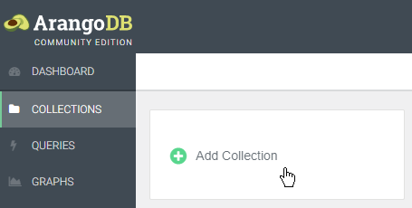
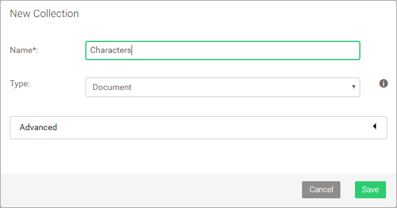
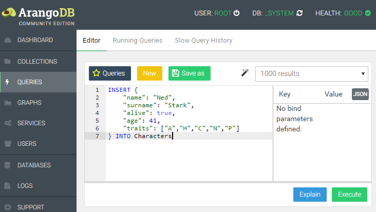

CRUD
====

- [**C**reate documents](#create-documents)
- [**R**ead documents](#read-documents)
- [**U**pdate documents](#update-documents)
- [**D**elete documents](#delete-documents)

Create documents
----------------

Before we can insert documents with AQL, we need a place to put them in - a
collection. Collections can be managed via the web interface, arangosh or a
driver. It is not possible to do so with AQL however.
<!-- ref to AQL introduction about DML -->





Click on *COLLECTIONS* in the web interface, then *Add Collection* and type
`Characters` as name. Confirm with *Save*. The new collection should appear
in the list.

Next, click on *QUERIES*. To create the first document for collection with AQL,
use the following AQL query, which you can paste into the query textbox and
run by clicking *Execute*:



```js
INSERT {
    "name": "Ned",
    "surname": "Stark",
    "alive": true,
    "age": 41,
    "traits": ["A","H","C","N","P"]
} INTO Characters
```

The syntax is `INSERT document INTO collectionName`. The document is an object
like you may know it from JavaScript or JSON, which is comprised of attribute
key and value pairs. The quotes around the attribute keys are optional in AQL.
Keys are always character sequences (strings), whereas attribute values can
have [different types](../Fundamentals/DataTypes.md):

- null
- boolean (true, false)
- number (integer and floating point)
- string
- array
- object

Name and surname of the character document we inserted are both string values.
The alive state uses a boolean. Age is a numeric value. The traits are an array
of strings. The entire document is an object.

Let's add a bunch of other characters in a single query:

```js
LET data = [
    { "name": "Robert", "surname": "Baratheon", "alive": false, "traits": ["A","H","C"] },
    { "name": "Jaime", "surname": "Lannister", "alive": true, "age": 36, "traits": ["A","F","B"] },
    { "name": "Catelyn", "surname": "Stark", "alive": false, "age": 40, "traits": ["D","H","C"] },
    { "name": "Cersei", "surname": "Lannister", "alive": true, "age": 36, "traits": ["H","E","F"] },
    { "name": "Daenerys", "surname": "Targaryen", "alive": true, "age": 16, "traits": ["D","H","C"] },
    { "name": "Jorah", "surname": "Mormont", "alive": false, "traits": ["A","B","C","F"] },
    { "name": "Petyr", "surname": "Baelish", "alive": false, "traits": ["E","G","F"] },
    { "name": "Viserys", "surname": "Targaryen", "alive": false, "traits": ["O","L","N"] },
    { "name": "Jon", "surname": "Snow", "alive": true, "age": 16, "traits": ["A","B","C","F"] },
    { "name": "Sansa", "surname": "Stark", "alive": true, "age": 13, "traits": ["D","I","J"] },
    { "name": "Arya", "surname": "Stark", "alive": true, "age": 11, "traits": ["C","K","L"] },
    { "name": "Robb", "surname": "Stark", "alive": false, "traits": ["A","B","C","K"] },
    { "name": "Theon", "surname": "Greyjoy", "alive": true, "age": 16, "traits": ["E","R","K"] },
    { "name": "Bran", "surname": "Stark", "alive": true, "age": 10, "traits": ["L","J"] },
    { "name": "Joffrey", "surname": "Baratheon", "alive": false, "age": 19, "traits": ["I","L","O"] },
    { "name": "Sandor", "surname": "Clegane", "alive": true, "traits": ["A","P","K","F"] },
    { "name": "Tyrion", "surname": "Lannister", "alive": true, "age": 32, "traits": ["F","K","M","N"] },
    { "name": "Khal", "surname": "Drogo", "alive": false, "traits": ["A","C","O","P"] },
    { "name": "Tywin", "surname": "Lannister", "alive": false, "traits": ["O","M","H","F"] },
    { "name": "Davos", "surname": "Seaworth", "alive": true, "age": 49, "traits": ["C","K","P","F"] },
    { "name": "Samwell", "surname": "Tarly", "alive": true, "age": 17, "traits": ["C","L","I"] },
    { "name": "Stannis", "surname": "Baratheon", "alive": false, "traits": ["H","O","P","M"] },
    { "name": "Melisandre", "alive": true, "traits": ["G","E","H"] },
    { "name": "Margaery", "surname": "Tyrell", "alive": false, "traits": ["M","D","B"] },
    { "name": "Jeor", "surname": "Mormont", "alive": false, "traits": ["C","H","M","P"] },
    { "name": "Bronn", "alive": true, "traits": ["K","E","C"] },
    { "name": "Varys", "alive": true, "traits": ["M","F","N","E"] },
    { "name": "Shae", "alive": false, "traits": ["M","D","G"] },
    { "name": "Talisa", "surname": "Maegyr", "alive": false, "traits": ["D","C","B"] },
    { "name": "Gendry", "alive": false, "traits": ["K","C","A"] },
    { "name": "Ygritte", "alive": false, "traits": ["A","P","K"] },
    { "name": "Tormund", "surname": "Giantsbane", "alive": true, "traits": ["C","P","A","I"] },
    { "name": "Gilly", "alive": true, "traits": ["L","J"] },
    { "name": "Brienne", "surname": "Tarth", "alive": true, "age": 32, "traits": ["P","C","A","K"] },
    { "name": "Ramsay", "surname": "Bolton", "alive": true, "traits": ["E","O","G","A"] },
    { "name": "Ellaria", "surname": "Sand", "alive": true, "traits": ["P","O","A","E"] },
    { "name": "Daario", "surname": "Naharis", "alive": true, "traits": ["K","P","A"] },
    { "name": "Missandei", "alive": true, "traits": ["D","L","C","M"] },
    { "name": "Tommen", "surname": "Baratheon", "alive": true, "traits": ["I","L","B"] },
    { "name": "Jaqen", "surname": "H'ghar", "alive": true, "traits": ["H","F","K"] },
    { "name": "Roose", "surname": "Bolton", "alive": true, "traits": ["H","E","F","A"] },
    { "name": "The High Sparrow", "alive": true, "traits": ["H","M","F","O"] }
]

FOR d IN data
    INSERT d INTO Characters
```

The `LET` keyword defines a variable with name *data* and an array of objects
as value, so `LET variableName = valueExpression` and the expression being a
literal array definition like `[ {...}, {...}, ... ]`.

`FOR variableName IN expression` is used to iterate over each element of the
*data* array. In each loop, one element is assigned to the variable *d*.
This variable is then used in the `INSERT` statement instead of a literal
object definition. What is does is basically:

```js
INSERT {
    "name": "Robert",
    "surname": "Baratheon",
    "alive": false,
    "traits": ["A","H","C"]
} INTO Characters

INSERT {
    "name": "Jaime",
    "surname": "Lannister",
    "alive": true,
    "age": 36,
    "traits": ["A","F","B"]
} INTO Characters

...
```

Note: AQL does not permit multiple `INSERT` operations that target the same
collection in in a single query. <!-- explain why? -->
It is allowed as body of a `FOR` loop however, inserting multiple documents
like we did with above query.

Read documents
--------------

There are a couple of documents in the *Characters* collection by now. We can
retrieve them all using a `FOR` loop again. This time however, we use it to
go through all documents in the collection instead of an array:

```js
FOR c IN Characters
    RETURN c
```

The syntax of the loop is `FOR variableName IN collectionName`. For each
document in the collection, *c* is assigned a document, which is then returned
as per the loop body. The query returns all characters we previously stored.

Among them should be *Ned Stark*, similar to this example:

```json
  {
    "_key": "2861650",
    "_id": "Characters/2861650",
    "_rev": "_V1bzsXa---",
    "name": "Ned",
    "surname": "Stark",
    "alive": true,
    "age": 41,
    "traits": ["A","H","C","N","P"]
  },
```

The document features the four attributes we stored, plus three more added by
the database system. Each document needs a unique `_key`, which identifies it
within a collection. The `_id` is a computed property, a concatenation of the
collection name, a forward slash `/` and the document key. It uniquely identies
a document within a database. `_rev` is a revision ID managed by the system.

Document keys can be provided by the user upon document creation, or a unique
value is assigned automatically. It can not be changed later. All three system
attributes starting with an underscore `_` are read-only.

We can use either the document key or the document ID to retrieve a specific
document with the help of an AQL function `DOCUMENT()`:

```js
RETURN DOCUMENT("Characters", "2861650")
// --- or ---
RETURN DOCUMENT("Characters/2861650")
```

```json
[
  {
    "_key": "2861650",
    "_id": "Characters/2861650",
    "_rev": "_V1bzsXa---",
    "name": "Ned",
    "surname": "Stark",
    "alive": true,
    "age": 41,
    "traits": ["A","H","C","N","P"]
  }
]
```

Note: Document keys will be different for you. Change the queries accordingly.
Here, `"2861650"` is the key for the *Ned Stark* document, and `"2861653"` for
*Catelyn Stark*.

The `DOCUMENT()` function also allows to fetch multiple documents at once:

```js
RETURN DOCUMENT("Characters", ["2861650", "2861653"])
// --- or ---
RETURN DOCUMENT(["Characters/2861650", "Characters/2861653"])
```

```json
[
  [
    {
      "_key": "2861650",
      "_id": "Characters/2861650",
      "_rev": "_V1bzsXa---",
      "name": "Ned",
      "surname": "Stark",
      "alive": true,
      "age": 41,
      "traits": ["A","H","C","N","P"]
    },
    {
      "_key": "2861653",
      "_id": "Characters/2861653",
      "_rev": "_V1bzsXa--B",
      "name": "Catelyn",
      "surname": "Stark",
      "alive": false,
      "age": 40,
      "traits": ["D","H","C"]
    }
  ]
]
```

See the [`DOCUMENT()` function](../Functions/Miscellaneous.md#document)
documentation for more details.

Update documents
----------------

According to our *Ned Stark* document, he is alive. When we get to know that he
died, we need to change the `alive` attribute. Let us modify the existing document:

```js
UPDATE "2861650" WITH { alive: false } IN Characters
```

The syntax is `UPDATE documentKey WITH object IN collectionName`. It updates the
specified document with the attributes listed (or adds them if they don't exist),
but leaves the rest untouched. To replace the entire document content, you may
use `REPLACE` instead of `UPDATE`:

```js
REPLACE "2861650" WITH {
    name: "Ned",
    surname: "Stark",
    alive: false,
    age: 41,
    traits: ["A","H","C","N","P"]
} IN Characters
```

This also works in a loop, to add a new attribute to all documents for instance:

```js
FOR c IN Characters
    UPDATE c WITH { season: 1 } IN Characters
```

A variable is used instead of a literal document key, to update each document.
The query adds an attribute `season` to the documents' top-level. You can
inspect the result by re-running the query that returns all documents in
collection:

```js
FOR c IN Characters
    RETURN c
```

```json
[
  [
    {
      "_key": "2861650",
      "_id": "Characters/2861650",
      "_rev": "_V1bzsXa---",
      "name": "Ned",
      "surname": "Stark",
      "alive": false,
      "age": 41,
      "traits": ["A","H","C","N","P"],
      "season": 1
    },
    {
      "_key": "2861653",
      "_id": "Characters/2861653",
      "_rev": "_V1bzsXa--B",
      "name": "Catelyn",
      "surname": "Stark",
      "alive": false,
      "age": 40,
      "traits": ["D","H","C"],
      "season": 1
    },
    {
        ...
    }
  ]
]
```

Delete documents
----------------

To fully remove documents from a collection, there is the `REMOVE` operation.
It works similar to the other modification operations, yet without a `WITH` clause:

```js
REMOVE "2861650" IN Characters
```

It can also be used in a loop body to effectively truncate a collection:

```js
FOR c IN Characters
    REMOVE c IN Characters
```

Note: re-run the [insert queries](#create-documents) at the top with all
character documents before you continue with the next chapter, to have data
to work with again.
