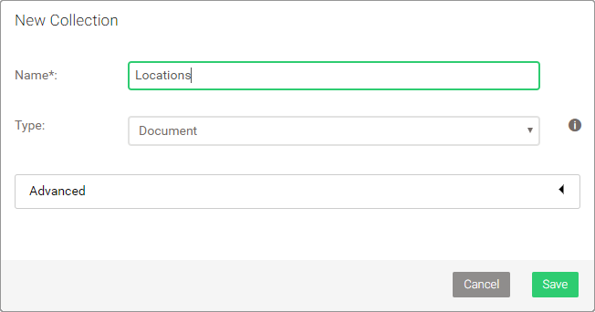
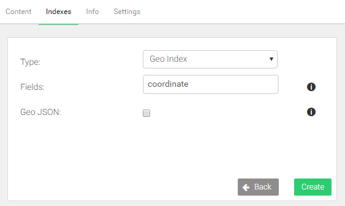
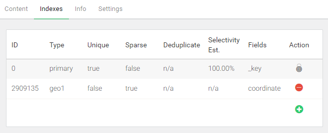

Geospatial queries
==================

Geospatial coordinates consisting of a latitude and longitude value
can be stored either as two separate attributes, or as a single
attribute in the form of an array with both numeric values.
ArangoDB can [index such coordinates](../../Manual/Indexing/Geo.html)
for fast geospatial queries.

Locations data
--------------

Let us insert some filming locations into a new collection *Locations*,
which you need to create first, then run below AQL query:



```js
LET places = [
    { "name": "Dragonstone", "coordinate": [ 55.167801, -6.815096 ] },
    { "name": "King's Landing", "coordinate": [ 42.639752, 18.110189 ] },
    { "name": "The Red Keep", "coordinate": [ 35.896447, 14.446442 ] },
    { "name": "Yunkai", "coordinate": [ 31.046642, -7.129532 ] },
    { "name": "Astapor", "coordinate": [ 31.50974, -9.774249 ] },
    { "name": "Winterfell", "coordinate": [ 54.368321, -5.581312 ] },
    { "name": "Vaes Dothrak", "coordinate": [ 54.16776, -6.096125 ] },
    { "name": "Beyond the wall", "coordinate": [ 64.265473, -21.094093 ] }
]

FOR place IN places
    INSERT place INTO Locations
```

Visualization of the coordinates on a map with their labels:


Geospatial index
----------------

To query based on coordinates, a [geo index](../../Manual/Indexing/Geo.html)
is required. It determines which fields contain the latitude and longitude
values.

- Go to *COLLECTIONS*
- Click on the *Locations* collection
- Switch to the *Indexes* tab at top
- Click the green button with a plus on the right-hand side
- Change the type to *Geo Index*
- Enter `coordinate` into the *Fields* field
- Click *Create* to confirm





Find nearby locations
---------------------

A `FOR` loop is used again, but this time to iterate over the results of a
function call to `NEAR()` to find the *n* closest coordinates to a reference
point, and return the documents with the nearby locations. The default for
*n* is 100, which means 100 documents are returned at most, the closest
matches first.

In below example, the limit is set to 3. The origin (the reference point) is
a coordinate somewhere downtown in Dublin, Ireland:

```js
FOR loc IN NEAR(Locations, 53.35, -6.26, 3)
    RETURN {
        name: loc.name,
        latitude: loc.coordinate[0],
        longitude: loc.coordinate[1]
    }
```

```json
[
  {
    "name": "Vaes Dothrak",
    "latitude": 54.16776,
    "longitude": -6.096125
  },
  {
    "name": "Winterfell",
    "latitude": 54.368321,
    "longitude": -5.581312
  },
  {
    "name": "Dragonstone",
    "latitude": 55.167801,
    "longitude": -6.815096
  }
]
```

The query returns the location name, as well as the coordinate. The coordinate
is returned as two separate attributes. You may use a simpler `RETURN loc` 
instead if you want.

Find locations within radius
----------------------------

`NEAR()` can be swapped out with `WITHIN()`, to search for locations within a
given radius from a reference point. The syntax is the same as for `NEAR()`,
except for the fourth parameter, which specifies the radius instead of a limit.
The unit for the radius is meters. The example uses a radius of 200,000
meters (200 kilometers):

```js
FOR loc IN WITHIN(Locations, 53.35, -6.26, 200 * 1000)
    RETURN {
        name: loc.name,
        latitude: loc.coordinate[0],
        longitude: loc.coordinate[1]
    }
```

```json
[
  {
    "name": "Vaes Dothrak",
    "latitude": 54.16776,
    "longitude": -6.096125
  },
  {
    "name": "Winterfell",
    "latitude": 54.368321,
    "longitude": -5.581312
  }
]
```

Return the distance
-------------------

Both `NEAR()` and `WITHIN()` can return the distance to the reference point
by adding an optional fifth parameter. It has to be a string, which will be
used as attribute name for an additional attribute with the distance in meters:

```js
FOR loc IN NEAR(Locations, 53.35, -6.26, 3, "distance")
    RETURN {
        name: loc.name,
        latitude: loc.coordinate[0],
        longitude: loc.coordinate[1],
        distance: loc.distance / 1000
    }
```

```json
[
  {
    "name": "Vaes Dothrak",
    "latitude": 54.16776,
    "longitude": -6.096125,
    "distance": 91.56658640314431
  },
  {
    "name": "Winterfell",
    "latitude": 54.368321,
    "longitude": -5.581312,
    "distance": 121.66399816395028
  },
  {
    "name": "Dragonstone",
    "latitude": 55.167801,
    "longitude": -6.815096,
    "distance": 205.31879386198324
  }
]
```

The extra attribute, here called *distance*, is returned as part of the *loc*
variable, as if it was part of the location document. The value is divided
by 1000 in the example query, to convert the unit to kilometers, simply to
make it better readable.

<!-- Geo cursor
https://www.arangodb.com/using-arangodb-geo-index-cursor-via-aql/
-->
