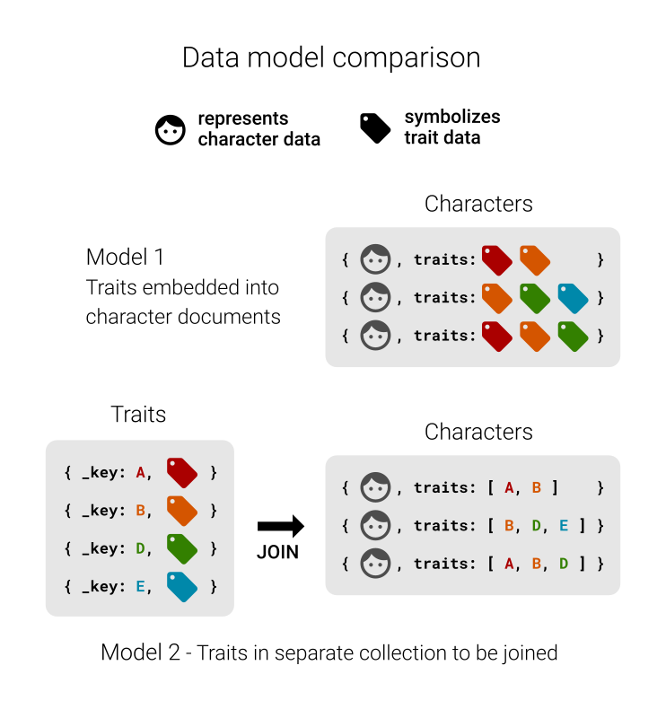
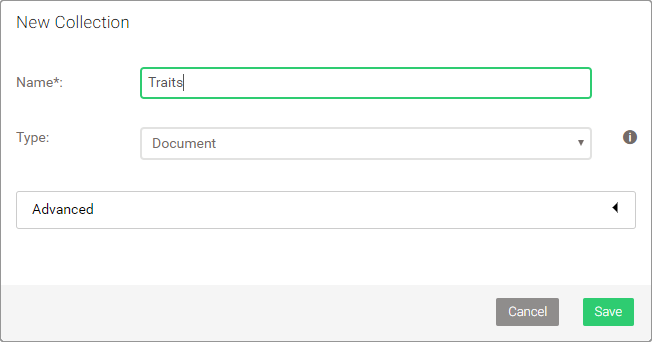

Joining together
================

References to other documents
-----------------------------

The character data we imported has an attribute *traits* for each character,
which is an array of strings. It does not store character features directly
however:

```json
{
    "name": "Ned",
    "surname": "Stark",
    "alive": false,
    "age": 41,
    "traits": ["A","H","C","N","P"]
}
```

It is rather a list of letters without an apparent meaning. The idea here is
that *traits* is supposed to store documents keys of another collection, which
we can use to resolve the letters to labels such as "strong". The benefit of
using another collection for the actual traits is, that we can easily query
for all existing traits later on and store labels in multiple languages for
instance in a central place. If we would embed traits directly...

```json
{
    "name": "Ned",
    "surname": "Stark",
    "alive": false,
    "age": 41,
    "traits": [
        {
            "de": "stark",
            "en": "strong"
        },
        {
            "de": "einflussreich",
            "en": "powerful"
        },
        {
            "de": "loyal",
            "en": "loyal"
        },
        {
            "de": "rational",
            "en": "rational"
        },
        {
            "de": "mutig",
            "en": "brave"
        }
    ]
}
```

... it becomes really hard to maintain traits. If you were to rename or
translate one of them, you would need to find all other character documents
with the same trait and perform the changes there too. If we only refer to a
trait in another collection, it is as easy as updating a single document.

<!-- What if Trait doc is deleted? DOCUMENT() skips null -->



Importing traits
----------------

Below you find the traits data. Follow the pattern shown in
[Create documents](CRUD.md#create-documents) to import it:

- Create a document collection *Traits*
- Assign the data to a variable in AQL, `LET data = [ ... ]`
- Use a `FOR` loop to iterate over each array element of the data
- `INSERT` the element `INTO Traits`



```json
[
    { "_key": "A", "en": "strong", "de": "stark" },
    { "_key": "B", "en": "polite", "de": "freundlich" },
    { "_key": "C", "en": "loyal", "de": "loyal" },
    { "_key": "D", "en": "beautiful", "de": "schön" },
    { "_key": "E", "en": "sneaky", "de": "hinterlistig" },
    { "_key": "F", "en": "experienced", "de": "erfahren" },
    { "_key": "G", "en": "corrupt", "de": "korrupt" },
    { "_key": "H", "en": "powerful", "de": "einflussreich" },
    { "_key": "I", "en": "naive", "de": "naiv" },
    { "_key": "J", "en": "unmarried", "de": "unverheiratet" },
    { "_key": "K", "en": "skillful", "de": "geschickt" },
    { "_key": "L", "en": "young", "de": "jung" },
    { "_key": "M", "en": "smart", "de": "klug" },
    { "_key": "N", "en": "rational", "de": "rational" },
    { "_key": "O", "en": "ruthless", "de": "skrupellos" },
    { "_key": "P", "en": "brave", "de": "mutig" },
    { "_key": "Q", "en": "mighty", "de": "mächtig" },
    { "_key": "R", "en": "weak", "de": "schwach" }
]
```

Resolving traits
----------------

Let's start simple by returning only the traits attribute of each character:

```js
FOR c IN Characters
    RETURN c.traits
```

```json
[
    { "traits": ["A","H","C","N","P"] },
    { "traits": ["D","H","C"] },
    ...
]
```

<!-- Obsolete if we add a chapter about attribute manipulation -->
Also see the [Fundamentals of Objects / Documents](../Fundamentals/DataTypes.md#objects--documents)
about attribute access.

We can use the *traits* array together with the `DOCUMENT()` function to use
the elements as document keys and look them up in the *Traits* collection:

```js
FOR c IN Characters
    RETURN DOCUMENT("Traits", c.traits)
```

```json
[
  [
    {
      "_key": "A",
      "_id": "Traits/A",
      "_rev": "_V5oRUS2---",
      "en": "strong",
      "de": "stark"
    },
    {
      "_key": "H",
      "_id": "Traits/H",
      "_rev": "_V5oRUS6--E",
      "en": "powerful",
      "de": "einflussreich"
    },
    {
      "_key": "C",
      "_id": "Traits/C",
      "_rev": "_V5oRUS6--_",
      "en": "loyal",
      "de": "loyal"
    },
    {
      "_key": "N",
      "_id": "Traits/N",
      "_rev": "_V5oRUT---D",
      "en": "rational",
      "de": "rational"
    },
    {
      "_key": "P",
      "_id": "Traits/P",
      "_rev": "_V5oRUTC---",
      "en": "brave",
      "de": "mutig"
    }
  ],
  [
    {
      "_key": "D",
      "_id": "Traits/D",
      "_rev": "_V5oRUS6--A",
      "en": "beautiful",
      "de": "schön"
    },
    {
      "_key": "H",
      "_id": "Traits/H",
      "_rev": "_V5oRUS6--E",
      "en": "powerful",
      "de": "einflussreich"
    },
    {
      "_key": "C",
      "_id": "Traits/C",
      "_rev": "_V5oRUS6--_",
      "en": "loyal",
      "de": "loyal"
    }
  ],
  ...
]
```

The [DOCUMENT() function](../Functions/Miscellaneous.md#document) can be used
to look up a single or multiple documents via document identifiers. In our
example, we pass the collection name from which we want to fetch documents
as first argument (`"Traits"`) and an array of document keys (`_key` attribute)
as second argument. In return we get an array of the full trait documents
for each character.

This is a bit too much information, so let's only return English labels using
the [array expansion](../Advanced/ArrayOperators.md#array-expansion) notation:

```js
FOR c IN Characters
    RETURN DOCUMENT("Traits", c.traits)[*].en
```

```json
[
  [
    "strong",
    "powerful",
    "loyal",
    "rational",
    "brave"
  ],
  [
    "beautiful",
    "powerful",
    "loyal"
  ],
  ...
]
```

Merging characters and traits
-----------------------------

Great, we resolved the letters to meaningful traits! But we also need to know
to which character they belong. Thus, we need to merge both the character
document and the data from the trait documents:

```js
FOR c IN Characters
    RETURN MERGE(c, { traits: DOCUMENT("Traits", c.traits)[*].en } )
```

```json
[
  {
    "_id": "Characters/2861650",
    "_key": "2861650",
    "_rev": "_V1bzsXa---",
    "age": 41,
    "alive": false,
    "name": "Ned",
    "surname": "Stark",
    "traits": [
      "strong",
      "powerful",
      "loyal",
      "rational",
      "brave"
    ]
  },
  {
    "_id": "Characters/2861653",
    "_key": "2861653",
    "_rev": "_V1bzsXa--B",
    "age": 40,
    "alive": false,
    "name": "Catelyn",
    "surname": "Stark",
    "traits": [
      "beautiful",
      "powerful",
      "loyal"
    ]
  },
  ...
]
```

The `MERGE()` functions merges objects together. Because we used an object
`{ traits: ... }` which has the same attribute name *traits* as the original
character attribute, the latter got overwritten by the merge operation.

Join another way
----------------

The `DOCUMENT()` function utilizes primary indices to look up documents quickly.
It is limited to find documents via their identifiers however. For a use case
like in our example it is sufficient to accomplish a simple join.

There is another, more flexible syntax for joins: nested `FOR` loops over
multiple collections, with a `FILTER` condition to match up attributes.
In case of the traits key array, there needs to be a third loop to iterate
over the keys:

```js
FOR c IN Characters
  RETURN MERGE(c, {
    traits: (
      FOR key IN c.traits
        FOR t IN Traits
          FILTER t._key == key
          RETURN t.en
    )
  })
```

For each character, it loops over its *traits* attribute (e.g. `["D","H","C"]`)
and for each document reference in this array, it loops over the *Traits*
collections. There is a condition to match the document key with the key
reference. The inner `FOR` loop and the `FILTER` get transformed to a primary
index lookup in this case instead of building up a Cartesian product only to
filter away everything but a single match (document keys within a collection
are unique).

The English trait label is returned and the spelled out traits are merged
with the character document, so the result is identical to the previous query.
However, this approach is not limited to primary keys. You can do this with
any other attribute as well. For an efficient lookup, make sure you add a
hash index for this attribute. If its values are unique, then also set the
index option to unique. Then the query optimizer will know that it can stop
after one match. If you actually want to match multiple documents, that is
possible too of course.
