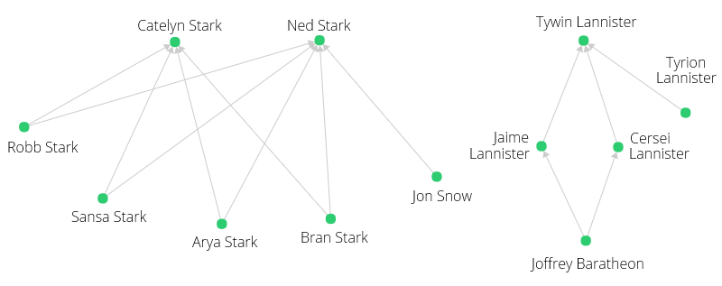
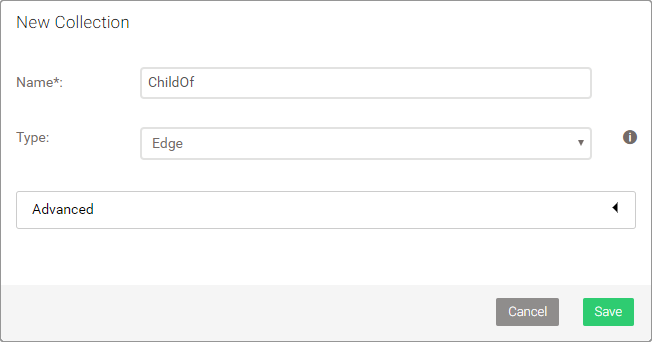

Traversal
=========

Relations such as between parents and children can be modeled as graph.
In ArangoDB, two documents (a parent and a child character document) can be
linked by an edge document. Edge documents are stored in edge collections and
have two additional attributes: `_from` and `_to`. They reference any two
documents by their document IDs (`_id`).

ChildOf relations
-----------------

Our characters have the following relations between parents and children
(first names only for a better overview):

```
    Robb -> Ned
   Sansa -> Ned
    Arya -> Ned
    Bran -> Ned
     Jon -> Ned
    Robb -> Catelyn
   Sansa -> Catelyn
    Arya -> Catelyn
    Bran -> Catelyn
   Jaime -> Tywin
  Cersei -> Tywin
  Tyrion -> Tywin
 Joffrey -> Jaime
 Joffrey -> Cersei
```

Visualized as graph:



Creating the edges
------------------

To create the required edge documents to store these relations in the database,
we can run a query that combines joining and filtering to match up the right
character documents, then use their `_id` attribute to insert an edge into an
edge collection *ChildOf*.

First off, create a new collection with the name *ChildOf* and make sure you
change the collection type to **Edge**.



Then run the following query:

```js
LET data = [
    {
        "parent": { "name": "Ned", "surname": "Stark" },
        "child": { "name": "Robb", "surname": "Stark" }
    }, {
        "parent": { "name": "Ned", "surname": "Stark" },
        "child": { "name": "Sansa", "surname": "Stark" }
    }, {
        "parent": { "name": "Ned", "surname": "Stark" },
        "child": { "name": "Arya", "surname": "Stark" }
    }, {
        "parent": { "name": "Ned", "surname": "Stark" },
        "child": { "name": "Bran", "surname": "Stark" }
    }, {
        "parent": { "name": "Catelyn", "surname": "Stark" },
        "child": { "name": "Robb", "surname": "Stark" }
    }, {
        "parent": { "name": "Catelyn", "surname": "Stark" },
        "child": { "name": "Sansa", "surname": "Stark" }
    }, {
        "parent": { "name": "Catelyn", "surname": "Stark" },
        "child": { "name": "Arya", "surname": "Stark" }
    }, {
        "parent": { "name": "Catelyn", "surname": "Stark" },
        "child": { "name": "Bran", "surname": "Stark" }
    }, {
        "parent": { "name": "Ned", "surname": "Stark" },
        "child": { "name": "Jon", "surname": "Snow" }
    }, {
        "parent": { "name": "Tywin", "surname": "Lannister" },
        "child": { "name": "Jaime", "surname": "Lannister" }
    }, {
        "parent": { "name": "Tywin", "surname": "Lannister" },
        "child": { "name": "Cersei", "surname": "Lannister" }
    }, {
        "parent": { "name": "Tywin", "surname": "Lannister" },
        "child": { "name": "Tyrion", "surname": "Lannister" }
    }, {
        "parent": { "name": "Cersei", "surname": "Lannister" },
        "child": { "name": "Joffrey", "surname": "Baratheon" }
    }, {
        "parent": { "name": "Jaime", "surname": "Lannister" },
        "child": { "name": "Joffrey", "surname": "Baratheon" }
    }
]

FOR rel in data
    LET parentId = FIRST(
        FOR c IN Characters
            FILTER c.name == rel.parent.name
            FILTER c.surname == rel.parent.surname
            LIMIT 1
            RETURN c._id
    )
    LET childId = FIRST(
        FOR c IN Characters
            FILTER c.name == rel.child.name
            FILTER c.surname == rel.child.surname
            LIMIT 1
            RETURN c._id
    )
    FILTER parentId != null AND childId != null
    INSERT { _from: childId, _to: parentId } INTO ChildOf
    RETURN NEW
```

The character documents don't have user-defined keys. If they had, it would
allow us to create the edges more easily like:

```js
INSERT { _from: "Characters/robb", _to: "Characters/ned" } INTO ChildOf
```

However, creating the edges programmatically based on character names is a
good exercise. Breakdown of the query:

- Assign the relations in form of an array of objects with a *parent* and
  a *child* attribute each, both with sub-attributes *name* and *surname*,
  to a variable `data`
- For each element in this array, assign a relation to a variable `rel` and
  execute the subsequent instructions
- Assign the result of an expression to a variable `parentId`
  - Take the first element of a sub-query result (sub-queries are enclosed
    by parentheses, but here they are also a function call)
    - For each document in the Characters collection, assign the document
      to a variable `c`
    - Apply two filter conditions: the name in the character document must
      equal the parent name in `rel`, and the surname must also equal the
      surname give in the relations data
    - Stop after the first match for efficiency
    - Return the ID of the character document (the result of the sub-query
      is an array with one element, `FIRST()` takes this element and assigns
      it to the `parentId` variable)
- Assign the result of an expression to a variable `childId`
  - A sub-query is used to find the child character document and the ID is
    returned, in the same way as the parent document ID (see above)
- If either or both of the sub-queries were unable to find a match, skip the
  current relation, because two IDs for both ends of an edge are required to
  create one (this is only a precaution)
- Insert a new edge document into the ChildOf collection, with the edge going
  from `childId` to `parentId` and no other attributes
- Return the new edge document (optional)

Traverse to the parents
-----------------------

Now that edges link character documents (vertices), we have a graph we can
query to find out who the parents are of another character &ndash; or in
graph terms, we want to start at a vertex and follow the edges to other
vertices in an [AQL graph traversal](../Graphs/Traversals.md):

```js
FOR v IN 1..1 OUTBOUND "Characters/2901776" ChildOf
    RETURN v.name
```

This `FOR` loop doesn't iterate over a collection or an array, it walks the
graph and iterates over the connected vertices it finds, with the vertex
document assigned to a variable (here: `v`). It can also emit the edges it
walked as well as the full path from start to end to
[another two variables](../Graphs/Traversals.md#syntax).

In above query, the traversal is restricted to a minimum and maximum traversal
depth of 1 (how many steps to take from the start vertex), and to only follow
edges in `OUTBOUND` direction. Our edges point from child to parent, and the
parent is one step away from the child, thus it gives us the parents of the
child we start at. `"Characters/2901776"` is that start vertex. Note that the
document ID will be different for you, so please adjust it to your document ID
of e.g. the Bran Stark document:

```js
FOR c IN Characters
    FILTER c.name == "Bran"
    RETURN c._id
```

```json
[ "Characters/<YourDocumentkey>" ]
```

You may also combine this query with the traversal directly, to easily change
the start vertex by adjusting the filter condition(s):

```js
FOR c IN Characters
    FILTER c.name == "Bran"
    FOR v IN 1..1 OUTBOUND c ChildOf
        RETURN v.name
```

The start vertex is followed by `ChildOf`, which is our edge collection. The
example query returns only the name of each parent to keep the result short:

```json
[
  "Ned",
  "Catelyn"
]
```

The same result will be returned for Robb, Arya and Sansa as starting point.
For Jon Snow, it will only be Ned.

Traverse to the children
------------------------

We can also walk from a parent in reverse edge direction (`INBOUND` that is)
to the children:

```js
FOR c IN Characters
    FILTER c.name == "Ned"
    FOR v IN 1..1 INBOUND c ChildOf
        RETURN v.name
```

```json
[
  "Robb",
  "Sansa",
  "Jon",
  "Arya",
  "Bran"
]
```

Traverse to the grandchildren
-----------------------------

For the Lannister family, we have relations that span from parent to
grandchild. Let's change the traversal depth to return grandchildren,
which means to go exactly two steps:

```js
FOR c IN Characters
    FILTER c.name == "Tywin"
    FOR v IN 2..2 INBOUND c ChildOf
        RETURN v.name
```

```json
[
  "Joffrey",
  "Joffrey"
]
```

It might be a bit unexpected, that Joffrey is returned twice. However, if you
look at the graph visualization, you can see that multiple paths lead from
Joffrey (bottom right) to Tywin:


```
Tywin <- Jaime <- Joffrey
Tywin <- Cersei <- Joffrey
```

As a quick fix, change the last line of the query to `RETURN DISTINCT v.name`
to return each value only once. Keep in mind though, that there are
[traversal options](../Graphs/Traversals.md#syntax) to suppress duplicate
vertices early on.

Also check out the
[ArangoDB Graph Course](https://www.arangodb.com/arangodb-graph-course)
which covers the basics, but also explains different traversal options
and advanced graph queries.

Traverse with variable depth
----------------------------

To return the parents and grandparents of Joffrey, we can walk edges in
`OUTBOUND` direction and adjust the traversal depth to go at least 1 step,
and 2 at most:

```js
FOR c IN Characters
    FILTER c.name == "Joffrey"
    FOR v IN 1..2 OUTBOUND c ChildOf
        RETURN DISTINCT v.name
```

```json
[
  "Cersei",
  "Tywin",
  "Jaime"
]
```

If we had deeper family trees, it would only be a matter of changing the depth
values to query for great-grandchildren and similar relations.

<!-- TODO: Add SQL examples for comparison (children's children) -->
<!-- Dump path? -->