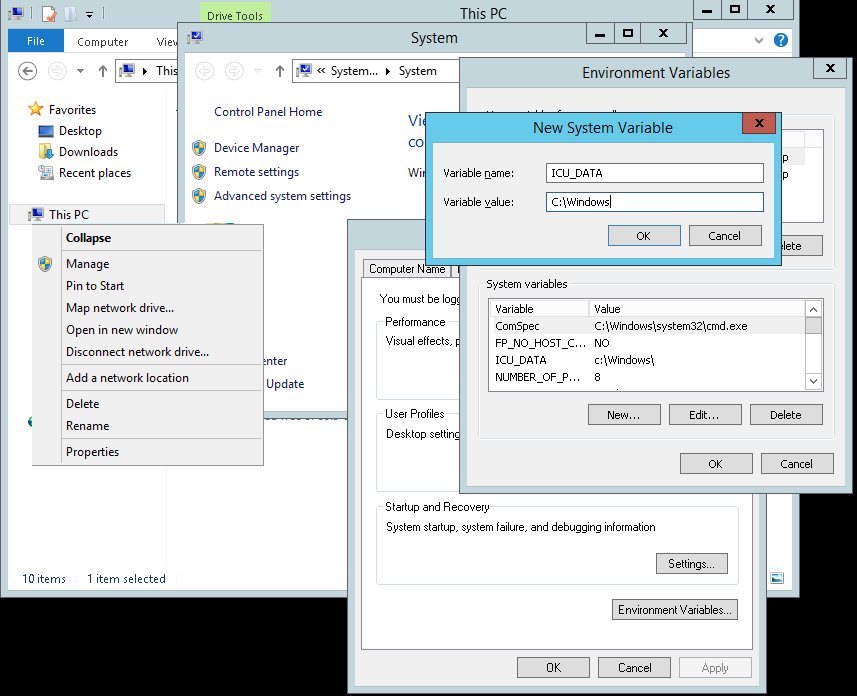

# Compiling ArangoDB under Windows

## Problem

I want to compile ArangoDB under Windows.

**Note:** For this recipe you need at least ArangoDB 2.4; it also works for 2.5 and above.
For ArangoDB version before 2.4 look at the [old Compiling ArangoDB under Windows](CompilingUnderWindowsLegacy.md).

## Solution

While compiling ArangoDB under Linux is straight forward - simply execute `configure` and `make` - compiling under Windows 
is a bit more demanding.

### Ingredients

For this recipe you need to install the following programs under Windows:

* [cygwin](https://www.cygwin.com/)

  You need at least `make` from cygwin. Cygwin also offers a `cmake`. Do **not** install this version.
  The unit tests require the bash.

  You should also issue these commands to generate user informations for the cygwin commands:

        mkpasswd > /etc/passwd
        mkgroup > /etc/group

  Turning ACL off (noacl) for all mounts in cygwin fixes permissions troubles that may appear in the build:

        # /etc/fstab
        #
        #    This file is read once by the first process in a Cygwin process tree.
        #    To pick up changes, restart all Cygwin processes.  For a description
        #    see https://cygwin.com/cygwin-ug-net/using.html#mount-table
        
        # noacl = Ignore Access Control List and let Windows handle permissions
        C:/cygwin64/bin  /usr/bin   ntfs      binary,auto,noacl           0  0
        C:/cygwin64/lib  /usr/lib   ntfs      binary,auto,noacl           0  0
        C:/cygwin64      /          ntfs      override,binary,auto,noacl  0  0
        none             /cygdrive  cygdrive  binary,posix=0,user,noacl   0  0

* [cmake](http://www.cmake.org/)

  Either version 2.8.12, 3.0.2 or 3.1.2 should work. Attention - pitfall: the cygwin version doesn't work.

* [python](http://www.python.org)

  Either 2.x version should work - it's used to run V8s GYP.
  Make sure you add python.exe to your path environment variable;
  restarting your running shell may be necessary.

* [Visual Studio Express 2013 for Windows Desktop](https://www.microsoft.com/en-us/download/details.aspx?id=44914)

  More recent versions, such as [Visual Studio Community 2015](https://www.visualstudio.com/) don't work yet.

  Please note that there are different versions of Visual Studio. The `Visual Studio for Windows`
  will **not work**. You need to install `Visual Studio (Express) for Windows Desktop`. You must
  configure your path in such a way that the compiler can be found. One way is to execute the
  `vcvarsall.bat` script from the `VC` folder.

<!--
* BOOST (if you intend to run the tests for development)

    [installing boost under windows](https://niuquant.wordpress.com/2013/11/16/setup-boost-1-55-0-unit-test-framework-with-visual-stuido-2010-on-windows-8-desktop/)
    has more details on how to.
-->

* [Nullsoft Scriptable Install System](http://nsis.sourceforge.net/Download)

* [Ruby](https://www.ruby-lang.org/en/downloads/)
  (for the unittests, if you intend to run them)

* [procdump](https://technet.microsoft.com/en-us/sysinternals/dd996900.aspx)
  (for the unittests; run once to accept the eula)

* [GitLink](https://github.com/GitTools/GitLink) to adjust the pdb files to github

* [WinDbg](https://msdn.microsoft.com/de-de/windows/hardware/gg454513.aspx)
  (in the section "Standalone Debugging Tools for Windows (WinDbg)")
  to get automated backraces during unittest runs. Hint: Add its install path to the PATH environment.

### Enable native symlinks for Cygwin and git

Cygwin will create proprietary files as placeholders by default instead of
actually symlinking files. The placeholders later tell Cygwin where to resolve
paths to. It does not intercept every access to the placeholders however, so
that 3rd party scripts break. Windows Vista and above support real symlinks,
and Cygwin can be configured to make use of it:

    # use actual symlinks to prevent documentation build errors
    # (requires elevated rights!)
    export CYGWIN="winsymlinks:native"

Note that you must run Cygwin as administrator or change the Windows group
policies to allow user accounts to create symlinks (`gpedit.msc` if available).

BTW: You can create symlinks manually on Windows like:

    mklink /H target/file.ext source/file.ext
    mklink /D target/path source/path
    mklink /J target/path source/path/for/junction

And in Cygwin:

    ln -s source target

### Use bundled Python and other executables

To use the bundled python 2.6, even if there's another python installation on
your machine, use the following shell command in the Cygwin environment to
extend the environment path (non-permanent):

    export PATH=absolute/path/to/python_26:$PATH

Note that the build scripts aren't compatible with Python 3.x!

Add more paths if needed to make commands like `ebook-convert` available:

    export PATH="/cygdrive/c/Program Files/Calibre2:absolute/path/to/python_26:$PATH"

Colons are used to separate individual paths (`path1:path2`). `$PATH` contains
the current environment paths, and must be used at the end of the export command
to not take precedence over the newly added paths.

### Building the required libraries

First of all, start a `bash` from cygwin and clone the repository using the corresponding branch, e.g. for ArangoDB 2.6:

    git clone -b 2.6 https://github.com/arangodb/arangodb-windows-libraries.git

and switch into the directory `arangodb-windows-libraries`. This repository contains the open-source libraries which
are needed by ArangoDB:

* etcd from CoreOS
* getopt
* libev
* linenoise
* openssl
* regex
* zlib

In order to build the corresponding 32bit and 64bit versions of these libraries, execute

    make
    make install
    make 3rdParty

This will create a folder `WindowsLibraries` containing the headers and libraries.

### Building ArangoDB itself

Clone the repository

    https://github.com/arangodb/arangodb.git

and copy the previously created `WindowsLibraries` folder into this directory `ArangoDB`.

Next you need to build Google's V8 version, that is part of ArangoDB. This version contains V8 and ICU.
Switch into the directory

    ArangoDB/3rdParty

and execute

    make -f Makefile.v8-windows
    make -f Makefile.v8-windows install

Now switch back into the `ArangoDB` root folder and execute

    make pack-win32

or

    make pack-win64

in order to build the installer file for either 32 bit or 64 bit.

### Development builds
For development builds which are able to run the unit tests run
<!--
(adjust the boost directory to your situation):
-->
<!--
    export BOOST_ROOT='c:\Program Files\boost_1_56_0\'
    export BOOST_LIBRARYDIR='c:\Program Files\boost_1_56_0\lib64-msvc-12.0'
    BOOSTROOT='c:\Program Files\boost_1_56_0'
    BOOST_INCLUDE='c:\Program Files\boost_1_56_0\'
    BOOST_LIBRARYDIR='c:\Program Files\boost_1_56_0\lib64-msvc-12.0'
    BOOST_ROOT='c:\Program Files\boost_1_56_0\'
    CMAKE_INCLUDE_PATHE='c:\Program Files\boost_1_56_0\'
-->

    make pack-win64-relative

Since most of the scripts assume they're running on a unix system, some directories are treated
as mandatory and thus have to be created on the drive where you checked out your source:

    mkdir -p /cygdrive/c/var/tmp/

You probably already downloaded and installed [Ruby](https://www.ruby-lang.org/en/downloads/).
Now we need to install the httparty and rspec gems. In order to use gem, you need to
[Install certificates](https://gist.github.com/fnichol/867550). Once you did that you can run:

    gem install httparty rspec

The *bin/rspec.bat* created by gem is not sufficient for being run by the unittesting facility;
replace it with something like this:

    @ECHO OFF
    IF NOT "%~f0" == "~f0" GOTO :WinNT
    @"C:\Program Files (x86)\Rub21-x64\bin\ruby.exe" "C:/Program Files (x86)/Ruby21-x64/bin/rspec" %1 %2 %3 %4 %5 %6 %7 %8 %9
    GOTO :EOF
    :WinNT
    @"C:\Program Files (x86)\Ruby21-x64\bin\ruby.exe" "C:/Program Files (x86)/Ruby21-x64/bin/rspec" %*

You can then run the unittests like that:

    bash ./scripts/unittest all --skipBoost true --skipGeo true

### Executables only

If you do not need the installer file, you can use the `cmake` to build the executables. Instead of `make pack-win32`
use

    mkdir Build32
    cd Build32
    cmake -G "Visual Studio 12" ..

This will create a solution file in the `Build32` folder. You can now start Visual Studio and open this
solution file.

To build the 64 bit version, use

    mkdir Build64
    cd Build64
    cmake -G "Visual Studio 12 Win64" ..

Alternatively use `cmake` to build the executables.

    cmake --build . --config Release

In order to execute the binaries you need to copy the ICU datafile into the directory containing the
executable

    cp WindowsLibraries/64/icudtl.dat Build64/bin/Debug/icudt54l.dat

If you intend to use the machine for development purposes, it may be more practical to copy it somewhere else:

    cp WindowsLibraries/64/icudtl.dat /cygdrive/c/Windows/icudt54l.dat

And configure your environment (yes this instruction remembers to the hitchhikers guide to the galaxy...) so that
`ICU_DATA` points to `c:\\Windows`. You do that by opening the explorer,
right click on `This PC` in the tree on the left, choose `Properties` in the opening window `Advanced system settings`,
in the Popup `Environment Variables`, another popup opens, in the `System Variables` part you click `New`, 
And Key: :`ICU_DATA` to value: `c:\\Windows`

**Authors**:
[Frank Celler](https://github.com/fceller),
[Wilfried Goesgens](https://github.com/dothebart) and
[CoDEmanX](https://github.com/CoDEmanX).

**Tags**: #windows
