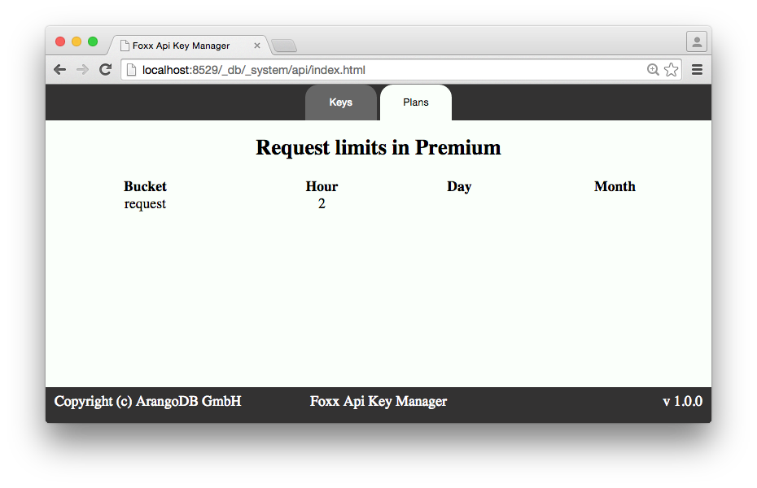
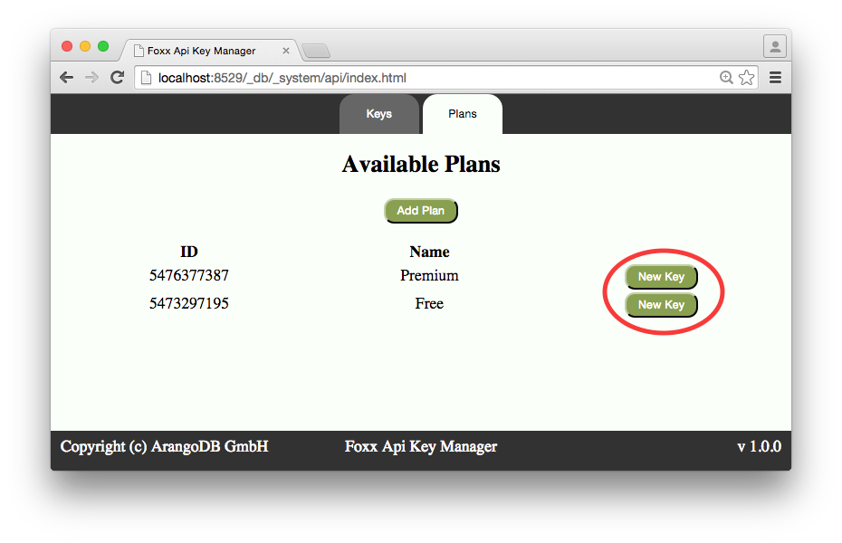
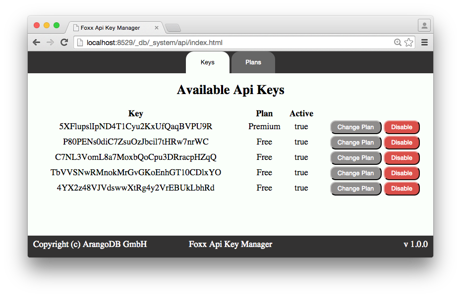

#Restrict Foxx Apps with API Keys

**Note:** For this recipe you need at least ArangoDB 2.5.

## Problem

I have collected some data that I would like to make available via an API.
But I want to restrict the API calls by issuing API keys to my users.
Also I would like to offer several plans for API keys, one for free users and one for premium users.
The premium users should be allowed to access the same API more often than free users.

## Solution

In this recipe I will use a simple weather API as an example.
Assume I have managed to create a Foxx Repository that accesses my secret data
and allows me to get the weather prediction for the next week for a given zip code (in this example only numeric zip-codes with 5 digits are allowed).
The interface for this repository is simple: `getWeather(zip, days)` with days between 1 and 7.
As a dummy for this repository we will use the following code in `repo.js`:

```js
"use strict";
let Foxx = require("org/arangodb/foxx");
let Weather = Foxx.Repository.extend({
  getWeather: function(zip, days) {
    let result = [];
    for(let i = 0; i < days; ++i) {
      result.push(Math.floor(Math.random() * 10 + 20));
    }
    return result;
  }
});
module.exports = Weather;
```

But now lets focus on the main part of this recipe, the controller.
The first API-key free implementation is the following `controller.js`:

```js
"use strict";
let Foxx = require("org/arangodb/foxx");
let Controller = new Foxx.Controller(applicationContext);
let Weather = require("./repo";
let weather = new Weather(applicationContext.collection("weather"));
let joi = require("joi");

/** Todays weather
 *
 * Load the weather of today for the given zip.
 */
controller.get("/day/:zip", function(req, res) {
  let zip = req.params("zip");
  res.json(weather.getWeather(zip, 1));
}).pathParam("zip", {type: joi.number().integer().min(10000).max(99999);

/** Next week weather
 *
 * Load the weather of the upcomming week for the given zip.
 */
controller.get("/week/:zip", function(req, res) {
  let zip = req.params("zip");
  res.json(weather.getWeather(zip, 7));
}).pathParam("zip", {type: joi.number().integer().min(10000).max(99999);
```

With this controller everyone can access my weather API and can call infinitely many calls to each of the routes.
But I want to restrict it such that there is a free account and a paid premium account.
I want to restrict a free plan to request the weather for a zipcode only five times per day.
A premium user should be allowed to access the weather two times per hour.

In order to achieve this I can make use of the Foxx API keys App available in the ArangoDB store, I will install it at the mountpoint /api

```
unix>foxx-manager install foxx-api-keys /api
```

This gives me a basic administration tool to create my plans for API keys and issue new ones.
I can either do this via the shipped web interface or via API calls.
I have prepared two plans "Free" and "Premium" according to my definition before. There I have defined a bucket named `request` which will be refilled at the given rate and which should take away tokens whenever the API key is used:




They also show up in the list of plans now and I can simply create new API keys for these plans:



Now I get an overview of all issued keys and can send them to my users:



But how to restrict my API now?

That is just a few lines of code.
First of all I have to include the Foxx-API-keys App mounted at /api:

```js
let apiKeys = Foxx.requireApp('/api').apiKeys;
```

Then I have to extend my controller and attach an additional function I can call on all my routes to setup the restriction:

```js
controller.extend({
  countCall: apiKeys.payForRoute
});

```

This simple command allows me to call a function `countCall(bucket, amount)` which will take away `amount` many tokens from the `bucket` and will return with an http 400 if either no valid API key is submitted or the `bucket` does not contain enough tokens.
The parameter `amount` is optional and will default to `1`.
**Note** I can also use `amount = 0` to only validate the API key but make the route free of charge.
Now I can extend my routes in the following way:

```js
/** Todays weather
 *
 * Load the weather of today for the given zip.
 */
controller.get("/day/:zip", function(req, res) {
  let zip = req.params("zip");
  res.json(weather.getWeather(zip, 1));
}).pathParam("zip", {type: joi.number().integer().min(10000).max(99999)
.countCall("request");
```

What happened now to my route?

1. It expects an additional query parameter "apiKey", if that one is invalid or not given the route will return with a 400 - Bad request
2. If the apiKey is valid (contained in the list of API keys) it is checked if the bucket `request` of this user has enough tokens left. If not the route will return with a 400 - Bad request
3. If the route has not yet returned my own code will be evaluated

Now lets fire some commands against my API:

No API key:
```
unix>curl http://localhost:8529/_db/_system/weather/day/50674 --dump -
HTTP/1.1 400 Bad Request
Server: ArangoDB
Connection: Keep-Alive
Content-Type: application/json; charset=utf-8
Content-Length: 105

{"error":true,"code":400,"errorNum":400,"errorMessage":"Invalid value for \"apiKey\": value is required"}

```

Invalid API key:
```
unix>curl http://localhost:8529/_db/_system/weather/day/50674?apiKey="123456789" --dump -
HTTP/1.1 400 Bad Request
Server: ArangoDB
Connection: Keep-Alive
Content-Type: application/json
Content-Length: 27

{"error":"Invalid apikey."}
```

The first five calls of a free account in a day:
```
unix>curl http://localhost:8529/_db/_system/weather/day/50674?apiKey="77423849774"
[27]
unix>curl http://localhost:8529/_db/_system/weather/day/50674?apiKey="77423849774"
[21]
unix>curl http://localhost:8529/_db/_system/weather/day/50674?apiKey="77423849774"
[29]
unix>curl http://localhost:8529/_db/_system/weather/day/50674?apiKey="77423849774"
[20]
unix>curl http://localhost:8529/_db/_system/weather/day/50674?apiKey="77423849774"
[24]
```

The sixth call of a free account in a day:
```
unix>curl http://localhost:8529/_db/_system/weather/day/50674?apiKey="77423849774" --dump -
HTTP/1.1 400 Bad Request
Server: ArangoDB
Connection: Keep-Alive
Content-Type: application/json
Content-Length: 64

{"error":"The apikey has issued too many requests of this type"}
```

Problem solved, my API is restricted by the API keys I issue via Foxx-API-keys app.

Full controller code:

```js
"use strict";
let Foxx = require("org/arangodb/foxx");
let Controller = new Foxx.Controller(applicationContext);
let Weather = require("./repo");
let weather = new Weather(applicationContext.collection("weather"));
let joi = require("joi");
let apiKeys = Foxx.requireApp('/api').apiKeys;

controller.extend({
  countCall: apiKeys.payForRoute
});

/** Todays weather
 *
 * Load the weather of today for the given zip.
 */
controller.get("/day/:zip", function(req, res) {
  let zip = req.params("zip");
  res.json(weather.getWeather(zip, 1));
}).pathParam("zip", {type: joi.number().integer().min(10000).max(99999)
.countCall("request");

/** Next week weather
 *
 * Load the weather of the upcomming week for the given zip.
 */
controller.get("/week/:zip", function(req, res) {
  let zip = req.params("zip");
  res.json(weather.getWeather(zip, 7));
}).pathParam("zip", {type: joi.number().integer().min(10000).max(99999)
.countCall("request");

```

**Notes:**
* You can define several buckets for the same plan, f.e. a bucket for read and a bucket for write requests
* The API-key-app is neither restricted to the mountpoint `/api` nor to the database `_system`, this is just an example used here.
* The API-key-app does not work across databases. You need to have it mounted in the same databases as your secured API.

**Author**: [Michael Hackstein](https://github.com/mchacki)

**Tags**: #foxx #api #api-keys
