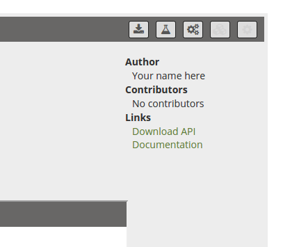
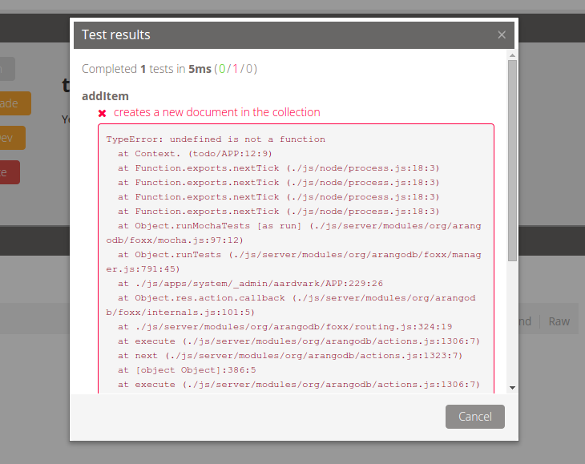
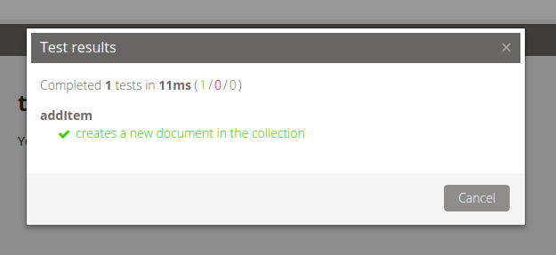

# Testing Foxx Apps

## Problem

I already know [how to write Foxx apps](FoxxFirstSteps.md) but now I want to be able to test my Foxx code in the context of a real ArangoDB server.

**Note:** This recipe uses features that will be introduced in ArangoDB 2.6 and will not work in older versions of ArangoDB.

## Solution

Starting with 2.6 Foxx has built-in support for [Mocha](http://mochajs.org) tests. Let's see how we can use them for test-driven development by writing a simple Foxx To Do list app starting from scratch.

Create a new Foxx app via the generator and make sure that it has at least one collection called "todo". This is where we will be storing our list items. Once you're done, download the app archive and unzip to a folder.

Inside the project folder create a new folder called "tests". Inside of it create a new JavaScript file and open it in your code editor of choice.

Let's start by loading an assertion library:

```js
/*global describe, it */
'use strict';
var expect = require('chai').expect;
```

A recent version of [chai](http://chaijs.com) comes pre-installed with ArangoDB 2.6 and higher. Also, when your tests are executed, Mocha will automatically provide the functions `describe`, `it`, as well as a few other helpers, so you don't need to worry about requiring them yourself.

We want our Foxx app to provide a JavaScript API to other Foxx apps for creating To Do list items rather than use the controllers the Foxx generator created for us. You can delete the "controllers" folder if you want, but remember to also remove the corresponding entry from the manifest.

Let's write our first test case:

```js
describe('addItem', function () {
  it('creates a new document in the collection', function () {
    var todoText = 'Construct additional pylons';
    api.addItem(todoText);
    var doc = collection.firstExample({text: todoText});
    expect(doc).to.exist;
    expect(doc).to.have.property('text', todoText);
  });
});
```

We haven't defined `api` and `collection` yet, so let's quickly add those to the top of the file:

```js
var api = require('../exports');
var collection = applicationContext.collection('todo');
```

We'll also need to add the file containing the Foxx app's exported API. Create an empty file called "exports.js" in the project folder itself, then open up the manifest.

The manifest file that was generated for us should look something like this:

```json
{
  "name": "todo-app",
  "description": "Yet another To Do app.",
  "author": "Your name here",
  "version": "0.0.1",
  "license": "The Unlicense",
  "scripts": {
    "setup": "scripts/setup.js",
    "teardown": "scripts/teardown.js"
  }
}
```

We'll need to add our exports so other apps can use them and also add the test folder so we can run them:

```json
{
  …
  "exports": "exports.js",
  "tests": "test/**",
  "scripts": {
    …
  }
}
```

Wrap it all up in a `.zip` archive and return to ArangoDB's web admin interface and open the app details in the "Applications" tab. Press the big "Upgrade" button and upload your zip file. If you removed the controllers, you should notice that the generated API documentation no longer shows any routes. This means the upgrade was successful.



Find the "Tests" icon in the app's controls in the upper right next to the download icon and click it. You will be asked for confirmation to give you a pause to make sure you're not accidentally running tests on a production database, then you'll be shown the test results.



If everything went right, you should see that the test we came up with failed because of the infamous `TypeError: undefined is not a function`. This shouldn't be surprising as our exports file doesn't yet actually export anything. Let's open up our "exports.js" and remedy that, then zip and upload it all again:

```js
'use strict';
var ToDo = require('./models/todo');
var ToDoRepository = require('./repositories/todo');
var todos = new ToDoRepository(
  applicationContext.collection('todo'),
  {model: ToDo}
);

exports.addItem = function () {};
```

With our stub implementation in place, the test will still fail but this time with the more expected `AssertionError: expected null to exist`, indicating the collection couldn't find the document we were looking for. We can now replace the stub with an actual implementation:

```js
exports.addItem = function (text) {
  var model = new ToDo({text: text});
  todos.save(model);
};
```

After another zip, upgrade and test, we are now greeted with our first working test case.



## Comment

Going through the edit-zip-upgrade-test cycle for every change can be tedious. For serious development it is easier to modify the app directly on the file system and setting it to development mode so changes to the app are reflected immediately. Note that using development mode is not necessary if you only want to modify the tests and not the Foxx app(s) under test itself.

If you want to automate the testing, you can also run tests via the admin interface's HTTP API via

```sh
$ curl -X POST http://localhost:8529/_db/<database-name>/_admin/aardvark/foxxes/tests?mount=<your-app's-mount-point>
```

or using the `foxx-manager`:

```sh
$ foxx-manager tests <your-app's-mount-point>
```

e.g.:

```sh
$ foxx-manager tests /todo '{"reporter": "spec"}'
```

**Author:** [Alan Plum](https://github.com/pluma)

**Tags:** #foxx #tdd
