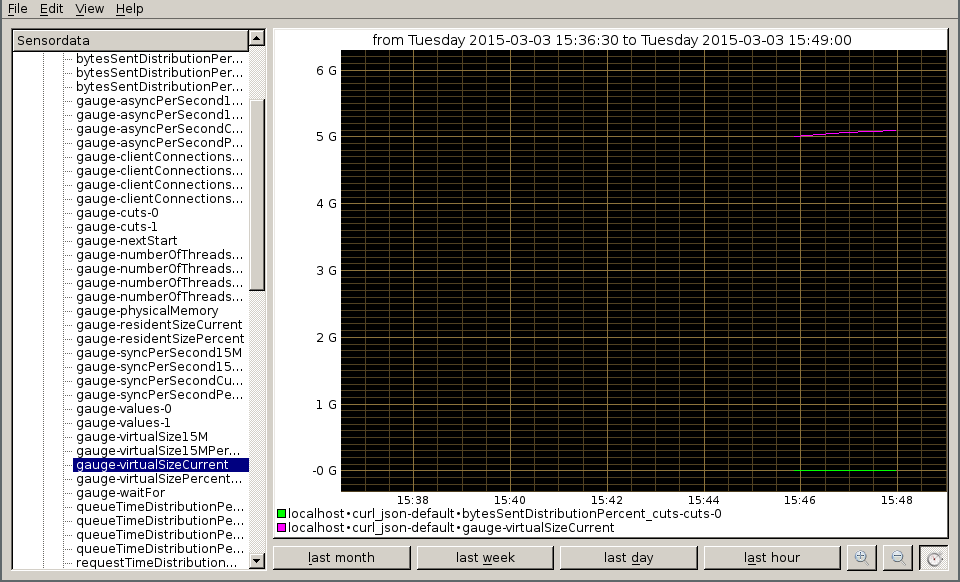

#Monitoring ArangoDB using collectd

##Problem

The ArangoDB web interface shows a nice summary of the current state. I want to see similar numbers in my monitoring system so I can analyze the system usage post mortem or send alarms on failure.

## Solution

[Collectd](http://collectd.org) is an excellent tool to gather all kinds of metrics from a system and deliver it to a central monitoring like [Graphite](http://graphite.wikidot.com/screen-shots) and / or [Nagios](http://www.nagios.org/).

### Ingredients

For this recipe you need to install the following tools:

* [collectd >= 5.4.2](https://collectd.org/) The aggregation Daemon
* [kcollectd](https://www.forwiss.uni-passau.de/~berberic/Linux/kcollectd.html) for inspecting the data

### Configuring collectd

For aggregating the values we will use the [cURL-JSON plug-in](https://collectd.org/wiki/index.php/Plugin:cURL-JSON). We will store the values using the [Round-Robin-Database writer](https://collectd.org/wiki/index.php/RRD)(RRD) which `kcollectd` can later on present to you.

We assume your `collectd` comes from your distribution and reads its config from `/etc/collectd/collectd.conf`. Since this file tends to become pretty unreadable quickly, we use the `include` mechanism:

    <Include "/etc/collectd/collectd.conf.d">
      Filter "*.conf"
    </Include>

This way we can make each metric group on compact set config files. It consists of three components:

* loading the plug-in
* adding metrics to the TypesDB
* the configuration for the plug-in itself

### rrdtool
We will use the [Round-Robin-Database](http://oss.oetiker.ch/rrdtool/) as storage backend for now. It creates its own database files of fixed size for each specific time range. Later you may choose more advanced writer-plug-ins, which may do network distribution of your metrics or integrate the above mentioned Graphite or your already established monitoring, etc.

For the RRD we will go pretty much with defaults:

    # Load the plug-in:
    LoadPlugin rrdtool
    <Plugin rrdtool>
       DataDir "/var/lib/collectd/rrd"
    #  CacheTimeout 120
    #  CacheFlush 900
    #  WritesPerSecond 30
    #  CreateFilesAsync false
    #  RandomTimeout 0
    #
    # The following settings are rather advanced
    # and should usually not be touched:
    #   StepSize 10
    #   HeartBeat 20
    #   RRARows 1200
    #   RRATimespan 158112000
    #   XFF 0.1
    </Plugin>

### cURL JSON
`Collectd` comes with a wide range of metric aggregation plug-ins. Many tools today use [JSON](http://json.org) as data formating grammar; so does ArangoDB. Therefore a plug-in offering to fetch JSON documents via HTTP is the perfect match as an integration interface:

    # Load the plug-in:
    LoadPlugin curl_json
    # we need to use our own types to generate individual names for our gauges:
    TypesDB "/etc/collectd/collectd.conf.d/arangodb_types.db"
    <Plugin curl_json>
      # Adjust the URL so collectd can reach your arangod:
      <URL "http://localhost:8529/_db/_system/_admin/aardvark/statistics/short">
       # Set your authentication to Aardvark here:
       # User "foo"
       # Password "bar"
        <Key "totalTimeDistributionPercent/values/0">
           Type "totalTimeDistributionPercent_values"
         </Key>
         <Key "totalTimeDistributionPercent/cuts/0">
           Type "totalTimeDistributionPercent_cuts"
         </Key>
         <Key "requestTimeDistributionPercent/values/0">
           Type "requestTimeDistributionPercent_values"
         </Key>
         <Key "requestTimeDistributionPercent/cuts/0">
           Type "requestTimeDistributionPercent_cuts"
         </Key>
         <Key "queueTimeDistributionPercent/values/0">
           Type "queueTimeDistributionPercent_values"
         </Key>
         <Key "queueTimeDistributionPercent/cuts/0">
           Type "queueTimeDistributionPercent_cuts"
         </Key>
         <Key "bytesSentDistributionPercent/values/0">
           Type "bytesSentDistributionPercent_values"
         </Key>
         <Key "bytesSentDistributionPercent/cuts/0">
           Type "bytesSentDistributionPercent_cuts"
         </Key>
         <Key "bytesReceivedDistributionPercent/values/0">
           Type "bytesReceivedDistributionPercent_values"
         </Key>
         <Key "bytesReceivedDistributionPercent/cuts/0">
           Type "bytesReceivedDistributionPercent_cuts"
         </Key>
         <Key "numberOfThreadsCurrent">
           Type "gauge"
         </Key>
         <Key "numberOfThreadsPercentChange">
           Type "gauge"
         </Key>
         <Key "virtualSizeCurrent">
           Type "gauge"
         </Key>
         <Key "virtualSizePercentChange">
           Type "gauge"
         </Key>
         <Key "residentSizeCurrent">
           Type "gauge"
         </Key>
         <Key "residentSizePercent">
           Type "gauge"
         </Key>
         <Key "asyncPerSecondCurrent">
           Type "gauge"
         </Key>
         <Key "asyncPerSecondPercentChange">
           Type "gauge"
         </Key>
         <Key "syncPerSecondCurrent">
           Type "gauge"
         </Key>
         <Key "syncPerSecondPercentChange">
           Type "gauge"
         </Key>
         <Key "clientConnectionsCurrent">
           Type "gauge"
         </Key>
         <Key "clientConnectionsPercentChange">
           Type "gauge"
         </Key>
         <Key "physicalMemory">
           Type "gauge"
         </Key>
         <Key "nextStart">
           Type "gauge"
         </Key>
         <Key "waitFor">
           Type "gauge"
         </Key>
         <Key "numberOfThreads15M">
           Type "gauge"
         </Key>
         <Key "numberOfThreads15MPercentChange">
           Type "gauge"
         </Key>
         <Key "virtualSize15M">
           Type "gauge"
         </Key>
         <Key "virtualSize15MPercentChange">
           Type "gauge"
         </Key>
         <Key "asyncPerSecond15M">
           Type "gauge"
         </Key>
         <Key "asyncPerSecond15MPercentChange">
           Type "gauge"
         </Key>
         <Key "syncPerSecond15M">
           Type "gauge"
         </Key>
         <Key "syncPerSecond15MPercentChange">
           Type "gauge"
         </Key>
         <Key "clientConnections15M">
           Type "gauge"
         </Key>
         <Key "clientConnections15MPercentChange">
           Type "gauge"
         </Key>
      </URL>
    </Plugin>

To circumvent the shortcoming of the curl_JSON plug-in to only take the last path element as name for the metric, we need to give them a name using our own `types.db` file in `/etc/collectd/collectd.conf.d/arangodb_types.db`:

    totalTimeDistributionPercent_values		value:GAUGE:U:U
    totalTimeDistributionPercent_cuts		value:GAUGE:U:U
    requestTimeDistributionPercent_values		value:GAUGE:U:U
    requestTimeDistributionPercent_cuts		value:GAUGE:U:U
    queueTimeDistributionPercent_values		value:GAUGE:U:U
    queueTimeDistributionPercent_cuts		value:GAUGE:U:U
    bytesSentDistributionPercent_values		value:GAUGE:U:U
    bytesSentDistributionPercent_cuts		value:GAUGE:U:U
    bytesReceivedDistributionPercent_values		value:GAUGE:U:U
    bytesReceivedDistributionPercent_cuts		value:GAUGE:U:U

### Rolling your own
You may want to monitor your own metrics from ArangoDB. Here is a simple example how to use the `config`:

    {
     "testArray":[1,2],
     "testArrayInbetween":[{"blarg":3},{"blub":4}],
     "testDirectHit":5,
     "testSubLevelHit":{"oneMoreLevel":6}
    }

This `config` snippet will parse the JSON above:

    <Key "testArray/0">
      Type "gauge"
      # Expect: 1
    </Key>
    <Key "testArray/1">
      Type "gauge"
      # Expect: 2
    </Key>
    <Key "testArrayInbetween/0/blarg">
      Type "gauge"
      # Expect: 3
    </Key>
    <Key "testArrayInbetween/1/blub">
      Type "gauge"
      # Expect: 4
    </Key>
    <Key "testDirectHit">
      Type "gauge"
      # Expect: 5
    </Key>
    <Key "testSubLevelHit/oneMoreLevel">
      Type "gauge"
      # Expect: 6
    </Key

### Get it served

Now we will (re)start `collectd` so it picks up our configuration:

    /etc/init.d/collectd start

We will inspect the syslog to revalidate nothing went wrong:

    Mar  3 13:59:52 localhost collectd[11276]: Starting statistics collection and monitoring daemon: collectd.
    Mar  3 13:59:52 localhost systemd[1]: Started LSB: manage the statistics collection daemon.
    Mar  3 13:59:52 localhost collectd[11283]: Initialization complete, entering read-loop.

`Collectd` adds the hostname to the directory address, so now we should have files like these:

     -rw-r--r-- 1 root root 154888 Mar  2 16:53 /var/lib/collectd/rrd/localhost/curl_json-default/gauge-numberOfThreads15M.rrd

Now we start `kcollectd` to view the values in the RRD file:

Since we started putting values in just now, we need to choose 'last hour' and zoom in a little more to inspect the values.

Finished with this dish, wait for more metrics to come in other recipes.

**Author:** [Wilfried Goesgens](https://github.com/dothebart)

**Tags:** #json #monitoring
