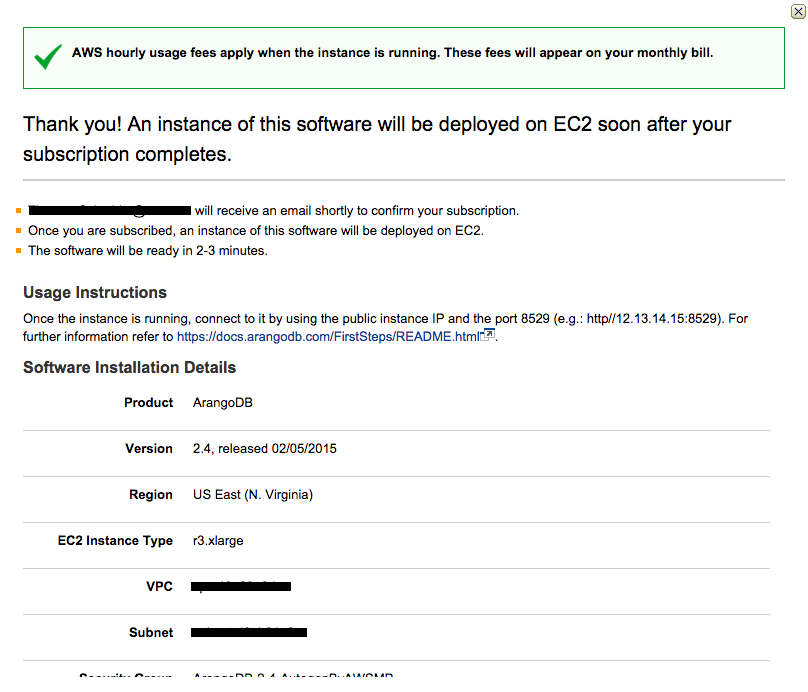
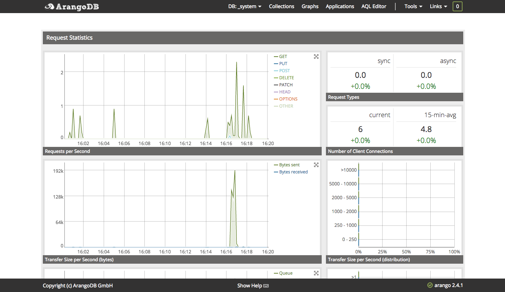

#Running ArangoDB on AWS

ArangoDB is available as AMI on the [AWS Marketplace][1].

(If you've already a running ArangoDB image on AWS and need an update, please have a look at [Updating ArangoDB on AWS](UpdateArangoDBOnAWS.md)).

Here is a quick guide how to start:

* Go the [ArangoDB marketplace][2], select the latest version and click on **Continue**
* Use the **1-Click Launch** tab and select the size of the instance (**EC2 Instance Type**) you wish to use.
* Now you can continue with a click on **Accept Terms & Launch with 1-Click**.

**Note**: If you do not have a key pair a warning will appear after clicking and you will be asked to generate a key pair.

You successfully launched an ArangoDB instance on AWS.

The ArangoDB Web-Interface can be reached using the **Access Software** button or via public instance IP and the Port 8529 (e.g.: http://12.13.14.15:8529)
The default user is `root` and the password is the `Instance ID` (You can find the Instance ID on the instance list).

If you want to learn more about ArangoDB, start with the [ArangoDB First Steps][4] in our Documentation or try one of our [Tutorials][5] or Cookbook recipes.

**Author**: [Ingo Friepoertner](https://github.com/ifcologne)

**Tags** : #aws, #amazon, #howto

[1]: https://aws.amazon.com
[2]: https://aws.amazon.com/marketplace/search/results/ref=dtl_navgno_search_box?page=1&searchTerms=arangodb
[3]: https://aws.amazon.com/marketplace/library
[4]: https://docs.arangodb.com/FirstSteps/index.html
[5]: https://www.arangodb.com/tutorials
