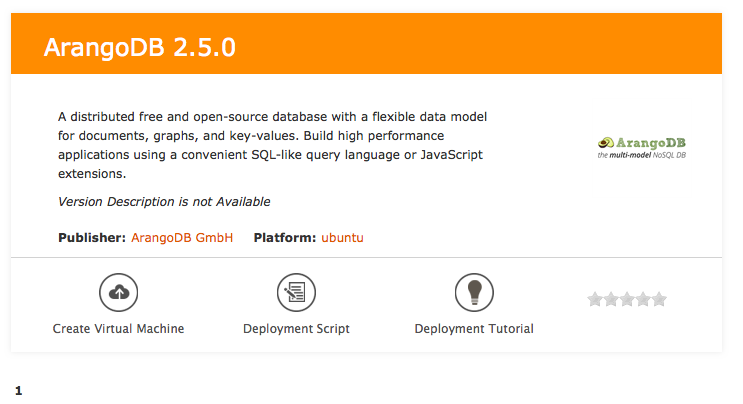

# ArangoDB in Microsoft Azure

I want to use ArangoDB in Microsoft Azure

## How to

The short answer is: go to

```
https://vmdepot.msopentech.com/
```

type in "ArangoDB", select the version you require and press "Create Virtual Machine".



Follow the instructions given there and within minutes you have a running ArangoDB
instance in Microsoft Azure. You will receive an email as soon as your machine
is ready.

Assume your machine is called `myarangodb`, than you can access ArangoDB pointing
your browser to

```
http://myarangodb.cloudapp.net:8529
```

Please note that for security reasons the default instance is password protected.

However, the password for "root" is empty. So, please log in and change the
password as soon as possible.

**Authors**: [Frank Celler](https://github.com/fceller)

**Tags**: #azure, #howto
