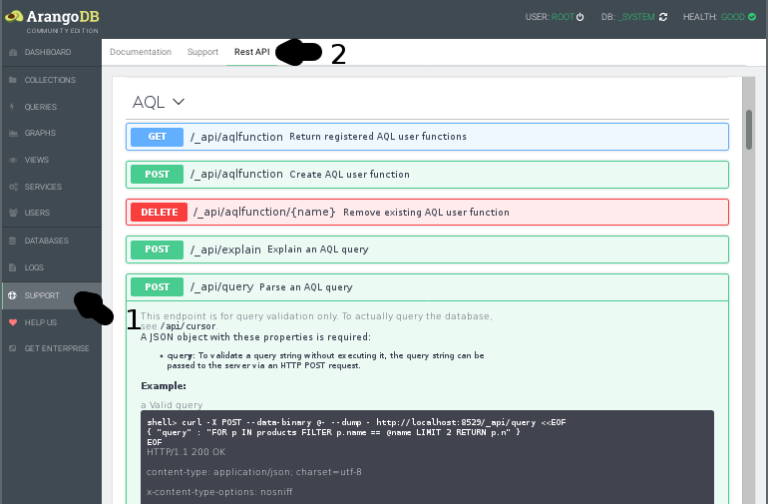

ArangoDB VERSION_NUMBER HTTP API Documentation
==============================================

Welcome to the ArangoDB HTTP API documentation! This documentation is
for API developers. As a user or administrator of ArangoDB you should
not need the information provided herein.

In general, as a user of ArangoDB you will use one of the language
[drivers](https://www.arangodb.com/arangodb-drivers/).

**Interactive Swagger documentation**

Please note that your ArangoDB comes with an interactive version of
this documentation using [Swagger](https://swagger.io):

We also have a blog post explaining
[how to work with the Swagger API](https://www.arangodb.com/2018/03/using-arangodb-swaggerio-interactive-api-documentation/).
