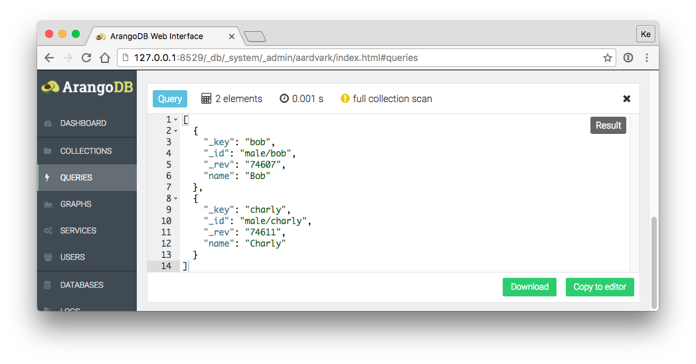

!CHAPTER Query View

The query view offers you three different subviews:

- Editor
- Running Queries
- Slow Query History

!SECTION AQL Query Editor

The web interface offers a AQL Query Editor:


The editor is split into two parts, the query editor pane and the bind
parameter pane.

The left pane is your regular query input field, where you can edit and then
execute or explain your queries. By default, the entered bind parameter will
automatically be recognized and shown in the bind parameter table in the right
pane, where you can easily edit them.

The input fields are equipped with type detection. This means you don't have to
use quote marks around string, just write them as-is. Numbers will be treated
as numbers, *true* and *false* as booleans, *null* as null-type value. Square
brackets can be used to define arrays, and curly braces for objects (keys and
values have to be surrounded by double quotes). This will mostly be what you want.
But if you want to force something to be treated as string, use quotation marks
for the value:

```js
123   // interpreted as number
"123" // interpreted as string

["foo", "bar", 123, true] // interpreted as array
['foo', 'bar', 123, true] // interpreted as string
```

If you are used to work with JSON, you may want to switch the bind parameter
editor to JSON mode by clicking on the upper right toggle button.  You can then
edit the bind parameters in raw JSON format.

!SUBSECTION Custom Queries

To save the current query use the *Save* button in the top left corner of
the editor or use the shortcut (see below).


By pressing the *Queries* button in the top left corner of the editor you
activate the custom queries view. Here you can select a previously stored custom
query or one of our query examples.

Click on a query title to get a code preview. In addition, there are action
buttons to:

- Copy to editor
- Explain query
- Run query
- Delete query

For the built-in example queries, there is only *Copy to editor* available.

To export or import queries to and from JSON you can use the buttons on the
right-hand side.

!SUBSECTION Result



Each query you execute or explain opens up a new result box, so you are able
to fire up multiple queries and view their results at the same time. Every query
result box gives you detailed query information and of course the query result
itself. The result boxes can be dismissed individually, or altogether using the
*Remove results* button. The toggle button in the top right corner of each box
switches back and forth between the *Result* and *AQL* query with bind parameters.

!SUBSECTION Spotlight


The spotlight feature opens up a modal view. There you can find all AQL keywords,
AQL functions and collections (filtered by their type) to help you to be more
productive in writing your queries. Spotlight can be opened by the magic wand icon
in the toolbar or via shortcut (see below).

!SUBSECTION AQL Editor Shortcuts

- Ctrl / Cmd + Return to execute a query
- Ctrl / Cmd + Shift + Return to explain a query
- Ctrl / Cmd + Shift + S to save the current query
- Ctrl / Cmd + Shift + C to toggle comments  
- Ctrl + Space to open up the spotlight search
- Ctrl + Cmd + Z to undo last change
- Ctrl + Cmd + Shift + Z to redo last change
  
!SECTION Running Queries


The *Running Queries* tab gives you a compact overview of all running queries.
By clicking the red minus button, you can abort the execution of a running query.

!SECTION Slow Query History


The *Slow Query History* tab gives you a compact overview of all past slow queries.
