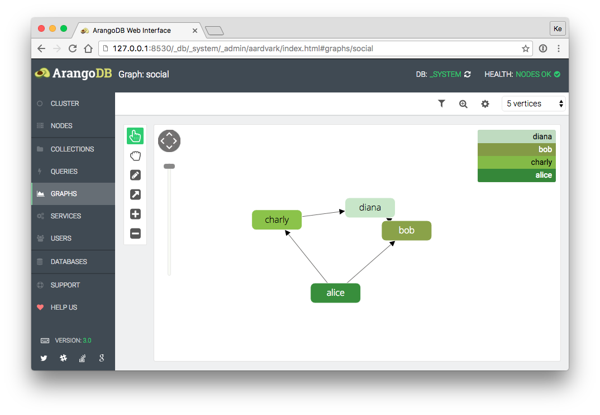
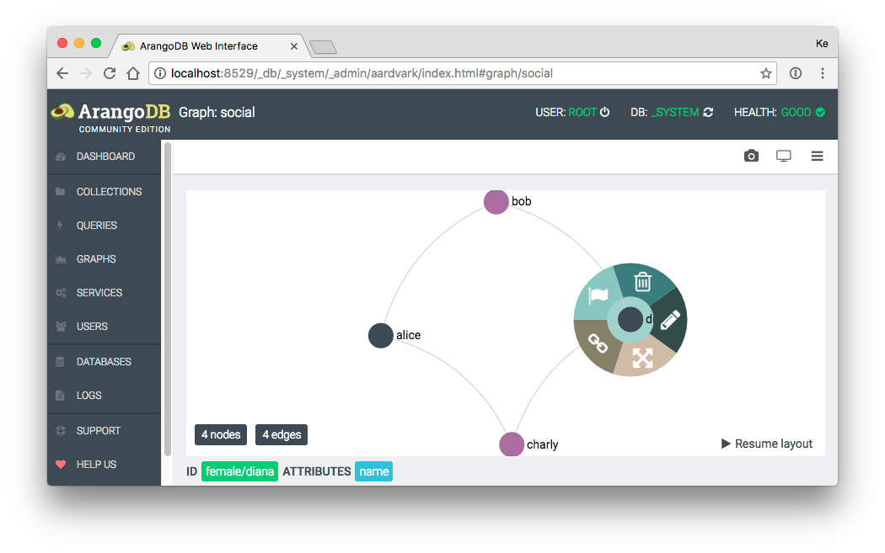

Graphs
======

The *Graphs* tab provides a viewer facility for graph data stored in ArangoDB.
It allows browsing ArangoDB graphs stored in the *_graphs* system collection or
a graph consisting of an arbitrary vertex and [edge collection](../../Appendix/Glossary.md#edge-collection).

Please note that the graph viewer requires canvas (optional: webgl)  support 
in your browser. Especially Internet Explorer browsers older than version 9
are likely to not support this.

Graph Viewer
------------

Top Toolbar Functions:

- Load full graph (Also nodes without connections will be drawn. Useful during graph modeling setup)
- Take a graph screenshot
- Start full screen mode
- Open graph options menu

Default Context Menu (mouse-click background):

- Add a new node
- Close visible context menu(s)

Node Context Menu (mouse-click node):

- Delete node
- Edit node
- Expand node (Show all bound edges)
- Draw edge (Connect with another node)
- Set as startnode (The Graph will rerender starting the selected node and given options (graph options menu))

Edge Context Menu (mouse-click edge):

- Edit edge
- Delete edge

Edge Highlighting (right-mouse-click node):

- Highlight all edges connected to the node (right-click at the background will remove highlighting)

### Graph Viewer Options

Graph Options Menu: 

- Startnode (string - valid node id or space seperated list of id's): Heart of your graph. Rendering and traversing will start from here. Empty value means: a random starting point will be used.
- Layout: Different graph layouting algoritms. No overlap (optimal: big graph), force layout (optimal: medium graph), fruchtermann (optimal: little to medium graph).
- Renderer: Canvas mode allows editing. WebGL currently offers only display mode (a lot faster with much nodes/edges).
- Search depth (number): Search depth which is starting from your start node. 
- Limit (number): Limit nodes count. If empty or zero, no limit is set.

Nodes Options Menu:

- Label (string): Nodes will be labeled by this attribute. If node attribute is not found, no label will be displayed.
- Add Collection Name: This appends the collection name to the label, if it exists.
- Color By Collections: Should nodes be colorized by their collection? If enabled, node color and node color attribute will be ignored.
- Color: Default node color.
- Color Attribute (string): If an attribute is given, nodes will then be colorized by the attribute. This setting ignores default node color if set.
- Size By Connections: Should nodes be sized by their edges count? If enabled, node sizing attribute will be ignored.
- Sizing Attribute (number): Default node size. Numeric value > 0.

Edges Options Menu:

- Label (string): Edges will be labeled by this attribute. If edge attribute is not found, no label will be displayed.
- Add Collection Name: This appends the collection name to the label, if it exists.
- Color By Collections: Should edges be colorized by their collection? If enabled, edge color and edge color attribute will be ignored.
- Color: Default edge color.
- Color Attribute (string): If an attribute is given, edges will then be colorized by the attribute. This setting ignores default node color if set.
- Type: The renderer offers multiple types of rendering. They only differ in their display style, except for the type 'curved'. The curved type
allows to display more than one edges between two nodes.
