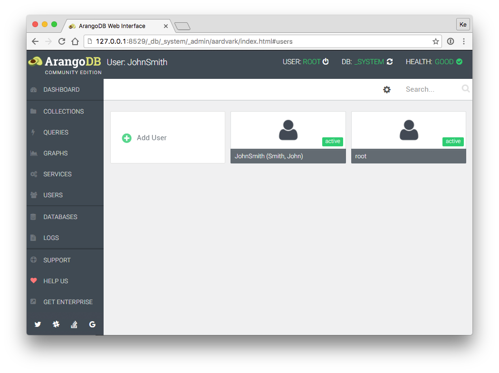
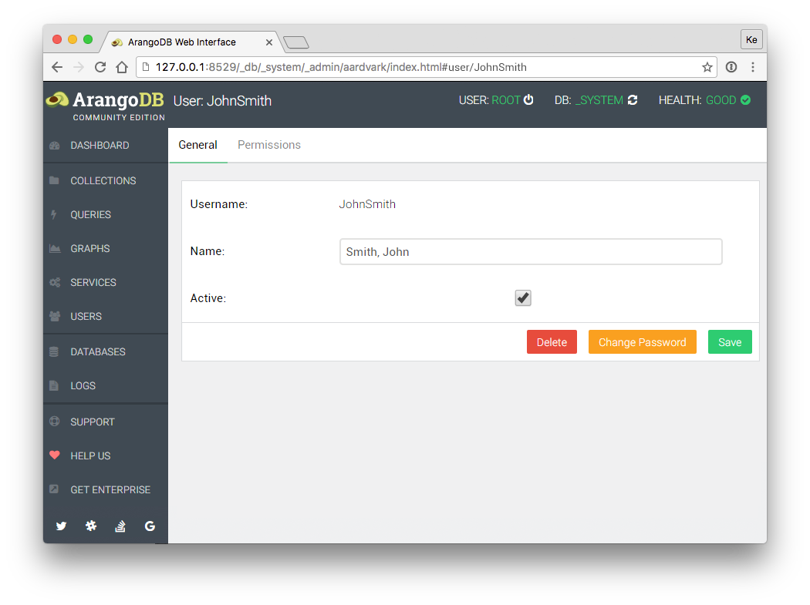
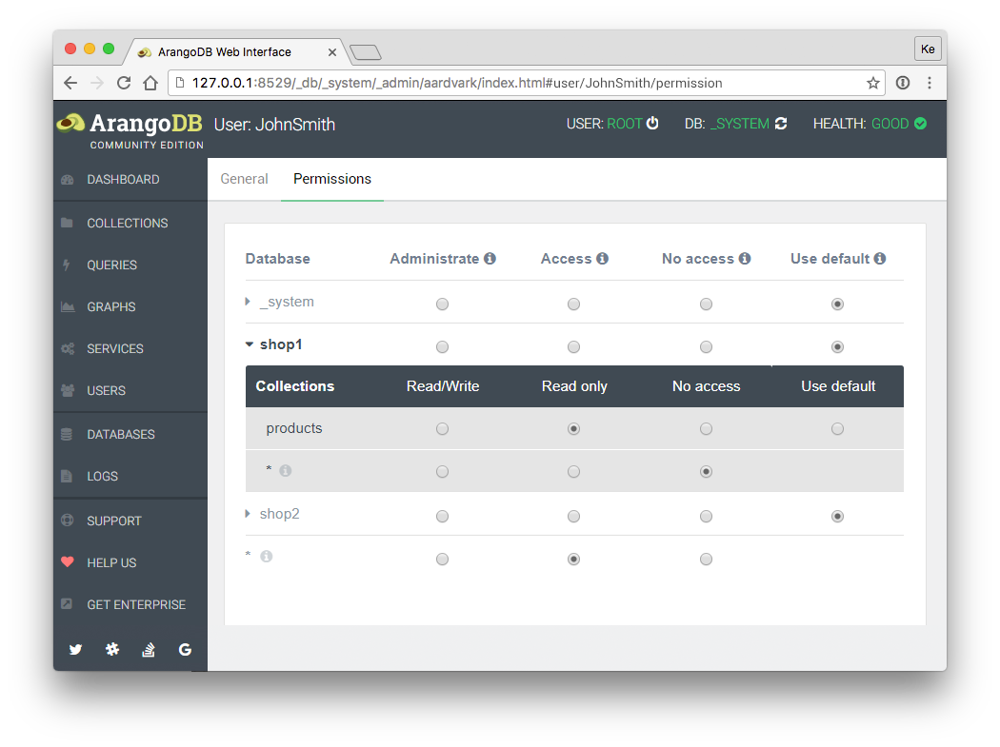

Managing Users in the Web Interface
===================================

ArangoDB users are globally stored in the \_system database and can only be
mananged while logged on to this database. There you can find the *Users* section:

General
-------

Select a user to bring up the *General* tab with the username, name and active
status, as well as options to delete the user or change the password.

Permissions
-----------

Select a user and go to the *Permissions* tab. You will see a list of databases
and their corresponding database access level for that user.

Please note that server access level follows from the access level on
the database *\_system*. Furthermore, the default database access level
for this user appear in the artificial row with the database name `*`.

Below this table is another one for the collection category access
levels. At first, it shows the list of databases, too. If you click on a
database, the list of collections in that database will be open and you
can see the defined collection access levels for each collection of that
database (which can be all unselected which means that nothing is
explicitly set). The default access levels for this user and database
appear in the artificial row with the collection name `*`.


Also see [**Managing Users**](../ManagingUsers/README.md) about access levels.

