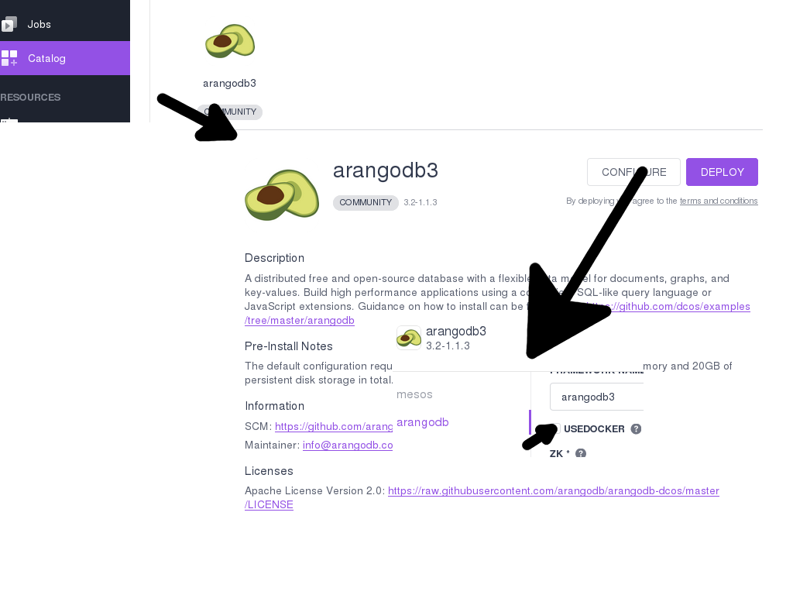
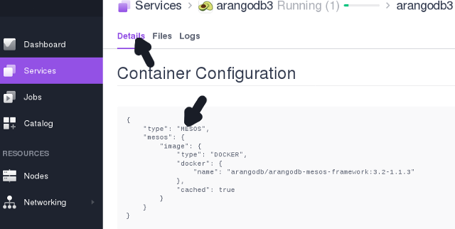

Running ArangoDB Clusters on DC/OS with Mesos Containers
========================================================

Since DC/OS 1.8 a new way of running containers in Mesos clouds has become available. It re-uses the docker on-disk format and distribution infrastructure,
but pairs it with management features that make it a better fit for DC/OS environments. 

With ArangoDB 3.2.6 we introduce the possibility to instanciate an ArangoDB Clusters using the Mesos containerizer. You can deploy clusters with it
by unchecking the `USEDOCKER` checkmark:



Once the ArangoDB framework task is up and running you can revalidate its running using the Mesos container engine by clicking on the task, 
and scroll all the way down in the *Details* tab:


Using the DC/OS cli we can now also list the running tasks:

```
# dcos task
NAME                    HOST        USER  STATE  ID                                              MESOS ID
arangodb3               10.0.1.221  root    R    arangodb3.988230ce-b95f-11e7-b0b3-d27390e16c96  4339f842-fb3b-46a6-9cb1-46febca9ad31-S4
arangodb3-Agent1        10.0.3.125  root    R    f1bbb380-6650-47c6-a6dd-31256b9db2a7            4339f842-fb3b-46a6-9cb1-46febca9ad31-S1
arangodb3-Agent2        10.0.0.234  root    R    410e4df2-5dea-4fae-9724-82e382488acd            4339f842-fb3b-46a6-9cb1-46febca9ad31-S0
arangodb3-Agent3        10.0.0.231  root    R    bbb73025-00da-4bdf-8a6d-e34129e3abaf            4339f842-fb3b-46a6-9cb1-46febca9ad31-S5
arangodb3-Coordinator1  10.0.3.125  root    R    9eea93a7-2ada-45c2-8bb6-f3f6153b7fd8            4339f842-fb3b-46a6-9cb1-46febca9ad31-S1
arangodb3-Coordinator2  10.0.0.234  root    R    c49496c2-ea66-4b75-9b0d-4d35e637ca77            4339f842-fb3b-46a6-9cb1-46febca9ad31-S0
arangodb3-DBServer1     10.0.0.234  root    R    43bdda44-4edb-457a-bde7-44d5711f076d            4339f842-fb3b-46a6-9cb1-46febca9ad31-S0
arangodb3-DBServer2     10.0.3.125  root    R    ff3ad9fb-d69a-4d1a-9bd7-43e782835d83            4339f842-fb3b-46a6-9cb1-46febca9ad31-S1
```

And find the running ArangoDB cluster. We can now use the DC/OS cli to gain a shell on the framework container by picking its ID from the 5th column:

```
dcos task exec -it arangodb3.988230ce-b95f-11e7-b0b3-d27390e16c96 bash 
```

Which will give us an interactive shell in that container. Since the container is stripped down to the bare minimum, we may want to install a bunch of tools for better inspecting the current state:

```
root@ip-10-0-1-221:/mnt/mesos/sandbox# export PATH=$PATH:/usr/sbin:/sbin; \
     apt-get update; \
     apt-get install curl net-tools procps netcat jq
```

We then can i.e. inspect the running tasks:

```
root@ip-10-0-1-221:/mnt/mesos/sandbox# ps -eaf 
UID  PID PPID C STIME TTY    TIME CMD
root   1    0 0 08:36 ?  00:00:00 /opt/mesosphere/active/mesos/libexec/mesos/mesos-containerizer launch
root   6    1 0 08:36 ?  00:00:00 mesos-executor --launcher_dir=/opt/mesosphere/active/mesos/libexec/mesos --sandbox_directory=/mnt/mesos/sandbo
root  16    6 0 08:36 ?  00:00:01 ./arangodb-framework --webui_port=10452 --framework_port=10453 --webui=http://10.0.1.221:10452 framework --fra
root  38   16 0 08:37 ?  00:00:00 haproxy -f /tmp/arango-haproxy.conf -sf 37
root  40    1 0 08:42 ?  00:00:00 /opt/mesosphere/active/mesos/libexec/mesos/mesos-containerizer launch
root  41   40 0 08:42 ?  00:00:00 bash
root 460   41 0 08:44 ?  00:00:00 ps -eaf
```
