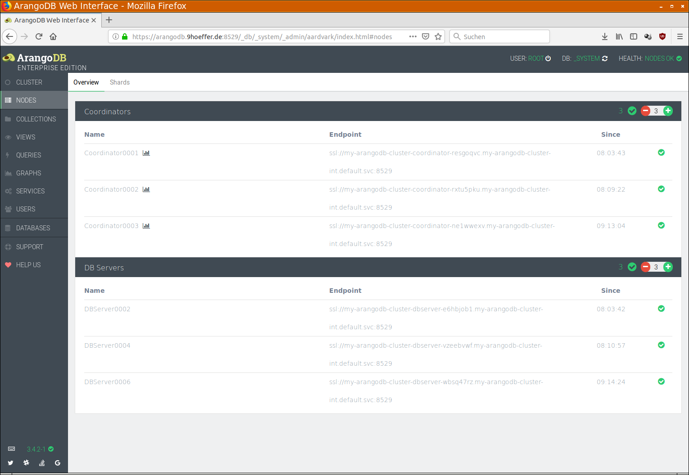
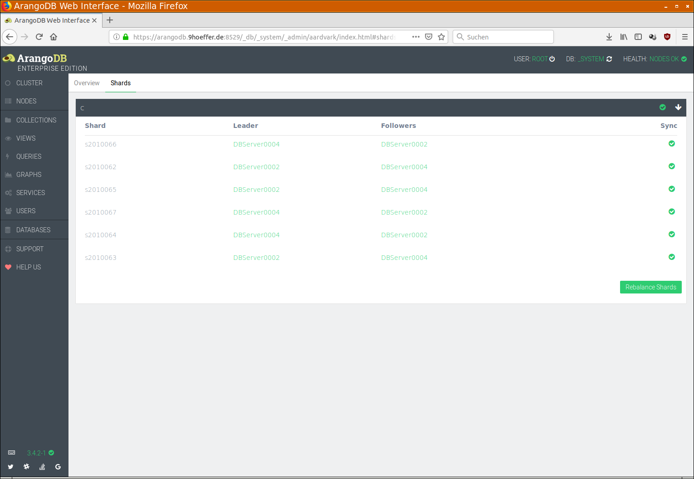

<!-- don't edit here, it's from https://@github.com/arangodb/kube-arangodb.git / docs/Manual/ -->
# Draining Kubernetes nodes


If Kubernetes nodes with ArangoDB pods on them are drained without care
data loss can occur! The recommended procedure is described below.


For maintenance work in k8s it is sometimes necessary to drain a k8s node,
which means removing all pods from it. Kubernetes offers a standard API
for this and our operator supports this - to the best of its ability.

Draining nodes is easy enough for stateless services, which can simply be
re-launched on any other node. However, for a stateful service this
operation is more difficult, and as a consequence more costly and there
are certain risks involved, if the operation is not done carefully
enough. To put it simply, the operator must first move all the data
stored on the node (which could be in a locally attached disk) to
another machine, before it can shut down the pod gracefully. Moving data
takes time, and even after the move, the distributed system ArangoDB has
to recover from this change, for example by ensuring data synchronicity
between the replicas in their new location.

Therefore, a systematic drain of all k8s nodes in sequence has to follow
a careful procedure, in particular to ensure that ArangoDB is ready to
move to the next step. This is necessary to avoid catastrophic data
loss, and is simply the price one pays for running a stateful service.

## Anatomy of a drain procedure in k8s: the grace period

When a `kubectl drain` operation is triggered for a node, k8s first
checks if there are any pods with local data on disk. Our ArangoDB pods have
this property (the _Coordinators_ do use `EmptyDir` volumes, and _Agents_
and _DBServers_ could have persistent volumes which are actually stored on
a locally attached disk), so one has to override this with the
`--delete-local-data=true` option.

Furthermore, quite often, the node will contain pods which are managed
by a `DaemonSet` (which is not the case for ArangoDB), which makes it
necessary to override this check with the `--ignore-daemonsets=true`
option.

Finally, it is checked if the node has any pods which are not managed by
anything, either by k8s itself (`ReplicationController`, `ReplicaSet`,
`Job`, `DaemonSet` or `StatefulSet`) or by an operator. If this is the
case, the drain operation will be refused, unless one uses the option
`--force=true`. Since the ArangoDB operator manages our pods, we do not
have to use this option for ArangoDB, but you might have to use it for
other pods.

If all these checks have been overcome, k8s proceeds as follows: All
pods are notified about this event and are put into a `Terminating`
state. During this time, they have a chance to take action, or indeed
the operator managing them has. In particular, although the pods get
termination notices, they can keep running until the operator has
removed all _finalizers_. This gives the operator a chance to sort out
things, for example in our case to move data away from the pod.

However, there is a limit to this tolerance by k8s, and that is the
grace period. If the grace period has passed but the pod has not
actually terminated, then it is killed the hard way. If this happens,
the operator has no chance but to remove the pod, drop its persistent
volume claim and persistent volume. This will obviously lead to a
failure incident in ArangoDB and must be handled by fail-over management.
Therefore, **this event should be avoided**.

## Things to check in ArangoDB before a node drain

There are basically two things one should check in an ArangoDB cluster
before a node drain operation can be started:

 1. All cluster nodes are up and running and healthy.
 2. For all collections and shards all configured replicas are in sync.


If any cluster node is unhealthy, there is an increased risk that the
system does not have enough resources to cope with a failure situation.

If any shard replicas are not currently in sync, then there is a serious
risk that the cluster is currently not as resilient as expected.


One possibility to verify these two things is via the ArangoDB web interface.
Node health can be monitored in the _Overview_ tab under _NODES_:



**Check that all nodes are green** and that there is **no node error** in the
top right corner.

As to the shards being in sync, see the _Shards_ tab under _NODES_:



**Check that all collections have a green check mark** on the right side.
If any collection does not have such a check mark, you can click on the
collection and see the details about shards. Please keep in
mind that this has to be done **for each database** separately!

Obviously, this might be tedious and calls for automation. Therefore, there
are APIs for this. The first one is [Cluster Health](../../../HTTP/Cluster/Health.html):

```
POST /_admin/cluster/health
```

… which returns a JSON document looking like this:

```JSON
{
  "Health": {
    "CRDN-rxtu5pku": {
      "Endpoint": "ssl://my-arangodb-cluster-coordinator-rxtu5pku.my-arangodb-cluster-int.default.svc:8529",
      "LastAckedTime": "2019-02-20T08:09:22Z",
      "SyncTime": "2019-02-20T08:09:21Z",
      "Version": "3.4.2-1",
      "Engine": "rocksdb",
      "ShortName": "Coordinator0002",
      "Timestamp": "2019-02-20T08:09:22Z",
      "Status": "GOOD",
      "SyncStatus": "SERVING",
      "Host": "my-arangodb-cluster-coordinator-rxtu5pku.my-arangodb-cluster-int.default.svc",
      "Role": "Coordinator",
      "CanBeDeleted": false
    },
    "PRMR-wbsq47rz": {
      "LastAckedTime": "2019-02-21T09:14:24Z",
      "Endpoint": "ssl://my-arangodb-cluster-dbserver-wbsq47rz.my-arangodb-cluster-int.default.svc:8529",
      "SyncTime": "2019-02-21T09:14:24Z",
      "Version": "3.4.2-1",
      "Host": "my-arangodb-cluster-dbserver-wbsq47rz.my-arangodb-cluster-int.default.svc",
      "Timestamp": "2019-02-21T09:14:24Z",
      "Status": "GOOD",
      "SyncStatus": "SERVING",
      "Engine": "rocksdb",
      "ShortName": "DBServer0006",
      "Role": "DBServer",
      "CanBeDeleted": false
    },
    "AGNT-wrqmwpuw": {
      "Endpoint": "ssl://my-arangodb-cluster-agent-wrqmwpuw.my-arangodb-cluster-int.default.svc:8529",
      "Role": "Agent",
      "CanBeDeleted": false,
      "Version": "3.4.2-1",
      "Engine": "rocksdb",
      "Leader": "AGNT-oqohp3od",
      "Status": "GOOD",
      "LastAckedTime": 0.312
    },
    ... [some more entries, one for each instance]
  },
  "ClusterId": "210a0536-fd28-46de-b77f-e8882d6d7078",
  "error": false,
  "code": 200
}
```

Check that each instance has a `Status` field with the value `"GOOD"`.
Here is a shell command which makes this check easy, using the
[`jq` JSON pretty printer](https://stedolan.github.io/jq/):

```bash
curl -k https://arangodb.9hoeffer.de:8529/_admin/cluster/health --user root: | jq . | grep '"Status"' | grep -v '"GOOD"'
```

For the shards being in sync there is the
[Cluster Inventory](../../../HTTP/Replications/ReplicationDump.html#return-cluster-inventory-of-collections-and-indexes)
API call:

```
POST /_db/_system/_api/replication/clusterInventory
```

… which returns a JSON body like this:

```JSON
{
  "collections": [
    {
      "parameters": {
        "cacheEnabled": false,
        "deleted": false,
        "globallyUniqueId": "c2010061/",
        "id": "2010061",
        "isSmart": false,
        "isSystem": false,
        "keyOptions": {
          "allowUserKeys": true,
          "type": "traditional"
        },
        "name": "c",
        "numberOfShards": 6,
        "planId": "2010061",
        "replicationFactor": 2,
        "shardKeys": [
          "_key"
        ],
        "shardingStrategy": "hash",
        "shards": {
          "s2010066": [
            "PRMR-vzeebvwf",
            "PRMR-e6hbjob1"
          ],
          "s2010062": [
            "PRMR-e6hbjob1",
            "PRMR-vzeebvwf"
          ],
          "s2010065": [
            "PRMR-e6hbjob1",
            "PRMR-vzeebvwf"
          ],
          "s2010067": [
            "PRMR-vzeebvwf",
            "PRMR-e6hbjob1"
          ],
          "s2010064": [
            "PRMR-vzeebvwf",
            "PRMR-e6hbjob1"
          ],
          "s2010063": [
            "PRMR-e6hbjob1",
            "PRMR-vzeebvwf"
          ]
        },
        "status": 3,
        "type": 2,
        "waitForSync": false
      },
      "indexes": [],
      "planVersion": 132,
      "isReady": true,
      "allInSync": true
    },
    ... [more collections following]
  ],
  "views": [],
  "tick": "38139421",
  "state": "unused"
}
```

Check that for all collections the attributes `"isReady"` and `"allInSync"`
both have the value `true`. Note that it is necessary to do this for all
databases!

Here is a shell command which makes this check easy:

```bash
curl -k https://arangodb.9hoeffer.de:8529/_db/_system/_api/replication/clusterInventory --user root: | jq . | grep '"isReady"\|"allInSync"' | sort | uniq -c
```

If all these checks are performed and are okay, then it is safe to
continue with the clean out and drain procedure as described below.


If there are some collections with `replicationFactor` set to
1, the system is not resilient and cannot tolerate the failure of even a
single server! One can still perform a drain operation in this case, but
if anything goes wrong, in particular if the grace period is chosen too
short and a pod is killed the hard way, data loss can happen.


If all `replicationFactor`s of all collections are at least 2, then the
system can tolerate the failure of a single _DBserver_. If you have set
the `Environment` to `Production` in the specs of the ArangoDB
deployment, you will only ever have one _DBserver_ on each k8s node and
therefore the drain operation is relatively safe, even if the grace
period is chosen too small.

Furthermore, we recommend to have one k8s node more than _DBservers_ in
you cluster, such that the deployment of a replacement _DBServer_ can
happen quickly and not only after the maintenance work on the drained
node has been completed. However, with the necessary care described
below, the procedure should also work without this.

Finally, one should **not run a rolling upgrade or restart operation**
at the time of a node drain.

## Clean out a DBserver manually

In this step we clean out a _DBServer_ manually, **before issuing the
`kubectl drain` command**. Previously, we have denoted this step as optional,
but for safety reasons, we consider it mandatory now, since it is near
impossible to choose the grace period long enough in a reliable way.

Furthermore, if this step is not performed, we must choose
the grace period long enough to avoid any risk, as explained in the
previous section. However, this has a disadvantage which has nothing to
do with ArangoDB: We have observed, that some k8s internal services like
`fluentd` and some DNS services will always wait for the full grace
period to finish a node drain. Therefore, the node drain operation will
always take as long as the grace period. Since we have to choose this
grace period long enough for ArangoDB to move all data on the _DBServer_
pod away to some other node, this can take a considerable amount of
time, depending on the size of the data you keep in ArangoDB.

Therefore it is more time-efficient to perform the clean-out operation
beforehand. One can observe completion and as soon as it is completed
successfully, we can then issue the drain command with a relatively
small grace period and still have a nearly risk-free procedure.

To clean out a _DBServer_ manually, we have to use this API:

```
POST /_admin/cluster/cleanOutServer
```

… and send as body a JSON document like this:

```JSON
{"server":"DBServer0006"}
```

The value of the `"server"` attribute should be the name of the DBserver
which is the one in the pod which resides on the node that shall be
drained next. This uses the UI short name (`ShortName` in the
`/_admin/cluster/health` API), alternatively one can use the
internal name, which corresponds to the pod name. In our example, the
pod name is:

```
my-arangodb-cluster-prmr-wbsq47rz-5676ed
```

… where `my-arangodb-cluster` is the ArangoDB deployment name, therefore
the internal name of the _DBserver_ is `PRMR-wbsq47rz`. Note that `PRMR`
must be all capitals since pod names are always all lower case. So, we
could use the body:

```JSON
{"server":"PRMR-wbsq47rz"}
```

You can use this command line to achieve this:

```bash
curl -k https://arangodb.9hoeffer.de:8529/_admin/cluster/cleanOutServer --user root: -d '{"server":"PRMR-wbsq47rz"}'
```

The API call will return immediately with a body like this:

```JSON
{"error":false,"id":"38029195","code":202}
```

The given `id` in this response can be used to query the outcome or
completion status of the clean out server job with this API:

```
GET /_admin/cluster/queryAgencyJob?id=38029195
```

… which will return a body like this:

```JSON
{
  "error": false,
  "id": "38029195",
  "status": "Pending",
  "job": {
    "timeCreated": "2019-02-21T10:42:14.727Z",
    "server": "PRMR-wbsq47rz",
    "timeStarted": "2019-02-21T10:42:15Z",
    "type": "cleanOutServer",
    "creator": "CRDN-rxtu5pku",
    "jobId": "38029195"
  },
  "code": 200
}
```

Use this command line to check progress:

```bash
curl -k https://arangodb.9hoeffer.de:8529/_admin/cluster/queryAgencyJob?id=38029195 --user root:
```

It indicates that the job is still ongoing (`"Pending"`). As soon as
the job has completed, the answer will be:

```JSON
{
  "error": false,
  "id": "38029195",
  "status": "Finished",
  "job": {
    "timeCreated": "2019-02-21T10:42:14.727Z",
    "server": "PRMR-e6hbjob1",
    "jobId": "38029195",
    "timeStarted": "2019-02-21T10:42:15Z",
    "timeFinished": "2019-02-21T10:45:39Z",
    "type": "cleanOutServer",
    "creator": "CRDN-rxtu5pku"
  },
  "code": 200
}
```

From this moment on the _DBserver_ can no longer be used to move
shards to. At the same time, it will no longer hold any data of the
cluster.

Now the drain operation involving a node with this pod on it is
completely risk-free, even with a small grace period.

## Performing the drain

After all above [checks before a node drain](#things-to-check-in-arangodb-before-a-node-drain)
and the [manual clean out of the DBServer](#clean-out-a-dbserver-manually)
have been done successfully, it is safe to perform the drain operation, similar to this command:

```bash
kubectl drain gke-draintest-default-pool-394fe601-glts --delete-local-data --ignore-daemonsets --grace-period=300
```

As described above, the options `--delete-local-data` for ArangoDB and
`--ignore-daemonsets` for other services have been added. A `--grace-period` of
300 seconds has been chosen because for this example we are confident that all the data on our _DBServer_ pod
can be moved to a different server within 5 minutes. Note that this is
**not saying** that 300 seconds will always be enough. Regardless of how
much data is stored in the pod, your mileage may vary, moving a terabyte
of data can take considerably longer!

If the highly recommended step of
[cleaning out a DBserver manually](#clean-out-a-dbserver-manually)
has been performed beforehand, the grace period can easily be reduced to 60
seconds - at least from the perspective of ArangoDB, since the server is already
cleaned out, so it can be dropped readily and there is still no risk.

At the same time, this guarantees now that the drain is completed
approximately within a minute.

## Things to check after a node drain

After a node has been drained, there will usually be one of the
_DBservers_ gone from the cluster. As a replacement, another _DBServer_ has
been deployed on a different node, if there is a different node
available. If not, the replacement can only be deployed when the
maintenance work on the drained node has been completed and it is
uncordoned again. In this latter case, one should wait until the node is
back up and the replacement pod has been deployed there.

After that, one should perform the same checks as described in
[things to check before a node drain](#things-to-check-in-arangodb-before-a-node-drain)
above.

Finally, it is likely that the shard distribution in the "new" cluster
is not balanced out. In particular, the new _DBSserver_ is not automatically
used to store shards. We recommend to
[re-balance](../../Administration/Cluster/README.md#movingrebalancing-shards) the shard distribution,
either manually by moving shards or by using the _Rebalance Shards_
button in the _Shards_ tab under _NODES_ in the web UI. This redistribution can take
some time again and progress can be monitored in the UI.

After all this has been done, **another round of checks should be done**
before proceeding to drain the next node.
