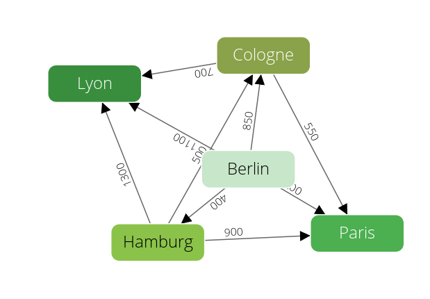

Graph Functions
===============

This chapter describes [various functions on a graph](../README.md).
A lot of these accept a vertex (or edge) example as parameter as defined in the next section.

Examples will explain the API on the [the city graph](../README.md#the-city-graph):

Definition of examples
----------------------

@startDocuBlock JSF_general_graph_example_description

Get vertices from edges.
------------------------

### Get vertex *from* of an edge

Get the source vertex of an edge

`graph._fromVertex(edgeId)`

Returns the vertex defined with the attribute *_from* of the edge with *edgeId* as its *_id*.

**Parameters**
 * edgeId (required) *_id* attribute of the edge

**Examples**

    @startDocuBlockInline generalGraphGetFromVertex
    @EXAMPLE_ARANGOSH_OUTPUT{generalGraphGetFromVertex}
      var examples = require("@arangodb/graph-examples/example-graph.js");
      var graph = examples.loadGraph("social");
      var any = require("@arangodb").db.relation.any();
      graph._fromVertex("relation/" + any._key);
    ~ examples.dropGraph("social");
    @END_EXAMPLE_ARANGOSH_OUTPUT
    @endDocuBlock generalGraphGetFromVertex

### Get vertex *to* of an edge

Get the target vertex of an edge

`graph._toVertex(edgeId)`

Returns the vertex defined with the attribute *_to* of the edge with *edgeId* as its *_id*.

**Parameters**

 * edgeId (required) *_id* attribute of the edge

**Examples**

    @startDocuBlockInline generalGraphGetToVertex
    @EXAMPLE_ARANGOSH_OUTPUT{generalGraphGetToVertex}
      var examples = require("@arangodb/graph-examples/example-graph.js");
      var graph = examples.loadGraph("social");
      var any = require("@arangodb").db.relation.any();
      graph._toVertex("relation/" + any._key);
    ~ examples.dropGraph("social");
    @END_EXAMPLE_ARANGOSH_OUTPUT
    @endDocuBlock generalGraphGetToVertex

_neighbors
----------

Get all neighbors of the vertices defined by the example

`graph._neighbors(vertexExample, options)`

The function accepts an id, an example, a list of examples or even an empty
example as parameter for vertexExample.
The complexity of this method is **O(n\*m^x)** with *n* being the vertices defined by the
parameter vertexExamplex, *m* the average amount of neighbors and *x* the maximal depths.
Hence the default call would have a complexity of **O(n\*m)**;

**Parameters**

- vertexExample (optional) See [Definition of examples](#definition-of-examples)
- options (optional) An object defining further options. Can have the following values:
  - *direction*: The direction of the edges. Possible values are *outbound*, *inbound* and *any* (default).
  - *edgeExamples*: Filter the edges, see [Definition of examples](#definition-of-examples)
  - *neighborExamples*: Filter the neighbor vertices, see [Definition of examples](#definition-of-examples)
  - *edgeCollectionRestriction* : One or a list of edge-collection names that should be
    considered to be on the path.
  - *vertexCollectionRestriction* : One or a list of vertex-collection names that should be
    considered on the intermediate vertex steps.
  - *minDepth*: Defines the minimal number of intermediate steps to neighbors (default is 1).
  - *maxDepth*: Defines the maximal number of intermediate steps to neighbors (default is 1).

**Examples**

A route planner example, all neighbors of capitals.

    @startDocuBlockInline generalGraphModuleNeighbors1
    @EXAMPLE_ARANGOSH_OUTPUT{generalGraphModuleNeighbors1}
      var examples = require("@arangodb/graph-examples/example-graph.js");
      var graph = examples.loadGraph("routeplanner");
      graph._neighbors({isCapital : true});
    ~ examples.dropGraph("routeplanner");
    @END_EXAMPLE_ARANGOSH_OUTPUT
    @endDocuBlock generalGraphModuleNeighbors1

A route planner example, all outbound neighbors of Hamburg.

    @startDocuBlockInline generalGraphModuleNeighbors2
    @EXAMPLE_ARANGOSH_OUTPUT{generalGraphModuleNeighbors2}
      var examples = require("@arangodb/graph-examples/example-graph.js");
      var graph = examples.loadGraph("routeplanner");
      graph._neighbors('germanCity/Hamburg', {direction : 'outbound', maxDepth : 2});
    ~ examples.dropGraph("routeplanner");
    @END_EXAMPLE_ARANGOSH_OUTPUT
    @endDocuBlock generalGraphModuleNeighbors2

_commonNeighbors
----------------

Get all common neighbors of the vertices defined by the examples.

`graph._commonNeighbors(vertex1Example, vertex2Examples, optionsVertex1, optionsVertex2)`

This function returns the intersection of *graph_module._neighbors(vertex1Example, optionsVertex1)*
and *graph_module._neighbors(vertex2Example, optionsVertex2)*.
For parameter documentation see [_neighbors](#neighbors).

The complexity of this method is **O(n\*m^x)** with *n* being the maximal amount of vertices
defined by the parameters vertexExamples, *m* the average amount of neighbors and *x* the
maximal depths.
Hence the default call would have a complexity of **O(n\*m)**;

**Examples**

A route planner example, all common neighbors of capitals.

    @startDocuBlockInline generalGraphModuleCommonNeighbors1
    @EXAMPLE_ARANGOSH_OUTPUT{generalGraphModuleCommonNeighbors1}
    var examples = require("@arangodb/graph-examples/example-graph.js");
    var graph = examples.loadGraph("routeplanner");
    graph._commonNeighbors({isCapital : true}, {isCapital : true});
    ~ examples.dropGraph("routeplanner");
    @END_EXAMPLE_ARANGOSH_OUTPUT
    @endDocuBlock generalGraphModuleCommonNeighbors1

A route planner example, all common outbound neighbors of Hamburg with any other location
which have a maximal depth of 2 :

    @startDocuBlockInline generalGraphModuleCommonNeighbors2
    @EXAMPLE_ARANGOSH_OUTPUT{generalGraphModuleCommonNeighbors2}
      var examples = require("@arangodb/graph-examples/example-graph.js");
      var graph = examples.loadGraph("routeplanner");
    | graph._commonNeighbors(
    |   'germanCity/Hamburg',
    |   {},
    |   {direction : 'outbound', maxDepth : 2},
        {direction : 'outbound', maxDepth : 2});
    ~ examples.dropGraph("routeplanner");
    @END_EXAMPLE_ARANGOSH_OUTPUT
    @endDocuBlock generalGraphModuleCommonNeighbors2

_countCommonNeighbors
---------------------

Get the amount of common neighbors of the vertices defined by the examples.

`graph._countCommonNeighbors(vertex1Example, vertex2Examples, optionsVertex1, optionsVertex2)`

Similar to [_commonNeighbors](#commonneighbors) but returns count instead of the elements.

**Examples**

A route planner example, all common neighbors of capitals.

    @startDocuBlockInline generalGraphModuleCommonNeighborsAmount1
    @EXAMPLE_ARANGOSH_OUTPUT{generalGraphModuleCommonNeighborsAmount1}
      var examples = require("@arangodb/graph-examples/example-graph.js");
      var graph = examples.loadGraph("routeplanner");
      var example = { isCapital: true };
      var options = { includeData: true };
      graph._countCommonNeighbors(example, example, options, options);
    ~ examples.dropGraph("routeplanner");
    @END_EXAMPLE_ARANGOSH_OUTPUT
    @endDocuBlock generalGraphModuleCommonNeighborsAmount1

A route planner example, all common outbound neighbors of Hamburg with any other location
which have a maximal depth of 2 :

    @startDocuBlockInline generalGraphModuleCommonNeighborsAmount2
    @EXAMPLE_ARANGOSH_OUTPUT{generalGraphModuleCommonNeighborsAmount2}
      var examples = require("@arangodb/graph-examples/example-graph.js");
      var graph = examples.loadGraph("routeplanner");
      var options = { direction: 'outbound', maxDepth: 2, includeData: true };
      graph._countCommonNeighbors('germanCity/Hamburg', {}, options, options);
    ~ examples.dropGraph("routeplanner");
    @END_EXAMPLE_ARANGOSH_OUTPUT
    @endDocuBlock generalGraphModuleCommonNeighborsAmount2

_commonProperties
-----------------

Get the vertices of the graph that share common properties.

`graph._commonProperties(vertex1Example, vertex2Examples, options)`

The function accepts an id, an example, a list of examples or even an empty
example as parameter for vertex1Example and vertex2Example.

The complexity of this method is **O(n)** with *n* being the maximal amount of vertices
defined by the parameters vertexExamples.

**Parameters**

* vertex1Examples (optional) Filter the set of source vertices, see [Definition of examples](#definition-of-examples)

- vertex2Examples (optional) Filter the set of vertices compared to, see [Definition of examples](#definition-of-examples)
- options (optional) An object defining further options. Can have the following values:
  - *vertex1CollectionRestriction* : One or a list of vertex-collection names that should be
    searched for source vertices.
  - *vertex2CollectionRestriction* : One or a list of vertex-collection names that should be
    searched for compare vertices.
  - *ignoreProperties* : One or a list of attribute names of a document that should be ignored.

**Examples**

A route planner example, all locations with the same properties:

    @startDocuBlockInline generalGraphModuleProperties1
    @EXAMPLE_ARANGOSH_OUTPUT{generalGraphModuleProperties1}
      var examples = require("@arangodb/graph-examples/example-graph.js");
      var graph = examples.loadGraph("routeplanner");
      graph._commonProperties({}, {});
    ~ examples.dropGraph("routeplanner");
    @END_EXAMPLE_ARANGOSH_OUTPUT
    @endDocuBlock generalGraphModuleProperties1

A route planner example, all cities which share same properties except for population.

    @startDocuBlockInline generalGraphModuleProperties2
    @EXAMPLE_ARANGOSH_OUTPUT{generalGraphModuleProperties2}
      var examples = require("@arangodb/graph-examples/example-graph.js");
      var graph = examples.loadGraph("routeplanner");
      graph._commonProperties({}, {}, {ignoreProperties: 'population'});
    ~ examples.dropGraph("routeplanner");
    @END_EXAMPLE_ARANGOSH_OUTPUT
    @endDocuBlock generalGraphModuleProperties2

_countCommonProperties
----------------------

Get the amount of vertices of the graph that share common properties.

`graph._countCommonProperties(vertex1Example, vertex2Examples, options)`

Similar to [_commonProperties](#commonproperties) but returns count instead of
the objects.

**Examples**

A route planner example, all locations with the same properties:

    @startDocuBlockInline generalGraphModuleAmountProperties1
    @EXAMPLE_ARANGOSH_OUTPUT{generalGraphModuleAmountProperties1}
    var examples = require("@arangodb/graph-examples/example-graph.js");
    var graph = examples.loadGraph("routeplanner");
    graph._countCommonProperties({}, {});
    ~ examples.dropGraph("routeplanner");
    @END_EXAMPLE_ARANGOSH_OUTPUT
    @endDocuBlock generalGraphModuleAmountProperties1

A route planner example, all German cities which share same properties except for population.

    @startDocuBlockInline generalGraphModuleAmountProperties2
    @EXAMPLE_ARANGOSH_OUTPUT{generalGraphModuleAmountProperties2}
    var examples = require("@arangodb/graph-examples/example-graph.js");
    var graph = examples.loadGraph("routeplanner");
    | graph._countCommonProperties({}, {}, {vertex1CollectionRestriction : 'germanCity',
      vertex2CollectionRestriction : 'germanCity' ,ignoreProperties: 'population'});
    ~ examples.dropGraph("routeplanner");
    @END_EXAMPLE_ARANGOSH_OUTPUT
    @endDocuBlock generalGraphModuleAmountProperties2

_paths
------

The _paths function returns all paths of a graph.

`graph._paths(options)`

This function determines all available paths in a graph.

The complexity of this method is **O(n\*n\*m)** with *n* being the amount of vertices in
the graph and *m* the average amount of connected edges;

**Parameters**

- options (optional) An object containing options, see below:
  - *direction*: The direction of the edges. Possible values are *any*,
    *inbound* and *outbound* (default).
  - *followCycles* (optional): If set to *true* the query follows cycles in the graph,
    default is false.
  - *minLength* (optional): Defines the minimal length a path must
    have to be returned (default is 0).
  - *maxLength* (optional): Defines the maximal length a path must
     have to be returned (default is 10).

**Examples**

Return all paths of the graph "social":

    @startDocuBlockInline generalGraphModulePaths1
    @EXAMPLE_ARANGOSH_OUTPUT{generalGraphModulePaths1}
      var examples = require("@arangodb/graph-examples/example-graph.js");
      var g = examples.loadGraph("social");
      g._paths();
    ~ examples.dropGraph("social");
    @END_EXAMPLE_ARANGOSH_OUTPUT
    @endDocuBlock generalGraphModulePaths1

Return all inbound paths of the graph "social" with a maximal
length of 1 and a minimal length of 2:

    @startDocuBlockInline generalGraphModulePaths2
    @EXAMPLE_ARANGOSH_OUTPUT{generalGraphModulePaths2}
      var examples = require("@arangodb/graph-examples/example-graph.js");
      var g = examples.loadGraph("social");
      g._paths({direction : 'inbound', minLength : 1, maxLength :  2});
    ~ examples.dropGraph("social");
    @END_EXAMPLE_ARANGOSH_OUTPUT
    @endDocuBlock generalGraphModulePaths2

_shortestPath
-------------

The _shortestPath function returns all shortest paths of a graph.

`graph._shortestPath(startVertexExample, endVertexExample, options)`

This function determines all shortest paths in a graph.
The function accepts an id, an example, a list of examples
or even an empty example as parameter for
start and end vertex.
The length of a path is by default the amount of edges from one start vertex to
an end vertex. The option weight allows the user to define an edge attribute
representing the length.

**Parameters**

- startVertexExample (optional) An example for the desired start Vertices (see [Definition of examples](#definition-of-examples)).
- endVertexExample (optional) An example for the desired end Vertices (see [Definition of examples](#definition-of-examples)).
- options (optional) An object containing options, see below:
  - *direction*: The direction of the edges as a string.
    Possible values are *outbound*, *inbound* and *any* (default).
  - *edgeCollectionRestriction*: One or multiple edge
    collection names. Only edges from these collections will be considered for the path.
  - *startVertexCollectionRestriction*: One or multiple vertex
    collection names. Only vertices from these collections will be considered as
    start vertex of a path.
  - *endVertexCollectionRestriction*: One or multiple vertex
    collection names. Only vertices from these collections will be considered as
    end vertex of a path.
  - *weight*: The name of the attribute of
    the edges containing the length as a string.
  - *defaultWeight*: Only used with the option *weight*.
    If an edge does not have the attribute named as defined in option *weight* this default
    is used as length.
    If no default is supplied the default would be positive Infinity so the path could
    not be calculated.

**Examples**

A route planner example, shortest path from all german to all french cities:

    @startDocuBlockInline generalGraphModuleShortestPaths1
    @EXAMPLE_ARANGOSH_OUTPUT{generalGraphModuleShortestPaths1}
      var examples = require("@arangodb/graph-examples/example-graph.js");
      var g = examples.loadGraph("routeplanner");
    | g._shortestPath({}, {}, {weight : 'distance', endVertexCollectionRestriction : 'frenchCity',
      startVertexCollectionRestriction : 'germanCity'});
    ~ examples.dropGraph("routeplanner");
    @END_EXAMPLE_ARANGOSH_OUTPUT
    @endDocuBlock generalGraphModuleShortestPaths1

A route planner example, shortest path from Hamburg and Cologne to Lyon:

    @startDocuBlockInline generalGraphModuleShortestPaths2
    @EXAMPLE_ARANGOSH_OUTPUT{generalGraphModuleShortestPaths2}
      var examples = require("@arangodb/graph-examples/example-graph.js");
      var g = examples.loadGraph("routeplanner");
    | g._shortestPath([{_id: 'germanCity/Cologne'},{_id: 'germanCity/Munich'}], 'frenchCity/Lyon',
      {weight : 'distance'});
    ~ examples.dropGraph("routeplanner");
    @END_EXAMPLE_ARANGOSH_OUTPUT
    @endDocuBlock generalGraphModuleShortestPaths2

_distanceTo
-----------

The _distanceTo function returns all paths and there distance within a graph.

`graph._distanceTo(startVertexExample, endVertexExample, options)`

This function is a wrapper of [graph._shortestPath](#shortestpath).
It does not return the actual path but only the distance between two vertices.

**Examples**

A route planner example, shortest distance from all german to all french cities:

    @startDocuBlockInline generalGraphModuleDistanceTo1
    @EXAMPLE_ARANGOSH_OUTPUT{generalGraphModuleDistanceTo1}
      var examples = require("@arangodb/graph-examples/example-graph.js");
      var g = examples.loadGraph("routeplanner");
    | g._distanceTo({}, {}, {weight : 'distance', endVertexCollectionRestriction : 'frenchCity',
      startVertexCollectionRestriction : 'germanCity'});
    ~ examples.dropGraph("routeplanner");
    @END_EXAMPLE_ARANGOSH_OUTPUT
    @endDocuBlock generalGraphModuleDistanceTo1

A route planner example, shortest distance from Hamburg and Cologne to Lyon:

    @startDocuBlockInline generalGraphModuleDistanceTo2
    @EXAMPLE_ARANGOSH_OUTPUT{generalGraphModuleDistanceTo2}
      var examples = require("@arangodb/graph-examples/example-graph.js");
      var g = examples.loadGraph("routeplanner");
    | g._distanceTo([{_id: 'germanCity/Cologne'},{_id: 'germanCity/Munich'}], 'frenchCity/Lyon',
      {weight : 'distance'});
    ~ examples.dropGraph("routeplanner");
    @END_EXAMPLE_ARANGOSH_OUTPUT
    @endDocuBlock generalGraphModuleDistanceTo2

_absoluteEccentricity
---------------------

Get the
[eccentricity](http://en.wikipedia.org/wiki/Distance_%28graph_theory%29)
of the vertices defined by the examples.

`graph._absoluteEccentricity(vertexExample, options)`

The function accepts an id, an example, a list of examples or even an empty
example as parameter for vertexExample.

**Parameters**

- vertexExample (optional) Filter the vertices, see [Definition of examples](#definition-of-examples)
- options (optional) An object defining further options. Can have the following values:
  - *direction*: The direction of the edges. Possible values are *outbound*, *inbound* and *any* (default).
  - *edgeCollectionRestriction* : One or a list of edge-collection names that should be
    considered to be on the path.
  - *startVertexCollectionRestriction* : One or a list of vertex-collection names that should be
    considered for source vertices.
  - *endVertexCollectionRestriction* : One or a list of vertex-collection names that should be
    considered for target vertices.
  - *weight*: The name of the attribute of the edges containing the weight.
  - *defaultWeight*: Only used with the option *weight*.
    If an edge does not have the attribute named as defined in option *weight* this default
    is used as weight.
    If no default is supplied the default would be positive infinity so the path and
    hence the eccentricity can not be calculated.

**Examples**

A route planner example, the absolute eccentricity of all locations.

    @startDocuBlockInline generalGraphModuleAbsEccentricity1
    @EXAMPLE_ARANGOSH_OUTPUT{generalGraphModuleAbsEccentricity1}
      var examples = require("@arangodb/graph-examples/example-graph.js");
      var graph = examples.loadGraph("routeplanner");
      graph._absoluteEccentricity({});
    ~ examples.dropGraph("routeplanner");
    @END_EXAMPLE_ARANGOSH_OUTPUT
    @endDocuBlock generalGraphModuleAbsEccentricity1

A route planner example, the absolute eccentricity of all locations.
This considers the actual distances.

    @startDocuBlockInline generalGraphModuleAbsEccentricity2
    @EXAMPLE_ARANGOSH_OUTPUT{generalGraphModuleAbsEccentricity2}
      var examples = require("@arangodb/graph-examples/example-graph.js");
      var graph = examples.loadGraph("routeplanner");
      graph._absoluteEccentricity({}, {weight : 'distance'});
    ~ examples.dropGraph("routeplanner");
    @END_EXAMPLE_ARANGOSH_OUTPUT
    @endDocuBlock generalGraphModuleAbsEccentricity2

A route planner example, the absolute eccentricity of all cities regarding only
outbound paths.

    @startDocuBlockInline generalGraphModuleAbsEccentricity3
    @EXAMPLE_ARANGOSH_OUTPUT{generalGraphModuleAbsEccentricity3}
      var examples = require("@arangodb/graph-examples/example-graph.js");
      var graph = examples.loadGraph("routeplanner");
    | graph._absoluteEccentricity({}, {startVertexCollectionRestriction : 'germanCity',
      direction : 'outbound', weight : 'distance'});
    ~ examples.dropGraph("routeplanner");
    @END_EXAMPLE_ARANGOSH_OUTPUT
    @endDocuBlock generalGraphModuleAbsEccentricity3

_eccentricity
-------------

Get the normalized
[eccentricity](http://en.wikipedia.org/wiki/Distance_%28graph_theory%29)
of the vertices defined by the examples.

`graph._eccentricity(vertexExample, options)`

Similar to [_absoluteEccentricity](#absoluteeccentricity) but returns a normalized result.

**Examples**

A route planner example, the eccentricity of all locations.

    @startDocuBlockInline generalGraphModuleEccentricity2
    @EXAMPLE_ARANGOSH_OUTPUT{generalGraphModuleEccentricity2}
      var examples = require("@arangodb/graph-examples/example-graph.js");
      var graph = examples.loadGraph("routeplanner");
      graph._eccentricity();
    ~ examples.dropGraph("routeplanner");
    @END_EXAMPLE_ARANGOSH_OUTPUT
    @endDocuBlock generalGraphModuleEccentricity2

A route planner example, the weighted eccentricity.

    @startDocuBlockInline generalGraphModuleEccentricity3
    @EXAMPLE_ARANGOSH_OUTPUT{generalGraphModuleEccentricity3}
      var examples = require("@arangodb/graph-examples/example-graph.js");
      var graph = examples.loadGraph("routeplanner");
      graph._eccentricity({weight : 'distance'});
    ~ examples.dropGraph("routeplanner");
    @END_EXAMPLE_ARANGOSH_OUTPUT
    @endDocuBlock generalGraphModuleEccentricity3

_absoluteCloseness
------------------

Get the
[closeness](http://en.wikipedia.org/wiki/Centrality#Closeness_centrality)
of the vertices defined by the examples.

`graph._absoluteCloseness(vertexExample, options)`

The function accepts an id, an example, a list of examples or even an empty
example as parameter for *vertexExample*.

**Parameters**

- vertexExample (optional) Filter the vertices, see [Definition of examples](#definition-of-examples)
- options (optional) An object defining further options. Can have the following values:
  - *direction*: The direction of the edges. Possible values are *outbound*, *inbound* and *any* (default).
  - *edgeCollectionRestriction* : One or a list of edge-collection names that should be
    considered to be on the path.
  - *startVertexCollectionRestriction* : One or a list of vertex-collection names that should be
    considered for source vertices.
  - *endVertexCollectionRestriction* : One or a list of vertex-collection names that should be
    considered for target vertices.
  - *weight*: The name of the attribute of the edges containing the weight.
  - *defaultWeight*: Only used with the option *weight*.
    If an edge does not have the attribute named as defined in option *weight* this default
    is used as weight.
    If no default is supplied the default would be positive infinity so the path and
    hence the closeness can not be calculated.

**Examples**

A route planner example, the absolute closeness of all locations.

    @startDocuBlockInline generalGraphModuleAbsCloseness1
    @EXAMPLE_ARANGOSH_OUTPUT{generalGraphModuleAbsCloseness1}
      var examples = require("@arangodb/graph-examples/example-graph.js");
      var graph = examples.loadGraph("routeplanner");
      graph._absoluteCloseness({});
    ~ examples.dropGraph("routeplanner");
    @END_EXAMPLE_ARANGOSH_OUTPUT
    @endDocuBlock generalGraphModuleAbsCloseness1

A route planner example, the absolute closeness of all locations.
This considers the actual distances.

    @startDocuBlockInline generalGraphModuleAbsCloseness2
    @EXAMPLE_ARANGOSH_OUTPUT{generalGraphModuleAbsCloseness2}
      var examples = require("@arangodb/graph-examples/example-graph.js");
      var graph = examples.loadGraph("routeplanner");
      graph._absoluteCloseness({}, {weight : 'distance'});
    ~ examples.dropGraph("routeplanner");
    @END_EXAMPLE_ARANGOSH_OUTPUT
    @endDocuBlock generalGraphModuleAbsCloseness2

A route planner example, the absolute closeness of all German Cities regarding only
outbound paths.

    @startDocuBlockInline generalGraphModuleAbsCloseness3
    @EXAMPLE_ARANGOSH_OUTPUT{generalGraphModuleAbsCloseness3}
      var examples = require("@arangodb/graph-examples/example-graph.js");
      var graph = examples.loadGraph("routeplanner");
    | graph._absoluteCloseness({}, {startVertexCollectionRestriction : 'germanCity',
      direction : 'outbound', weight : 'distance'});
    ~ examples.dropGraph("routeplanner");
    @END_EXAMPLE_ARANGOSH_OUTPUT
    @endDocuBlock generalGraphModuleAbsCloseness3

_closeness
----------

Get the normalized
[closeness](http://en.wikipedia.org/wiki/Centrality#Closeness_centrality)
of graphs vertices.

`graph._closeness(options)`

Similar to [_absoluteCloseness](#absolutecloseness) but returns a normalized value.

**Examples**

A route planner example, the normalized closeness of all locations.

    @startDocuBlockInline generalGraphModuleCloseness1
    @EXAMPLE_ARANGOSH_OUTPUT{generalGraphModuleCloseness1}
    var examples = require("@arangodb/graph-examples/example-graph.js");
    var graph = examples.loadGraph("routeplanner");
    graph._closeness();
    ~ examples.dropGraph("routeplanner");
    @END_EXAMPLE_ARANGOSH_OUTPUT
    @endDocuBlock generalGraphModuleCloseness1

A route planner example, the closeness of all locations.
This considers the actual distances.

    @startDocuBlockInline generalGraphModuleCloseness2
    @EXAMPLE_ARANGOSH_OUTPUT{generalGraphModuleCloseness2}
    var examples = require("@arangodb/graph-examples/example-graph.js");
    var graph = examples.loadGraph("routeplanner");
    graph._closeness({weight : 'distance'});
    ~ examples.dropGraph("routeplanner");
    @END_EXAMPLE_ARANGOSH_OUTPUT
    @endDocuBlock generalGraphModuleCloseness2

A route planner example, the closeness of all cities regarding only
outbound paths.

    @startDocuBlockInline generalGraphModuleCloseness3
    @EXAMPLE_ARANGOSH_OUTPUT{generalGraphModuleCloseness3}
    var examples = require("@arangodb/graph-examples/example-graph.js");
    var graph = examples.loadGraph("routeplanner");
    graph._closeness({direction : 'outbound', weight : 'distance'});
    ~ examples.dropGraph("routeplanner");
    @END_EXAMPLE_ARANGOSH_OUTPUT
    @endDocuBlock generalGraphModuleCloseness3

_absoluteBetweenness
--------------------

Get the
[betweenness](http://en.wikipedia.org/wiki/Betweenness_centrality)
of all vertices in the graph.

`graph._absoluteBetweenness(vertexExample, options)`

<!-- TODO mchacki: das hier ist geloescht, wollen wir darueber etwas schreiben?  The complexity of the function is described [here] (../../../AQL/Graphs/Operations.html#the-complexity-of-the-shortest-path-algorithms). -->

**Parameters**

- vertexExample (optional) Filter the vertices, see [Definition of examples](#definition-of-examples)
- options (optional) An object defining further options. Can have the following values:
  - *direction*: The direction of the edges. Possible values are *outbound*, *inbound* and *any* (default).
  - *weight*: The name of the attribute of the edges containing the weight.
  - *defaultWeight*: Only used with the option *weight*.
    If an edge does not have the attribute named as defined in option *weight* this default
    is used as weight.
    If no default is supplied the default would be positive infinity so the path and
    hence the betweeness can not be calculated.

**Examples**

A route planner example, the absolute betweenness of all locations.

    @startDocuBlockInline generalGraphModuleAbsBetweenness1
    @EXAMPLE_ARANGOSH_OUTPUT{generalGraphModuleAbsBetweenness1}
      var examples = require("@arangodb/graph-examples/example-graph.js");
      var graph = examples.loadGraph("routeplanner");
      graph._absoluteBetweenness({});
    ~ examples.dropGraph("routeplanner");
    @END_EXAMPLE_ARANGOSH_OUTPUT
    @endDocuBlock generalGraphModuleAbsBetweenness1

A route planner example, the absolute betweenness of all locations.
This considers the actual distances.

    @startDocuBlockInline generalGraphModuleAbsBetweenness2
    @EXAMPLE_ARANGOSH_OUTPUT{generalGraphModuleAbsBetweenness2}
      var examples = require("@arangodb/graph-examples/example-graph.js");
      var graph = examples.loadGraph("routeplanner");
      graph._absoluteBetweenness({weight : 'distance'});
    ~ examples.dropGraph("routeplanner");
    @END_EXAMPLE_ARANGOSH_OUTPUT
    @endDocuBlock generalGraphModuleAbsBetweenness2

A route planner example, the absolute betweenness of all cities regarding only
outbound paths.

    @startDocuBlockInline generalGraphModuleAbsBetweenness3
    @EXAMPLE_ARANGOSH_OUTPUT{generalGraphModuleAbsBetweenness3}
      var examples = require("@arangodb/graph-examples/example-graph.js");
      var graph = examples.loadGraph("routeplanner");
      graph._absoluteBetweenness({direction : 'outbound', weight : 'distance'});
    ~ examples.dropGraph("routeplanner");
    @END_EXAMPLE_ARANGOSH_OUTPUT
    @endDocuBlock generalGraphModuleAbsBetweenness3

_betweenness
------------

Get the normalized
[betweenness](http://en.wikipedia.org/wiki/Betweenness_centrality)
of graphs vertices.

`graph_module._betweenness(options)`

Similar to [_absoluteBetweeness](#absolutebetweenness) but returns normalized values.

**Examples**

A route planner example, the betweenness of all locations.

    @startDocuBlockInline generalGraphModuleBetweenness1
    @EXAMPLE_ARANGOSH_OUTPUT{generalGraphModuleBetweenness1}
      var examples = require("@arangodb/graph-examples/example-graph.js");
      var graph = examples.loadGraph("routeplanner");
      graph._betweenness();
    ~ examples.dropGraph("routeplanner");
    @END_EXAMPLE_ARANGOSH_OUTPUT
    @endDocuBlock generalGraphModuleBetweenness1

A route planner example, the betweenness of all locations.
This considers the actual distances.

    @startDocuBlockInline generalGraphModuleBetweenness2
    @EXAMPLE_ARANGOSH_OUTPUT{generalGraphModuleBetweenness2}
      var examples = require("@arangodb/graph-examples/example-graph.js");
      var graph = examples.loadGraph("routeplanner");
      graph._betweenness({weight : 'distance'});
    ~ examples.dropGraph("routeplanner");
    @END_EXAMPLE_ARANGOSH_OUTPUT
    @endDocuBlock generalGraphModuleBetweenness2

A route planner example, the betweenness of all cities regarding only
outbound paths.

    @startDocuBlockInline generalGraphModuleBetweenness3
    @EXAMPLE_ARANGOSH_OUTPUT{generalGraphModuleBetweenness3}
      var examples = require("@arangodb/graph-examples/example-graph.js");
      var graph = examples.loadGraph("routeplanner");
      graph._betweenness({direction : 'outbound', weight : 'distance'});
    ~ examples.dropGraph("routeplanner");
    @END_EXAMPLE_ARANGOSH_OUTPUT
    @endDocuBlock generalGraphModuleBetweenness3

_radius
-------

Get the
[radius](http://en.wikipedia.org/wiki/Eccentricity_%28graph_theory%29)
of a graph.

`

**Parameters**

- options (optional) An object defining further options. Can have the following values:
  - *direction*: The direction of the edges. Possible values are *outbound*, *inbound* and *any* (default).
  - *weight*: The name of the attribute of the edges containing the weight.
  - *defaultWeight*: Only used with the option *weight*.
    If an edge does not have the attribute named as defined in option *weight* this default
    is used as weight.
    If no default is supplied the default would be positive infinity so the path and
    hence the radius can not be calculated.

**Examples**

A route planner example, the radius of the graph.

    @startDocuBlockInline generalGraphModuleRadius1
    @EXAMPLE_ARANGOSH_OUTPUT{generalGraphModuleRadius1}
      var examples = require("@arangodb/graph-examples/example-graph.js");
      var graph = examples.loadGraph("routeplanner");
      graph._radius();
    ~ examples.dropGraph("routeplanner");
    @END_EXAMPLE_ARANGOSH_OUTPUT
    @endDocuBlock generalGraphModuleRadius1

A route planner example, the radius of the graph.
This considers the actual distances.

    @startDocuBlockInline generalGraphModuleRadius2
    @EXAMPLE_ARANGOSH_OUTPUT{generalGraphModuleRadius2}
      var examples = require("@arangodb/graph-examples/example-graph.js");
      var graph = examples.loadGraph("routeplanner");
      graph._radius({weight : 'distance'});
    ~ examples.dropGraph("routeplanner");
    @END_EXAMPLE_ARANGOSH_OUTPUT
    @endDocuBlock generalGraphModuleRadius2

A route planner example, the radius of the graph regarding only
outbound paths.

    @startDocuBlockInline generalGraphModuleRadius3
    @EXAMPLE_ARANGOSH_OUTPUT{generalGraphModuleRadius3}
      var examples = require("@arangodb/graph-examples/example-graph.js");
      var graph = examples.loadGraph("routeplanner");
      graph._radius({direction : 'outbound', weight : 'distance'});
    ~ examples.dropGraph("routeplanner");
    @END_EXAMPLE_ARANGOSH_OUTPUT
    @endDocuBlock generalGraphModuleRadius3

_diameter
---------

Get the
[diameter](http://en.wikipedia.org/wiki/Eccentricity_%28graph_theory%29)
of a graph.

`graph._diameter(graphName, options)`

**Parameters**

- options (optional) An object defining further options. Can have the following values:
  - *direction*: The direction of the edges. Possible values are *outbound*, *inbound* and *any* (default).
  - *weight*: The name of the attribute of the edges containing the weight.
  - *defaultWeight*: Only used with the option *weight*.
    If an edge does not have the attribute named as defined in option *weight* this default
    is used as weight.
    If no default is supplied the default would be positive infinity so the path and
    hence the radius can not be calculated.

**Examples**

A route planner example, the diameter of the graph.

    @startDocuBlockInline generalGraphModuleDiameter1
    @EXAMPLE_ARANGOSH_OUTPUT{generalGraphModuleDiameter1}
      var examples = require("@arangodb/graph-examples/example-graph.js");
      var graph = examples.loadGraph("routeplanner");
      graph._diameter();
    ~ examples.dropGraph("routeplanner");
    @END_EXAMPLE_ARANGOSH_OUTPUT
    @endDocuBlock generalGraphModuleDiameter1

A route planner example, the diameter of the graph.
This considers the actual distances.

    @startDocuBlockInline generalGraphModuleDiameter2
    @EXAMPLE_ARANGOSH_OUTPUT{generalGraphModuleDiameter2}
      var examples = require("@arangodb/graph-examples/example-graph.js");
      var graph = examples.loadGraph("routeplanner");
      graph._diameter({weight : 'distance'});
    ~ examples.dropGraph("routeplanner");
    @END_EXAMPLE_ARANGOSH_OUTPUT
    @endDocuBlock generalGraphModuleDiameter2

A route planner example, the diameter of the graph regarding only
outbound paths.

    @startDocuBlockInline generalGraphModuleDiameter3
    @EXAMPLE_ARANGOSH_OUTPUT{generalGraphModuleDiameter3}
      var examples = require("@arangodb/graph-examples/example-graph.js");
      var graph = examples.loadGraph("routeplanner");
      graph._diameter({direction : 'outbound', weight : 'distance'});
    ~ examples.dropGraph("routeplanner");
    @END_EXAMPLE_ARANGOSH_OUTPUT
    @endDocuBlock generalGraphModuleDiameter3
