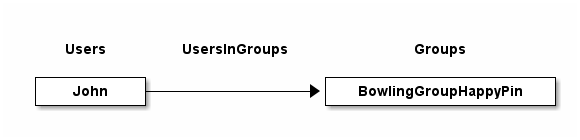
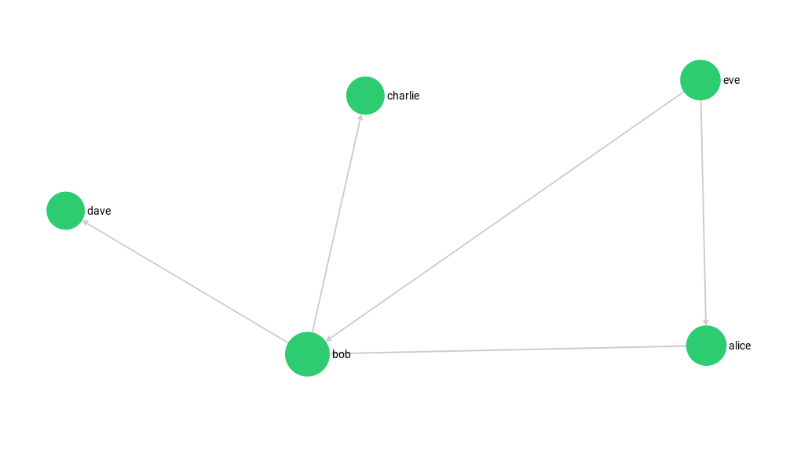
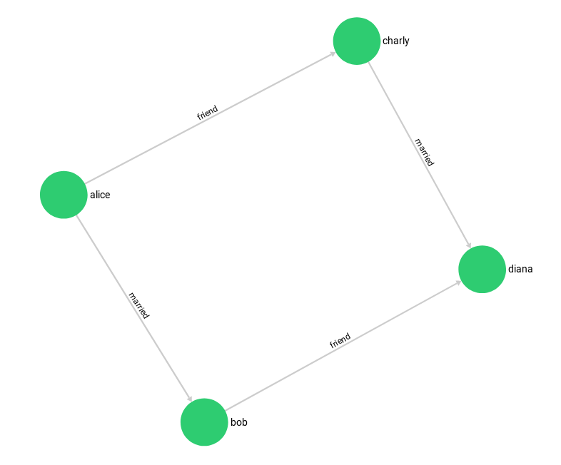
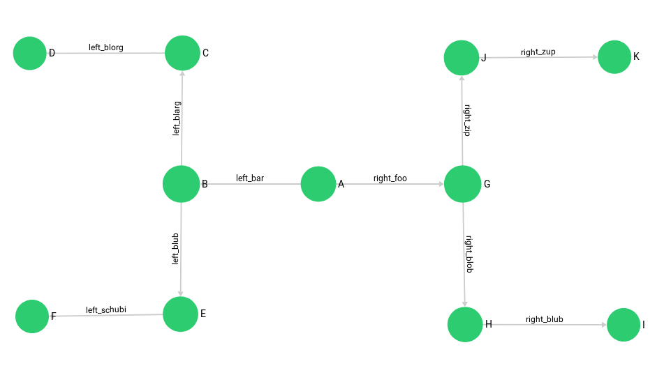

ArangoDB Graphs
---------------

### First Steps with Graphs

A Graph consists of *vertices* and *edges*. Edges are stored as documents in *edge collections*.
A vertex can be a document of a *document collection* or of an *edge collection* (so *edges* can be used as *vertices*).
Which collections are used within a named graph is defined via *edge definitions*.
A named graph can contain more than one *edge definition*, at least one is needed.
Graphs allow you to structure your models in line with your domain and group them logically in collections and giving you the power to query them in the same graph queries.


New to graphs? [**Take our free graph course for freshers**](https://www.arangodb.com/arangodb-graph-course/)
and get from zero knowledge to advanced query techniques.


### Coming from a relational background - what's a graph?

In SQL you commonly have the construct of a relation table to store *n:m* relations between two data tables.
An *edge collection* is somewhat similar to these *relation tables*; *vertex collections* resemble the data tables with the objects to connect.
While simple graph queries with fixed number of hops via the relation table may be doable in SQL with several nested joins,
graph databases can handle an arbitrary number of these hops over edge collections - this is called *traversal*.
Also edges in one edge collection may point to several vertex collections.
Its common to have attributes attached to edges, i.e. a *label* naming this interconnection.
Edges have a direction, with their relations `_from` and `_to` pointing *from* one document *to* another document stored in vertex collections.
In queries you can define in which directions the edge relations may be followed (`OUTBOUND`: `_from` → `_to`, `INBOUND`: `_from` ← `_to`, `ANY`: `_from` ↔ `_to`).

### Named Graphs

Named graphs are completely managed by arangodb, and thus also [visible in the webinterface](../Administration/WebInterface/Graphs.md).
They use the full spectrum of ArangoDBs graph features. You may access them via several interfaces.

- [AQL Graph Operations](../../AQL/Graphs/index.html) with several flavors:
  - [AQL Traversals](../../AQL/Graphs/Traversals.html) on both named and anonymous graphs
  - [AQL Shortest Path](../../AQL/Graphs/ShortestPath.html) on both named and anonymous graph
- [JavaScript General Graph implementation, as you may use it in Foxx Services](GeneralGraphs/README.md)
  - [Graph Management](GeneralGraphs/Management.md); creating & manipualating graph definitions; inserting, updating and deleting vertices and edges into graphs
  - [Graph Functions](GeneralGraphs/Functions.md) for working with edges and vertices, to analyze them and their relations
- [JavaScript Smart Graph implementation, for scalable graphs](SmartGraphs/README.md)
  - [Smart Graph Management](SmartGraphs/Management.md); creating & manipualating SmartGraph definitions; Differences to General Graph 
- [RESTful General Graph interface](../../HTTP/Gharial/index.html) used to implement graph management in client drivers

#### Manipulating collections of named graphs with regular document functions

The underlying collections of the named graphs are still accessible using the standard methods for collections.
However the graph module adds an additional layer on top of these collections giving you the following guarantees:

* All modifications are executed transactional
* If you delete a vertex all edges will be deleted, you will never have loose ends
* If you insert an edge it is checked if the edge matches the *edge definitions*, your edge collections will only contain valid edges

These guarantees are lost if you access the collections in any other way than the graph module or AQL,
so if you delete documents from your vertex collections directly, the edges pointing to them will be remain in place.

### Anonymous graphs

Sometimes you may not need all the powers of named graphs, but some of its bits may be valuable to you.
You may use anonymous graphs in the [traversals](Traversals/README.md) and in the [Working with Edges](Edges/README.md) chapter.
Anonymous graphs don't have *edge definitions* describing which *vertex collection* is connected by which *edge collection*. The graph model has to be maintained in the client side code.
This gives you more freedom than the strict *named graphs*.

- [AQL Graph Operations](../../AQL/Graphs/index.html) are available for both, named and anonymous graphs:
  - [AQL Traversals](../../AQL/Graphs/Traversals.html)
  - [AQL Shortest Path](../../AQL/Graphs/ShortestPath.html)

#### When to choose anonymous or named graphs?

As noted above, named graphs ensure graph integrity, both when inserting or removing edges or vertices.
So you won't encounter dangling edges, even if you use the same vertex collection in several named graphs.
This involves more operations inside the database which come at a cost.
Therefore anonymous graphs may be faster in many operations.
So this question may be narrowed down to: 'Can I afford the additional effort or do I need the warranty for integrity?'. 

### Multiple edge collections vs. `FILTER`s on edge document attributes

If you want to only traverse edges of a specific type, there are two ways to achieve this. The first would be
an attribute in the edge document - i.e. `type`, where you specify a differentiator for the edge -
i.e. `"friends"`, `"family"`, `"married"` or `"workmates"`, so you can later `FILTER e.type = "friends"`
if you only want to follow the friend edges.

Another way, which may be more efficient in some cases, is to use different edge collections for different
types of edges, so you have `friend_edges`, `family_edges`, `married_edges` and `workmate_edges` as collection names.
You can then configure several named graphs including a subset of the available edge and vertex collections -
or you use anonymous graph queries, where you specify a list of edge collections to take into account in that query.
To only follow friend edges, you would specify `friend_edges` as sole edge collection.

Both approaches have advantages and disadvantages. `FILTER` operations on ede attributes will do comparisons on
each traversed edge, which may become CPU-intense. When not *finding* the edges in the first place because of the
collection containing them is not traversed at all, there will never be a reason to actualy check for their
`type` attribute with `FILTER`.

The multiple edge collections approach is limited by the [number of collections that can be used simultaneously in one query](../../AQL/Fundamentals/Syntax.html#collection-names).
Every collection used in a query requires some resources inside of ArangoDB and the number is therefore limited
to cap the resource requirements. You may also have constraints on other edge attributes, such as a hash index
with a unique constraint, which requires the documents to be in a single collection for the uniqueness guarantee,
and it may thus not be possible to store the different types of edges in multiple edeg collections.

So, if your edges have about a dozen different types, it's okay to choose the collection approach, otherwise
the `FILTER` approach is preferred. You can still use `FILTER` operations on edges of course. You can get rid
of a `FILTER` on the `type` with the former approach, everything else can stay the same.

### Which part of my data is an Edge and which a Vertex?

The main objects in your data model, such as users, groups or articles, are usually considered to be vertices.
For each type of object, a document collection (also called vertex collection) should store the individual entities.
Entities can be connected by edges to express and classify relations between vertices. It often makes sense to have
an edge collection per relation type.

ArangoDB does not require you to store your data in graph structures with edges and vertices, you can also decide
to embed attributes such as which groups a user is part of, or `_id`s of documents in another document instead of
connecting the documents with edges. It can be a meaningful performance optimization for *1:n* relationships, if
your data is not focused on relations and you don't need graph traversal with varying depth. It usually means
to introduce some redundancy and possibly inconsistencies if you embed data, but it can be an acceptable tradeoff.

#### Vertices

Let's say we have two vertex collections, `Users` and `Groups`. Documents in the `Groups` collection contain the attributes
of the Group, i.e. when it was founded, its subject, an icon URL and so on. `Users` documents contain the data specific to a
user - like all names, birthdays, Avatar URLs, hobbies...

#### Edges

We can use an edge collection to store relations between users and groups. Since multiple users may be in an arbitrary
number of groups, this is an **m:n** relation. The edge collection can be called `UsersInGroups` with i.e. one edge
with `_from` pointing to `Users/John` and `_to` pointing to `Groups/BowlingGroupHappyPin`. This makes the user **John**
a member of the group **Bowling Group Happy Pin**. Attributes of this relation may contain qualifiers to this relation,
like the permissions of **John** in this group, the date when he joined the group etc.

So roughly put, if you use documents and their attributes in a sentence, nouns would typically be vertices, verbs become the edges.
You can see this in the [knows graph](#the-knowsgraph) below:

     Alice knows Bob, who in term knows Charlie.

#### Advantages of this approach

Graphs give you the advantage of not just being able to have a fixed number of **m:n** relations in a row, but an
arbitrary number. Edges can be traversed in both directions, so it's easy to determine all
groups a user is in, but also to find out which members a certain group has. Users could also be
interconnected to create a social network.

Using the graph data model, dealing with data that has lots of relations stays manageable and can be queried in very
flexible ways, whereas it would cause headache to handle it in a relational database system.

### Backup and restore

For sure you want to have backups of your graph data, you can use [Arangodump](../Administration/Arangodump.md) to create the backup,
and [Arangorestore](../Administration/Arangorestore.md) to restore a backup into a new ArangoDB. You should however note that:

- you need the system collection `_graphs` if you backup named graphs.
- you need to backup the complete set of all edge and vertex collections your graph consists of. Partial dump/restore may not work.

### Managing graphs
By default you should use [the interface your driver provides to manage graphs](../HTTP/Gharial/Management.html).

This is i.e. documented [in Graphs-Section of the ArangoDB Java driver](https://github.com/arangodb/arangodb-java-driver#graphs).

### Example Graphs

ArangoDB comes with a set of easily graspable graphs that are used to demonstrate the APIs.
You can use the `add samples` tab in the `create graph` window in the webinterface, or load the module `@arangodb/graph-examples/example-graph` in arangosh and use it to create instances of these graphs in your ArangoDB.
Once you've created them, you can [inspect them in the webinterface](../Administration/WebInterface/Graphs.md) - which was used to create the pictures below.

You [can easily look into the innards of this script](https://github.com/arangodb/arangodb/blob/devel/js/common/modules/%40arangodb/graph-examples/example-graph.js) for reference about howto manage graphs programatically.

#### The Knows\_Graph

A set of persons knowing each other:

The *knows* graph consists of one *vertex collection* `persons` connected via one *edge collection* `knows`.
It will contain five persons *Alice*, *Bob*, *Charlie*, *Dave* and *Eve*.
We will have the following directed relations:

  - *Alice* knows *Bob*
  - *Bob* knows *Charlie*
  - *Bob* knows *Dave*
  - *Eve* knows *Alice*
  - *Eve* knows *Bob*

This is how we create it, inspect its *vertices* and *edges*, and drop it again:

    @startDocuBlockInline graph_create_knows_sample
    @EXAMPLE_ARANGOSH_OUTPUT{graph_create_knows_sample}
    var examples = require("@arangodb/graph-examples/example-graph.js");
    var g = examples.loadGraph("knows_graph");
    db.persons.toArray()
    db.knows.toArray();
    examples.dropGraph("knows_graph");
    @END_EXAMPLE_ARANGOSH_OUTPUT
    @endDocuBlock graph_create_knows_sample

#### The Social Graph

A set of persons and their relations:

This example has female and male persons as *vertices* in two *vertex collections* - `female` and `male`. The *edges* are their connections in the `relation` *edge collection*.
This is how we create it, inspect its *vertices* and *edges*, and drop it again:

    @startDocuBlockInline graph_create_social_sample
    @EXAMPLE_ARANGOSH_OUTPUT{graph_create_social_sample}
    var examples = require("@arangodb/graph-examples/example-graph.js");
    var graph = examples.loadGraph("social");
    db.female.toArray()
    db.male.toArray()
    db.relation.toArray()
    examples.dropGraph("social");
    @END_EXAMPLE_ARANGOSH_OUTPUT
    @endDocuBlock graph_create_social_sample

#### The City Graph

A set of european cities, and their fictional traveling distances as connections:

The example has the cities as *vertices* in several *vertex collections* - `germanCity` and `frenchCity`. The *edges* are their interconnections in several *edge collections* `french / german / international Highway`. This is how we create it, inspect its *edges* and *vertices*, and drop it again:

    @startDocuBlockInline graph_create_cities_sample
    @EXAMPLE_ARANGOSH_OUTPUT{graph_create_cities_sample}
    var examples = require("@arangodb/graph-examples/example-graph.js");
    var g = examples.loadGraph("routeplanner");
    db.frenchCity.toArray();
    db.germanCity.toArray();
    db.germanHighway.toArray();
    db.frenchHighway.toArray();
    db.internationalHighway.toArray();
    examples.dropGraph("routeplanner");
    @END_EXAMPLE_ARANGOSH_RUN
    @endDocuBlock graph_create_cities_sample

#### The Traversal Graph

This graph was designed to demonstrate filters in traversals. It has some labels to filter on it.

The example has all its vertices in the *circles* collection, and an *edges* edge collection to connect them.
Circles have unique numeric labels. Edges have two boolean attributes (*theFalse* always being false, *theTruth* always being true) and a label sorting *B* - *D* to the left side, *G* - *K* to the right side. Left and right side split into Paths - at *B* and *G* which are each direct neighbours of the root-node *A*. Starting from *A* the graph has a depth of 3 on all its paths.

    @startDocuBlockInline graph_create_traversal_sample
    @EXAMPLE_ARANGOSH_OUTPUT{graph_create_traversal_sample}
    var examples = require("@arangodb/graph-examples/example-graph.js");
    var g = examples.loadGraph("traversalGraph");
    db.circles.toArray();
    db.edges.toArray();
    examples.dropGraph("traversalGraph");
    @END_EXAMPLE_ARANGOSH_RUN
    @endDocuBlock graph_create_traversal_sample

#### The World Graph

The world country graph structures its nodes like that: world → continent → country → capital. In some cases edge directions aren't forward (therefore it will be displayed disjunct in the graph viewer). It has two ways of creating it. One using the named graph utilities (*worldCountry*), one without (*worldCountryUnManaged*). 
It is used to demonstrate raw traversal operations.

    @startDocuBlockInline graph_create_world_sample
    @EXAMPLE_ARANGOSH_OUTPUT{graph_create_world_sample}
    var examples = require("@arangodb/graph-examples/example-graph.js");
    var g = examples.loadGraph("worldCountry");
    db.worldVertices.toArray();
    db.worldEdges.toArray();
    examples.dropGraph("worldCountry");
    var g = examples.loadGraph("worldCountryUnManaged");
    examples.dropGraph("worldCountryUnManaged");
    @END_EXAMPLE_ARANGOSH_RUN
    @endDocuBlock graph_create_world_sample

### Cookbook examples

The above referenced chapters describe the various APIs of ArangoDBs graph engine with small examples. Our cookbook has some more real life examples:

 - [Traversing a graph in full depth](https://docs.arangodb.com/cookbook/Graph/FulldepthTraversal.html)
 - [Using an example vertex with the java driver](https://docs.arangodb.com/cookbook/Graph/JavaDriverGraphExampleVertex.html)
 - [Retrieving documents from ArangoDB without knowing the structure](https://docs.arangodb.com/cookbook/Graph/JavaDriverBaseDocument.html)
 - [Using a custom visitor from node.js](https://docs.arangodb.com/cookbook/Graph/CustomVisitorFromNodeJs.html)
 - [AQL Example Queries on an Actors and Movies Database](https://docs.arangodb.com/cookbook/Graph/ExampleActorsAndMovies.html)

### Higher volume graph examples

All of the above examples are rather small so they are easier to comprehend and can demonstrate the way the functionality works. There are however several datasets freely available on the web that are a lot bigger. [We collected some of them with import scripts](https://github.com/arangodb/example-datasets) so you may play around with them. Another huge graph is the [Pokec social network](https://snap.stanford.edu/data/soc-pokec.html) from Slovakia that we [used for performance testing on several databases](https://www.arangodb.com/2015/06/multi-model-benchmark/); You will find importing scripts etc. in this blogpost.
