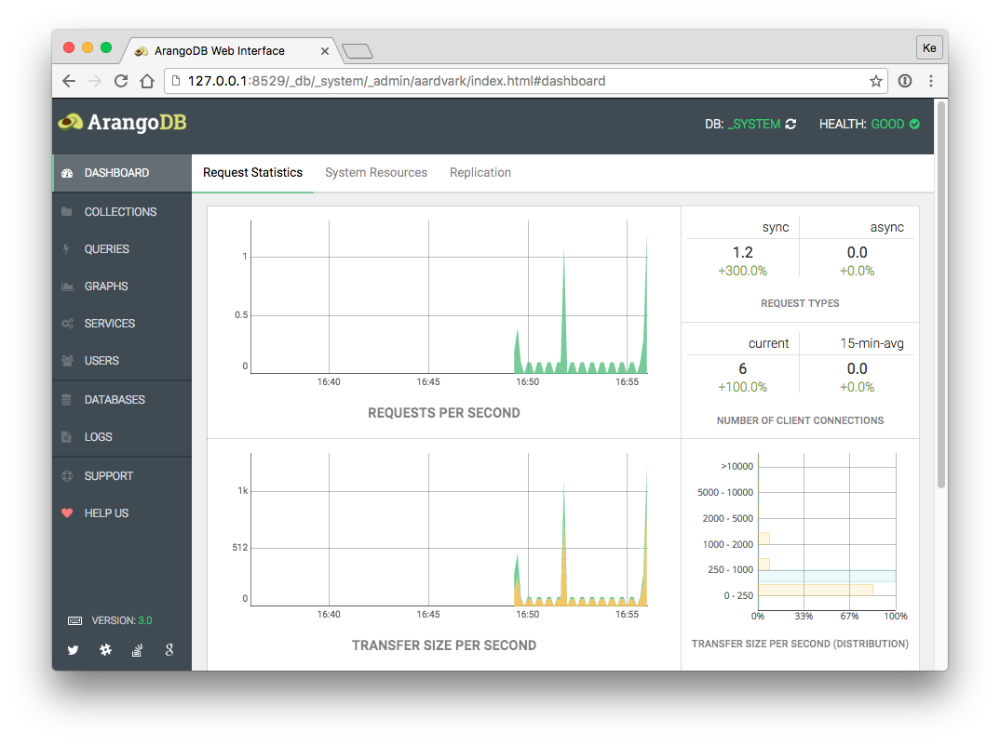

Dashboard
=========

The *Dashboard* tab provides statistics which are polled regularly from the
ArangoDB server.

Requests Statistics:

 - Requests per second
 - Request types
 - Number of client connections
 - Transfer size
 - Transfer size (distribution)
 - Average request time
 - Average request time (distribution)

System Resources:

- Number of threads
- Memory
- Virtual size
- Major page faults
- Used CPU time

Replication:

- Replication state
- Totals
- Ticks
- Progress
