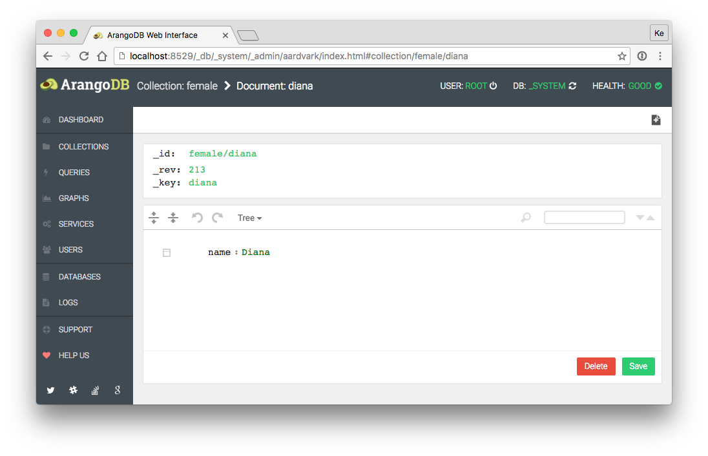

Document
========

The document section offers a editor which let you edit documents and edges of a collection.

Functions:

 - Edit document 
 - Save document
 - Delete docment
 - Switch between Tree/Code - Mode
 - Create a new document

Information:

 - Displays: _id, _rev, _key properties
