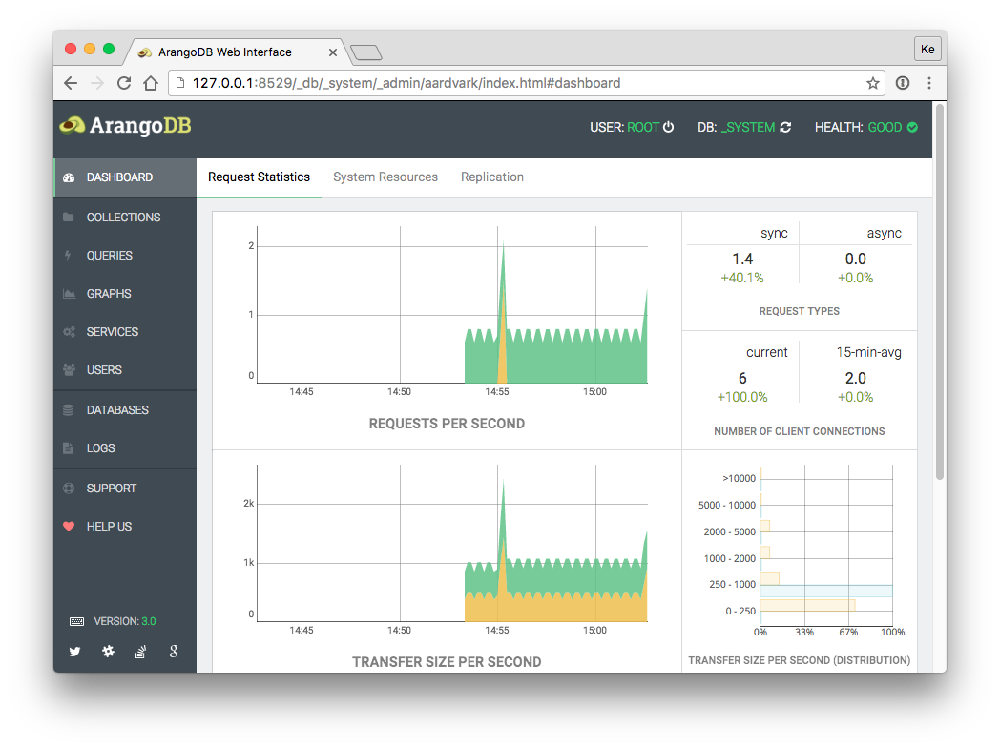
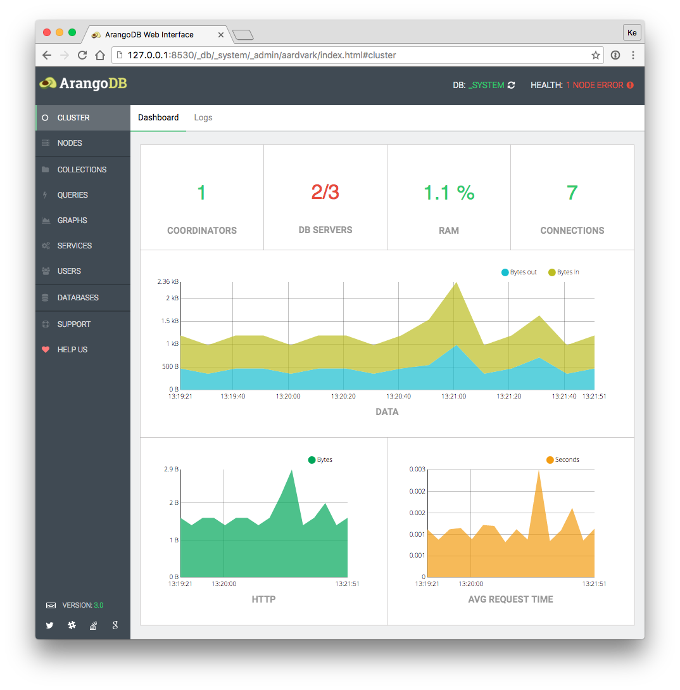

Web Interface
=============

The ArangoDB server (*arangod*) comes with a built-in web interface for
administration. It lets you manage databases, collections, documents,
users, graphs and more. You can also run and explain queries in a
convenient way. Statistics and server status are provided as well.

The Web Interface (also Web UI, frontend or *Aardvark*) can be accessed with a
browser under the URL `http://localhost:8529` with default server settings.

The interface differs for standalone instances and cluster setups.

Standalone:

Cluster:

