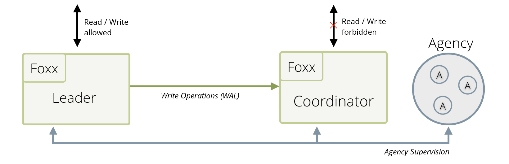

Active Failover
===============

This _Chapter_ introduces ArangoDB's _Active Failover_ environment.
For further information about _Active Failover_ in ArangoDB, please refer to the following sections:

- [Active Failover Architecture](Architecture.md)
- [Active Failover Deployment](../../Deployment/ActiveFailover/README.md)
- [Active Failover Administration](../../Administration/ActiveFailover/README.md)

**Note:** _Asynchronous Failover_, _Resilient Single_, _Active-Passive_ or _Hot
Standby_ are other terms that have been used to define the _Active Failover_ environment. 
Starting from version 3.3 _Active Failover_ is the preferred term to identify such
environment.

