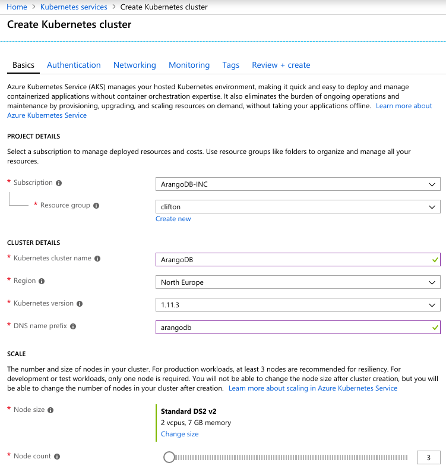
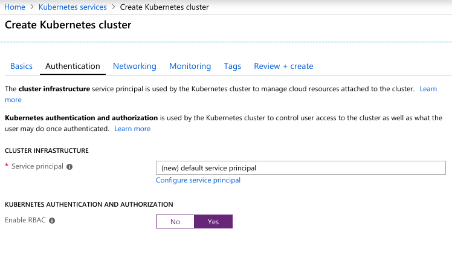
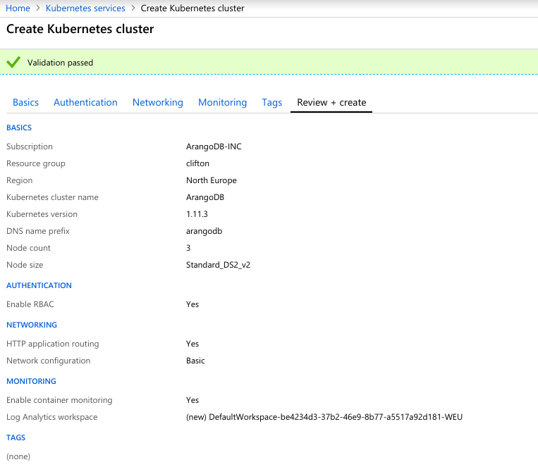

<!-- don't edit here, it's from https://@github.com/arangodb/kube-arangodb.git / docs/Manual/ -->
# Start ArangoDB on Azure Kubernetes Service (AKS)

## Requirements

* [kubectl](https://kubernetes.io/docs/tasks/tools/install-kubectl/) (**version >= 1.10**)
* [helm](https://www.helm.sh/)
* [Azure CLI](https://docs.microsoft.com/en-us/cli/azure/install-azure-cli-apt?view=azure-cli-latest)

## Deploy cluster

* In Azure dashboard choose **Create a resource**
* Choose **Kubernetes Service**

## Cluster basics (version >=1.10)



## Cluster authentication (Enable RBAC)



## Wait for cluster to be created



## Move to control using `kubectl`

- Login to Azure using CLI

  ```
  $ az login
    [
      {
        "cloudName": "AzureCloud",
        "id": "...",
        "isDefault": true,
        "name": "ArangoDB-INC",
        "state": "Enabled",
        "tenantId": "...",
        "user": {
          "name": "xxx@arangodb.com",
          "type": "user"
        }
      }
    ]
  ```

- Get AKS credentials to merge with local config, using resource group and
  cluster names used for above deployment

  ```
    $ az aks get-credentials --resource-group clifton --name ArangoDB
  ```

- Verify successful merge

  ```
  $ kubectl get svc
    NAME         TYPE        CLUSTER-IP   EXTERNAL-IP   PORT(S)   AGE
    kubernetes   ClusterIP   10.0.0.1     <none>        443/TCP   38m
  ```

- Initialize `helm`

  ```
  $ kubectl create serviceaccount --namespace kube-system tiller
    serviceaccount/tiller created
  ```

  ```
  $ kubectl create clusterrolebinding tiller-cluster-rule \
        --clusterrole=cluster-admin --serviceaccount=kube-system:tiller
    clusterrolebinding.rbac.authorization.k8s.io/tiller-cluster-rule created
  ```

  ```
  $ helm init --service-account tiller
    $HELM_HOME has been configured at /home/xxx/.helm.
    ...
    Happy Helming!

    Tiller (the Helm server-side component) has been
    installed into your Kubernetes Cluster.
  ```

- Deploy ArangoDB operator

  ```
  $ helm install \
      github.com/arangodb/kube-arangodb/releases/download/X.X.X/kube-arangodb.tgz
    NAME:   orderly-hydra
    LAST DEPLOYED: Wed Oct 31 15:11:37 2018
    NAMESPACE: default
    STATUS: DEPLOYED
    ...
    See https://docs.arangodb.com/devel/Manual/Tutorials/Kubernetes/
    for how to get started.
  ```

- Deploy ArangoDB cluster

  ```
  $ kubectl apply -f https://raw.githubusercontent.com/arangodb/kube-arangodb/master/examples/simple-cluster.yaml
  ```
