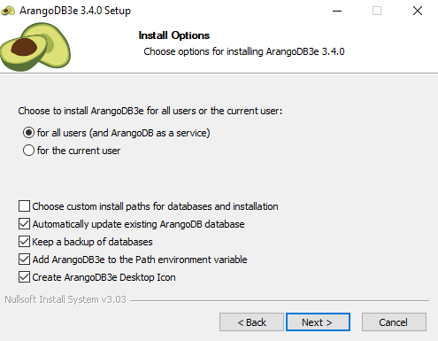
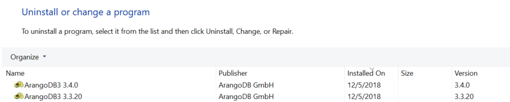
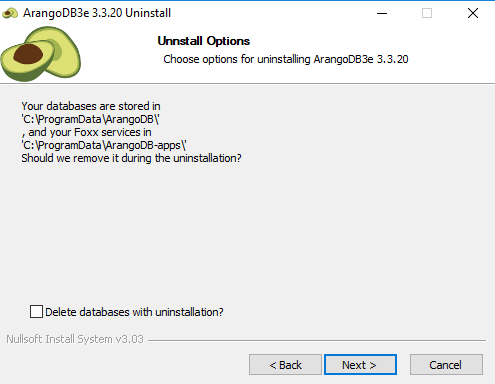

**TMP**

Upgrading on Windows
====================

As there are different ways to install ArangoDB on Windows, the upgrade
method depends on the installation method that was used.

In general, it will be needed to:

- install the new ArangoDB binaries on the system
- upgrade the database
- optinal (but suggested) to keep the system clean (unless there are specific
  reasons to not do so): remove the old binaries from the system

Some of the above steps may be done automatically, depending on your
specifc situation.

Upgrading via the Installer
---------------------------

If you have installed via the _Installer_, to upgrade:

- Download the new _Installer_ and run it.
- The _Installer_ will ask if you want to update your current database: select
  the option "_Automatically update existing ArangoDB database_" so that the database
  files will be upgraded.

 
Upgrading via the Installer, when the old data is kept, will keep your 
password and choice of storage engine as it is.


- After installing the new package, you will have both packages installed.
You can uninstall the old one manually (make a copy of your old configuration
file first).

 
When uninstalling the old package, please make sure the option
"_Delete databases with unistallation_" is **not** checked.


 
When upgrading, the Windows Installer does not use the old configuration file
for the installed _Single Instance_ but a new (default) one ([Issue #3773](https://github.com/arangodb/arangodb/issues/3773)).
To use the old configuration, it is currently needed to:
- stop the server
- replace the new with the old confituration file
- restart the server


Manual upgrade of 'ZIP archive' installation
--------------------------------------------

