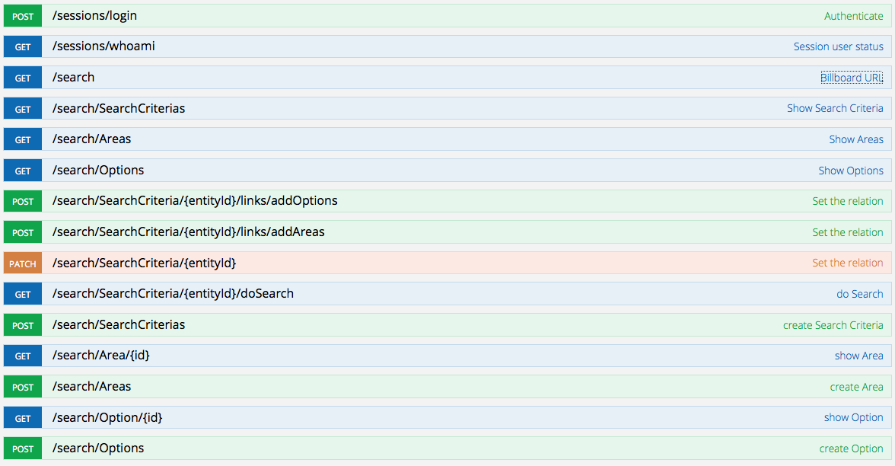
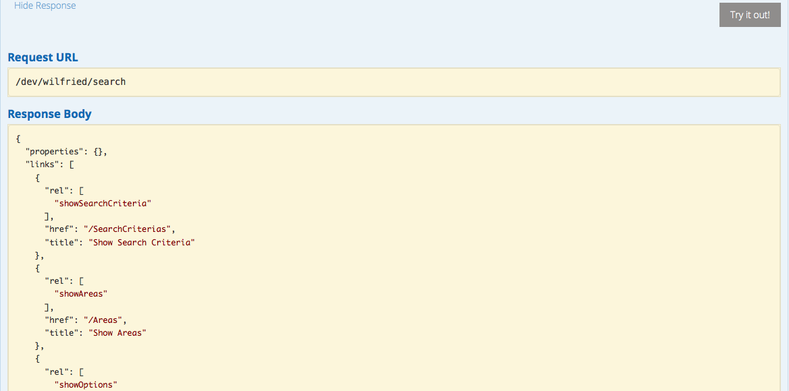

# FoxxGenerator

FoxxGenerator is a declarative JavaScript framework that allows developers to describe the API in terms of the domain using statecharts. This declarative approach is based upon a combination of Richardson and Amundsen's design approach described in their book [RESTful Web APIs](http://restfulwebapis.com), Eric Evans' ideas from his book [domain driven design](http://www.amazon.com/Domain-Driven-Design-Tackling-Complexity-Software/dp/0321125215) and the Harel's statecharts introduced in his paper *Statecharts: A Visual Formalism For Complex Systems*.

To create an API with FoxxGenerator, first draw a statechart that represents your API. In this statechart, your states can have one of the following types:

* Entity: This state represents something that has an identity and an arbitrary number of (optionally nested) attributes.
* Repository: A repository can store entities.
* Service: A service can do something. What it can do is defined via a JavaScript function that you can define. A service does not have a state.

Connect these states with transitions. When you have modeled your statechart in a way that it can fulfill all your use cases, it is time to classify your transitions. For every transition you have to decide which of the following type it follows:

* `follow`: This is a transition that you can just follow from one state to the next.
* `connect`: This is a point of extension where you can create a transition at runtime. In order to be able to follow this transition, you have to add a `follow` transition as well.
* `disconnect`: With this transition you can remove a transition created with `connect`.
* `modify`: This is a transition that can only be created from an entity to itself. It is used to modify the state of this entity.

You can now translate this annotated statechart into the DSL of FoxxGenerator to create your API.

## Setting up a Foxx application with FoxxGenerator.

First, create a Foxx application as described in [Foxx's manual](http://docs.arangodb.org/Foxx/README.html). In the folder of your Foxx app, you can now install FoxxGenerator with `npm install foxx_generator`. In the same way you would add a controller to your Foxx application, you can now add a FoxxGenerator to your application: In the file that would normally contain your FoxxController, add the following:

```js
var FoxxGenerator = require('foxx_generator').Generator,
  Joi = require('joi'),
  generator;

generator = new FoxxGenerator('name_of_your_app', {
  // To learn more about media types, see below
  mediaType: 'application/vnd.siren+json',
  applicationContext: applicationContext,
});

// Insert transition definitions here

// Insert states here

generator.generate();
```

For more information on how to choose a media type, see the section about Media types. Now you can define the transitions you used in your statechart and then add the states and the transitions between them.

## Defining the transitions

Every transition needs the following attributes:

* A name for the transition that you can use when you want to add a transition of this type.
* `type`: One of the types described above.
* `to`: Is the target of this transition one or more states? For a `connect` transition this for example determines if you can only connect one state to it or more than that. Acceptable values are `one` and `many`.

You can also add a documentation block (a JavaScript comment starting with `/**`) that will be used for the documentation. The first line should be a short summary, all other lines will be used for a long description. An example for that would be the following transition definition:

```js
/** Show details for a particular item
 * 
 * Show all information about this particular item.
 */
generator.defineTransition('showDetail', {
  type: 'follow',
  to: 'one'
});
```

For a `connect` and `disconnect` transition you additionally have to determine which `follow` transition can be used to follow the created transition. This is done with `as` and the name of the transition.

You can also add `parameters` to the transition, if in the transition process you need additional information from the user of the API. Each of the parameters needs to be a value object defined with [Joi](https://github.com/hapijs/joi). For example:

```js
/** Modify the title of the entity
 *
 */
generator.defineTransition('changeTitle', {
  type: 'modify',
  to: 'one',

  parameters: {
    title: Joi.string()
  }
});
```

You can also define a `condition` for a transition. This is a JavaScript function that takes the parameters of the HTTP request as its argument and returns either true or false. If it is true, the transition can be executed. If it is false, the transition can not be executed and the link to execute it will be hidden from the representation. This can for example be used for user authorization.

## Adding states and transitions

Now you can add states and transitions to your API. Every state has a name, a type and a number of outgoing transitions. The type is one of the above described ones – either `entity`, `repository` or `service`. Every transition needs information about where it leads to and via which transition type. The transition type needs to be defined as described above. Simple example:

```js
generator.addState('ideas', {
  type: 'repository',
  contains: 'idea',

  transitions: [
    { to: 'idea', via: 'showDetail' }
  ]
});
```

Some states take additional information: Entities need to know which repository they are contained in (via `containedIn`) and repositories need to know which entities they contain (via `contains`).

### Entity

An entity can be `parameterized` (by setting its attribute `parameterized` to `true`) which means that there is not only one state of that type, but there can be an arbitrary amount – each of them is identified by a parameter. This is usually the case with entities that are stored in a repository.

It also takes an object of attributes which describe the representation of the entity. Each of the attributes needs to be a value object defined with [Joi](https://github.com/hapijs/joi).

Example for an entity:

```js
generator.addState('idea', {
  type: 'entity',
  parameterized: true,
  containedIn: 'ideas',

  attributes: {
    description: Joi.string().required(),
    title: Joi.string().required()
  },

  transitions: [
    { to: 'idea', via: 'relatedIdea' }
  ]
});
```

### Service

A service needs to describe what it does, this is done with an `action` which is a function that takes a request and a response in the [same way that a FoxxController route does](http://docs.arangodb.org/Foxx/FoxxController.html). The default HTTP verb for a service is a `post`, it can be changed by setting the `verb`. Example:

```js
generator.addState('title', {
  type: 'service',
  verb: 'get',

  action: function (req, res) {
    var entity = req.params('entity');
    res.json({ title: entity.get('title') });
  }
});
```

## Media types

FoxxGenerator currently only supports [siren](https://github.com/kevinswiber/siren) which is a media type without application semantics. Use the media type `application/vnd.siren+json`. We plan to support HAL with an extension for forms in the near future.

## Interactive Documentation

During your development, FoxxGenerator will generate an interactive documentation alongside the API. You can use this in an iterative development style to check after each step if the API is as you expected it to be. The documentation allows you to try out each of the generated endpoints. The API documentation can be found in the admin interface of ArangoDB and looks a little like this:



If you click on one of the routes, you can try it out:



## Examples

* An example for a Siren API generated with FoxxGenerator can be found [here](https://github.com/moonglum/siren)

## Linting

To check the project for linting errors, run `npm run jshint`.
